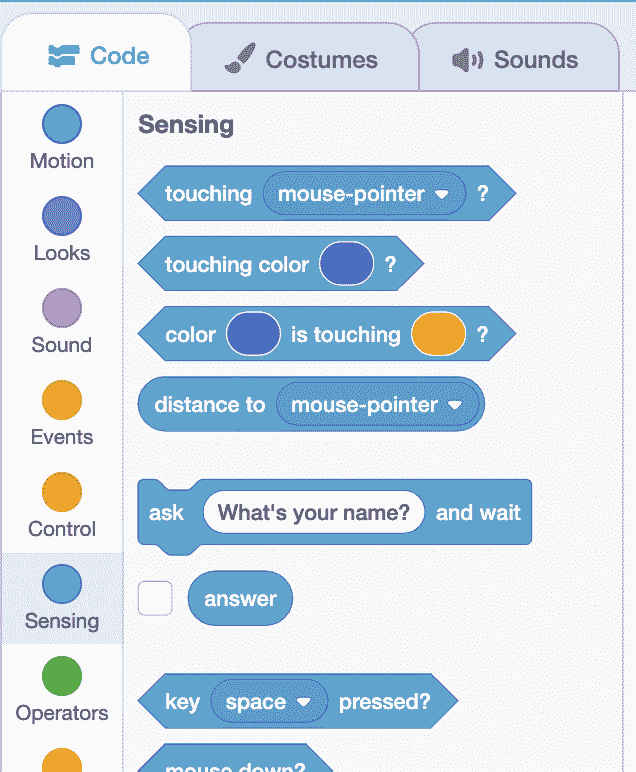
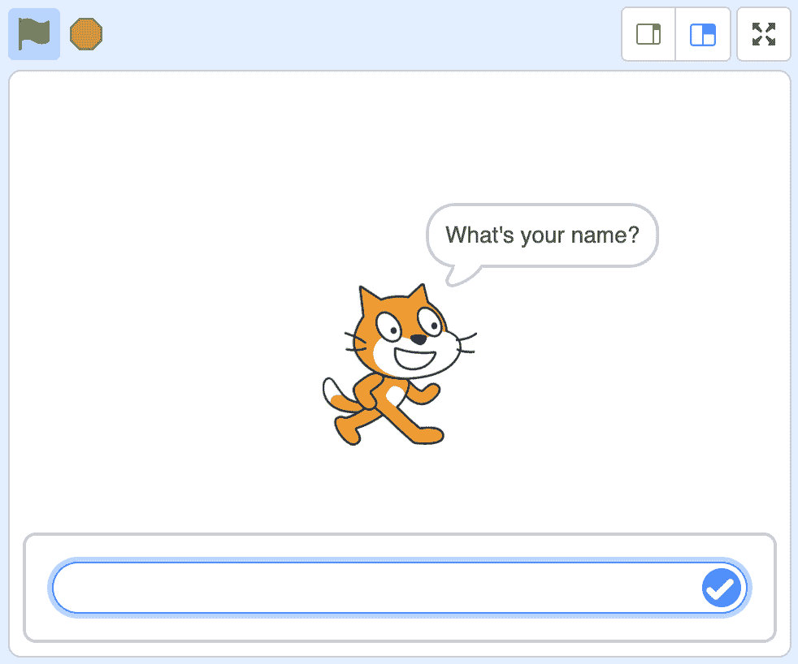
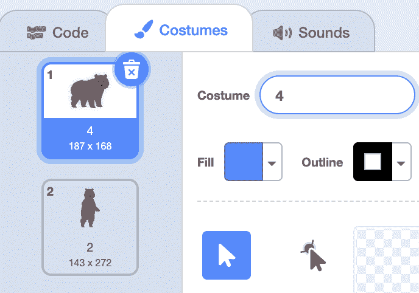
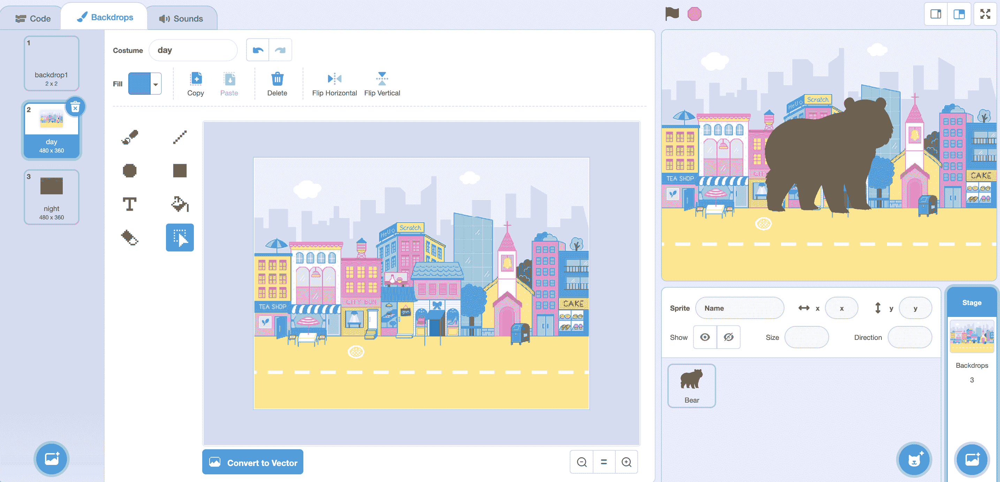

# 值

> 原文：[`cs50.harvard.edu/scratch/notes/4/`](https://cs50.harvard.edu/scratch/notes/4/)

## 上次

+   上次，我们看了一下事件，我们的代码可以响应发生的事情，比如点击绿色标志。

+   这次，我们将更仔细地看看函数，或者我们的代码，它对这些事件做出响应。

## 值

+   回想一下，我们的一些函数可以接受一个或多个输入，或者某种类型的信息，这些信息进入椭圆形：

    [PRE0]

    +   例如，这个“移动”块有一个值为 10 的椭圆形，告诉我们的精灵移动 10 步。

    +   我们可以改变这个值，即实际的数字，使其更大或更小。

+   对于其他块，如“说”块，我们也可以使用单词作为输入。

+   结果表明，Scratch 有一些自身就是值的块，我们可以使用。在“运动”类别块的底部，我们看到一些椭圆形的块：

    [PRE1]

    +   由于它们不是矩形的，所以我们不能像我们迄今为止使用的矩形块那样堆叠它们。

    +   相反，我们可以将这些块放在其他块的椭圆形中，将它们用作输入值。

## 位置

+   我们将告诉我们的精灵说它的 x 位置，或者它相对于舞台的左右距离，持续两秒钟：

    [PRE2]

    +   现在，当我们点击标志时，我们的猫会说出它的当前 x 位置。如果我们移动我们的猫在舞台上，当我们再次点击标志时，我们可以看到它说了一个不同的数字。

+   我们将添加另一个块，这样我们就可以看到我们的猫的 x 位置和 y 位置：

    [PRE3]

## 操作符

+   **操作符**是另一类块，也是编程中更一般的概念。操作符接受值作为输入，并产生一个新的值。

+   例如，一个操作符是“+”块：

    [PRE4]

    +   这个操作符将取两个值，比如 1 和 2，并将它们相加。

+   我们可以通过以下方式看到这一点：

    [PRE5]

    +   注意，我们的绿色“+”操作符块将根据其自己的输入（3）计算一个值，然后这个值将用作我们猫的“说”块的值。

+   我们可以使用另一个“连接”块，将两个单词或字符放在一起：

    [PRE6]

    +   现在，我们可以在同一个“说”块中同时说出 x 位置和 y 位置，因为“连接”块会帮我们把它们放在一起。

+   但当我们点击标志时，位置会相加，就像“-161-13”。

+   我们将更改背景为“Xy-grid”，这样我们就可以可视化我们的猫的位置，猫确实在-161 和-13 的位置。但我们要用逗号分隔我们的值，这样我们就可以更容易地看到这一点。

+   我们需要另一个“连接”块，将 x 位置与用逗号和空格连接的 y 位置连接起来：

    [PRE7]

    +   因此，所有这些块将 x 位置与逗号、空格结合，然后是 y 位置。

+   我们可以添加另一个“连接”块来形成一个完整的句子：

    [PRE8]

+   现在，我们已经创建了[位置](https://scratch.mit.edu/projects/507449365/)示例。

+   我们还可以使用“方向”块让我们的猫说出它面对的方向。

## 按大小移动

+   在外观类别块的底部，我们看到一些更多的椭圆形块，这意味着我们可以将它们用作输入。

+   其中有一个叫做“大小”，它将仅仅表示我们的精灵有多大或多小。

+   让我们以刺猬作为我们的精灵，我们将使用块使它在每次按下右箭头键时移动 10 步，在[Walking Hedgehog](https://scratch.mit.edu/projects/507450683/)中：

    [PRE9]

+   但如果我们改变刺猬的大小，我们希望它每次移动时更多或更少，这取决于它的大小。

+   我们将把“大小”块拖进来作为值：

    [PRE10]

    +   但由于我们的刺猬从 100%大小开始，它每次移动 100 步。

+   我们可以使用运算符类别中的“/”块，它执行除法操作。所以我们将它拖进来，并将我们的“大小”块也拖进去：

    [PRE11]

    +   我们将大小除以 10，所以在 100%大小的情况下，我们的刺猬将移动 10 步，但在 50%大小的情况下，它将只移动 5 步。

## 随机选择

+   运算符类别中另一个块是“随机选择”，它会为我们选择一个随机数。

+   我们将通过告诉我们的刺猬每次点击标志时指向一个随机方向来尝试它，在[Rotating Hedgehog](https://scratch.mit.edu/projects/507451010/)中：

    [PRE12]

    +   现在，每次我们按下绿色标志，我们的刺猬会做一些令人惊讶的事情，它不一定会每次都做同样的事情。

## 计时器，取整

+   在块中，感知类别中我们看到另一个值，称为“计时器”。计时器的值将是我们开始项目以来的秒数，所以我们将让刺猬每次点击时说出它，在[Timing Hedgehog](https://scratch.mit.edu/projects/507451281/)中：

    [PRE13]

    +   现在，点击绿色标志后，我们可以点击刺猬来查看秒数，比如 4.45 或 9.90。

+   我们不想看到秒数的这么多细节，所以我们将寻找运算符类别中的“取整”块。取整块将接受一个数字作为输入，并将其四舍五入到整数。

+   因此，我们可以将我们的“计时器”块拖入一个“取整”块中，现在我们的刺猬将说出整数的秒数：

    [PRE14]

## 感知

+   在感知部分，我们看到另一个块，“询问你的名字？并等待”。椭圆形表示函数块的输入，在这种情况下，“你的名字是什么？”告诉块使用这个作为问题。

+   结果，这个块还有一个输出，或者返回值，在我们运行它后会返回。

+   我们可以看到，在这个块下面有一个椭圆形的“答案”块，它将显示用户对这个问题输入的任何响应的值：

    

+   让我们通过构建一个名为[Hello](https://scratch.mit.edu/projects/507451522/)的程序来看看：

    [PRE15]

    +   现在，当我们运行我们的程序时，我们的猫会提出问题，并等待我们输入响应后继续：

        

+   我们可以用“加入”模块让我们的猫变得更有亲和力：

    [PRE16]

+   让我们把问题改为“[走了多少步？](https://scratch.mit.edu/projects/507451753/)”：

    [PRE17]

    +   我们还将使用一个“移动”模块，并在其中使用“答案”模块作为输入。因此，我们的猫将移动我们作为问题的答案输入的步数。

+   我们也可以通过询问[去哪里？](https://scratch.mit.edu/projects/507451963/)中的 x 值和 y 值来告诉我们的猫去一个特定的位置：

    [PRE18]

    +   注意，我们可以提出多个问题，而“答案”模块将具有我们为最近一个问题输入的任何值。

## 更改服装

+   我们现在暂时移除我们的猫，再次添加熊。我们可以在服装标签中重命名它的服装：

    

    +   我们将把熊的四条腿都穿上的服装称为“4”，而另一条两条腿的服装称为“2”。

+   现在，我们可以构建一个程序，[有多少条腿？](https://scratch.mit.edu/projects/507452267/)，来询问我们使用哪个服装：

    [PRE19]

    +   结果表明，“切换服装”模块也可以接受一个椭圆形模块作为输入，因此现在我们的答案将被用作我们熊将切换到的服装名称的值。

## 更改背景图

+   我们可以用背景图来尝试这个功能。我们将添加“彩色城市”和“夜晚城市”作为我们的背景图，通过点击右下角的舞台面板，我们可以打开背景图标签来重命名它们：

    

    +   我们将把白天城市的背景图称为“白天”，而夜晚的背景图称为“夜晚”。

+   在[什么时间？](https://scratch.mit.edu/projects/507452523/)，我们将创建熊的脚本：

    [PRE20]

    +   现在，当我们回答“白天”或“夜晚”时，背景图将改变。

+   通过这些允许用户回答问题的模块，以及我们的代码将他们的答案作为函数输入，我们可以给用户更多的控制权，并使我们的项目变得更加有趣。
