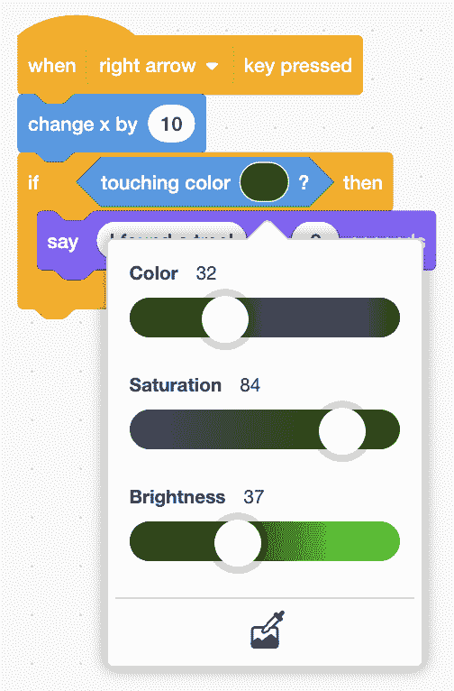
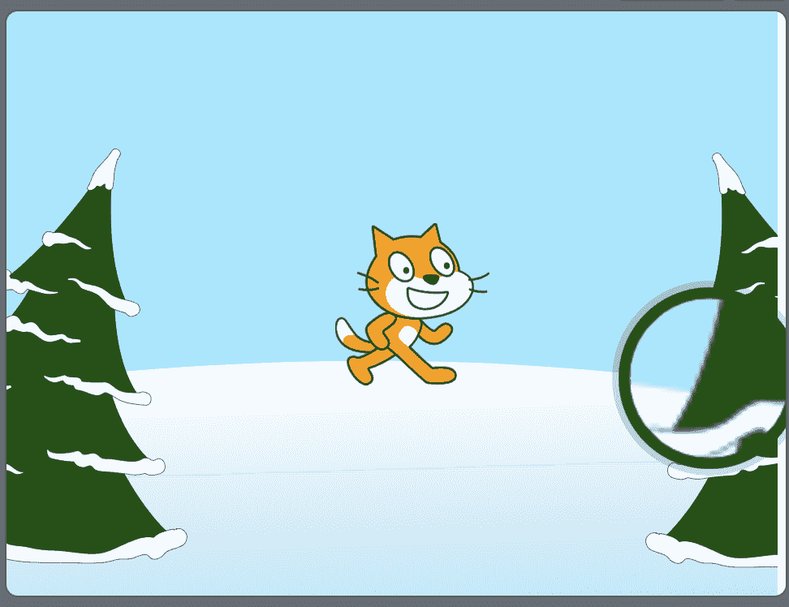
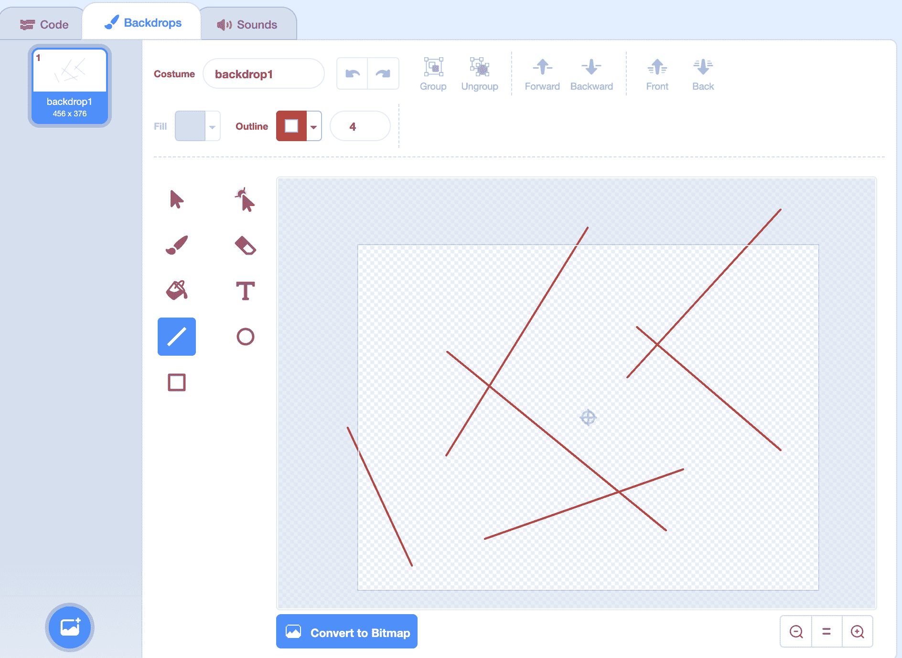

# 条件

> 原文：[`cs50.harvard.edu/scratch/notes/5/`](https://cs50.harvard.edu/scratch/notes/5/)

## 上次

+   上次，我们查看了一些值，这些是我们可以在 Scratch 程序中使用的信息。

+   今天，我们将通过提问来使用值做出决定，并根据那些答案决定要做什么。例如，我们可能会在出门前问，“外面冷吗？”如果答案是肯定的，我们可能会穿上夹克。

## 触碰鼠标指针

+   我们将从告诉我们的猫在按下空格键时播放声音的脚本开始[喵喵](https://scratch.mit.edu/projects/507453025/)：

    [PRE0]

+   在积木的“控制”部分，有一个名为“如果”的积木，我们可以使用它，其中有一个六边形区域，还有一个地方可以嵌套额外的积木：

    [PRE1]

+   六边形代表我们想要提出的问题，这个问题可以用“是”或“否”来回答，或者等价地，用“真”或“假”来回答。

+   在积木的“感应”部分，我们看到一些六边形形状的积木。实际上，我们可以提出的问题被称为**布尔表达式**，或者描述某物可以是真（用“是”回答）或假（用“否”回答）的一种方式。

+   我们将把“触碰鼠标指针？”布尔表达式积木拖入“如果”积木的六边形中：

    [PRE2]

    +   我们还将放置我们的“播放声音”积木。

    +   现在，当我们按下键盘上的空格键时，如果我们的鼠标指针或屏幕上的光标触碰到舞台上的精灵，我们的猫才会播放声音。

+   我们还可以检查我们的精灵是否在[猫和气球](https://scratch.mit.edu/projects/507454098/)中触碰到另一个精灵。我们将添加一个气球精灵，并在“触碰鼠标指针？”积木的下拉菜单中，我们现在可以将值更改为：

    [PRE3]

    +   现在，我们的猫只有在我们将气球拖到舞台上的它那里时才会播放声音。

## 触碰颜色

+   “触碰颜色？”积木将允许我们检查我们的精灵是否触碰到特定颜色的任何东西。

+   我们将保留我们的猫，并使用“冬季”背景。我们将在名为[猫和树](https://scratch.mit.edu/projects/507454297/)的程序中创建这个脚本：

    [PRE4]

+   我们将拖入这些积木中的每一个，对于“触碰颜色？”积木，我们可以点击颜色来使用不同的滑块选择颜色：

    

+   但要精确地获取树的颜色可能有些困难，因此我们可以点击颜色滑块底部的吸管图标，并使用它来用鼠标选择舞台上的颜色：

    

+   现在，当按下右箭头键时，我们的猫会向右移动。每次它向右移动时，它也会问自己是否触碰到绿色。最终，当它到达绿色的大树时，那个问题的答案将是“是”，它会说“我找到一棵树了！”。

## 大小

+   我们将设置舞台为普通背景，并恢复气球。我们将使用这个脚本使气球在[气球](https://scratch.mit.edu/projects/507454552/)中生长：

    [PRE5]

+   但我们想让我们的气球最终爆裂，实际上我们可以使用“=”运算符来比较两个数字。我们将使用一个“if”块，并在其中拖入这些块：

    [PRE6]

    +   注意，“=”运算符的形状像一个六边形，所以它也是一个我们可以使用的布尔表达式，答案为“是”或“否”。

    +   现在，每次按下空格键时，我们会检查大小是否等于 200。

+   如果大小是 200，我们可以让我们的气球精灵隐藏，并播放爆裂声音：

    [PRE7]

    +   现在，当我们的气球达到 200 大小时，它会消失并播放声音，就像它爆裂了一样。

## 如果...那么...否则

+   我们还有运算符来检查一个数字是否大于或小于另一个数字。

+   我们将在[数字](https://scratch.mit.edu/projects/507454942/)中使用鸭子精灵，并且我们首先会要求输入一个数字：

    [PRE8]

    +   然后，我们可以检查那个问题的答案是否大于 0。如果是这样，那么这个数字将是一个正数，我们可以告诉用户它是正数。

+   现在，我们能够在问题的答案是“是”时运行一些代码。但如果答案是“否”，我们可能还想做其他事情。实际上，在控制部分还有一个名为“if then else”的块：

    [PRE9]

    +   底部的新部分，称为“else”，将包括另一个用于当问题的答案是“否”时运行的块堆。所以无论问题的答案是什么，我们都会运行两个块堆中的一个。

    +   当问题的答案是“否”时，我们有一个负数，所以我们的鸭子会说“负数”。

+   但现在我们的程序中有一个错误，当 0 出现时，我们的鸭子会说“负数”，因为 0 不大于 0。我们可以在“else”部分添加另一个“if then else”块：

    [PRE10]

    +   所以现在，如果数字不是大于零，我们会问另一个问题，如果它是小于零。如果是这样，我们可以说“负数”。否则，数字必须是 0。

## 刺猬赛跑

+   让我们把刺猬添加到我们的舞台上，并编写一个程序来告诉我们我们有多快地将其移动到舞台的另一边，[刺猬赛跑 1](https://scratch.mit.edu/projects/507456004/)。

+   我们将从一组块开始，这些块将我们的刺猬带到舞台的左侧：

    [PRE11]

+   当按下右箭头键时，我们还想让我们的刺猬移动 10 步：

    [PRE12]

+   当我们的刺猬到达舞台的边缘时，我们想让它说出计时器的值，或者自我们开始程序以来已经过去了多少秒。

    [PRE13]

    +   每次按下右箭头键时，我们的刺猬将移动 10 步，但也会检查它是否触碰到舞台的边缘。

    +   如果它是，我们将对计时器的值进行四舍五入，因为我们并不真的关心小数部分，只想得到整数的秒数。然后我们将在“say”块中使用这个值，以便在我们到达边缘时看到刺猬说出它。

+   我们还可以在[Hedgehog Race 2](https://scratch.mit.edu/projects/507455734/)中添加更多问题：

    [PRE14]

    +   现在，我们有一个询问“计时器”值是否小于 5 的块，如果答案是肯定的，我们将说“快！”。否则，我们将说“慢！”。

## 刺猬迷宫

+   我们将刺猬添加到我们的程序中，并使用[Hedgehog Maze](https://scratch.mit.edu/projects/507456120/)构建一个带有迷宫的游戏。

+   我们将点击右下角的舞台面板，并使用背景部分在背景上绘制线条，就像迷宫一样：

    

    +   我们将选择线条工具，将轮廓改为红色，并使用鼠标在背景周围绘制几条线。

+   现在，我们将我们的刺猬大小改为 40，并添加块使其在按下右箭头键时向右移动：

    [PRE15]

+   我们还希望检查刺猬是否触碰到迷宫中的墙壁。因此，我们将使用“触碰颜色？”块：

    [PRE16]

    +   现在，每次我们的刺猬移动时，它都会检查是否接触到红色。如果答案是“是”，我们将让它移动到舞台上的一个随机位置。

+   我们将右键单击或控制单击这个块堆，并选择“复制”选项，为左箭头键创建一个类似的堆：

    [PRE17]

    +   注意，我们通过改变 x 值减去 5 来向左移动。

+   我们将重复此操作，使用“改变 y”块来上下移动：

    [PRE18]

+   现在，我们可以通过按箭头键来测试这个功能，每次我们的刺猬触碰到墙壁时，它都会消失然后重新出现。

+   使用这些条件和布尔表达式的块，我们可以在程序内部根据问题的答案提出问题并做出决策。
