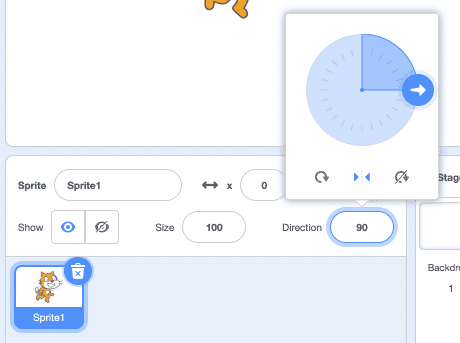

# 循环

> 原文：[`cs50.harvard.edu/scratch/notes/6/`](https://cs50.harvard.edu/scratch/notes/6/)

## 上次

+   上次，我们结合了函数、值和条件的块，使我们的 Scratch 程序能够提出问题，并根据这些问题的答案做出决定。

+   但每次我们运行代码时，无论是按绿色标志、按键还是点击，每个脚本都只能从上到下运行一次。

## 行走猫

+   现在，我们将告诉我们的程序**循环**，或重复多次执行一些块。

+   我们将以一个[行走猫](https://scratch.mit.edu/projects/507456678/)的例子开始，当点击绿色标志时，我们的猫将移动 10 步：

    [PRE0]

+   我们将在块的“控制”部分使用“永远”块，使我们的猫反复移动：

    [PRE1]

    +   现在，我们的猫将移动，直到它到达边缘，在那里它不能再移动。它仍然会尝试移动。

+   我们可以点击舞台顶部的停止标志，旁边是绿色标志，并将猫拖回舞台的左侧。

+   我们将添加另一个块，告诉我们的猫在到达边缘时跳跃或转身：

    [PRE2]

    +   现在，我们的猫在边缘转身时是倒置的，但我们可以通过在精灵面板中的方向旋钮上点击并选择第二个选项来更改旋转样式：

        

+   然而，我们的猫的腿并没有移动，实际上我们可以制作一个动画，图像移动得足够快，从而产生运动的错觉。

+   结果表明，我们的猫有两种服装，它的腿处于略微不同的位置。因此，我们可以使用“下一个服装”块在两者之间交替：

    [PRE3]

+   我们的猫看起来移动得有点快，所以我们将减慢它的移动速度：

    [PRE4]

    +   现在，我们的猫将移动，如果它在边缘，则弹跳，切换到下一个服装，然后等待一秒钟的短暂时间。然后它会反复执行所有这些块，直到我们按下停止标志。

## 游泳鱼

+   我们将在[游泳鱼](https://scratch.mit.edu/projects/507457166/)中使用“水下 1”背景，并让鱼指向鼠标光标：

    [PRE5]

    +   通过使用“永远”块，在点击绿色标志后，鱼将始终指向鼠标，反复进行。

+   我们也可以让鱼每次移动 5 步：

    [PRE6]

+   我们也可以用这个作为背景。我们可以在舞台面板中点击背景，并拖入这些块：

    [PRE7]

    +   最初，“播放声音”块只有“砰”的声音，所以我们将使用“声音”选项卡将“海洋波浪”声音添加到我们的背景中。然后，我们可以使用“播放声音”块中的下拉菜单选择“海洋波浪”。

    +   现在，我们的背景将反复播放波浪声。

+   现在，当我们点击绿色标志来运行我们的程序时，我们将有多个“永远”循环运行。我们的鱼将跟随鼠标指针，背景将连续播放波浪声。

+   使用这些积木，我们可以在我们的程序中添加重复播放的音乐，让我们有一种总有什么事情在发生的感觉。

## 抚摸猫

+   我们将移除我们的背景和鱼，并添加回猫，以[抚摸猫](https://scratch.mit.edu/projects/507457677/)。

+   现在，让我们告诉我们的猫，当鼠标太靠近时，它要发出“喵喵”声：

    [PRE8]

    +   我们可以添加一个条件来检查鼠标指针的距离。如果它小于 100 的值，我们的猫就会发出声音。

    +   注意，我们可以在积木的分类中找到“距离到”积木。

+   但当我们运行我们的程序时，没有任何事情发生，即使我们移动鼠标指针靠近猫。结果是我们的积木堆只运行了一次，一旦我们点击绿色标志，它就会提出问题，但由于我们的鼠标指针离猫很远，所以什么也不做。

+   通过添加“永远”积木并将我们的条件放在其中，我们可以不断地提出这个问题，并且每次我们的鼠标指针太靠近时都会播放声音：

    [PRE9]

+   一个“永远”循环，它会在程序结束时重复运行，也被称为无限循环。

## 喵喵

+   我们还可以使用“重复”积木来运行一些代码块特定次数：

    [PRE10]

    +   注意，在这个积木的右下角有一个小箭头，表示里面的代码将会被重复执行。

+   例如，如果我们想让我们的猫叫三次，我们可以使用：

    [PRE11]

+   但我们可以通过使用“重复”积木来改进我们程序的布局，[喵喵](https://scratch.mit.edu/projects/507457982/)，而不是反复使用相同的“播放声音”积木：

    [PRE12]

    +   这更好，因为我们现在只使用两个积木，而不是像以前那样使用三个。如果我们想重复 30 次，我们只需要改变椭圆形中的数字，而不是拖出 27 个额外的“播放声音”积木。

+   我们还可以在“重复”积木的椭圆形中使用其他值。例如，我们可以提出一个问题，并使用答案作为输入：

    [PRE13]

    +   现在，我们的程序用户可以控制我们的猫叫多少次。

+   我们可以在另一个例子中尝试让我们的猫在圆形中移动，[圆形](https://scratch.mit.edu/projects/507458172/)：

    [PRE14]

    +   我们的猫将移动 30 步，轻微转向，然后重复 24 次，在圆形中移动自己。

    +   以前，我们需要自己一次又一次地点击我们的积木。现在，我们的猫能够非常快速地重复所有这些操作。

### 气球

+   我们将在[Balloon 1](https://scratch.mit.edu/projects/507458351/)中使用循环让气球自己膨胀：

    [PRE15]

    +   现在，当我们点击绿色标志时，我们的气球将增加 10 个单位的大小，暂停一秒钟。它会这样做 10 次，直到它变得越来越大，然后消失并播放噼啪声。

+   但当我们再次点击绿色标志时，什么也没有发生。气球仍然隐藏着，所以我们需要添加一些积木来再次显示它：

    [PRE16]

    +   我们还将使用“设置大小”积木将气球恢复到原始大小。现在，每次我们点击绿色标志，它都会重新出现。

+   由于我们从 100 开始，并且增加 10 次共 10 次，气球将在 200 大小时爆裂。我们可以将循环重复的次数改为 15，现在气球将增长到 250 大小时才爆裂。

+   结果我们发现可以在“控制”部分的另一个块中使用“重复直到”，这样我们就可以避免自己进行那个计算，在[Balloon 2](https://scratch.mit.edu/projects/507458714/)中：

    [PRE17]

    +   “重复直到”块是循环和条件的组合。它将反复运行，直到某个问题被回答为“是”，或者变为真。

    +   我们将在“运算符”部分使用六边形形状的“=”运算符来比较气球的大小，一旦它等于 250，我们的“重复直到”块将停止重复。

    +   条件成立后，我们其余的块将运行，隐藏我们的气球并播放爆裂声。

+   通过使用“永远”块、“重复”块和“重复直到”块，我们能够在程序中创建循环，多次运行我们的代码，而无需我们一次次地点击。
