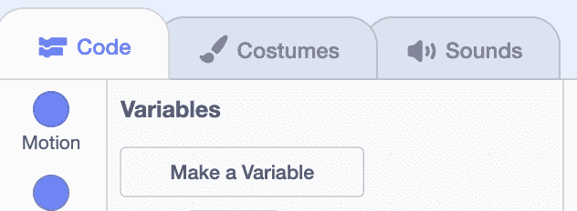
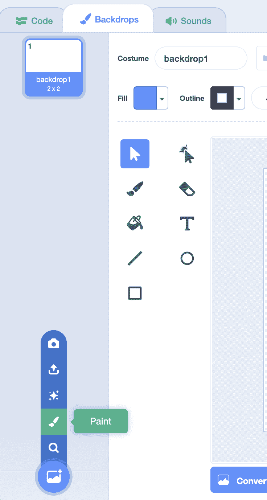
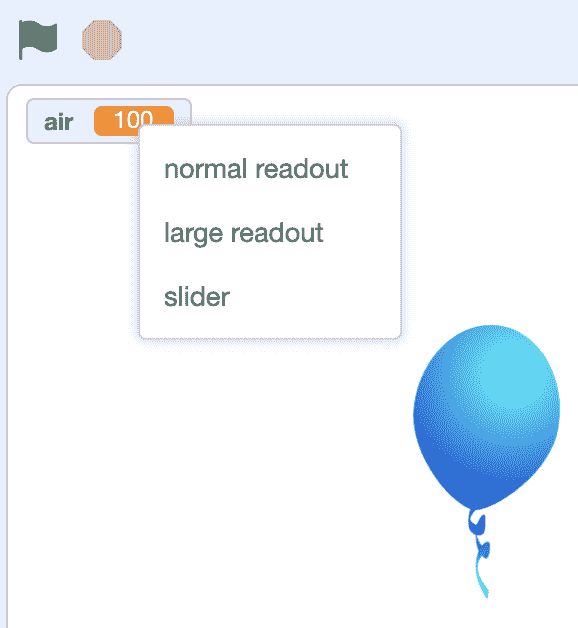

# 变量

> 原文：[`cs50.harvard.edu/scratch/notes/7/`](https://cs50.harvard.edu/scratch/notes/7/)

+   到目前为止，我们使用的是程序中可以作为决策依据或作为函数输入的信息值。

+   当这些值存储在我们的程序中以便我们稍后使用时，它们可以被称作**变量**。

## 计数猫

+   让我们构建[计数猫](https://scratch.mit.edu/projects/507459074/)的示例。

+   我们将在代码块的“变量”部分查找，并看到这个标有“创建变量”的按钮：

    

    +   当我们点击这个按钮时，会要求我们输入变量的名称，所以我们将输入“count”，因为我们想用它来存储计数。

    +   我们还可以决定这个变量是否对所有精灵可用或可更改，通常被称为**全局变量**。或者，我们也可以使这个变量仅对当前精灵可用，也称为**局部变量**。我们将为这个“count”变量选择“对所有精灵”。

+   现在，我们看到了一个可用的椭圆形“count”代码块，它左侧有一个复选框。复选框会告诉 Scratch 在舞台的左上角显示变量的值，或者存储在变量中的内容。我们可以取消勾选，这样值就会在舞台上隐藏。

+   我们可以为我们的猫添加计数点击次数的代码块：

    [PRE0]

    +   “改变”代码块会将“count”变量的值增加 1。

    +   然后，我们的猫会说出变量的值。

+   我们可以添加另一个精灵，“Button2”，它将是一个我们可以用来将计数重置为 0 的按钮。我们将使用“外观”选项卡为我们的按钮添加文本，使其标有“重置”：

    

+   我们将为重置按钮添加这些代码块：

    [PRE1]

    +   现在，当这个按钮被按下时，0 的值将被放入“count”变量中，替换掉之前的内容。

## 追逐星星

+   现在，我们可以制作一个游戏，让刺猬跟踪我们的分数，[追逐星星](https://scratch.mit.edu/projects/507459780/)。

+   我们将删除我们的精灵，并右键点击或按住控制键点击“count”变量，然后选择“删除”选项来将其也删除。

+   我们将添加我们的刺猬，并告诉它指向并移动到鼠标指针的方向：

    [PRE2]

+   我们将添加另一个精灵，星星，每次刺猬触摸它时，它都会增加我们的分数。我们还会让它在被触摸后移动到随机位置：

    [PRE3]

    +   首先，我们需要创建一个新的变量，我们将称之为“score”。

    +   我们将使用无限循环让星星不断检查它是否触摸到刺猬，每次触摸时，我们将分数增加 1。

    +   最后，我们将告诉我们的星星在被触摸后移动到随机位置。

+   现在，我们有一个游戏，我们可以尝试用刺猬收集星星。

+   当程序开始运行时，我们可能希望将分数重置为 0。我们将使用刺猬来实现这一点：

    [PRE4]

    +   注意，我们想要将“设置”块放在“无限循环”之外。这样，它只会被设置为 0 一次，之后由星星改变。

+   我们可以让程序在获得一定数量的分数时改变背景并停止。

+   首先，我们将点击右下角的舞台面板，并转到背景选项卡。然后点击左下角的带加号的按钮，选择“绘画”来创建我们自己的背景：

    

+   我们将添加一个覆盖背景的绿色矩形和一些写着“你赢了！”的文本。我们将把背景的名字改为“Win”。

+   现在，我们想要确保背景从纯白色背景“backdrop1”开始，所以我们将它添加到我们的刺猬上：

    [PRE5]

+   然后，在我们的星星代码块中，我们希望在达到 10 分时改变背景并停止我们的程序：

    [PRE6]

    +   在我们改变分数后，我们想要添加一个检查“分数”值的条件。如果它等于 10，那么我们将切换背景。我们还会在控制部分使用“停止”块，这将停止我们程序中的所有内容。

    +   回想一下，我们可以在运算符部分得到“=”块，在变量部分得到“分数”块。

## 弹跳球

+   我们将移除这些精灵，并为我们的下一个示例选择另一个背景，“蓝天”，[弹跳球](https://scratch.mit.edu/projects/507460802/)。

+   我们将添加球精灵，并告诉它开始下落，或者向下移动，直到它到达地面：

    [PRE7]

    +   我们将 y 位置减去 5，这使得球向下移动。

    +   然后，如果球接触到背景地面上的棕色，我们将停止我们的程序。我们将点击颜色，然后点击吸管来选择棕色。

    +   现在，当我们点击旗帜时，我们的球开始下落。我们可以将球拖回舞台顶部，再试一次。

+   但这种下落并不非常逼真。一个真实的球最初下落得很慢，然后越来越快。

+   让我们的球每次移动一个可变步数。我们将创建一个新的变量叫做“速度”，因为它将存储下落的速度，我们可以使这个变量只对“这个精灵”可用，因为其他精灵不需要使用它。

    +   现在，在我们的舞台左上角，我们看到变量被标记为“球：速度”，告诉我们它属于哪个精灵。

+   对于球的代码，我们将在它下落时增加“速度”变量的值：

    [PRE8]

    +   首先，我们将“速度”设置为 0。然后，我们将改变球的位置 y 值，这个值最初将是 0。

    +   之后，我们将“速度”的值减去 1，这使得它更加负，因此我们的球会更快地向下移动舞台。

    +   我们的无限循环会一直重复运行，直到“停止所有”块告诉我们的程序停止。

+   我们可以让球在接触地面后向上移动，也可以：

    [PRE9]

    +   我们可以通过乘以-1 来将我们的“速度”变量的值从负数变为正数。然后，球将开始在舞台上向上移动，但“速度”变量会再次每次减少 1。

    +   最终，球的“速度”将变为 0，然后变为负数，然后它将再次开始沿着舞台向下移动。

+   我们还可以让球每次弹跳时稍微失去一点速度：

    [PRE10]

    +   当速度从负数变为正数时，我们也可以从它减去 2，这样新的速度总是比之前略小。

    +   最终，我们希望球停止移动，因此我们需要添加一些额外的代码来实现这一点。

+   使用变量，我们可以近似弹跳球的速率，使其运动更加逼真。

## 气球

+   让我们看看一个例子，用户可以在[气球](https://scratch.mit.edu/projects/507461727/editor/)中控制气球的大小。

+   我们有一个气球精灵，我们将创建一个新的变量叫做“空气”。在舞台上，我们可以右键点击，或者按住控制键点击变量，并改变读数的外观：

    

    +   我们可以选择显示大读数，但暂时我们选择滑块。

+   现在，用户可以移动滑块来改变变量的值。我们可以右键点击，或者按住控制键点击滑块，选择“更改滑块范围”，以便有一个最小值和最大值。为此，我们将最小值设置为 100，最大值设置为 200，因为大小应该在两个值之间。

+   我们将在气球精灵中添加代码块，告诉它改变其大小：

    [PRE11]

    +   现在，点击绿色标志后，气球将不断将其大小设置为“空气”变量的值，即使我们在舞台上改变滑块的值。

+   通过这些想法，我们可以允许用户直接控制变量来与我们的项目或精灵交互。

## 螺旋

+   让我们看看一个带有笔扩展的例子，[螺旋](https://scratch.mit.edu/projects/507462011/editor/)。

+   我们会让猫沿着圆形移动：

    [PRE12]

    +   我们将从屏幕中心面向右开始移动和转向，以获得圆形移动的效果。

+   我们将通过使用界面左下角的蓝色按钮来添加笔扩展。然后我们将擦除一切，放下笔开始绘制：

    [PRE13]

    +   我们还会让猫在每一步之间等待一小段时间，这样我们就可以看到它是如何画圆的。

+   现在，让我们创建一个新的变量叫做“步骤”。我们首先将其设置为 0，并告诉猫按照变量的值移动：

    [PRE14]

    +   注意，我们还在每次移动时稍微增加“步骤”变量的值，每次增加 0.5。因此，每次移动时，我们都会移动得更远。结果看起来像螺旋。

+   使用循环、变量和笔，我们可以在程序中绘制一些有趣的图形。

+   更普遍地，使用变量，我们可以在程序中跟踪信息，并在以后更改或使用它们，从而制作出比以前更强大、更精彩的电子游戏、动画和故事。
