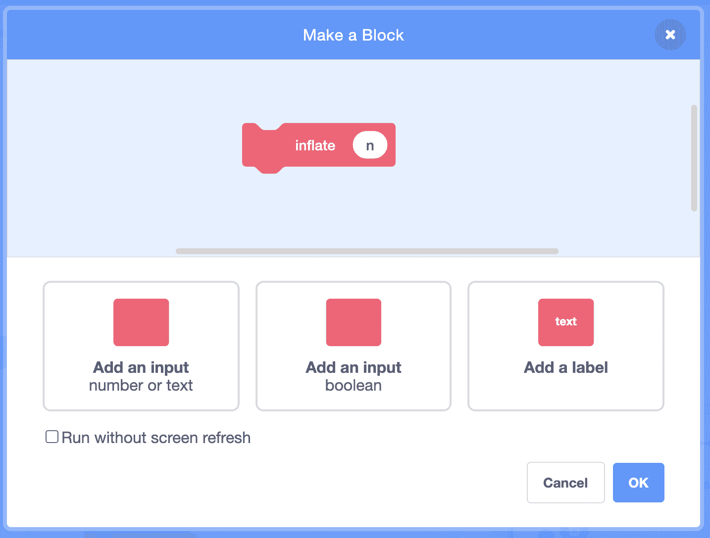
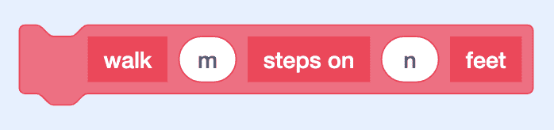

# 抽象

> [`cs50.harvard.edu/scratch/notes/8/`](https://cs50.harvard.edu/scratch/notes/8/)

+   到目前为止，我们已经看到了 Scratch 的许多功能，包括让我们可以向项目中添加循环、变量和条件的块。

+   现在，让我们考虑一下我们如何可能改进我们在 Scratch 项目中设计的块的方式。

## 恐龙游戏

+   让我们从添加一个恐龙精灵开始，构建我们的[Dinosaur Game](https://scratch.mit.edu/projects/507462509/)示例。

+   我们将添加块，以便在按下箭头键时它可以移动：

    ```
     when [up arrow v] key pressed
      change y by (10)

      when [down arrow v] key pressed
      change y by (-10)

      when [right arrow v] key pressed
      change x by (10)

      when [left arrow v] key pressed
      change x by (-10) 
    ```

+   我们将添加另一个精灵，星星，并且当我们的恐龙触摸星星时，我们可以说我们赢得了游戏。

+   让我们的恐龙在向上移动后检查它是否接触到了星星：

    ```
     when [up arrow v] key pressed
      change y by (10)
      if <touching (Star v) ?> then
      say (timer) for (2) seconds 
    ```

    +   回想一下，“if”块位于块的“控制”部分，而“接触？”块位于“感应”部分。

    +   我们还会添加一个“说”块以及“计时器”变量，这样我们的恐龙就可以告诉我们找到星星花了多长时间。

+   但如果我们按下右键到达星星后，这种方法就不起作用了。

+   我们希望我们的恐龙能够检查无论我们使用哪个键，我们是否已经到达了星星，因此我们需要在“if”块上右键单击或控制单击，并选择“复制”为每个键创建一个副本：

    ```
     when [up arrow v] key pressed
      change y by (10)
      if <touching (Star v) ?> then
      say (timer) for (2) seconds

      when [down arrow v] key pressed
      change y by (-10)
      if <touching (Star v) ?> then
      say (timer) for (2) seconds

      when [right arrow v] key pressed
      change x by (10)
      if <touching (Star v) ?> then
      say (timer) for (2) seconds

      when [left arrow v] key pressed
      change x by (-10)
      if <touching (Star v) ?> then
      say (timer) for (2) seconds 
    ```

+   我们还会在我们的星星上添加一些代码，以便每次程序启动时它都会移动到随机位置：

    ```
     when green flag clicked
      go to (random position v) 
    ```

+   现在，我们可以使用箭头键将我们的恐龙移动到星星，并且每次它都会告诉我们我们花了多长时间。

+   看起来时间是以小数报告的，比如 9.70。因此，我们可以使用运算符部分中的“round”块将此时间四舍五入到最接近的秒数。

+   但现在，我们必须将“圆形”块拖入每个方向的脚本中。

+   当我们在项目中复制大量代码时，通常有一个更好的解决方案。

+   在这种情况下，我们实际上可以创建一个新的自定义块，并在需要时引用它。

+   我们将在“我的块”部分中查找，并点击“创建块”来创建一个新的块。我们将将其命名为“检查是否胜利”，因为我们正在尝试做的事情。然后，我们会看到这个块出现：

    ```
     define check if won 
    ```

    +   现在，我们可以在下面添加一些块，每次我们使用“检查是否胜利”块时，它都会运行。

+   因此，我们将条件块和“说”块移动到它那里：

    ```
     define check if won
      if <touching (Star v) ?> then
      say (timer) for (2) seconds 
    ```

+   对于我们的其他脚本，我们将拖出我们自己的“检查是否胜利”块：

    ```
     when [up arrow v] key pressed
      change y by (10)
      check if won

      when [down arrow v] key pressed
      change y by (-10)
      check if won

      when [right arrow v] key pressed
      change x by (10)
      check if won

      when [left arrow v] key pressed
      change x by (-10)
      check if won 
    ```

    +   现在，我们使用更少的块来实现相同的效果。

+   如果我们想要四舍五入计时器的值，我们现在只需更改一个位置，而不是四个：

    ```
     define check if won
      if <touching (Star v) ?> then
      say (round(timer)) for (2) seconds 
    ```

+   创建我们自己的块的能力将使我们能够改进项目的整体设计和可读性。

## 气球

+   让我们为[Balloon 1](https://scratch.mit.edu/projects/507463302/)添加一个气球精灵，并添加使其充气和放气的块：

    ```
     when green flag clicked
      set size to (50) %
      repeat (10)
      change size by (10)
      end
      wait (1) seconds
      repeat (10)
      change size by (-10)
      end 
    ```

    +   我们的风筝将从一个 50%的大小开始，增加其大小 10 次，等待一秒钟，然后减小其大小 10 次（通过负 10 改变）。

+   但这段代码需要其他人思考数字和循环在做什么，以理解会发生什么。我们可以通过添加更多块来使我们的代码更容易阅读。

+   我们可以创建一个新的名为“inflate”的块，该块将使我们的风筝大小增加 10 次：

    ```
     define inflate
      repeat (10)
      change size by (10)
      end 
    ```

+   我们还将创建另一个名为“deflate”的块，它将减小风筝的大小：

    ```
     define deflate
      repeat (10)
      change size by (-10)
      end 
    ```

+   对于主脚本，我们将使用我们新的块：

    ```
     when green flag clicked
      set size to (50) %
      inflate
      wait (1) seconds
      deflate 
    ```

    +   注意，我们的程序仍然执行完全相同的事情，但“when flag clicked”下的脚本更容易阅读。

+   我们可以将这些自定义块称为**抽象**，或者将更复杂的思想或动作取一个名字，这样我们就可以反复引用和使用。

+   我们可以在[Balloon 2](https://scratch.mit.edu/projects/507463768/)中给自己更多的控制。让我们右键单击或按住控制键单击我们拥有的“inflate”块，并选择“编辑”。然后，我们将点击“添加输入”以使这个块能够接受一些输入，并将其命名为“n”：

    

    +   “n”将是输入的名称，由于它将是一个数字，我们可以按照惯例使用“n”。

+   我们还将点击“添加标签”，并将其更改为“times”，这样我们的块看起来就像这样：

    

    +   标签让我们可以添加更多文字来描述块将要执行的操作。

+   注意，我们的“inflate”的“define”块将显示一个椭圆形的“n”，我们可以在下面的块中使用它，所以我们将将其拖入“repeat”块中：

    ```
     define inflate (n) times
      repeat (n)
      change size by (10) 
    ```

    +   现在，“inflate”将根据“n”的次数增加风筝的大小 10 次。

+   我们将以相同的方式对“deflate”进行操作。然后，在我们的“when flag clicked”脚本中，我们需要在每个自定义块中输入一个数字：

    ```
     when green flag clicked
      set size to (50) %
      inflate () times
      wait (1) seconds
      deflate () times 
    ```

    +   我们可以输入 10，这样风筝就会膨胀 10 次，或者我们可以将其更改为 20，或者任何其他值。

+   通过让我们的函数能够接受输入，我们可以使它们更加灵活。

## Walking Bear

+   让我们看看一个在[Walking Bear](https://scratch.mit.edu/projects/507464163/)中可以接受多个输入的函数。

+   我们将添加我们的熊角色，并将熊的四条腿服装重命名为“4”，两条腿的服装重命名为“2”。

+   让我们创建一个新的名为“walk”的块，并给它一个名为“m”的输入。我们将添加一个标签“steps on”，然后另一个输入，“n”。最后，我们还将添加另一个标签，“feet”：

    

    +   我们可以将输入命名为任何我们想要的，但我们将使用“m”和“n”。

+   我们希望这个块执行的操作是让我们的熊在“n”只脚上走“m”步，所以我们将定义为：

    ```
     define walk (m) steps on (n) feet
      switch costume to (n)
      repeat (m)
      move (1) steps 
    ```

    +   我们首先将我们的服装切换到“n”，然后移动 1 步“m”次。

+   现在，在我们的主脚本中，我们可以告诉我们的熊走任意数量的步数，用两只或四只脚：

    ```
     when green flag clicked
      walk (30) steps on (4) feet
      walk (30) steps on (2) feet 
    ```

    +   注意，当点击标志时，更容易理解我们的熊会做什么。而且我们也避免了反复重复多个代码块。

+   通过我们自己的自定义代码块，我们可以定义可以重用并使我们的项目更有条理的复杂行为。
