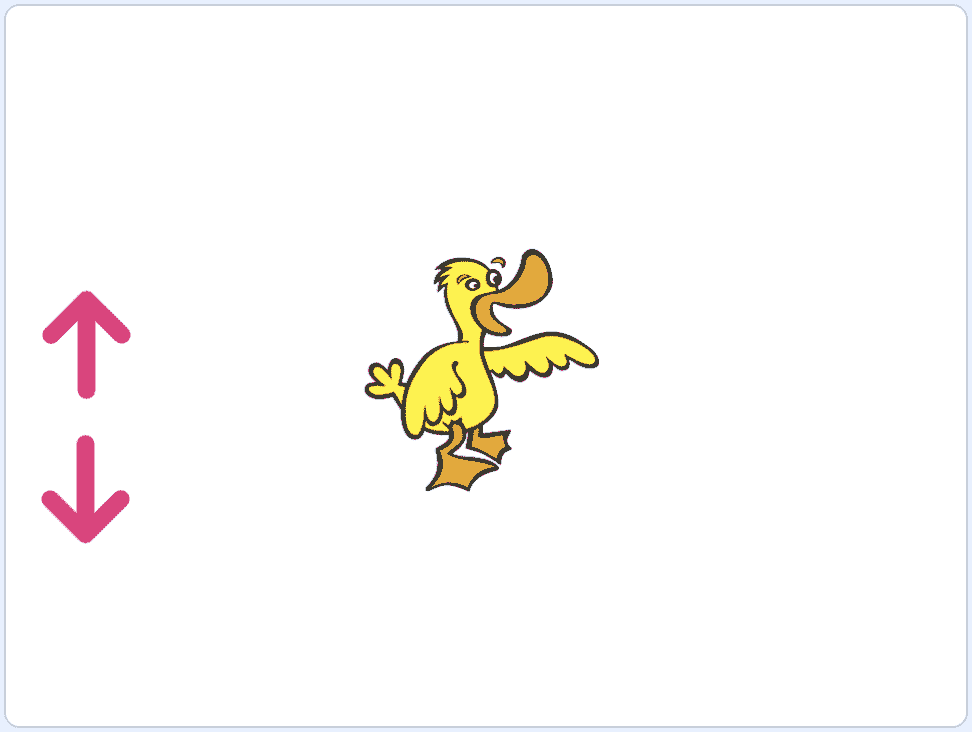

# 从 Scratch 开始构建

> 原文：[`cs50.harvard.edu/scratch/notes/9/`](https://cs50.harvard.edu/scratch/notes/9/)

## 广播

+   Scratch 中的一个有用功能将允许我们的精灵之间相互通信。

+   我们将添加我们的猫和恐龙精灵，并将恐龙旋转使其面向猫。

+   现在，我们将让猫向恐龙问候：

    ```
     when green flag clicked
      say [Hello, Dinosaur!] for (2) seconds 
    ```

+   我们还将让恐龙回话，但它应该等待两秒钟：

    ```
     when green flag clicked
      wait (2) seconds
      say [Hello, Cat!] for (2) seconds 
    ```

+   但是现在，如果我们想让猫只问候一秒钟，我们必须记得改变恐龙等待的时间。随着我们交互的增多，或者舞台上精灵的增多，这将会变得更加复杂。

+   结果表明，我们的猫精灵可以使用**广播**，即发送消息或信号的能力。而我们的恐龙精灵在接收到该消息时会做出响应。

+   在积木的“事件”类别中，我们将使用“广播”积木。我们将使用下拉菜单选择“新消息”，并将其命名为“greet”：

    ```
     broadcast (greet v) 
    ```

+   我们将更改猫的脚本以使用该积木在完成时发送消息：

    ```
     when green flag clicked
      say [Hello, Dinosaur!] for (2) seconds
      broadcast (greet v) 
    ```

+   对于我们的恐龙，我们可以使用“当我收到”积木：

    ```
     when I receive [greet v]
      say [Hello, Cat!] for (2) seconds 
    ```

    +   现在，当我们的猫完成问候后，我们的恐龙总是会做出回应。

## 控制鸭子

+   让我们在舞台添加一只鸭子以控制[控制鸭子](https://scratch.mit.edu/projects/507464954/)。

+   我们可以使用箭头键来控制它，但让我们在舞台上添加两个箭头精灵，并将其中一个旋转使其向上，另一个向下：

    

+   对于指向上方的箭头，我们将告诉它在点击时广播一个“up”的消息：

    ```
     when this sprite clicked
      broadcast (up v) 
    ```

+   对于指向下方的箭头，我们将广播另一个消息，“down”：

    ```
     when this sprite clicked
      broadcast (down v) 
    ```

+   对于我们的鸭子，我们将告诉它根据接收到的消息上下移动：

    ```
     when I receive [up v]
      change y by (10)

      when I receive [down v]
      change y by (-10) 
    ```

+   现在，每个箭头精灵在点击时都会广播一个消息，而鸭子在接收到消息时会移动。

## 访问鱼

+   舞台也可以广播消息，正如我们将在[访问鱼](https://scratch.mit.edu/projects/507465389/)中看到的。

+   我们将把背景更改为“水下 1”，并添加一个鱼精灵。

+   现在，我们可以点击右下角的背景，并在代码选项卡中，在事件部分添加“当舞台点击”积木：

    ```
     when stage clicked
      broadcast (visit v) 
    ```

    +   然后，我们将广播一个新的消息，我们将其命名为“visit”。

+   当我们的鱼接收到“visit”消息时，我们将告诉它去我们的鼠标指针：

    ```
     when I receive [visit v]
      point towards (mouse-pointer v)
      glide (1) secs to (mouse-pointer v) 
    ```

    +   现在，点击旗帜后，我们可以在舞台上的任何地方点击，我们的鱼就会移动到那里。

## 星星

+   让我们看看我们如何能够使用[星星](https://scratch.mit.edu/projects/507465575/)克隆或复制一个精灵。

+   使用我们朴素的白色背景和星星精灵，我们将添加以下积木：

    ```
     when this sprite clicked
      create clone of (myself v)

      when I start as a clone
      glide (1) secs to (random position v) 
    ```

    +   “创建克隆”和“当我作为克隆体开始”积木位于积木的“控制”部分。

    +   现在，每次点击星星时，它都会复制自己。然后，副本将运行“当我作为克隆体开始”下的任何脚本，将自己移动到舞台上的随机位置。

## 晶石捕捉

+   让我们移除我们的星星，并使用[Crystal Catch](https://scratch.mit.edu/projects/507465773/)构建一个完全完整的游戏。

+   我们将从我们的猫开始，尝试构建一个捕捉“Crystal”精灵的游戏。我们最终希望水晶从天空落下，而猫在它们到达地面之前捕捉到它们。

+   首先，我们将添加用于猫左右移动的箭头键的方块：

    ```
     when [left arrow v] key pressed
      change x by (-10)

      when [right arrow v] key pressed
      change x by (10) 
    ```

+   然后，我们希望我们的猫在点击绿色旗帜时从舞台中央开始：

    ```
     when green flag clicked
      go to x: (0) y: (-125)
      say (Catch the crystals without letting them hit the ground!) for (4) seconds
      broadcast (begin v) 
    ```

    +   我们还会为我们的用户提供一些说明。

    +   在游戏开始之前，我们应该隐藏水晶，然后创建它的克隆，因为我们希望出现许多水晶。在此之前，我们需要我们的猫广播一条消息，“开始”。

+   现在，我们可以让我们的水晶在游戏开始时隐藏自己，并创建自己的克隆：

    ```
     when green flag clicked
      hide

      when I receive [begin v]
      create clone of (myself v) 
    ```

+   然后，当水晶作为一个克隆体开始时，它应该显示自己：

    ```
     when I start as a clone
      show
      go to x: (0) y: (160)
      forever
      change y by (-2) 
    ```

    +   在我们的水晶出现后，它将从舞台顶部中央开始，并不断向下移动，形成一个永无止境的循环。

+   注意，我们一次构建游戏的一个组件，并且我们可以始终启动程序来确保到目前为止我们所做的一切都在工作。

+   接下来，我们的水晶需要检查它是否接触到了猫：

    ```
     when I start as a clone
      show
      go to x: (0) y: (160)
      forever
      change y by (-2)
      if <touching (Cat v) ?> then 
    ```

+   我们将创建一个新的变量“catches”来表示得分，并在猫的脚本中重置它，因为我们也在那里进行其他重置：

    ```
     when green flag clicked
      go to x: (0) y: (-125)
      set [catches v] to (0)
      say (Catch the crystals without letting them hit the ground!) for (4) seconds
      broadcast (begin v) 
    ```

+   现在，我们可以回到我们的水晶脚本，并添加当它接触到我们的猫时需要执行的方块：

    ```
     when I start as a clone
      show
      go to x: (0) y: (160)
      forever
      change y by (-2)
      if <touching (Cat v) ?> then
      change [catches v] by (1)
      create clone of (myself v)
      delete this clone 
    ```

    +   我们需要将“catches”变量增加 1，以跟踪我们的得分。

    +   然后，我们需要创建一个新的水晶，并让原始水晶删除自己。

    +   新的水晶将从屏幕顶部开始，因为它是一个新的克隆。

+   让我们改变水晶位置的 x 值到一个随机的值，这样我们的游戏就有了一些不可预测性。舞台的左右两侧将是很大的数字，所以我们将使用-200 和 200：

    ```
     when I start as a clone
      show
      go to x: (pick random (-200) to (200)) y: (160) 
    ```

    +   现在，我们的水晶每次都会出现在不同的位置。

+   如果我们没有捕捉到水晶，我们可能想要计算到目前为止的失误次数。

+   我们将创建一个新的变量“misses”，它将跟踪我们的猫没有捕捉到水晶的次数。每次游戏开始时，我们将将其重置为 0：

    ```
     when green flag clicked
      go to x: (0) y: (-125)
      set [catches v] to (0)
      set [misses v] to (0)
      say (Catch the crystals without letting them hit the ground!) for (4) seconds
      broadcast (begin v) 
    ```

+   现在，我们可以让我们的水晶检查它是否接触到了地面（或边缘）：

    ```
     when I start as a clone
      show
      go to x: (0) y: (160)
      forever
      change y by (-2)
      if <touching (Cat v) ?> then
      change [catches v] by (1)
      create clone of (myself v)
      delete this clone
      end
      if <touching (edge v) ?> then
      change [misses v] by (1)
      create clone of (myself v)
      delete this clone
      end 
    ```

    +   如果我们的水晶到达边缘，我们将增加“misses”的值，然后创建一个新的克隆体，并删除这个克隆体。

+   我们可能想要限制可以有的失误次数，因此我们可以有一个条件来检查这一点：

    ```
     if <touching (edge v) ?> then
      change [misses v] by (1)
      if <(misses) = (3)> then
      broadcast (game over v)
      delete this clone
      end
      create clone of (myself v)
      delete this clone
      end 
    ```

    +   在我们错过之后，我们将检查数字是否为三。如果是，我们将为我们的猫广播一条消息，然后删除这个克隆体。

+   最后，在我们的猫的脚本中，我们可以说出我们收到消息时的得分：

    ```
     when I receive [game over v]
      say (join (Your score is) (catches)) for (5) seconds 
    ```

+   我们可以尝试这样做，并看到我们的程序按预期工作。我们可以通过让水晶不断克隆自己来一次创建多个水晶：

    ```
     when I receive [begin v]
      forever
      create clone of (myself v)
      wait (15) seconds 
    ```

    +   现在，每 15 秒就会创建一个新的水晶。

+   但是我们注意到，当游戏结束时，新的水晶仍然会继续创建。所以，我们需要让我们的猫在我们的程序中停止一切：

    ```
     when I receive [game over v]
      say (join (Your score is) (catches)) for (5) seconds
      stop [all v] 
    ```

+   通过这些示例，希望你能看到所有这些组件、工具和概念如何被用来在 Scratch 中构建有趣和令人兴奋的项目。

+   我们鼓励你创建一些自己的东西，并与你的朋友、家人和我们分享。感谢你加入我们，一起学习 Scratch 编程入门！
