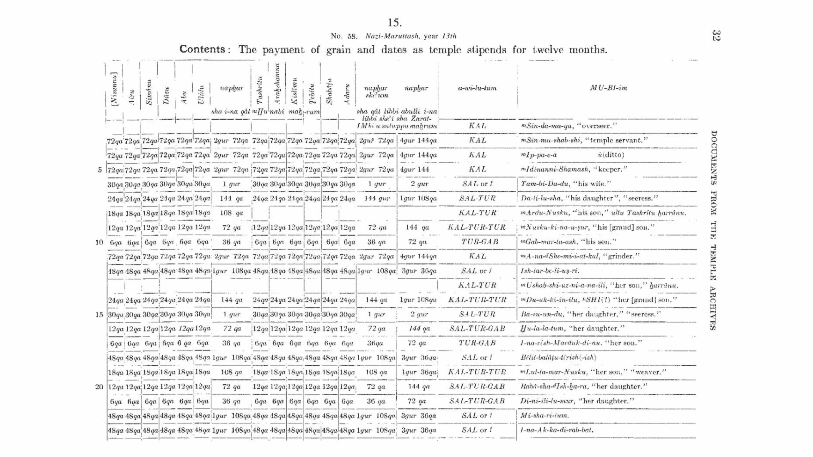
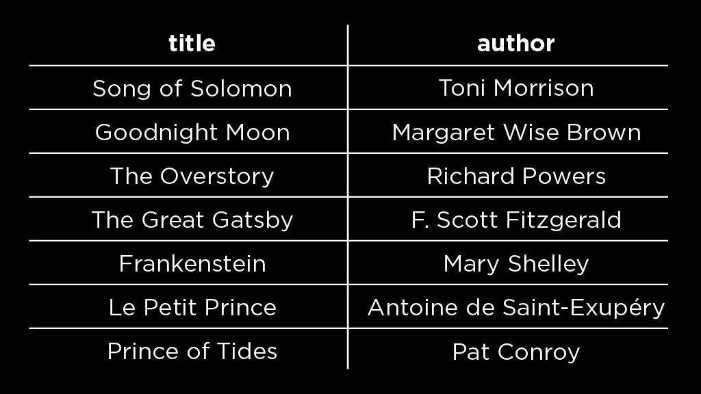

# 讲座 0

> 原文：[`cs50.harvard.edu/sql/notes/0/`](https://cs50.harvard.edu/sql/notes/0/)

+   简介

+   什么是数据库？

+   SQL

    +   问题

+   SQLite 入门

+   终端技巧

+   `SELECT`

    +   问题

+   `LIMIT`

+   `WHERE`

+   `NULL`

+   `LIKE`

    +   问题

+   范围

    +   问题

+   `ORDER BY`

    +   问题

+   聚合函数

    +   问题

+   结束

## 简介

+   数据库（和 SQL）是用于交互、存储和管理信息的工具。尽管我们在这个课程中使用的工具是新的，但数据库是一个古老的概念。

+   看一下几千年前的一个图表。它有行和列，似乎包含寺庙工人的津贴。可以称这个图表为一个表，甚至是一个电子表格。

+   根据上图所示，我们可以得出以下结论：

    +   一个表存储了一些信息集（这里，工人的津贴）。

    +   表中的每一行存储该集合中的一个项目（这里，一个工人）。

    +   每一列都有该项目的某个属性（这里，特定月份的津贴）。

+   让我们考虑一个现代的背景。假设你是一名图书管理员，负责组织关于这个图中书籍标题和作者的信息。

    

+   组织信息的一种方式是将每本书的书名后面跟其作者，如下所示。

    

    +   注意，现在每本书都是这个表中的一行。

    +   每一行都有两列——每列都是书籍的不同属性（书名和作者）。

+   在今天的信息时代，我们可以使用像 Google Sheets 这样的软件来存储表格，而不是纸张📝或石板🪨。然而，在这个课程中，我们将讨论数据库而不是电子表格。

+   超越电子表格转向数据库的三个原因是

    +   **规模**：数据库不仅可以存储数以万计的项目，甚至可以存储数以百万、数十亿计的项目。

    +   **更新容量**：数据库能够在一秒内处理多个数据更新。

    +   **速度**：数据库允许更快的信息查找。这是因为数据库为我们提供了访问不同算法以检索信息。相比之下，电子表格只能使用 Ctrl+F 或 Cmd+F 逐个查看搜索结果。

## 什么是数据库？

+   数据库是一种组织数据的方式，你可以对其执行四个操作

    +   create

    +   read

    +   update

    +   delete

+   数据库管理系统（DBMS）是使用图形界面或文本语言与数据库交互的方式。

+   数据库管理系统的例子：MySQL、Oracle、PostgreSQL、SQLite、Microsoft Access、MongoDB 等。

+   选择数据库管理系统会基于以下因素

    +   **成本**：专有软件与免费软件，

    +   **支持量**：像 MySQL、PostgreSQL 和 SQLite 这样的免费和开源软件需要你自己设置数据库，这是它们的缺点。

    +   **重量**：像 MySQL 或 PostgreSQL 这样的功能更全面的系统比 SQLite 这样的系统更重，运行时需要更多的计算资源。

+   在本课程中，我们将从 SQLite 开始，然后转向 MySQL 和 PostgreSQL。

## SQL

+   SQL 代表结构化查询语言。它是一种用于与数据库交互的语言，通过它可以创建、读取、更新和删除数据库中的数据。关于 SQL 的一些重要注意事项

    +   它是有结构的，正如我们将在本课程中看到的，

    +   它有一些可以用来与数据库交互的关键字，并且

    +   它是一种查询语言——它可以用来对数据库中的数据进行提问。

+   在本课中，我们将学习如何编写一些简单的 SQL 查询。

### 问题

> SQL 有子集吗？

+   SQL 是美国国家标准协会（ANSI）和国际标准化组织（ISO）的标准。大多数数据库管理系统都支持 SQL 语言的一些子集。所以，例如，对于 SQLite，我们使用的是 SQLite 支持的 SQL 子集。如果我们想将代码移植到像 MySQL 这样的不同系统，我们可能需要更改一些语法。

## SQLite 入门

+   值得注意的是，SQLite 不仅是我们在这个课程中使用的，它还用于许多其他应用程序，包括手机、桌面应用程序和网站。

+   现在，考虑一个包含长期入选 [国际布克奖](https://en.wikipedia.org/wiki/International_Booker_Prize#:~:text=Its%20aim%20is%20to%20encourage,the%20winner%20announced%20in%20May.) 的书籍的数据库。每年有 13 本书入选，我们的数据库包含了 5 年的此类长期入选名单。

+   在我们开始与这个数据库交互之前：

    +   登录到 [CS50 的 Visual Studio Code](https://cs50.dev/)。这是我们编写代码和编辑文件的地方。

    +   SQLite 环境已经在你的 Codespace 中设置好了！在终端中打开它。

## 终端技巧

这里有一些在终端上编写 SQL 代码的有用技巧。

+   要清除终端屏幕，请按 Ctrl + L。

+   要获取终端中之前执行的指令，请按上箭头键。

+   如果你的 SQL 查询太长，在终端中换行，你可以按回车键并继续在下一行编写查询。

+   要退出数据库或 SQLite 环境，请使用 `.quit`。

## `SELECT`

+   我们数据库中实际上有什么数据？为了回答这个问题，我们将使用我们的第一个 SQL 关键字 `SELECT`，它允许我们从数据库表中选择一些（或全部）行。

+   在 SQLite 环境中，运行

    [PRE0]

    这将选择名为 `longlist` 的表中的所有行。

+   我们得到的结果包含表中所有行的所有列，这有很多数据。我们可以通过选择表中的特定列来简化它，比如标题。让我们试试

    [PRE1]

+   现在，我们看到这个表中标题的列表。但如果我们想在搜索结果中看到标题和作者怎么办？为此，我们运行

    [PRE2]

### 问题

> 在表和列名周围使用双引号是必要的吗？

+   在表和列名周围使用双引号是一个好习惯，这些被称为 SQL 标识符。SQL 还包含字符串，我们用单引号来包围字符串，以区分它们和标识符。

> 这个数据库中的数据是从哪里来的？

+   这个数据库包含来自各种来源的数据。

+   长书单（2018-2023 年）来自 [Booker Prize](https://thebookerprizes.com/the-booker-library/features/full-list-of-international-booker-prize-winners-shortlisted-authors-and-their-books) 网站。

+   这些书籍的评分和其他信息来自 [Goodreads](https://www.goodreads.com/)。

> 我们如何知道数据库中有哪些表和列？

+   数据库模式包含数据库的结构，包括表和列名。在本课程的后期，我们将学习如何获取数据库模式并理解它。

> SQLite 3 是区分大小写的吗？为什么查询中的一些部分是大写，而另一些是小写？

+   SQLite 不区分大小写。然而，我们确实遵循一些样式约定。观察这个查询：

    [PRE3]

    SQL 关键字用大写字母书写。这在提高较长的查询的可读性方面特别有用。表和列名用小写字母。

## `LIMIT`

+   如果一个数据库有数百万行，选择所有行可能没有意义。相反，我们可能只想浏览它包含的数据。我们使用 SQL 关键字 `LIMIT` 来指定查询输出中的行数。

+   [PRE4]

    这个查询给我们数据库中的前 10 个标题。这些标题在查询输出中的顺序与数据库中的顺序相同。

## `WHERE`

+   关键字 `WHERE` 用于根据条件选择行；它将输出满足指定条件的行。

+   [PRE5]

    这给我们提供了 2023 年长名单书籍的标题和作者。请注意，`2023` 没有引号，因为它是一个整数，而不是字符串或标识符。

+   可以用于在 SQL 中指定条件的运算符有 `=`（“等于”）、`!=`（“不等于”）和 `<>`（也是“不等于”）。

+   要选择非精装书的书籍，我们可以运行以下查询

    [PRE6]

    +   注意，`hardcover` 用单引号，因为它是一个 SQL 字符串，而不是标识符。

+   `!=` 可以用运算符 `<>` 替换以获得相同的结果。修改后的查询将是

    [PRE7]

+   获取相同结果的另一种方法是使用 SQL 关键字 `NOT`。修改后的查询将是

    [PRE8]

+   要组合条件，我们可以使用 SQL 关键字 `AND` 和 `OR`。我们还可以使用括号来指示如何在复合条件语句中组合条件。

+   要选择 2022 年或 2023 年入选的书籍的标题和作者

    [PRE9]

+   要选择 2022 年或 2023 年入选的**非精装**书籍

    [PRE10]

    这里，括号表示应该先评估 `OR` 子句，然后再评估 `AND` 子句。

## `NULL`

+   表可能存在缺失数据。`NULL` 是一种用于表示某些数据没有值或不存在于表中的类型。

+   例如，我们数据库中的书籍都有一个翻译者和一个作者。然而，只有一些书籍被翻译成英文。对于其他书籍，翻译者值将是 `NULL`。

+   与 `NULL` 一起使用的条件是 `IS NULL` 和 `IS NOT NULL`。

+   要选择没有翻译者的书籍，我们可以运行

    [PRE11]

+   让我们尝试反过来：选择那些有翻译者的书籍。

    [PRE12]

## `LIKE`

+   此关键字用于选择与指定字符串大致匹配的数据。例如，`LIKE` 可以用来选择标题中包含特定单词或短语的书籍。

+   `LIKE` 与运算符 `%`（匹配给定字符串周围的任意字符）和 `_`（匹配单个字符）结合使用。

+   要选择标题中包含“love”一词的书籍，我们可以运行

    [PRE13]

    `%` 匹配 0 或多个字符，因此此查询将匹配包含“love”前后有 0 或多个字符的书籍标题——即包含“love”的标题。

+   要选择标题以“The”开头的书籍，我们可以运行

    [PRE14]

+   上述查询也可能返回标题以“Their”或“They”开头的书籍。要仅选择标题以“**The**”开头的书籍，我们可以添加一个空格。

    [PRE15]

+   假设表中有一本书的名称是“Pyre”或“Pire”，我们可以通过运行以下命令来选择它

    [PRE16]

    如果我们的数据库中存在像“Pore”或“Pure”这样的书籍标题，此查询也可能返回，因为 `_` 匹配任何单个字符。

### 问题

> 我们可以在查询中使用多个 `%` 或 `_` 符号吗？

+   是的，我们可以！示例 1：如果我们想选择标题以“The”开头并在中间某处有“love”的书籍，我们可以运行

    [PRE17]

+   注意：我们当前数据库中没有书籍与这个模式匹配，所以此查询返回空结果。

+   示例 2：如果我们知道表中有一本书的标题以“T”开头并且有四个字母，我们可以尝试通过运行以下命令来找到它

    [PRE18]

> 在 SQL 中字符串比较是否大小写敏感？

+   在 SQLite 中，字符串与 `LIKE` 的比较默认是大小写不敏感的，而与 `=` 的比较则是大小写敏感的。（注意，在其他 DBMS 中，数据库的配置可能会改变这一点！）

## 范围

+   我们也可以在条件中使用运算符 `<`、`>`、`<=` 和 `>=` 来匹配值范围。例如，要选择 2019 年至 2022 年（包括）之间入选的所有书籍，我们可以运行

    [PRE19]

+   另一种获取相同结果的方法是使用关键字 `BETWEEN` 和 `AND` 来指定包含范围。我们可以运行

    [PRE20]

+   要选择评分在 4.0 或更高的书籍，我们可以运行

    [PRE21]

+   要进一步通过投票数限制所选书籍，并且只包含至少有 10,000 票的书籍，我们可以运行

    [PRE22]

+   要选择页数少于 300 页的书籍，我们可以运行

    [PRE23]

### 问题

> 对于范围运算符如 `<` 和 `>`，数据库中的值必须是整数吗？

+   不，值可以是整数或浮点数（即“十进制”或“实数”）。在创建数据库时，有方法可以为列设置这些数据类型。

## `ORDER BY`

+   `ORDER BY` 关键字允许我们按某种指定的顺序组织返回的行。

+   以下查询按评分从低到高选择我们数据库中的前 10 本书。

    [PRE24]

+   注意我们得到的是底部的 10 本书，因为 `ORDER BY` 默认选择升序。

+   相反，要选择前 10 本书

    [PRE25]

    注意使用 SQL 关键字 `DESC` 来指定降序。`ASC` 可以用来显式指定升序。

+   要选择评分最高的前 10 本书，并且将投票数作为平局时的决定因素，我们可以运行

    [PRE26]

    注意到在 `ORDER BY` 子句中的每一列，我们指定了升序或降序。

### 问题

> 按标题字母顺序排序书籍，我们可以使用 `ORDER BY` 吗？

+   是的，我们可以。查询会是

    [PRE27]

## 聚合函数

+   `COUNT`、`AVG`、`MIN`、`MAX` 和 `SUM` 被称为聚合函数，允许我们对多行数据执行相应的操作。根据它们的本质，以下每个聚合函数都将只返回单个输出——聚合值。

+   查找数据库中所有书籍的平均评分

    [PRE28]

+   将平均评分四舍五入到两位小数

    [PRE29]

+   重命名显示结果的列

    [PRE30]

    注意使用 SQL 关键字 `AS` 来重命名列。

+   要选择数据库中的最高评分

    [PRE31]

+   要选择数据库中的最低评分

    [PRE32]

+   要统计数据库中总票数

    [PRE33]

+   统计我们数据库中书籍的数量

    [PRE34]

    +   记住我们使用了 `*` 来选择数据库中的每一行和每一列。在这种情况下，我们正在尝试统计数据库中的每一行，因此我们使用 `*`。

+   统计翻译者的数量

    [PRE35]

    +   我们观察到翻译者的数量少于数据库中的行数。这是因为 `COUNT` 函数不会计算 `NULL` 值。

+   要统计数据库中出版者的数量

    [PRE36]

+   与翻译者一样，此查询将统计非 `NULL` 的出版者值的数量。然而，这可能会包括重复值。另一个 SQL 关键字 `DISTINCT` 可以用来确保只计算不同的值。

    [PRE37]

### 问题

> 使用标题列的 `MAX` 会给你最长的书名吗？

+   不，使用标题列的 `MAX` 会给你“最大”的（在这种情况下，最后的）标题按字母顺序排列。同样，`MIN` 会给出第一个标题按字母顺序排列。

## 结束

+   这就带我们来到了关于 SQL 查询的 Lecture 0 的结论！要退出 SQLite 提示符，你可以输入 SQLite 关键字 `.quit`，这将带你回到常规终端。

+   到下次见面为止！
