# 讲座 1

> 原文：[`cs50.harvard.edu/sql/notes/1/`](https://cs50.harvard.edu/sql/notes/1/)

+   简介

+   实体关系图

    +   问题

+   键

    +   主键

    +   外键

    +   问题

+   子查询

+   IN

    +   问题

+   JOIN

    +   问题

+   集合

    +   问题

+   组

    +   问题

+   结束

## 简介

+   数据库可以有多个表。在上一节课中，我们看到了一个列出国际布克奖提名书籍的数据库。现在我们将看到这个数据库内部有许多不同的表——包括书籍、作者、出版社等。

+   首先，在您的[Codespace](https://cs50.dev/)终端中使用 SQLite 打开数据库。

+   我们可以使用以下 SQLite 命令查看我们数据库中的所有表：

    ```
    .tables 
    ```

    此命令返回`longlist.db`中的表名——总共 7 个。

+   这些表之间有一些关系，因此我们称数据库为**关系数据库**。查看`longlist.db`中的表列表，并尝试想象它们之间的关系。以下是一些例子：

    +   作者写书。

    +   出版社出版书籍。

    +   书籍由翻译者翻译。

+   考虑我们的第一个例子。以下是`authors`和`books`表的快照，包括作者姓名和书名列！

    

+   仅从这两列来看，我们如何判断谁写了哪本书？即使我们假设每本书都紧挨着其作者，仅查看`authors`表也不会提供关于该作者所写书籍的信息。

+   组织书籍和作者的一些可能方式是...

    +   **荣誉制度**：`authors`表中的第一行将始终对应于`books`表中的第一行。这个系统的问题是一个人可能会犯错误（添加了一本书但忘记了添加相应的作者，或者反之）。此外，一个作者可能写过多本书，或者一本书可能由多个作者合著。

    +   **回到单表方法**：如果一位作者写多本书或者一本书由多个作者合著，这种方法可能会导致冗余（数据重复）。以下是一个包含一些冗余数据的单表方法的快照。

        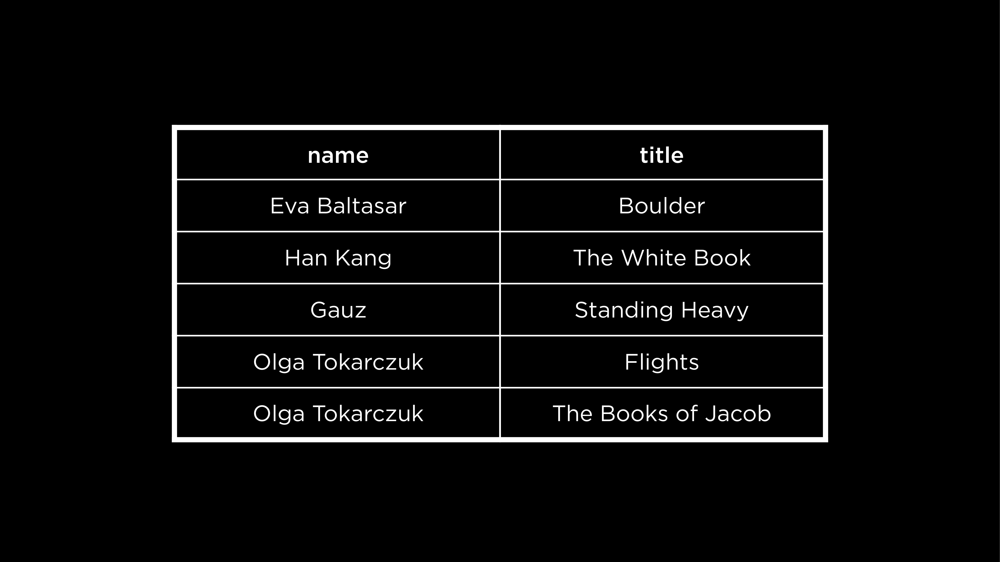

+   考虑了这些想法后，似乎有两个不同的表是最有效的方法。让我们看看关系数据库中表之间可以以哪些不同的方式相互关联。

+   考虑这种情况，每位作者只写一本书，每本书也只由一位作者撰写。这被称为一对一关系。

    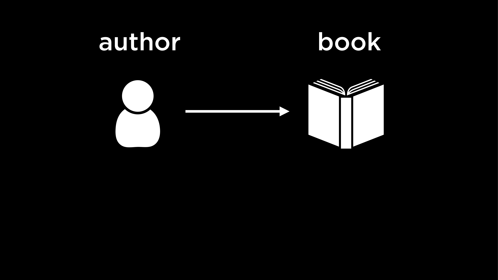

+   另一方面，如果一位作者可以写多本书，那么关系是一对多关系。

    

+   这里，我们看到另一种情况，不仅一位作者可以写多本书，而且多本书也可以由多位作者合著。这是一个多对多关系。

    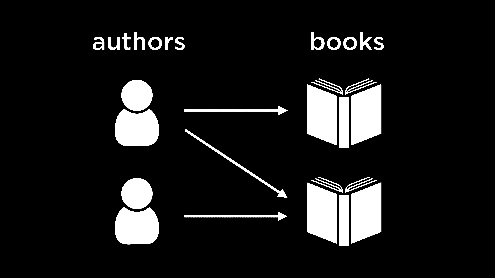

## 实体关系图

+   我们刚刚描述了数据库表中一对一、一对多和多对多关系。可以使用实体关系（ER）图来可视化这些关系。

+   这里是`longlist.db`中表的 ER 图。

    ```
    erDiagram
      "Author" }|--|{ "Book" : "wrote"
      "Publisher" ||--|{ "Book" : "published"
      "Translator" }o--|{ "Book" : "translated"
      "Book" ||--o{ "Rating" : "has" 
    ```

+   每个表都是我们数据库中的一个实体。表与表之间，或实体之间的关系，由标记实体之间线条的动词表示。

+   图中的每条线都使用鸟爪符号表示。

    +   第一行带有圆圈的线条看起来像线上标记的 0。这一行表示没有关系。

    +   第二行带有垂直线的线条看起来像线上标记的 1。具有此箭头的实体必须至少有一个与另一张表中的行相关联的行。

    +   第三行看起来像一只鸟爪，有很多分支。这一行表示该实体与另一张表中的多行相关。

        

+   例如：

    +   我们从左到右阅读这个符号。一位作者写一本书（或者，每位作者都可以有一本书与他们相关联）。

        

    +   现在，不仅一位作者可以写一本书，一本书也可以由一位作者编写。

        

    +   通过这个添加，一位作者至少写一本书，一本书至少由一位作者编写。换句话说，一位作者可以与一本或多本书相关联，一本书可以由一位或多位作者编写。

        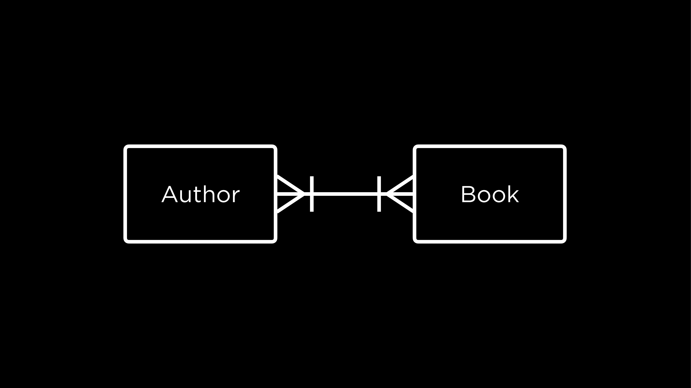

+   让我们重新审视我们数据库的 ER 图。

    ```
    erDiagram
      "Author" }|--|{ "Book" : "wrote"
      "Publisher" ||--|{ "Book" : "published"
      "Translator" }o--|{ "Book" : "translated"
      "Book" ||--o{ "Rating" : "has" 
    ```

+   观察连接书籍和翻译者实体的线条，我们可以说书籍不需要有翻译者。它们可以有零到多个翻译者。然而，数据库中的翻译者至少翻译一本书，可能还翻译多本书。

### 问题

> 如果我们有一个数据库，我们如何知道存储在其中的实体之间的关系？

+   实体之间的确切关系完全取决于数据库的设计者。例如，是否每位作者只能写一本书或多本书，这是在设计数据库时需要做出的决定。实体关系图（ER diagram）可以被视为一种工具，用于将这些决定传达给想要了解数据库及其实体之间关系的人。

> 一旦我们知道某些实体之间存在关系，我们如何在数据库中实现这种关系？

+   我们很快就会看到如何使用 SQL 中的**键**来关联表。

## 键

### 主键

+   在书籍的情况下，每本书都有一个唯一的标识符，称为 ISBN。换句话说，如果你通过 ISBN 搜索一本书，只会找到一本书。在数据库术语中，ISBN 是一个主键——它是表中每个项目的唯一标识符。

    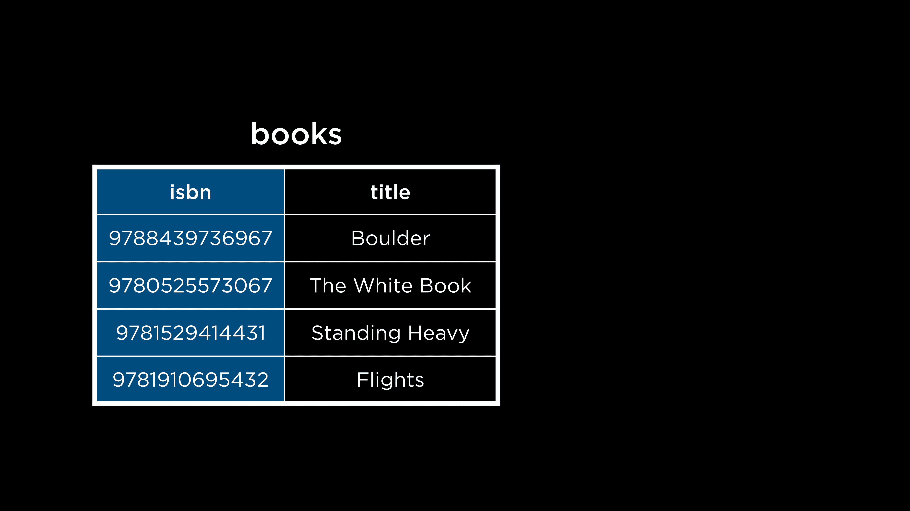

+   受到 ISBN 这一想法的启发，我们可以想象为我们的出版社、作者和翻译分配唯一的 ID！这些 ID 将是它们所属表的唯一主键。

### 外键

+   键也有助于在 SQL 中关联表。

+   外键是从另一个表中取出的主键。通过引用另一个表的主键，它通过在它们之间形成链接来帮助关联表。

    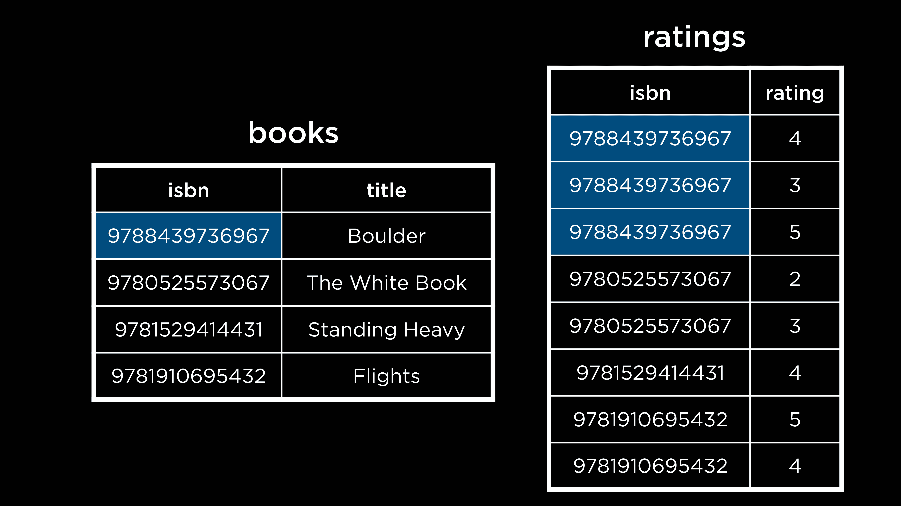

    注意到`books`表的主键现在成为了`ratings`表中的一列。这有助于形成两个表之间的一对多关系——一本书（在`books`表中找到）可以有多个评分（在`ratings`表中找到）。

+   如我们所见，ISBN 是一个长的标识符。如果每个字符占用一个字节的内存，存储一个单独的 ISBN（包括连字符）将需要 17 个字节的内存，这相当多！

+   幸运的是，我们不一定非得使用 ISBN 作为主键。我们可以简单地使用数字 1、2、3……等等来构建自己的主键，只要每本书都有一个唯一的数字来标识它。

+   之前，我们看到了如何实现`books`和`ratings`实体之间的一对多关系。这里有一个多对多关系的例子。

    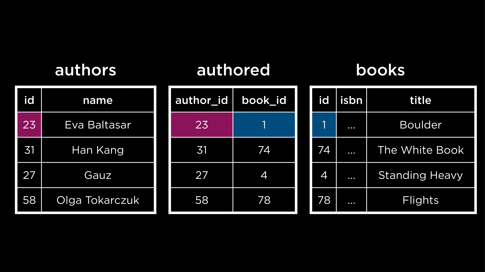

现在有一个名为`authored`的表，它将`books`表的主键（`book_id`）映射到`authors`表的主键（`author_id`）。

### 问题

> 作者和书的 ID 可以相同吗？例如，如果`author_id`是 1，而`authored`表中的`book_id`也是 1，会发生混淆吗？

+   像`authored`这样的表被称为“联合”或“连接”表。在这样的表中，我们通常知道哪个主键被哪个列引用。在这种情况下，由于我们知道第一列只包含`authors`的主键，第二列也只包含`books`的主键，所以即使值匹配也是可以的！

> 如果我们有很多这样的联合表，那不会占用太多空间吗？

+   是的，这里有一个权衡。像这样的表占用更多空间，但它们也使我们能够拥有许多多对多关系，没有冗余，就像我们之前看到的。

> 在更改书籍或作者的 ID 时，ID 是否也会在其他表中更新？

+   更新后的 ID 仍然需要是唯一的。鉴于这一点，ID 通常被抽象化，我们很少更改它们。

## 子查询

+   子查询是另一个查询中的查询。这些也被称为嵌套查询。

+   考虑这个用于一对多关系的示例。在`books`表中，我们有一个 ID 来表示出版社，这是从`publishers`表中取的外键。要找出 Fitzcarraldo Editions 出版的书籍，我们需要两个查询——一个是从`publishers`表中找出 Fitzcarraldo Editions 的`publisher_id`，第二个是使用这个`publisher_id`来找出 Fitzcarraldo Editions 出版的所有书籍。这两个查询可以通过子查询的概念合并成一个。

    ```
    SELECT "title"
    FROM "books"
    WHERE "publisher_id" = (
        SELECT "id"
        FROM "publishers"
        WHERE "publisher" = 'Fitzcarraldo Editions'
    ); 
    ```

    注意：

    +   子查询在括号中。括号中最里面的查询将首先运行，然后是外部查询。

    +   内部查询被缩进。这是按照子查询的风格约定进行的，以提高可读性。

+   要找出《记忆的纪念》的所有评分

    ```
    SELECT "rating"
    FROM "ratings"
    WHERE "book_id" = (
        SELECT "id"
        FROM "books"
        WHERE "title" = 'In Memory of Memory'
    ); 
    ```

+   要选择这本书的平均评分

    ```
    SELECT AVG("rating")
    FROM "ratings"
    WHERE "book_id" = (
        SELECT "id"
        FROM "books"
        WHERE "title" = 'In Memory of Memory'
    ); 
    ```

+   下一个示例是用于多对多关系。要找出写了《航班》的作者（们），需要查询三个表：`books`、`authors`和`authored`。

    ```
    SELECT "name"
    FROM "authors"
    WHERE "id" = (
        SELECT "author_id"
        FROM "authored"
        WHERE "book_id" = (
          SELECT "id"
          FROM "books"
          WHERE "title" = 'Flights'
        )
    ); 
    ```

    首先运行的查询是最深层的查询——找到《航班》的 ID。然后，找到写了《航班》的作者（们）的 ID。最后，使用这个 ID 检索作者名称。

## `IN`

+   这个关键字用于检查所需值是否在给定的列表或值集中。

+   作者和书籍之间的关系是多对多的。这意味着一个特定的作者可能写过多本书。要找出数据库中 Fernanda Melchor 所写的所有书籍的名称，我们可以使用以下`IN`关键字。

    ```
    SELECT "title"
    FROM "books"
    WHERE "id" IN (
        SELECT "book_id"
        FROM "authored"
        WHERE "author_id" = (
            SELECT "id"
            FROM "authors"
            WHERE "name" = 'Fernanda Melchor'
        )
    ); 
    ```

    注意，最内层的查询使用`=`而不是`IN`运算符。这是因为我们期望找到名为 Fernanda Melchor 的唯一作者。

### 问题

> 如果内部查询的值未找到怎么办？

+   在这种情况下，内部查询将返回空结果，这会促使外部查询也返回空结果。因此，外部查询依赖于内部查询的结果。

> 需要使用四个空格来缩进子查询吗？

+   不。用于缩进子查询的空格数量可以变化，查询中每行的长度也可以变化。但将查询拆分并缩进子查询的核心思想是使它们易于阅读。

> 我们如何实现表之间的多对一关系？

+   考虑这种情况，一本书由多个作者共同撰写。我们会有一个 `authored` 表，对于相同的书 ID 有多个条目。这些条目中的每一个都会有不同的作者 ID。值得注意的是，外键值可以在表中重复，但主键值总是唯一的。

## `JOIN`

+   此关键字允许我们将两个或多个表组合在一起。

+   要了解 `JOIN` 的工作原理，请考虑海狮及其迁徙模式的数据库。以下是数据库的快照。

    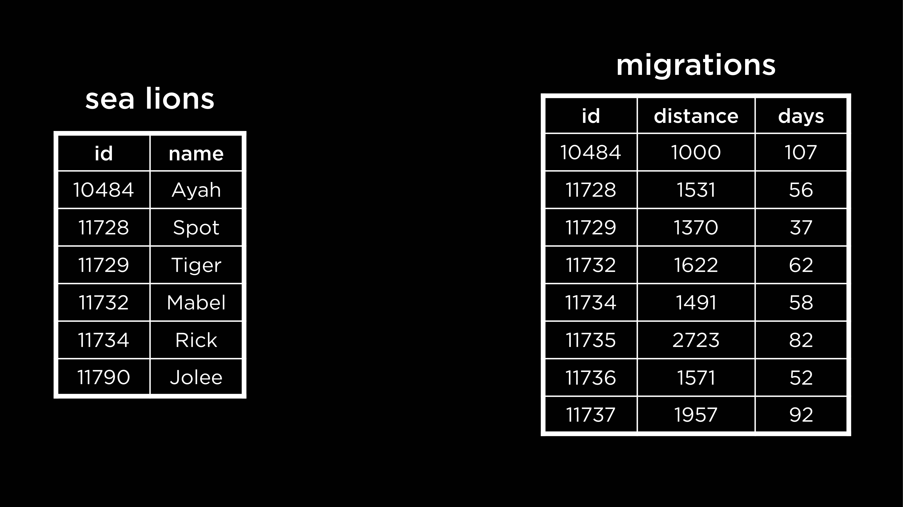

+   要找出海狮 Spot 走了多远，或者回答有关每只海狮的类似问题，我们可以使用嵌套查询。或者，我们可以将 `sea lions` 和 `migrations` 表连接起来，使得每只海狮也有其对应的信息，作为同一行的扩展。

+   我们可以在海狮 ID（两张表之间的共同因素）上连接表，以确保正确的行相互对齐。

+   在测试之前，请确保使用 `.quit` SQLite 命令退出 `longlist.db`。然后，打开 `sea_lions.db`。

+   要连接表

    ```
    SELECT *
    FROM "sea_lions"
    JOIN "migrations" ON "migrations"."id" = "sea_lions"."id"; 
    ```

    注意：

    +   `ON` 关键字用于指定在连接的表中哪些值匹配。如果没有匹配的值，则无法连接表。

    +   如果一个表中有任何 ID 在另一个表中不存在，则该行将不会出现在连接表中。这种连接称为 `INNER JOIN`。

+   其他允许我们保留某些不匹配 ID 的连接表的方法是 `LEFT JOIN`、`RIGHT JOIN` 和 `FULL JOIN`。这些都是 `OUTER JOIN` 的一种。

+   `LEFT JOIN` 优先考虑左表（或第一张表）中的数据。

    ```
    SELECT *
    FROM "sea_lions"
    LEFT JOIN "migrations" ON "migrations"."id" = "sea_lions"."id"; 
    ```

    此查询将保留 `sea_lions` 表中的所有海狮数据——左表。连接表中的某些行可能部分为空。如果右表没有特定 ID 的数据，就会发生这种情况。

+   类似地，`RIGHT JOIN` 保留右表（或第二张表）的所有行。`FULL JOIN` 允许我们看到所有表的全部内容。

+   如我们所见，`OUTER JOIN` 可能会导致连接表中出现空或 `NULL` 值。

+   海狮数据库中的两张表都有 `id` 列。由于我们连接表时使用的值在两张表中都有相同的列名，因此实际上在连接时我们可以省略查询的 `ON` 部分。

    ```
    SELECT *
    FROM "sea_lions"
    NATURAL JOIN "migrations"; 
    ```

    注意，在这种情况下结果中没有重复的 `id` 列。此外，这种连接与 `INNER JOIN` 的工作方式类似。

### 问题

> 在海狮数据库中，ID 是如何创建的？它们来自 `sea_lions` 表还是 `migrations` 表？

+   每只海狮的 ID 很可能是研究人员追踪这些海狮迁徙模式时分配的。也就是说，ID 不是在任一表中生成的，而是在数据本身的源头分配的。

> 如果我们试图连接三个表，我们如何知道哪一个是左表或右表？

+   对于每个`JOIN`语句，关键字之前的第一张表是左表。与`JOIN`关键字相关的是右表。

> 当我们连接表时，结果连接表会被保存吗？我们可以在不再次连接的情况下稍后引用它吗？

+   在我们使用`JOIN`的方式中，结果是临时表或结果集。它可以在查询期间使用。

> 有许多不同的`JOIN`类型。我们应该使用默认的哪一个？

+   最简单的一种——就是`JOIN`——实际上是一个`INNER JOIN`，这也是 SQL 的默认设置。

## 集合

+   在深入研究集合之前，我们需要退出海狮数据库，切换到`longlist.db`。

+   在执行查询时，我们看到的查询结果被称为结果集。这是一种 SQL 中的集合。

+   让我们再举一个例子。在我们的书籍数据库中，我们有作者和翻译者。一个人可以是作者或翻译者。如果这两个集合有交集，那么一个人也可能是书籍的作者和翻译者。我们可以使用`INTERSECT`运算符来找到这个集合。

    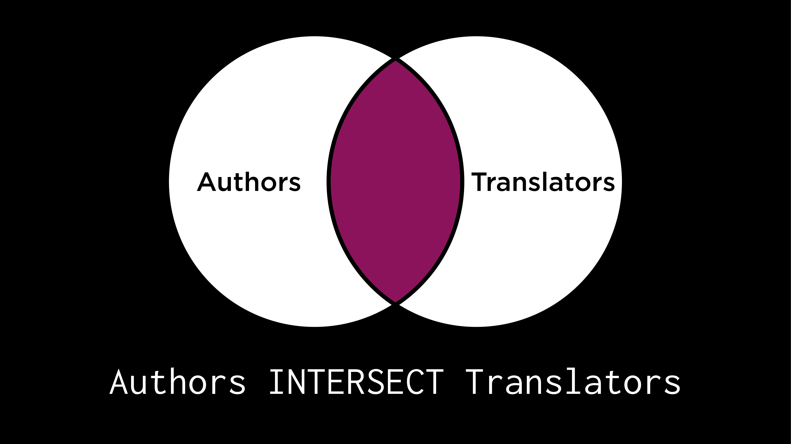

    ```
    SELECT "name" FROM "translators"
    INTERSECT
    SELECT "name" FROM "authors"; 
    ```

+   如果一个人是作者或翻译者，或者两者都是，那么他们属于两个集合的并集。换句话说，这个集合是通过合并作者和翻译者集合形成的。

    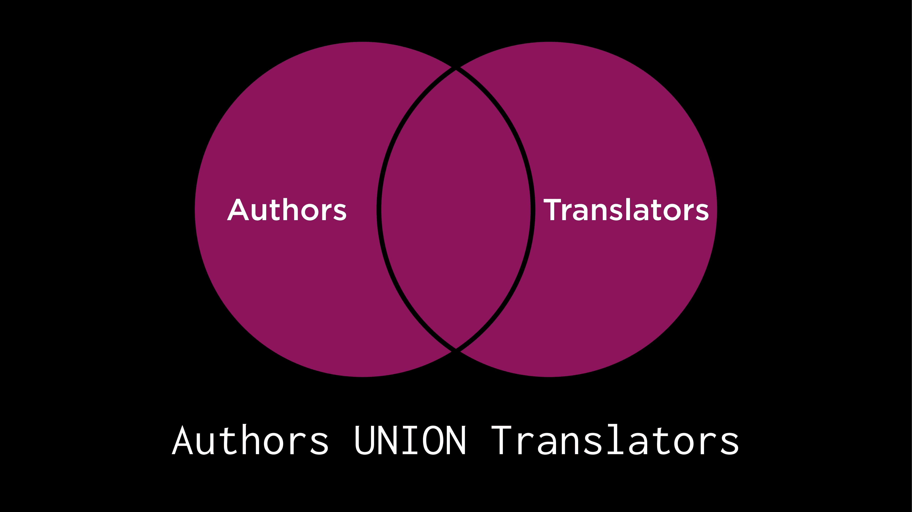

    ```
    SELECT "name" FROM "translators"
    UNION
    SELECT "name" FROM "authors"; 
    ```

    注意，每个作者和每个翻译者都包含在这个结果集中，但只出现一次！

+   对上一个查询进行轻微调整，我们可以根据一个人是作者还是翻译者，在结果集中得到他们的职业。

    ```
    SELECT 'author' AS "profession", "name" 
    FROM "authors"
    UNION
    SELECT 'translator' AS "profession", "name" 
    FROM "translators"; 
    ```

+   以下集合包括了所有既是作者又是**仅**是作者的人。`EXCEPT`关键字可以用来找到这样的集合。换句话说，从作者集合中减去翻译者集合，形成这个集合。

    

    ```
    SELECT "name" FROM "authors"
    EXCEPT
    SELECT "name" FROM "translators"; 
    ```

    我们可以验证，交集集中的任何作者-翻译者都没有出现在这个结果集中。

+   同样，我们可以使用`EXCEPT`来找到只做翻译者的集合。

+   我们如何找到这个集合，其中的人要么是作者或翻译者，但不能两者都是？

    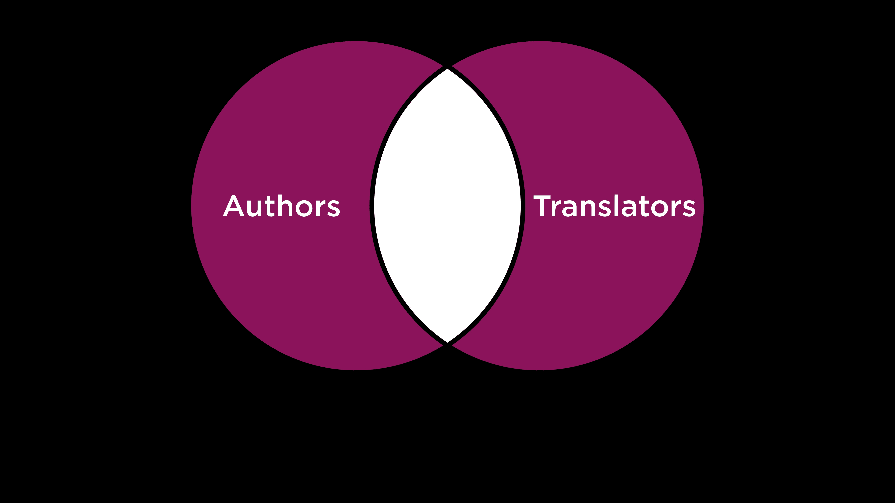

+   这些运算符可以用来回答许多不同的问题。例如，我们可以找到 Sophie Hughes 和 Margaret Jull Costa 共同翻译的书籍。

    ```
    SELECT "book_id" FROM "translated"
    WHERE "translator_id" = (
        SELECT "id" from "translators"
        WHERE "name" = 'Sophie Hughes'
    )
    INTERSECT
    SELECT "book_id" FROM "translated"
    WHERE "translator_id" = (
        SELECT "id" from "translators"
        WHERE "name" = 'Margaret Jull Costa'
    ); 
    ```

    这里嵌套的每个查询都找到了一个翻译者的书籍 ID。使用 `INTERSECT` 关键字来交集结果集，并给出他们合作过的书籍。

### 问题

> 我们可以使用 `INTERSECT`、`UNION` 等操作对 3-4 个集合进行操作吗？

+   是的，绝对可以。要交集 3 个集合，我们必须使用 `INTERSECT` 操作符两次。一个重要的注意事项——我们必须确保要组合的集合中有相同数量和类型的列。

## 组

+   考虑到 `ratings` 表。对于每本书，我们想要找到这本书的平均评分。为此，我们首先需要按书籍将评分分组，然后对每个书籍（每个组）的评分进行平均。

    ```
    SELECT "book_id", AVG("rating") AS "average rating"
    FROM "ratings"
    GROUP BY "book_id"; 
    ```

    在这个查询中，使用了 `GROUP BY` 关键字为每本书创建组，然后将组的评分合并成一个平均评分！

+   现在，我们只想看到那些评分很高的书籍，平均评分超过 4 分。

    ```
    SELECT "book_id", ROUND(AVG("rating"), 2) AS "average rating"
    FROM "ratings"
    GROUP BY "book_id"
    HAVING "average rating" > 4.0; 
    ```

    注意，这里使用 `HAVING` 关键字来指定组条件，而不是 `WHERE`（只能用于指定单个行的条件）。

### 问题

> 是否可以看到每本书的评分数量？

+   是的，这需要使用 `COUNT` 关键字进行轻微的修改。

    ```
    SELECT "book_id", COUNT("rating")
    FROM "ratings"
    GROUP BY "book_id"; 
    ```

> 是否也可以对这里获得的数据进行排序？

+   是的，可以。比如说，我们想要找到每个评分很高的书籍的平均评分，并按降序排列。

    ```
    SELECT "book_id", ROUND(AVG("rating"), 2) AS "average rating"
    FROM "ratings"
    GROUP BY "book_id"
    HAVING "average rating" > 4.0
    ORDER BY "average rating" DESC; 
    ```

## 结束

+   这把我们带到了关于关联的讲座 1 的结论。
