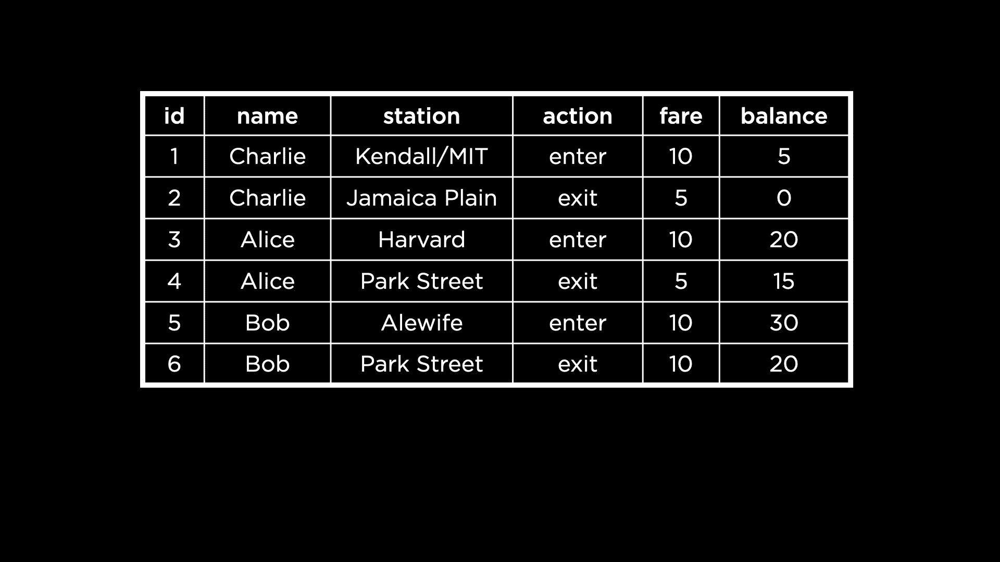
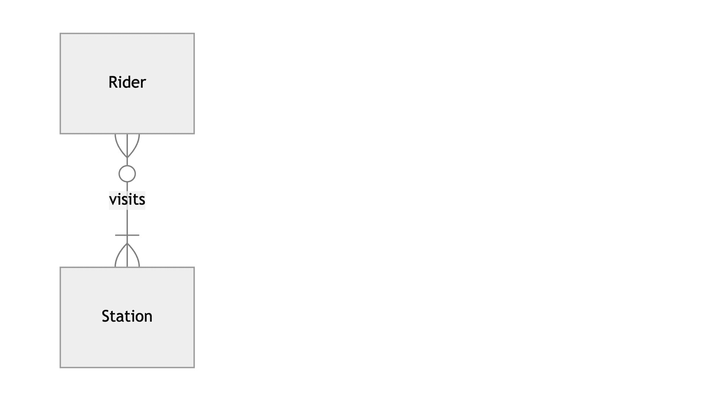
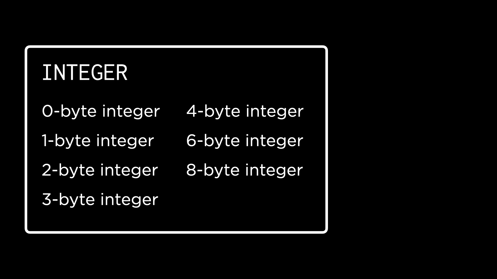

# 第二讲

> 原文：[`cs50.harvard.edu/sql/notes/2/`](https://cs50.harvard.edu/sql/notes/2/)

+   介绍

+   创建数据库模式

    +   规范化

    +   关联

    +   问题

+   创建表

    +   问题

+   数据类型和存储类

+   类型亲和力

+   向我们的表中添加类型

    +   问题

+   表约束

    +   问题

+   列约束

+   修改表

    +   问题

+   鳍

## 介绍

+   在这次讲座中，我们将学习如何设计我们自己的数据库模式。

+   到目前为止，我们主要使用的是国际布克奖长名单上的书籍数据库。现在，我们将深入内部，看看可以使用哪些命令来创建这样的数据库。

+   首先，让我们在我们的终端上打开第 0 周的数据库 `longlist.db`。作为提醒，这个数据库只包含一个名为 `longlist` 的表。要查看表的快照，我们可以运行

    ```
    SELECT "author", "title"
    FROM "longlist"
    LIMIT 5; 
    ```

    这为我们提供了来自表 `longlist` 的前 5 行的作者和标题。

+   这里是一个 SQLite 命令（不是一个 SQL 关键字），它可以进一步说明这个数据库是如何创建的。

    ```
    .schema 
    ```

    运行此命令后，我们看到用于创建表 `longlist` 的 SQL 语句。这显示了 `longlist` 内部的列以及每个列可以存储的数据类型。

+   接下来，让我们在我们的终端上打开第 1 周的相同数据库。这个版本的 `longlist.db` 包含了相互关联的不同表。

+   再次运行 `.schema` 后，我们看到许多命令——每个数据库中的表都有一个。有一种方法可以查看指定表的模式：

    ```
    .schema books 
    ```

    现在我们看到用于创建 `books` 表的语句。我们还能看到每个列的列名和数据类型。例如，`"title"` 列存储文本，而 `"publisher_id"` 列是整数。

## 创建数据库模式

+   现在我们已经看到了现有数据库的模式，让我们创建自己的！我们的任务是使用数据库模式来表示波士顿市的地铁系统。这包括地铁站点、不同的列车线路以及乘坐列车的人们。

    

+   为了进一步分解这个问题，我们需要决定……

    +   我们将在波士顿地铁数据库中有什么类型的表，

    +   每个表将有哪些列，以及

    +   我们应该在每一列中放入哪些类型的数据。

### 规范化

+   观察这个创建表示波士顿地铁数据的表的初步尝试。这个表包含地铁乘客姓名、乘客当前所在的车站以及在该车站执行的操作（如进入和离开）。它还记录了乘客在地铁卡上的付费金额和余额。这个表还包含每个乘客“交易”的 ID，作为主键。

    

+   这个表中存在哪些冗余？

    +   我们可以选择将乘客姓名分离到一个单独的表中，以避免多次重复名称。我们需要为每个乘客提供一个 ID，以便将新表与这个表关联起来。

    +   我们可以选择将地铁车站移动到不同的表，并为每个地铁车站分配一个 ID，用作这里的外键。

+   以这种方式分离我们的数据的过程称为**规范化**。在规范化过程中，我们将每个实体放入自己的表中——就像我们对乘客和地铁车站所做的那样。关于特定实体的任何信息，例如乘客的地址，都放入实体的表中。

### 关联

+   我们现在需要决定我们的实体（乘客和车站）之间的关系。一个乘客可能会访问多个车站，一个地铁站可能有多于一个乘客。鉴于这一点，这将是一个多对多关系。

+   我们也可以使用 ER 图来表示这种关系。

    

    在这里，我们看到每个乘客必须访问至少一个车站才能被认为是乘客。然而，一个车站可能没有乘客访问它，因为这可能是暂时出了故障。然而，一个车站可能有多个乘客访问它，这在 ER 图中用鸟脚符号表示。

### 问题

> 乘客和车站之间的关系必须像这里描述的那样精确吗？例如，为什么车站可以有 0 个乘客？

+   设计数据库的人需要决定实体之间的关系。可以添加一个约束，说明一个车站必须至少有一个乘客才能被认为是车站。

## `CREATE TABLE`

+   现在我们已经有了两张表的架构，让我们继续创建这些表。

+   让我们打开一个新的数据库，命名为 `mbta.db` —— MBTA 代表马萨诸塞湾交通管理局，它运营波士顿地铁。

+   如果我们运行 `.schema`，我们将看不到任何内容，因为在这个数据库中还没有创建任何表。

+   在这个数据库中，我们运行以下命令来创建第一个乘客表：

    ```
    CREATE TABLE riders (
        "id",
        "name"
    ); 
    ```

    运行此命令后，终端上不会显示任何结果。但如果我们再次运行 `.schema`，现在我们将看到我们定义的 `riders` 表的架构！

+   同样，让我们也创建一个车站的表。

    ```
    CREATE TABLE stations (
        "id",
        "name",
        "line"
    ); 
    ```

    在这里，我们添加了一个名为 `"line"` 的列来存储车站所属的列车线路。

+   `.schema` 现在显示了我们 `riders` 和 `stations` 的模式。

+   接下来，我们将创建一个表格来关联这两个实体。这些表格通常被称为连接表、关联实体或连接表！

    ```
    CREATE TABLE visits (
        "rider_id",
        "station_id"
    ); 
    ```

    表的每一行都告诉我们特定骑手访问过的站点。

### 问题

> 在 `CREATE TABLE` 括号内缩进行是必要的吗？
> 
> +   不，不是严格意义上的。然而，我们总是缩进列名以遵守样式约定！

## 数据类型和存储类

+   SQLite 有五种存储类：

    +   **空值（Null）**：无，或空值

    +   **整数**：没有小数点的数字

    +   **实数**：小数或浮点数

    +   **文本**：字符或字符串

    +   **二进制大对象（Blob）**：用于存储二进制对象（适用于图像、音频等）

+   存储类可以容纳多种数据类型。

+   例如，这些是隶属于整数存储类的数据类型。

    

    SQLite 负责将输入值存储在正确的数据类型下。换句话说，我们作为程序员只需要选择一个存储类，SQLite 就会完成剩下的工作！

+   考虑这个问题：我们会使用哪种存储类来存储票价？每个选择都有其优势和局限性。

    +   整数：我们可以将 10 美分的票价存储为数字 10，但这并不清楚地表明票价是 10 美分还是 10 美元。

    +   文本：我们可以将票价存储为文本，如“$0.10”。然而，现在将很难执行像加起来一个骑手的票价这样的数学运算。

    +   实数：我们可以使用浮点数存储票价，如 0.10，但无法精确地以二进制形式存储浮点数，并且——根据我们需要多精确——这样做可能会导致后续的计算错误。

## 类型亲和力

+   在创建表时可以指定列的数据类型。

+   然而，SQLite 中的列并不总是存储特定的一种数据类型。它们据说有**类型亲和力**，这意味着它们试图将输入值转换为它们具有亲和力的类型。

+   SQLite 中有五种类型亲和力：文本、数值（基于输入值最佳转换的整数或实数值）、整数、实数和二进制大对象。

+   考虑一个对整数有类型亲和力的列。如果我们尝试将“25”（数字 25 但以文本形式存储）插入到这个列中，它将被转换为整数数据类型。

+   类似地，将整数 25 插入到对文本有类型亲和力的列中，将数字转换为它的文本等价物，“25”。

## 将类型添加到我们的表中

+   要再次创建我们数据库中的表，我们首先需要删除（或删除）现有的表。

+   让我们尝试以下命令

    ```
    DROP TABLE "riders"; 
    ```

    ```
    DROP TABLE "stations"; 
    ```

    ```
    DROP TABLE "visits"; 
    ```

    运行这些语句没有输出，但 `.schema` 显示表已经被删除。

+   接下来，让我们创建一个可以运行以从头创建表的架构文件。这比我们之前所做的好，因为我们之前是逐个表地输入`CREATE TABLE`命令，因为这允许我们轻松地编辑和查看整个架构。

+   创建一个名为`schema.sql`的文件。注意，扩展名`.sql`使得我们的编辑器能够对 SQL 关键字进行语法高亮。

+   在文件中，让我们再次输入架构，但这次是带有亲和类型。

    ```
    CREATE TABLE riders (
        "id" INTEGER,
        "name" TEXT
    );

    CREATE TABLE stations (
        "id" INTEGER,
        "name" TEXT,
        "line" TEXT
    );

    CREATE TABLE visits (
        "rider_id" INTEGER,
        "station_id" INTEGER
    ); 
    ```

+   现在，我们在数据库中读取此文件以实际创建表。这是一个包含数据类型的更新后的 ER 图。

    

### 问题

> 之前，我们能够查询数据库中的表，并在类似表格的结构中看到结果。我们如何让相同类型的结果显示在这里？

+   我们还没有向表中添加任何数据。在第三讲中，我们将看到如何在我们创建的表中插入、更新和删除行！

> 我们对布尔类型有类型亲和力吗？

+   在 SQLite 中我们不做这样的事情，但其他数据库管理系统可能提供这个选项。一种解决方案是使用 0 或 1 的整数值来表示布尔值。

## 表约束

+   我们可以使用表约束来对表中某些值施加限制。

+   例如，主键列必须具有唯一值。我们用于此的表约束是`PRIMARY KEY`。

+   类似地，外键值的一个约束是它必须在相关表的**主键列**中找到！这种表约束，不出所料，被称为`FOREIGN KEY`。

+   让我们在`schema.sql`文件中添加主键和外键约束。

    ```
    CREATE TABLE riders (
        "id" INTEGER,
        "name" TEXT,
        PRIMARY KEY("id")
    );

    CREATE TABLE stations (
        "id" INTEGER,
        "name" TEXT,
        "line" TEXT,
        PRIMARY KEY("id")
    );

    CREATE TABLE visits (
        "rider_id" INTEGER,
        "station_id" INTEGER,
        FOREIGN KEY("rider_id") REFERENCES "riders"("id"),
        FOREIGN KEY("station_id") REFERENCES "stations"("id")
    ); 
    ```

    注意，我们创建了两个主键列，即`riders`和`stations`的 ID，然后在`visits`表中将这些主键作为外键引用。

+   在`visits`表中，没有主键。然而，SQLite 默认为每个表提供一个主键，称为行 ID。尽管行 ID 是隐式的，但它可以被查询！

+   也可以创建由两列组成的复合主键。例如，如果我们想给`visits`表创建一个由骑手和站点 ID 组成的复合主键，我们可以使用这种语法。

    ```
    CREATE TABLE visits (
        "rider_id" INTEGER,
        "station_id" INTEGER,
        PRIMARY KEY("rider_id", "station_id")
    ); 
    ```

    在这种情况下，我们可能希望允许骑手访问站点多次，所以我们不会采用这种方法。

### 问题

> 我们能否为`visits`表包含自己的主键？

+   是的！如果出于某种原因，`visits`表需要显式的主键，我们可以创建一个 ID 列并将其设为主键。

## 列约束

+   列约束是一种应用于表中指定列的约束类型。

+   SQLite 有四种列约束：

    +   `CHECK`：允许检查条件，例如列中的所有值都必须大于 0。

    +   `DEFAULT`：如果为行未提供值，则使用默认值。

    +   `NOT NULL`：规定列中不能插入空或空值。

    +   `UNIQUE`：规定该列中的每个值都必须是唯一的。

+   包含这些约束的更新模式如下所示：

    ```
    CREATE TABLE riders (
        "id" INTEGER,
        "name" TEXT,
        PRIMARY KEY("id")
    );

    CREATE TABLE stations (
        "id" INTEGER,
        "name" TEXT NOT NULL UNIQUE,
        "line" TEXT NOT NULL,
        PRIMARY KEY("id")
    );

    CREATE TABLE visits (
        "rider_id" INTEGER,
        "station_id" INTEGER,
        FOREIGN KEY("rider_id") REFERENCES "riders"("id"),
        FOREIGN KEY("station_id") REFERENCES "stations"("id")
    ); 
    ```

    `NOT NULL` 约束确保指定了车站名称和线路。另一方面，乘客不需要共享他们的名字，因为没有对乘客名字应用约束。同样，每个车站必须有一个唯一的名称，这是由 `UNIQUE` 约束规定的。

+   主键列以及由此派生的外键列必须始终具有唯一值，因此没有必要显式指定 `NOT NULL` 或 `UNIQUE` 列约束。表约束 `PRIMARY KEY` 包含这些列约束。

## 修改表

+   考虑以下更新的 ER 图，其中实体“Rider”已被新的实体“Card”所取代，用于表示 CharlieCards。在波士顿地铁中，CharlieCards 可以充值并用于进出车站。

    

+   注意，一张卡片可以被滑动多次，但每次只能在一个车站进行。

+   “Card” 实体有一个 ID，它也是其主键。

+   现在还有一个名为“Swipe”的实体，它有自己的 ID 和类型。“Swipe”还记录了卡片被滑动的时间和扣除的金额（相当于乘坐地铁所需的金额）！

+   现在，为了在我们的数据库中实施这些更改，我们首先需要删除 `riders` 表。

    ```
    DROP TABLE "riders"; 
    ```

+   运行 `.schema` 命令会显示更新后的模式，其中不包括 `riders` 表。

+   接下来，我们需要一个 `swipes` 表来表示更新后的 ER 图中的“Swipe”实体。我们可以按以下方式修改 `visits` 表。

    ```
    ALTER TABLE "visits"
    RENAME TO "swipes"; 
    ```

+   再次运行 `.schema` 命令，我们可以看到表 `visits` 已被重命名为 `swipes`。然而，这并不是唯一需要的更改。我们还需要添加一些列，例如滑动类型。

    ```
    ALTER TABLE "swipes"
    ADD COLUMN "swipetype" TEXT; 
    ```

    注意，在添加此列时也提到了类型亲和力 `TEXT`。

+   我们还可以在 `ALTER TABLE` 命令中重命名一个列。如果我们想将列 `"swipetype"` 重命名为更简洁的名称，可以尝试以下操作。

    ```
    ALTER TABLE "swipes"
    RENAME COLUMN "swipetype" TO "type"; 
    ```

+   最后，我们有能力删除（或移除）一个列。

    ```
    ALTER TABLE "swipes"
    DROP COLUMN "type"; 
    ```

    再次运行 `.schema` 命令，我们可以确认表中的列 `"type"` 已被删除。

+   也可以回到最初我们拥有的模式文件 `schema.sql`，并在那里直接进行这些更改，而不是修改表。以下是一个更新的 `schema.sql`。

    ```
    CREATE TABLE "cards" (
        "id" INTEGER,
        PRIMARY KEY("id")
    );

    CREATE TABLE "stations" (
        "id" INTEGER,
        "name" TEXT NOT NULL UNIQUE,
        "line" TEXT NOT NULL,
        PRIMARY KEY("id")
    );

    CREATE TABLE "swipes" (
        "id" INTEGER,
        "card_id" INTEGER,
        "station_id" INTEGER,
        "type" TEXT NOT NULL CHECK("type" IN ('enter', 'exit', 'deposit')),
        "datetime" NUMERIC NOT NULL DEFAULT CURRENT_TIMESTAMP,
        "amount" NUMERIC NOT NULL CHECK("amount" != 0),
        PRIMARY KEY("id"),
        FOREIGN KEY("station_id") REFERENCES "stations"("id"),
        FOREIGN KEY("card_id") REFERENCES "cards"("id")
    ); 
    ```

+   让我们花几分钟时间阅读更新后的模式，并记录下看起来有所变化的地方！

    +   `cards` 和 `swipes` 表被添加，并使用 `NOT NULL` 列约束来要求 `swipes` 中的某些值。

    +   `"datetime"`列被赋予类型亲和力数值型——这是因为数值类型可以存储和显示日期值。

    +   根据需要调整外键映射，使得 `"card_id"` 是一个外键，引用 `cards` 表的 ID。

    +   `"datetime"`列被分配了一个默认值，以便在没有提供的情况下自动获取当前的时间戳。注意使用了`CURRENT_TIMESTAMP`——它返回年、月、日、小时、分钟和秒合并成一个值。

    +   有一个检查确保滑动支付金额不是 0。这是通过列约束`CHECK`实现的，它与表达式`"amount" != 0`一起使用，以确保值不是 0。

    +   同样，对`"type"`也有一个检查，以确保其值是‘enter’、‘exit’和‘deposit’之一。这样做是因为当 CharlieCard 被滑动时，通常是为了这三个目的之一，所以让`"type"`只假设这些值是有意义的。注意使用了`IN`关键字来执行这个检查！有没有办法使用`OR`运算符来实现这个检查？

### 问题

> 在尝试删除`riders`表时，出现了一个错误，因为我们正在使用`riders`的 ID 作为外键。在这种情况下，如何删除该表呢？

+   在数据库中删除表时，会检查外键约束。在删除`riders`表之前，我们首先需要删除外键列`"rider_id"`。

> 不同数据库管理系统（如 MySQL 或 PostgreSQL）的语法有何不同？

+   大多数 SQLite 语法肯定也适用于其他数据库管理系统。然而，如果我们尝试移植我们的 SQLite 代码，可能需要进行一些最小限度的修改。

> 如果在 SQLite 中未指定列的类型亲和力，会发生什么？

+   默认的类型亲和力是数值型，因此该列将被分配数值型亲和力。

## Fin

+   这就带我们来到了关于 SQL 设计的第二讲的内容总结！关于 CharlieCard 名称起源的一个有趣故事，请阅读来自 Celebrate Boston 的[这篇文章](http://www.celebrateboston.com/mbta/charlie-card-origin.htm)。
