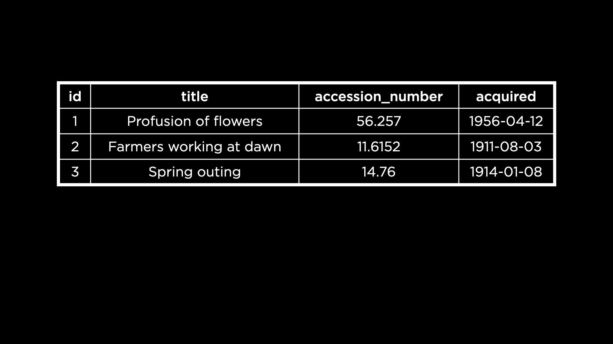
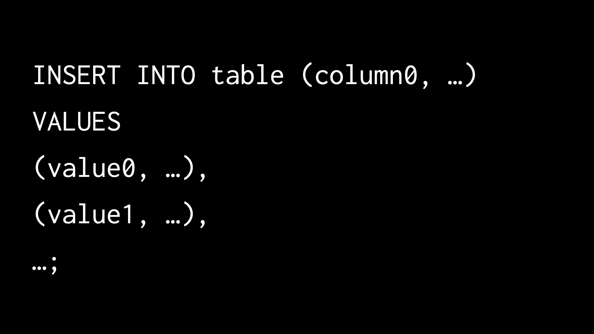
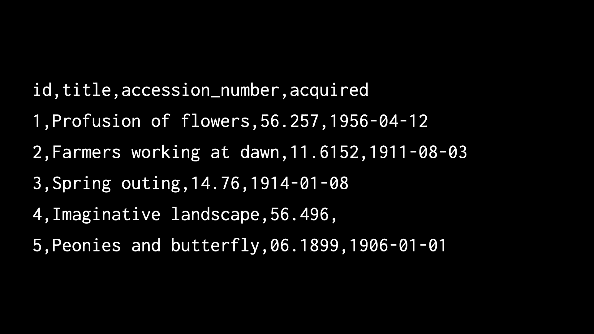
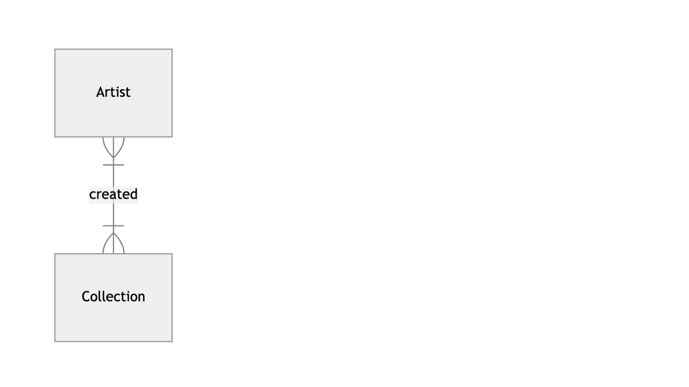
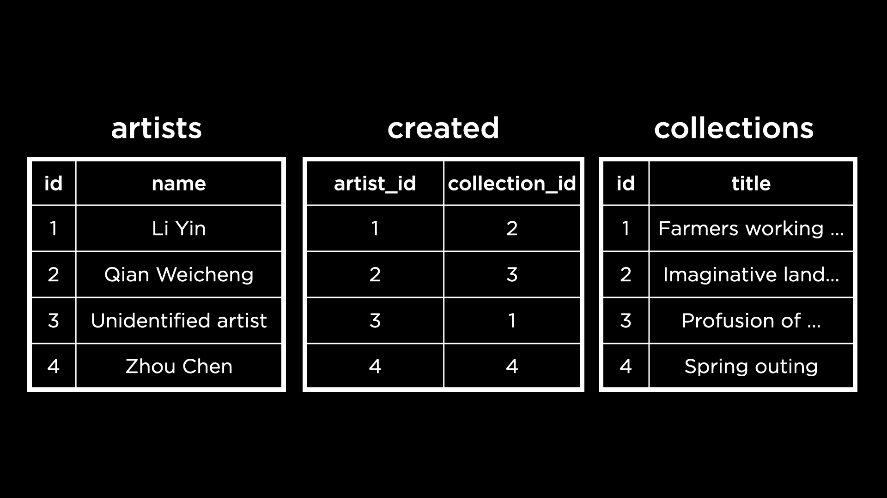
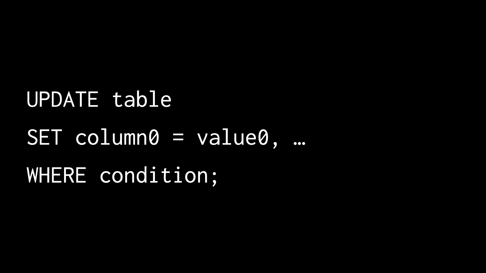

# 第三讲

> 原文：[`cs50.harvard.edu/sql/notes/3/`](https://cs50.harvard.edu/sql/notes/3/)

+   简介

+   数据库模式

+   插入数据

    +   问题

+   其他约束

+   插入多行

    +   问题

+   删除数据

    +   问题

+   更新数据

+   触发器

    +   创建“卖出”触发器

    +   创建“购买”触发器

    +   问题

+   软删除

+   结束

## 简介

+   上周，我们学习了如何创建自己的数据库模式。在本讲中，我们将探讨如何在数据库中添加、更新和删除数据。

+   波士顿 MFA（美术博物馆）是波士顿一个拥有一个世纪历史的博物馆。MFA 管理着大量历史和当代艺术品和文物的收藏。他们可能使用某种类型的数据库来存储有关他们的艺术和文物的数据。

+   当一个新的艺术品被添加到他们的收藏中时，我们可以想象他们会将相应的数据插入到他们的数据库中。同样，也存在一些用例，其中可能需要读取、更新或删除数据。

+   现在，我们将专注于在波士顿 MFA 数据库中创建（或插入）数据。

## 数据库模式

+   考虑到 MFA 可能用于其收藏的此架构。

    

+   每行数据包含一件艺术品的标题以及`accession_number`，这是博物馆内部使用的唯一 ID。还有一个表示艺术品获取日期的日期。

+   表中包含一个 ID，用作主键。

+   我们可以想象，MFA 的数据库管理员运行一个 SQL 查询，将每一件艺术品插入到表中。

+   为了理解这是如何工作的，让我们首先创建一个名为`mfa.db`的数据库。接下来，我们将模式文件`schema.sql`读入数据库。此模式文件已经提供给我们，帮助我们创建`collections`表。

+   为了确认表已创建，我们可以从表中选择。

    ```
    SELECT * FROM "collections"; 
    ```

    这应该会得到一个空的结果，因为表还没有任何数据。

## 插入数据

+   `INSERT INTO` SQL 语句用于将一行数据插入到指定的表中。

    ```
    INSERT INTO "collections" ("id", "title", "accession_number", "acquired")
    VALUES (1, 'Profusion of flowers', '56.257', '1956-04-12'); 
    ```

    我们可以看到，这个命令需要指定将接收新数据的表中的列列表以及要添加到每个列中的值，顺序相同。

+   运行`INSERT INTO`命令不会返回任何内容，但我们可以运行一个查询来确认该行现在已存在于`collections`表中。

    ```
    SELECT * FROM "collections"; 
    ```

+   我们可以通过多次插入来向数据库添加更多行。然而，手动输入主键值（如 1、2、3 等）可能会导致错误。幸运的是，SQLite 可以自动填充主键值。为了使用此功能，在插入行时我们可以完全省略 ID 列。

    ```
    INSERT INTO "collections" ("title", "accession_number", "acquired")
    VALUES ('Farmers working at dawn', '11.6152', '1911-08-03'); 
    ```

    我们可以通过运行以下命令来检查这一行是否已插入，其`id`为 2：

    ```
    SELECT * FROM "collections"; 
    ```

    注意 SQLite 填充主键值的方式是通过递增前一个主键值——在这种情况下，是 1。

### 问题

> 如果我们删除具有主键 1 的行，SQLite 是否会自动将主键 1 分配给下一个插入的行？

+   不，SQLite 实际上会选择表中最高的主键值并将其递增以生成下一个主键值。

## 其他约束

+   打开文件`schema.sql`将显示数据库的模式。

    ```
    CREATE TABLE "collections" (
        "id" INTEGER,
        "title" TEXT NOT NULL,
        "accession_number" TEXT NOT NULL UNIQUE,
        "acquired" NUMERIC,
        PRIMARY KEY("id")
    ); 
    ```

+   规定访问编号必须是唯一的。如果我们尝试插入一个具有重复访问编号的行，将会触发一个看起来像`Runtime error: UNIQUE constraint failed: collections.accession_number (19)`的错误。

+   这个错误告诉我们，我们正在尝试插入的行违反了模式中的约束——具体来说，在这个场景中是`UNIQUE`约束。

+   同样，我们可以尝试添加一个具有`NULL`标题的行，违反了`NOT NULL`约束。

    ```
    INSERT INTO "collections" ("title", "accession_number", "acquired")
    VALUES(NULL, NULL, '1900-01-10'); 
    ```

    运行此命令后，我们又将看到类似`Runtime error: NOT NULL constraint failed: collections.title (19)`的错误。

+   以这种方式，模式约束是保护我们免于添加不符合我们数据库模式的行的护栏。

## 插入多行

+   在向数据库写入时，我们可能需要一次插入多行。一种方法是在`INSERT INTO`命令中使用逗号分隔行。

    

    以这种方式一次插入多行允许程序员获得一些便利。这同样是一种更快、更高效地将行插入数据库的方法。

+   现在我们将两幅新的画作插入到`collections`表中。

    ```
    INSERT INTO "collections" ("title", "accession_number", "acquired") 
    VALUES 
    ('Imaginative landscape', '56.496', NULL),
    ('Peonies and butterfly', '06.1899', '1906-01-01'); 
    ```

    博物馆可能并不总是确切知道一幅画是在何时获得的，因此`acquired`值可能是`NULL`，正如我们刚刚插入的第一幅画的情况。

+   要查看更新的表，我们可以像往常一样选择表中的所有行。

    ```
    SELECT * FROM "collections"; 
    ```

+   我们的数据也可以以[逗号分隔值](https://en.wikipedia.org/wiki/Comma-separated_values)格式或 CSV 存储。观察以下示例，可以看到每行的值是通过逗号分隔的。

    

+   SQLite 使得直接将 CSV 文件导入我们的数据库成为可能。为此，我们需要从头开始。让我们离开这个数据库`mfa.db`然后将其删除。

+   我们已经有一个名为 `mfa.csv` 的 CSV 文件，其中包含我们需要的数据。打开这个文件后，我们可以注意到第一行包含列名，这些列名与我们的表 `collections` 的模式中的列名完全匹配。

+   首先，让我们再次创建数据库 `mfa.db` 并像之前一样读取模式文件。

+   接下来，我们可以通过运行 SQLite 命令来导入 CSV 文件。

    ```
    .import --csv --skip 1 mfa.csv collections 
    ```

    第一个参数 `--csv` 告诉 SQLite 我们正在导入一个 CSV 文件。这将帮助 SQLite 正确解析文件。第二个参数表示 CSV 文件的第一个行（标题行）需要被跳过，或者不插入到表中。

+   我们可以通过查询 `collections` 表来查看所有数据，以确认 `mfa.csv` 中的每一幅画都已成功导入到表中。

+   我们刚刚插入的 CSV 文件包含了每行数据的唯一键值（1, 2, 3 等）。然而，我们处理的大多数 CSV 文件可能不会包含 ID 或主键值。我们如何让 SQLite 自动插入它们？

+   为了尝试这个方法，让我们在我们的代码空间中打开 `mfa.csv` 并删除标题行中的 `id` 列，以及每个列中的值。编辑完成后，`mfa.csv` 应该看起来像这样：

    ```
    title,accession_number,acquired
    Profusion of flowers,56.257,1956-04-12
    Farmers working at dawn,11.6152,1911-08-03
    Spring outing,14.76,1914-01-08
    Imaginative landscape,56.496,
    Peonies and butterfly,06.1899,1906-01-01 
    ```

+   我们还将删除 `collections` 表中已经存在的所有行。

    ```
    DELETE FROM "collections"; 
    ```

+   现在，我们想要将这个 CSV 文件导入到一个表中。然而，根据我们的模式，`collections` 表的每一行都必须有四个列。这个新的 CSV 文件中的每一行只有三个列。因此，我们无法像以前那样继续导入。

+   要成功导入没有 ID 值的 CSV 文件，我们将需要使用一个临时表：

    ```
    .import --csv mfa.csv temp 
    ```

    注意我们在这个命令中没有使用 `--skip 1` 参数。这是因为 SQLite 能够识别 CSV 数据的第一行作为标题行，并将其转换为新 `temp` 表的列名。

+   我们可以通过查询 `temp` 表来查看其中的数据。

    ```
    SELECT * FROM "temp"; 
    ```

+   接下来，我们将从 `temp` 表中选择数据（不包含主键）并将其移动到 `collections` 表中，这正是我们的目标！我们可以使用以下命令来实现这一点。

    ```
    INSERT INTO "collections" ("title", "accession_number", "acquired") 
    SELECT "title", "accession_number", "acquired" FROM "temp"; 
    ```

    在此过程中，SQLite 将自动在 `id` 列中添加主键值。

+   为了清理我们的数据库，我们也可以在移动数据后删除 `temp` 表。

    ```
    DROP TABLE "temp"; 
    ```

### 问题

> 我们能否在插入表时将列放置在特定的位置？

+   虽然我们可以更改 `INSERT INTO` 命令中值的顺序，但我们通常不能更改列名的顺序。列名的顺序遵循创建表时使用的相同顺序。

> 如果我们尝试插入的多行中的任意一行违反了表约束，会发生什么？

+   当尝试将多行插入到表中时，如果其中任意一行违反了约束，插入命令将导致错误，并且不会插入任何行！

> 在从 CSV 文件插入数据后，其中一个单元格为空且不是`NULL`。为什么会发生这种情况？

+   当我们从 CSV 文件导入数据时，`acquired`值中的一个缺失了！这被解释为文本，因此被读取到表中作为空文本值。我们可以在导入后运行查询，将这些空值转换为`NULL`，如果需要的话。

## 删除数据

+   我们之前看到运行以下命令从`collections`表中删除了所有行。（我们现在实际上不想运行这个命令，否则我们会丢失表中的所有数据！）

    ```
    DELETE FROM "collections"; 
    ```

+   我们也可以删除符合特定条件的行。例如，要从我们的`collections`表中删除“春游”画作，我们可以执行以下命令：

    ```
    DELETE FROM "collections"
    WHERE "title" = 'Spring outing'; 
    ```

+   要删除任何获得日期为`NULL`的画作，我们可以执行以下命令：

    ```
    DELETE FROM "collections"
    WHERE "acquired" IS NULL; 
    ```

+   和我们通常做的那样，我们将通过从表中选择所有数据来确保删除操作按预期工作。

    ```
    SELECT * FROM "collections"; 
    ```

    我们看到“春游”和“想象风景”画作不再在表中。

+   要删除 1909 年之前的画作相关行，我们可以执行以下命令：

    ```
    DELETE FROM "collections"
    WHERE "acquired" < '1909-01-01'; 
    ```

    使用`<`运算符，我们正在查找 1909 年 1 月 1 日之前获得的画作。这些是在运行查询时将被删除的画作。

+   可能存在删除某些数据会影响数据库完整性的情况。外键约束是一个很好的例子。外键列引用不同表的主键。如果我们删除主键，外键列将没有任何可引用的内容！

+   现在考虑 MFA 数据库的更新模式，它不仅包含关于艺术品的信息，还包含艺术家信息。艺术家和收藏两个实体之间存在多对多关系——一幅画可以由许多艺术家创作，而单个艺术家也可以创作许多艺术品。

    

+   这里是一个实现上述 ER 图的数据库。

    

    `artists` 和 `collections` 表具有主键——ID 列。`created` 表通过其两个外键列引用这些 ID。

+   给定这个数据库，如果我们选择删除未知的艺术家（ID 为 3），那么`created`表中具有`artist_id`为 3 的行会发生什么？让我们试一试。

+   在打开`mfa.db`后，现在我们可以通过运行`.schema`命令来查看更新的模式。`created`表确实有两个外键约束，一个针对艺术家 ID，一个针对收藏 ID。

+   现在，我们可以尝试从`artists`表中删除数据。

    ```
    DELETE FROM "artists"
    WHERE "name" = 'Unidentified artist'; 
    ```

    在运行此命令时，我们得到一个与我们在本课程中之前看到的非常相似的错误：`运行时错误：外键约束失败（19）`。这个错误通知我们，删除这些数据将违反在`created`表中设置的外键约束。

+   我们如何确保约束不被违反？一种可能性是在从`artists`表删除之前，先从`created`表中删除相应的行。

    ```
    DELETE FROM "created"
    WHERE "artist_id" = (
        SELECT "id"
        FROM "artists"
        WHERE "name" = 'Unidentified artist'
    ); 
    ```

    这个查询有效地删除了艺术家与其作品之间的*关联*。一旦关联不再存在，我们就可以在不违反外键约束的情况下删除艺术家的数据。为此，我们可以运行

    ```
    DELETE FROM "artists"
    WHERE "name" = 'Unidentified artist'; 
    ```

+   在另一种可能性中，我们可以指定当通过外键引用的 ID 被删除时采取的操作。为此，我们使用关键字`ON DELETE`后跟要执行的操作。

    +   `ON DELETE RESTRICT`：这限制我们在外键约束违反时删除 ID。

    +   `ON DELETE NO ACTION`：这允许删除由外键引用的 ID，但不会发生任何操作。

    +   `ON DELETE SET NULL`：这允许删除由外键引用的 ID，并将外键引用设置为`NULL`。

    +   `ON DELETE SET DEFAULT`：这与之前的行为相同，但允许我们设置默认值而不是`NULL`。

    +   `ON DELETE CASCADE`：这允许删除由外键引用的 ID，并继续级联删除引用的外键行。例如，如果我们使用此方法删除艺术家 ID，所有艺术家与艺术品的关联也会从`created`表中删除。

+   最新版本的架构文件实现了上述方法。外键约束现在看起来像

    ```
    FOREIGN KEY("artist_id") REFERENCES "artists"("id") ON DELETE CASCADE
    FOREIGN KEY("collection_id") REFERENCES "collections"("id") ON DELETE CASCADE 
    ```

    现在运行以下`DELETE`语句不会导致错误，并将级联删除从`artists`表传播到`created`表：

    ```
    DELETE FROM "artists"
    WHERE "name" = 'Unidentified artist'; 
    ```

    要检查级联删除是否工作，我们可以查询`created`表：

    ```
    SELECT * FROM "created"; 
    ```

    我们观察到没有行具有 ID 3（从`artists`表中删除的艺术家 ID）。

### 问题

> 我们刚刚删除了 ID 为 3 的艺术家。有没有办法让下一个插入的行具有 ID 3？

+   默认情况下，正如我们之前讨论的，SQLite 将选择表中存在的最大 ID 并递增以获得下一个 ID。但我们在创建列时可以使用`AUTOINCREMENT`关键字来指示任何被删除的 ID 应重新用于表中插入的新行。

## 更新数据

+   我们可以轻松想象出数据库中的数据需要更新的场景。也许，在 MFA 数据库的案例中，我们发现原本映射到“未知的艺术家”的画作“黎明时分劳作的农民”实际上是由艺术家李银创作的。

+   我们可以使用更新命令来更改，比如说，一幅画的关系。以下是更新命令的语法。

    

+   让我们使用上述语法在`created`表中更改“黎明时分劳作的农民”的关联。

    ```
    UPDATE "created"
    SET "artist_id" = (
        SELECT "id"
        FROM "artists"
        WHERE "name" = 'Li Yin'
    )
    WHERE "collection_id" = (
        SELECT "id"
        FROM "collections"
        WHERE "title" = 'Farmers working at dawn'
    ); 
    ```

    查询的第一部分指定了要更新的表。下一部分检索李因的 ID 以设置为新的 ID。最后一部分选择 `created` 中的行（多行），这些行将更新为李因的 ID，即画作“黎明时分劳作的农民”！

## 触发器

+   **触发器**是一个 SQL 语句，在响应另一个 SQL 语句（如 `INSERT`、`UPDATE` 或 `DELETE`）时自动运行。

+   触发器对于维护数据一致性和在相关表之间自动化任务非常有用。

### 创建“销售”触发器

+   考虑包含一个 `collections` 表和一个新的 `transactions` 表的 MFA 数据库。

    ```
    CREATE TABLE "transactions" (
        "id" INTEGER,
        "title" TEXT,
        "action" TEXT,
        PRIMARY KEY("id")
    ); 
    ```

+   当艺术品被出售（从 `collections` 中删除）时，我们希望它自动在 `transactions` 中记录为“销售”动作。

    ```
    CREATE TRIGGER "sell" 
    BEFORE DELETE ON "collections"
    BEGIN
        INSERT INTO "transactions" ("title", "action")
        VALUES (OLD."title", 'sold');
    END; 
    ```

+   这个触发器在从 `collections` 中删除行之前运行。

+   **OLD** 是一个特殊的关键字，它指的是即将被删除的行。

+   `OLD."title"` 访问即将被删除的行的标题列。

+   触发器自动在 `transactions` 中插入一条记录，动作标记为“销售”。

### 创建“购买”触发器

+   当艺术品被购买（插入到 `collections`）时，我们希望它在 `transactions` 中记录为“购买”动作。

    ```
    CREATE TRIGGER "buy" 
    AFTER INSERT ON "collections"
    BEGIN
        INSERT INTO "transactions" ("title", "action")
        VALUES (NEW."title", 'bought');
    END; 
    ```

+   这个触发器在 `collections` 中插入新行之后运行。

+   **NEW** 是一个特殊的关键字，它指的是正在插入的行。

+   `NEW."title"` 访问新插入行的标题列。

### 问题

> 触发器内可以包含多个 SQL 语句吗？

+   是的，你可以在 `BEGIN` 和 `END` 块内包含多个语句，用分号分隔。

## 软删除

+   **软删除**（或**软删除**）意味着将数据标记为已删除，而不是真正从数据库中移除它。

+   例如，我们可以在 `collections` 表中添加一个 `deleted` 列，默认值为 0：

    ```
    ALTER TABLE "collections"
    ADD COLUMN "deleted" INTEGER DEFAULT 0; 
    ```

+   要“删除”一行，我们会更新 `deleted` 列为 1：

    ```
    UPDATE "collections"
    SET "deleted" = 1
    WHERE "title" = 'Farmers working at dawn'; 
    ```

+   然后，为了查询仅非删除行：

    ```
    SELECT * FROM "collections"
    WHERE "deleted" != 1; 
    ```

+   这样，如果需要的话，数据可以被恢复，并且保持完整的历史记录。

+   然而，遵守要求数据真正被删除的数据隐私法规仍然很重要。

## 结束

+   这就带我们来到了关于 SQL 写作的第三讲结束！
