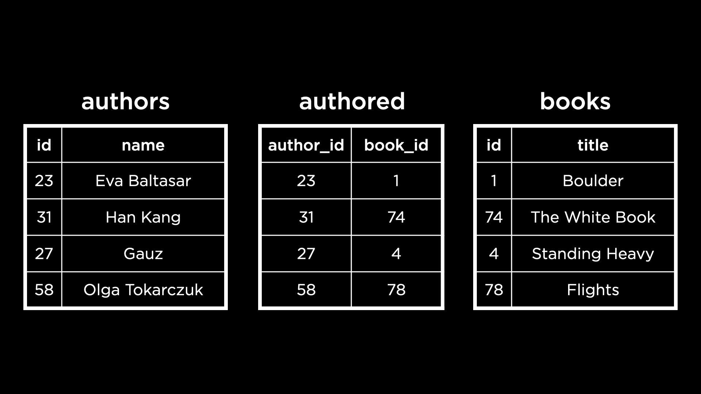
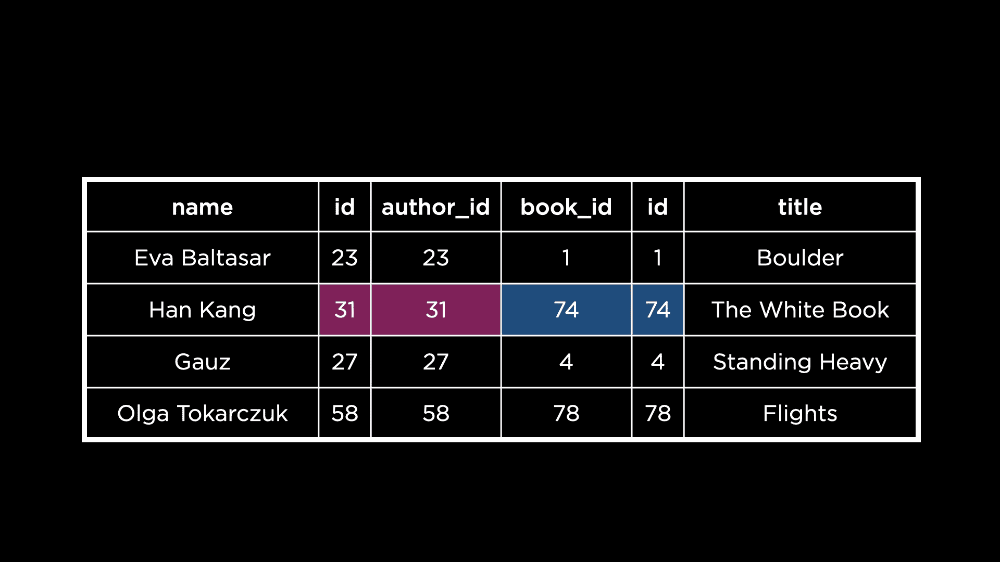
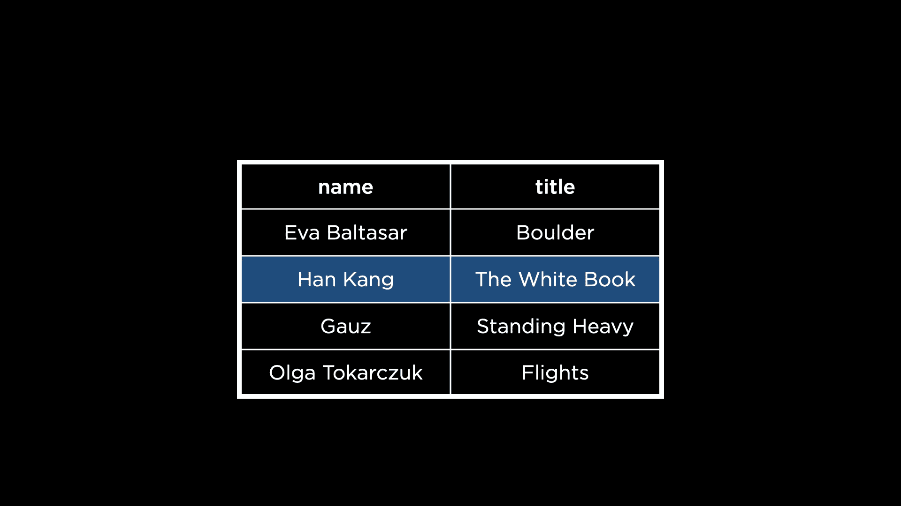
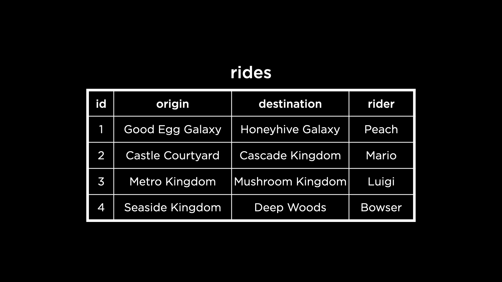
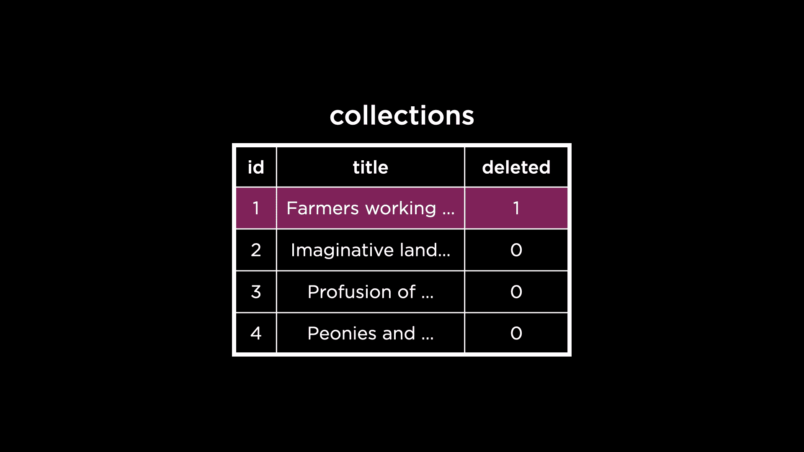

# 第四讲

> 原文：[`cs50.harvard.edu/sql/notes/4/`](https://cs50.harvard.edu/sql/notes/4/)

+   介绍

+   视图

+   简化

    +   问题

+   聚合

    +   问题

+   公用表表达式（CTE）

+   分区

    +   问题

+   安全

+   软删除

+   结束

## 介绍

+   到目前为止，我们已经学习了允许我们设计复杂数据库并将数据写入其中的概念。现在，我们将探讨从这些数据库中获取视图的方法。

+   让我们回到包含国际布克奖长名单书籍的数据库。以下是该数据库中表的快照。

    

+   要找到韩江（Han Kang）所著的书籍，我们需要遍历上述三个表中的每一个——首先找到作者的 ID，然后相应的书籍 ID，最后是书籍标题。相反，有没有一种方法可以将三个表中的相关信息组合成一个视图？

+   是的，我们可以使用 SQL 中的`JOIN`命令根据它们之间的相关列将两个或多个表中的行组合起来。以下是这些表如何连接以对齐作者及其书籍的视觉表示。

    

    这使得观察出韩江（Han Kang）是《白书》的作者变得简单。

+   也可以想象在这里删除 ID 列，这样我们的视图看起来就像下面这样。

    

## 视图

+   视图是由查询定义的虚拟表。

+   假设我们编写了一个查询来连接三个表，就像之前的例子一样，然后选择相关列。由这个查询创建的新表可以保存为视图，以便稍后进一步查询。

+   视图对于以下用途很有用：

    +   **简化**：将来自不同表的数据组合起来以便更简单地查询，

    +   **聚合**：运行聚合函数，如求和，并存储结果，

    +   **分区**：将数据划分为逻辑部分，

    +   **安全**：隐藏应保持安全的列。虽然视图还有其他有用的方式，但在本讲中，我们将关注上述四个方面。

## 简化

+   让我们在 SQLite 中打开`longlist.db`并运行`.schema`命令来验证我们之前示例中看到的三个表是否已创建：`authors`、`authored`和`books`。

+   要选择 Fernanda Melchor 所著的书籍，我们会编写这个嵌套查询。

    [PRE0]

+   上述查询很复杂——嵌套查询中有三个`SELECT`查询。为了简化，让我们首先使用`JOIN`创建包含作者及其书籍的视图。

+   在新的终端中，让我们再次连接到`longlist.db`，并运行以下查询。

    [PRE1]

    +   注意，指定如何连接两个表，或者它们连接的列是很重要的。

    +   小贴士：一个表的主键列通常与另一个表的对应外键列相连接！

    +   运行此命令将显示一个包含所有作者姓名及其所写书籍标题的表格。

+   要将之前步骤中创建的虚拟表保存为视图，我们需要更改查询。

    [PRE2]

    这里创建的视图称为`longlist`。现在我们可以像使用 SQL 中的表一样使用这个视图。

+   让我们编写一个查询来查看这个视图中的所有数据。

    [PRE3]

+   使用这个视图，我们可以大大**简化**查找 Fernanda Melchor 所写书籍所需的查询。

    [PRE4]

+   视图作为一个虚拟表，创建时不会消耗更多的磁盘空间。视图中的数据仍然存储在底层表中，但仍然可以通过这个简化的视图访问。

### 问题

> 我们能否操纵视图以使其有序，或者以不同的方式显示？

+   是的，我们可以像在表中一样在视图中对书籍进行排序。

    +   例如，让我们按书籍标题的顺序显示`longlist`视图中的数据。

        [PRE5]

    +   我们也可以让视图本身有序。我们可以通过在创建视图所用的查询中包含一个`ORDER BY`子句来实现这一点。

## 聚合

+   在`longlist.db`中，我们有一个包含每本书单独评分的表。在之前的几周中，我们看到了如何找到每本书的平均评分，并四舍五入到两位小数。

    [PRE6]

+   通过显示每本书的标题，以及每本书被列入长名单的年份，可以使上述查询的结果更有用。这些信息存在于`books`表中。

    [PRE7]

    +   在这里，我们使用`JOIN`将`ratings`和`books`表中的信息结合起来，通过书籍 ID 列进行连接。

    +   注意这个查询的操作顺序——特别是将`GROUP BY`操作放在查询末尾，在两个表连接之后。

+   这**聚合**的数据可以存储在视图中。

    [PRE8]

    +   现在，让我们查看这个视图中的数据。

        [PRE9]

+   在向`ratings`表添加更多数据以获取最新的聚合数据时，我们只需简单地使用上述类似的`SELECT`命令重新查询视图即可！

+   每次创建视图时，它都会被添加到模式中。我们可以通过运行`.schema`来验证这一点，观察`longlist`和`average_book_ratings`现在已经成为这个数据库模式的一部分。

+   要创建不存储在数据库模式中的临时视图，我们可以使用`CREATE TEMPORARY VIEW`。此命令创建一个仅在数据库连接期间存在的视图。

+   要找到每本书的**年度**平均评分，我们可以使用我们已创建的视图。

    [PRE10]

    注意，我们从 `average_book_ratings` 中选择了 `rating` 列，该列已经包含了每本书的平均评分。接下来，我们按年份对这些评分进行分组，并再次计算平均评分，这样就得到了每年的平均评分！

+   我们可以将结果存储在一个临时视图中。

    [PRE11]

### 问题

> 可以使用临时视图来测试查询是否有效吗？

+   是的，这是一个临时视图的绝佳用例！为了稍微概括一下，当我们想要以某种方式组织数据而不需要长期存储这种组织时，我们会使用临时视图。

## 公用表表达式（CTE）

+   正规视图在我们数据库模式中永久存在。临时视图在我们与数据库的连接期间存在。CTE 是仅对单个查询存在的视图。

+   让我们使用公用表表达式（CTE）而不是临时视图来重新创建包含每年平均书籍评分的视图。首先，我们需要删除现有的临时视图，这样我们就可以重用名称 `average_book_ratings`。

    [PRE12]

+   接下来，我们创建一个包含每本书平均评分的 CTE。然后，我们使用每本书的平均评分来计算每年的平均评分，这与我们之前的方法非常相似。

    [PRE13]

## 分区

+   视图可以用来分区数据，或者将其分解成对我们或应用程序有用的更小的部分。例如，国际布克奖的网站为每次获奖的年份都有一个入选书籍的页面。然而，我们的数据库将所有入选的书籍存储在一个单独的表中。为了创建网站或其他目的，可能需要为每年的书籍创建不同的表（或视图）。

+   让我们创建一个视图来存储 2022 年入选的书籍。

    [PRE14]

    +   我们也可以在这个视图中查看数据。

        [PRE15]

### 问题

> 视图可以更新吗？

+   不可以，因为视图不像表那样包含任何数据。视图实际上在每次查询时都会从底层表中提取数据。这意味着当底层表被更新时，下一次查询视图时，它将显示来自表的新数据！

## 安全

+   视图可以通过限制对某些数据的访问来增强数据库的安全性。

+   考虑一个共享出行公司的数据库，其中有一个名为 `rides` 的表，其结构如下。

    

+   如果我们将这些数据提供给分析师，他们的工作是找出最受欢迎的骑行路线，那么提供个别乘客的姓名将是不相关的，实际上也是不安全的。乘客姓名可能被归类为个人信息（PII），公司不允许无差别地共享这些信息。

+   在这种情况下，视图可以派上用场——我们可以与分析师分享一个包含骑行起点和目的地的视图，但不包含乘客姓名。

+   为了尝试这个，让我们在我们的终端中打开 `rideshare.db`。运行 `.schema` 应该会揭示这个数据库中的一个名为 `rides` 的表。

+   我们可以创建一个包含相关列的视图，同时完全省略`rider`列。但在这里，我们将更进一步，创建一个`rider`列来显示表中每行的匿名骑手。这将向分析师表明，尽管我们在数据库中有骑手姓名，但这些姓名为了安全起见已被匿名化。

    [PRE16]

    +   我们可以查询这个视图来确保它是安全的。

        [PRE17]

+   尽管我们可以创建一个匿名化数据的视图，但 SQLite 不允许访问控制。这意味着我们的分析师可以简单地查询原始的`rides`表，并看到我们在`analysis`视图中费尽心思省略的所有骑手姓名。

## 软删除

+   正如我们在前几周看到的，软删除涉及将行标记为已删除，而不是从表中删除它。

+   例如，名为“黎明时分劳作的农民”的艺术品通过将`collections`表中的`deleted`列的值从 0 更改为 1 被标记为已删除。

    

+   我们可以想象创建一个视图来仅显示未删除的艺术品。

+   要尝试这个，让我们在我们的终端中打开`mfa.db`。`collections`表还没有`deleted`列，所以我们需要添加它。这里的默认值将是 0，以表示该行未被删除。

    [PRE18]

+   现在，让我们对艺术品“黎明时分劳作的农民”执行软删除，通过将其`deleted`列更新为 1。

    [PRE19]

+   我们可以创建一个视图来显示未删除行的信息。

    [PRE20]

    +   我们可以显示这个视图中的数据来验证“黎明时分劳作的农民”不存在。

        [PRE21]

    +   在从底层表`collections`中软删除行后，它将在任何进一步的查询中从`current_collections`视图中被移除。

+   我们已经知道无法向视图中插入数据或从视图中删除数据。然而，我们可以设置一个触发器来向底层表插入或删除数据！`INSTEAD OF`触发器允许我们这样做。

    [PRE22]

    +   每次我们尝试从视图中删除行时，这个触发器将更新底层表`collections`中行的`deleted`列，从而完成软删除。

    +   我们在更新子句中使用关键字`OLD`来表示在`collections`中更新的行的 ID 应该与我们要从`current_collections`中删除的行的 ID 相同。

+   现在，我们可以从`current_collections`视图中删除一行。

    [PRE23]

    我们可以通过查询视图来验证这是否有效。

    [PRE24]

+   类似地，我们可以创建一个触发器，在我们尝试将数据插入视图时将其插入到底层表中。

+   这里有两个需要考虑的情况。我们可能试图将已存在于底层表中的、但已被软删除的行插入到视图中。我们可以编写以下触发器来处理这种情况。

    [PRE25]

    +   `WHEN`关键字用于检查艺术品的登记号是否已存在于`collections`表中。这是因为，正如我们从上周所知，登记号唯一地标识了表中每一件艺术品。

    +   如果艺术品确实存在于底层表中，我们将它的`deleted`值设置为 0，表示软删除的撤销。

+   第二种情况发生在我们尝试插入一个在底层表中不存在的行时。以下触发器处理这种情况。

    [PRE26]

    +   当插入数据的登记号不在`collections`中时，它将行插入到表中。

## Fin

+   这就带我们来到了关于 SQL 中查看的第四讲的内容总结！
