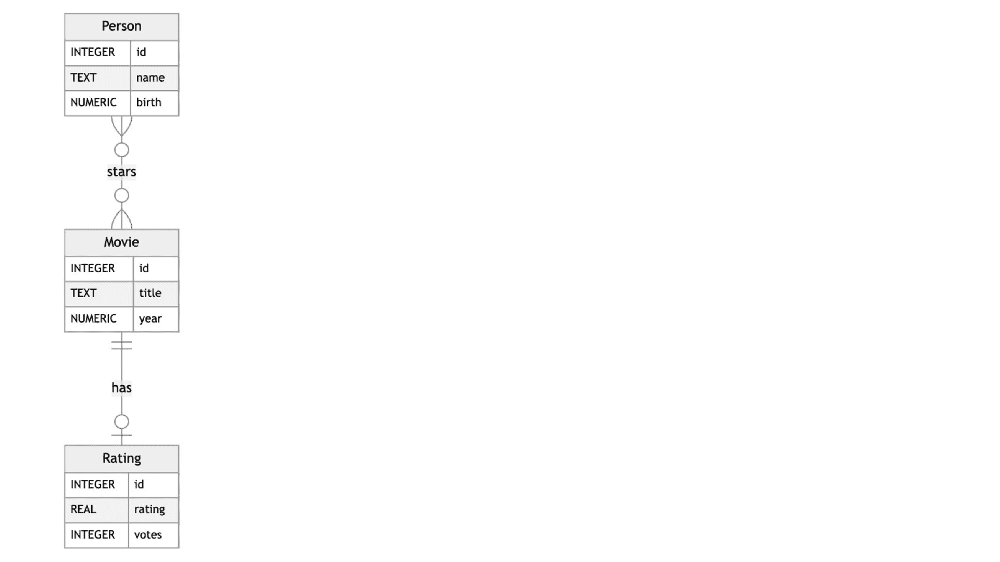
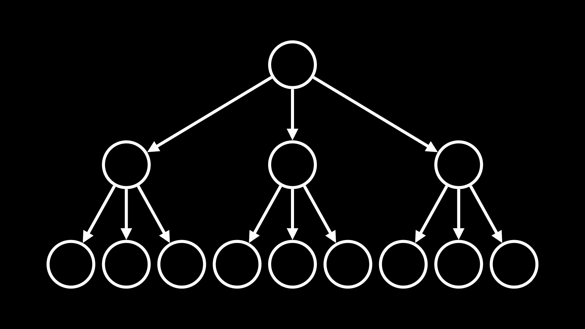
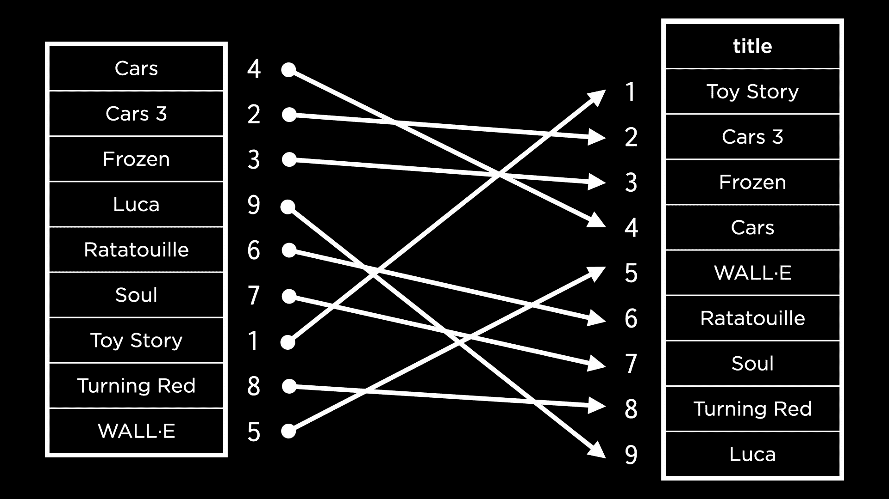
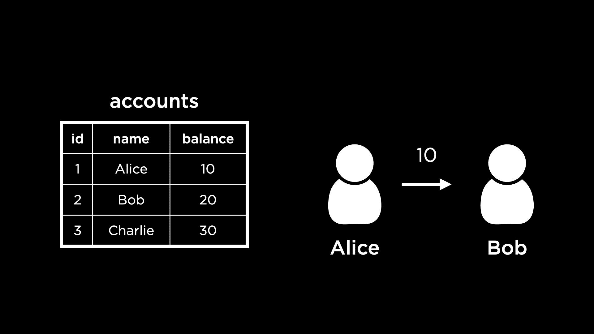

# 第五课

> 原文：[`cs50.harvard.edu/sql/notes/5/`](https://cs50.harvard.edu/sql/notes/5/)

+   简介

+   索引

    +   问题

+   跨多表索引

+   空间权衡

+   时间权衡

+   部分索引

    +   问题

+   真空

    +   问题

+   并发

    +   事务

    +   竞争条件

    +   问题

+   结束

## 简介

+   这周，我们将学习如何优化我们的 SQL 查询，无论是时间还是空间。我们还将学习如何并发地运行查询。

+   我们将在一个新的数据库的背景下做所有这些，即互联网电影数据库，或更广为人知的 IMDb。我们的 SQLite 数据库是从您可能之前在 imdb.com 看过的庞大在线电影数据库编译而成的。

+   查看这些统计数据，以了解这个数据库有多大！它拥有的数据比我们迄今为止所使用的任何其他数据库都要多！

    

+   这里是详细说明实体及其关系的 ER 图。

    

## 索引

+   让我们打开这个名为 `movies.db` 的数据库在 SQLite 中。

+   `.schema` 显示了在这个数据库中创建的表。为了实现实体 Person 和 Movie 之间的多对多关系，我们在 ER 图中有一个联合表，称为 `stars`，它将 `people` 和 `movies` 的 ID 列作为外键列引用！

+   要查看 `movies` 表，我们可以从表中选择并限制结果。

    [PRE0]

+   要查找与电影 Cars 相关的信息，我们会运行以下查询。

    [PRE1]

    +   假设我们想找出这个查询运行了多长时间。SQLite 有一个命令 `.timer on`，它使我们能够计时我们的查询。

    +   在运行上述查询以再次查找 Cars 时，我们可以看到三个不同的时间测量值与结果一起显示。

    +   “实际”时间表示计时器时间，或执行查询并获得结果之间的时间。这是我们关注的衡量时间。在讲座中执行此查询所花费的时间大约是 0.1 秒！

+   在底层，当运行查找 Cars 的查询时，我们触发了对表 `movies` 的 **扫描**——也就是说，表 `movies` 是逐行从上到下扫描，以找到所有标题为 Cars 的行。

+   我们可以优化这个查询，使其比扫描更高效。就像教科书通常有索引一样，数据库表也可以有索引。在数据库术语中，索引是一种用于加速从表中检索行的结构。

+   我们可以使用以下命令为 `movies` 表中的 `"title"` 列创建索引。

    [PRE2]

    +   在创建这个索引后，我们再次运行查询以查找名为《汽车总动员》的电影。在这次运行中，所需时间显著缩短（在讲座中，几乎比第一次快八倍）！

+   在上一个例子中，一旦创建了索引，我们就假设 SQL 会使用它来查找电影。然而，我们也可以通过在查询之前使用 SQLite 命令`EXPLAIN QUERY PLAN`来明确地看到这一点。

+   要删除我们刚刚创建的索引，请运行：

    [PRE3]

    +   在删除索引后，再次使用`EXPLAIN QUERY PLAN`与`SELECT`查询一起运行将表明计划将回退到扫描整个数据库。

### 问题

> 数据库没有隐式算法来优化搜索吗？

+   对于某些列来说，它们确实有。在 SQLite 和大多数其他数据库管理系统中，如果我们指定一个列是主键，则会自动创建一个索引，通过该索引我们可以搜索主键。然而，对于像`"title"`这样的常规列，则不会有自动优化。

> 是否建议为每个可能需要的列创建不同的索引？

+   虽然这似乎很有用，但在空间和时间上存在权衡，因为之后将数据插入带有索引的表中需要花费时间。我们很快就会看到更多关于这方面的内容！

## 跨多表索引

+   我们将运行以下查询来找到汤姆·汉克斯主演的所有电影。

    [PRE4]

+   为了了解哪种索引可以帮助加快这个查询的速度，我们可以在查询之前再次运行`EXPLAIN QUERY PLAN`。这显示查询需要两次扫描——`people`和`stars`。由于我们是通过 ID 搜索`movies`，SQLite 会自动为这个 ID 创建索引，所以不需要扫描`movies`表！

+   让我们创建两个索引来加快这个查询的速度。

    [PRE5]

+   现在，我们使用相同的嵌套查询运行`EXPLAIN QUERY PLAN`。我们可以观察到

    +   现在所有的扫描都变成了使用索引的搜索，这很好！

    +   在`people`表上的搜索使用了一种称为`COVERING INDEX`的东西

+   覆盖索引意味着查询所需的所有信息都可以在索引本身中找到。而不是两步：

    1.  在索引中查找相关信息，

    1.  使用索引来搜索表，覆盖索引意味着我们只需一步（只是第一步）进行搜索。

+   要让`stars`表上的搜索也使用覆盖索引，我们可以在为`stars`创建的索引中添加`"movie_id"`。这将确保要查找的信息（电影 ID）和要搜索的值（人物 ID）都包含在索引中。

+   首先，让我们删除`stars`表上现有的索引实现。

    [PRE6]

+   接下来，我们创建新的索引。

    [PRE7]

+   运行以下命令将证明我们现在有两个覆盖索引，这应该会导致搜索速度大大加快！

    [PRE8]

+   确保我们已运行`.timer on`，然后我们可以执行上述查询以找到汤姆·汉克斯主演的所有电影，并观察其运行时间。现在查询的运行速度比没有索引时快得多（在讲座中，速度快了一个数量级）！

## 空间权衡

+   索引看起来非常有帮助，但它们也有权衡——它们在数据库中占用额外的空间，因此虽然我们获得了查询速度的提升，但我们确实失去了空间。

+   索引以称为 B 树或平衡树的数据结构存储在数据库中。树数据结构看起来像这样：

    

    +   注意到树中有许多**节点**，每个节点通过箭头与其他几个节点相连。根节点，或树起源的节点，有三个**子节点**。树边缘的一些节点不指向任何其他节点。这些被称为**叶节点**。

+   让我们考虑如何为`movies`表的`"title"`列创建索引。如果电影标题按字母顺序排序，那么使用[二分搜索](https://en.wikipedia.org/wiki/Binary_search_algorithm)查找特定电影会容易得多。

+   在这种情况下，会复制`"titles"`列。这个副本会被排序，然后通过指向电影 ID 将它们链接回`movies`表中的原始行。这在下图中进行了可视化。

    

+   虽然这有助于我们轻松地可视化此列的索引，但在现实中，索引不是一个单独的列，而是被拆分成许多节点。这是因为如果数据库有大量数据，比如我们的 IMDb 示例，将一个列全部存储在内存中可能不可行。

+   然而，如果我们有包含索引部分的多个节点，我们还需要节点来导航到正确的部分。例如，考虑以下节点。左侧节点根据电影标题是否在 Frozen 之前、在 Frozen 和 Soul 之间或 Soul 之后按字母顺序，将我们引导到索引的正确部分！

    

+   上述表示是一个 B 树！这是 SQLite 中索引存储的方式。

## 时间权衡

+   与我们之前讨论的空间权衡类似，它也会使将数据插入列并添加到索引中花费更长的时间。每次向索引添加一个值时，B 树都需要遍历以确定该值应该添加的位置！

## 部分索引

+   这是一个只包含表的一部分行的索引，允许我们节省一个完整索引所占用的空间。

+   这在我们知道用户只查询表的一小部分行时特别有用。在 IMDb 的情况下，可能用户更有可能查询一部新发布的电影，而不是一部 15 年前的电影。让我们尝试创建一个部分索引，该索引存储 2023 年发布的电影标题。

    [PRE9]

+   我们可以检查搜索 2023 年发布的电影是否使用了新的索引。

    [PRE10]

    这表明`movies`表是使用部分索引进行扫描的。

### 问题

> 索引是否保存在模式中？

+   是的，在 SQLite 中，它们是这样的！我们可以通过运行`.schema`来确认，我们将在数据库模式中看到创建的索引列表。

## 真空

+   有方法可以删除我们数据库中的未使用空间。SQLite 允许我们“真空”数据——这清理了之前已删除的数据（实际上并没有删除，只是标记为可用空间以供下一个`INSERT`使用）。

+   要在终端上查找`movies.db`的大小，我们可以使用 Unix 命令

    [PRE11]

+   在讲座中，这个命令向我们展示了数据库的大小大约是 158 百万字节，或者说 158 兆字节。

+   我们现在可以连接到我们的数据库并删除我们之前创建的索引。

    [PRE12]

+   现在，如果我们再次运行 Unix 命令，我们会看到数据库的大小没有减少！要真正清理已删除的空间，我们需要对它进行真空。我们可以在 SQLite 中运行以下命令。

    [PRE13]

    这可能需要一秒钟或两秒钟的时间来运行。在再次运行 Unix 命令检查数据库大小时，我们应该看到更小的尺寸。一旦我们删除所有索引并再次真空，数据库的大小将比 158 MB 小得多（在讲座中大约是 100 MB）。

### 问题

> 是否有可能使真空过程更快？

+   每个真空过程所需的时间可能不同，这取决于我们试图真空的空间量以及找到需要释放的位和字节有多容易！

> 如果一个删除某些行的查询实际上并没有删除它们，而只是将它们标记为已删除，我们是否还能检索这些行？

+   在法医学方面受过训练的人能够找到我们认为已删除但实际上仍然在我们的电脑上的数据。在 SQLite 的情况下，在执行真空操作后，将无法再次找到已删除的行。

## 并发

+   到目前为止，我们已经看到了如何优化单个查询。现在，我们将探讨如何允许一次不仅仅是一个查询，而是多个查询同时进行。

+   并发是数据库同时处理多个查询或交互的方式。想象一下，一个网站或金融服务数据库在同时承受大量流量。在这些情况下，并发尤为重要。

+   一些数据库事务可以是多部分的。例如，考虑一个银行的数据库。以下是一个存储账户余额的`accounts`表的视图。

    

    +   一个事务可能是从一个账户向另一个账户转账。例如，爱丽丝试图向鲍勃发送 10 美元。

    +   要完成这个事务，我们需要向鲍勃的账户中添加 10 美元，并从爱丽丝的账户中减去 10 美元。如果有人看到在第一次更新鲍勃的账户之后但在第二次更新爱丽丝的账户之前的`accounts`数据库的状态，他们可能会对银行持有的总金额有一个错误的理解。

### 事务

+   对于外部观察者来说，它应该看起来像事务的不同部分是同时发生的。在数据库术语中，事务是一个单独的工作单元——不能分解成更小的部分。

+   事务具有一些属性，可以使用 ACID 首字母缩写词来记住：

    +   **原子性**：不能分解成更小的部分，

    +   **一致性**：不应违反数据库约束，

    +   **隔离性**：如果多个用户访问数据库，他们的事务不能相互干扰，

    +   **持久性**：在数据库内部发生任何故障的情况下，所有由事务更改的数据都将保持不变。

+   让我们在终端中打开`bank.db`，这样我们就可以实现从爱丽丝到鲍勃转账的事务了！

+   首先，我们想查看`accounts`表中已经存在的数据。

    [PRE14]

    我们在此处记录鲍勃的 ID 是 2，爱丽丝的 ID 是 1，这对我们的查询将很有用。

+   要将 10 美元从爱丽丝的账户转移到鲍勃的账户，我们可以编写以下事务。

    [PRE15]

    注意，`UPDATE`语句写在开始事务和提交事务的命令之间。如果我们执行查询是在写入`UPDATE`语句之后，但没有提交，那么两个`UPDATE`语句都不会执行！这有助于保持事务的**原子性**。通过以这种方式更新我们的表，我们无法看到中间步骤。

+   如果我们再次尝试运行上述事务——爱丽丝试图再给鲍勃支付 10 美元——它应该无法运行，因为爱丽丝的账户余额为 0。（`accounts`表中的`"balance"`列有一个检查约束，以确保它具有非负值。我们可以运行`.schema`来检查这一点。）

+   我们实现事务回滚的方式是使用`ROLLBACK`。一旦我们开始一个事务并写入一些 SQL 语句，如果其中任何一个失败，我们可以使用`ROLLBACK`来结束它，将所有值回滚到事务前的状态。这有助于保持事务的**一致性**。

    [PRE16]

### 竞争条件

+   事务可以帮助防止竞争条件。

+   当多个实体同时访问并基于共享值做出决策时，会发生竞争条件，这可能导致数据库中的不一致性。未解决的竞争条件可以被黑客利用来操纵数据库。

+   在讲座中，讨论了一个竞争条件的例子，其中两个用户合作可以利用数据库中的暂时不一致性来抢劫银行。

+   然而，事务是**隔离**处理的，以避免首先出现不一致。处理我们数据库中类似数据的每个事务都将按顺序处理。这有助于防止敌对攻击可以利用的不一致性。

+   为了使事务按顺序进行，SQLite 和其他数据库管理系统使用数据库上的**锁**。数据库中的表可能处于几种不同的状态：

    +   **未锁定（UNLOCKED）**：这是没有用户访问数据库时的默认状态，

    +   **共享（SHARED）**：当事务从数据库读取数据时，它获得共享锁，允许其他事务同时从数据库中读取，

    +   **排他（EXCLUSIVE）**：如果一个事务需要写入或更新数据，它将获得对数据库的排他锁，不允许其他事务同时发生（甚至不允许读取）

### 问题

> 我们如何决定何时一个事务可以获得排他锁？我们如何优先处理不同类型的交易？

+   可以使用不同的算法来做出这些决定。例如，我们总是可以选择最先发生的交易。如果需要排他性交易，则没有其他交易可以同时运行，这是确保表的一致性所必需的缺点。

> 锁定的粒度是什么？我们是锁定数据库、表还是表的行？

+   这取决于数据库管理系统（DBMS）。在 SQLite 中，我们可以通过运行以下排他性事务来实现这一点：

    [PRE17]

    如果我们现在不完成这笔交易，而是尝试通过不同的终端连接到数据库以读取表，我们将得到一个错误，表明数据库已被锁定！当然，这是一种非常粗略的锁定方式，因为它锁定了整个数据库。由于 SQLite 在这方面比较粗略，因此它有一个模块用于优先处理事务并确保只获得最短必要的排他锁。

## 完成

+   这将我们带到了关于 SQL 优化的第 5 讲结论！
