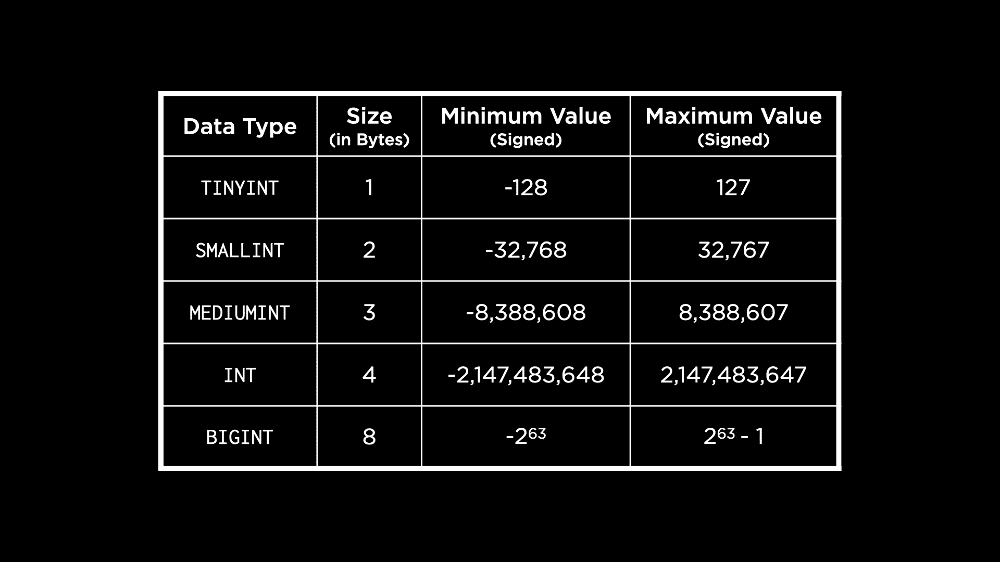
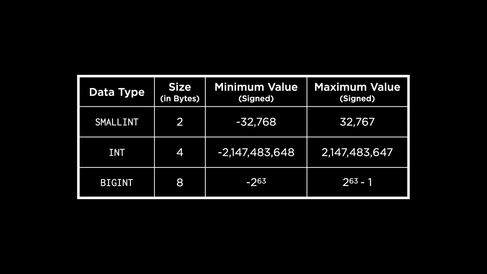

# 第六讲

> 原文：[`cs50.harvard.edu/sql/notes/6/`](https://cs50.harvard.edu/sql/notes/6/)

+   简介

+   MySQL

+   创建 `cards` 表

    +   问题

+   创建 `stations` 表

    +   问题

+   创建 `swipes` 表

    +   问题

+   修改表

+   存储过程

    +   问题

+   带有参数的存储过程

+   PostgreSQL

    +   问题

+   创建 PostgreSQL 表

+   使用 MySQL 进行扩展

+   访问控制

+   SQL 注入攻击

+   问题

+   Fin

## 简介

+   到目前为止，在本课程中，我们已经学习了如何设计和创建自己的数据库，读取和写入数据，以及最近如何优化我们的查询。现在，我们将了解如何以更大的规模来做这些事情。

+   可扩展性是增加或减少应用程序或数据库容量以满足需求的能力。

+   社交媒体平台和银行系统是可能需要随着其规模扩大和用户增加而扩展的应用程序的例子。

+   在本讲中，我们将使用不同的数据库管理系统，如 MySQL 和 PostgreSQL，这些系统可以用于扩展数据库。

+   SQLite 是一个嵌入式数据库，但 MySQL 和 PostgreSQL 是数据库服务器——它们通常运行在它们自己的专用硬件上，我们可以通过互联网连接到它们来运行我们的 SQL 查询。这使得它们能够将数据存储在 RAM 中，从而实现更快的查询。

## MySQL

+   我们将使用我们在之前的讲座中使用的 MBTA 数据库。以下是一个 ER 图，显示了实体 Card、Swipe 和 Station 以及这些实体之间的关系。

    

    +   作为提醒，使用地铁的乘客有一个 CharlieCard，在车站刷卡以获得进入权限。乘客可以充值卡片，在某些情况下，他们还需要刷卡才能离开车站。MBTA 不存储有关乘客的信息，但只跟踪卡片。

+   我们想要使用这个模式在 MySQL 中创建一个数据库！在终端上，让我们连接到一个 MySQL 服务器。

    ```
    mysql -u root -h 127.0.0.1 -P 3306 -p 
    ```

    +   在这个终端命令中，`-u` 表示用户。我们提供我们想要连接到数据库的用户——`root`（在这种情况下与数据库管理员同义）。

    +   `127.0.0.1` 是互联网上本地主机的地址（我们的电脑）。

    +   `3306` 是我们想要连接的端口，这是 MySQL 的默认端口。将主机和端口的组合视为我们试图连接的数据库的地址！

    +   命令末尾的`-p`表示我们希望在连接时提示输入密码。

+   由于这是一个完整的数据库服务器，其中可能包含许多数据库。要显示所有现有的数据库，我们使用以下 MySQL 命令。

    ```
    SHOW DATABASES; 
    ```

    这返回了一些服务器中已经存在的默认数据库。

+   我们将执行一些操作来设置 MBTA 数据库。我们已经看到了如何在 SQLite 中完成这些操作，所以让我们专注于 MySQL 的语法差异！

    +   创建新数据库：

        ```
        CREATE DATABASE `mbta`; 
        ```

        我们使用反引号而不是引号来标识 SQL 语句中的表名和其他变量。

    +   要将当前数据库更改为`mbta`：

        ```
        USE `mbta`; 
        ```

## 创建`cards`表

+   MySQL 在类型上比 SQLite 有更多的粒度。例如，一个整数可以是`TINYINT`、`SMALLINT`、`MEDIUMINT`、`INT`或`BIGINT`，这取决于我们想要存储的数字的大小。以下表格显示了我们可以存储在每个整数类型中的数字的大小和范围。

    

    这些范围假设我们想要使用有符号整数。如果我们使用无符号整数，每个整数类型可以存储的最大值将翻倍。

+   现在我们将使用`INT`数据类型为 ID 列创建表`cards`。由于`INT`可以存储高达 40 亿的数字，它应该足够大，可以满足我们的使用案例！

    ```
    CREATE TABLE `cards` (
        `id` INT AUTO_INCREMENT,
        PRIMARY KEY(`id`)
    ); 
    ```

    注意，我们使用关键字`AUTO_INCREMENT`与 ID 一起使用，这样 MySQL 会自动插入下一个数字作为新行的 ID。

### 问题

> 如果 ID 列不是无符号整数怎么办？我们如何表示这一点？

+   是的，我们可以在创建整数时显式地将 ID 设置为无符号整数，通过添加关键字`UNSIGNED`。

## 创建`stations`表

+   创建表后，我们可以通过运行以下命令来查看现有表的列表：

    ```
    SHOW TABLES; 
    ```

+   要获取关于表的更多详细信息，我们可以使用`DESCRIBE`命令。

    ```
    DESCRIBE `cards`; 
    ```

+   为了处理文本，MySQL 提供了许多类型。两种常用的类型是`CHAR`——一个固定宽度的字符串，和`VARCHAR`——一个可变长度的字符串。MySQL 还有一个`TEXT`类型，但与 SQLite 不同，这种类型用于更长的文本块，如段落、书籍的页面等。根据文本的长度，它可以是`TINYTEXT`、`TEXT`、`MEDIUMTEXT`和`LONGTEXT`之一。此外，我们还有`BLOB`类型来存储二进制字符串。

+   MySQL 还提供了两种其他文本类型：`ENUM`和`SET`。Enum 将列限制为我们提供的选项列表中的单个预定义选项。例如，衬衫尺寸可以枚举为 M、L、XL 等。Set 允许在单个单元格中存储多个选项，这在电影类型等场景中很有用。

+   现在，让我们在 MySQL 中创建`stations`表。

    ```
    CREATE TABLE `stations` (
        `id` INT AUTO_INCREMENT,
        `name` VARCHAR(32) NOT NULL UNIQUE,
        `line` ENUM('blue', 'green', 'orange', 'red') NOT NULL,
        PRIMARY KEY(`id`)
    ); 
    ```

    +   我们选择`VARCHAR`作为站名，因为名字可能长度不一。然而，一个站点所在的线路是波士顿现有的地铁线路之一。由于我们知道这些值可能是什么，我们可以使用`ENUM`类型。

    +   我们也像在 SQLite 中一样，使用列约束`UNIQUE`和`NOT NULL`。

+   在运行描述此表的命令后，我们看到一个类似的输出，列出了表中的每一列。在`Key`字段下，主键通过`PRI`被识别，任何具有唯一值的列通过`UNI`被识别。`NULL`字段告诉我们哪些列允许`NULL`值，对于`stations`表来说，没有列允许`NULL`值。

### 问题

> 我们能否将表作为`ENUM`的输入？

+   这可能可以通过嵌套`SELECT`语句来实现，但如果表中的值随时间变化，这可能不是一个好主意。最好明确地将值作为`ENUM`的选项。

> 如果我们不知道一段文本的长度，并使用类似`VARCHAR(300)`来表示它，这是否可以？

+   虽然这是可以的，但这里有一个权衡。每插入一行数据，我们将失去 300 字节的内存，如果我们最终只存储非常小的字符串，这可能不值得。可能更好的是从较小的长度开始，然后在需要时更改表以增加长度。

## 创建`swipes`表

+   MySQL 为我们提供了一些存储日期和时间的选项，而 SQLite 则必须使用数值类型来存储。

+   我们可以使用`DATE`、`YEAR`、`TIME`、`DATETIME`和`TIMESTAMP`（用于更精确的时间）来存储我们的日期和时间值。最后三个允许可选参数来指定我们想要存储时间的精度。

+   在 SQLite 中，我们有`REAL`数据类型。在这里，我们的选项是表下面的`FLOAT`和`DOUBLE PRECISION`。

    

    +   由于浮点数的不精确性，需要指定字节数来确定精度。这意味着在有限的内存中，浮点数只能表示到一定的精度。字节越多，表示数字的精度就越高。

+   在 MySQL 中，也有一种使用十进制（固定精度）类型的方法。使用这种方法，我们将指定要表示的数字中的位数以及小数点后的位数。

+   让我们现在创建`swipes`表。

    ```
    CREATE TABLE `swipes` (
        `id` INT AUTO_INCREMENT,
        `card_id` INT,
        `station_id` INT,
        `type` ENUM('enter', 'exit', 'deposit') NOT NULL,
        `datetime` DATETIME NOT NULL DEFAULT CURRENT_TIMESTAMP,
        `amount` DECIMAL(5,2) NOT NULL CHECK(`amount` != 0),
        PRIMARY KEY(`id`),
        FOREIGN KEY(`station_id`) REFERENCES `stations`(`id`),
        FOREIGN KEY(`card_id`) REFERENCES `cards`(`id`)
    ); 
    ```

    +   注意到使用`DEFAULT CURRENT_TIMESTAMP`来指示如果未提供值，则应自动填充时间戳以存储当前时间。

    +   我们为滑动金额选择的精度是 2。这是为了确保在没有任何舍入的情况下，可以添加或减去分。

    +   我们在 SQLite 中创建表时使用的列约束仍然存在，包括确保滑动金额不是负数的检查。

+   如果我们在创建表后描述它，我们将看到熟悉的输出。`Key`字段有一个新值，对于外键列，`MUL`（多个）表示它们可能有重复的值，因为它们是外键。

### 问题

> 当我们向列添加约束时，它们是否有生效的优先级？

+   不，约束以组合方式共同工作。MySQL 允许我们在创建表时以任何顺序添加约束。

> MySQL 有类型亲和力吗？

+   不完全是这样。MySQL 确实有数据类型，如 `INT` 和 `VARCHAR`，但与 SQLite 不同，它不会允许我们输入不同类型的数据并尝试转换它。

## 修改表

+   MySQL 允许我们比 SQLite 更根本地修改表。

+   如果我们想要向一个站点可能所在的线路中添加一条银色线路，我们可以这样做。

    ```
    ALTER TABLE `stations` 
    MODIFY `line` ENUM('blue', 'green', 'orange', 'red', 'silver') NOT NULL; 
    ```

    +   这允许我们修改 `line` 列并更改其类型，使得 `ENUM` 现在包括银色作为选项。

    +   还要注意，我们除了使用熟悉的 SQLite 中的 `ALTER TABLE` 构造外，还使用了 `MODIFY` 关键字。

## 存储过程

+   存储过程是一种自动化 SQL 语句并重复运行它们的方式。

+   为了演示存储过程，我们再次使用之前讲座中提到的数据库——波士顿 MFA 数据库。

+   回想一下，我们在 SQLite 中使用视图来实现 MFA 数据库中 `collections` 的软删除功能。一个名为 `current_collections` 的视图显示了所有未被标记为已删除的集合。现在，我们将使用 MySQL 中的存储过程来完成类似的功能。

+   让我们导航到已经在我们的 MySQL 服务器上创建的 MFA 数据库。

    ```
    USE `mfa`; 
    ```

+   在描述 `collections` 表时，我们看到 `deleted` 列不存在，需要添加到表中。

    ```
    ALTER TABLE `collections` 
    ADD COLUMN `deleted` TINYINT DEFAULT 0; 
    ```

    由于 `deleted` 列只有 0 或 1 的值，使用 `TINYINT` 是安全的。我们还将其默认值设置为 0，因为我们希望保留表中已有的所有集合。

+   在我们创建存储过程之前，我们需要将分隔符从 `;` 改为其他东西。与 SQLite 不同，在 `BEGIN` 和 `END`（这里需要一个存储过程）之间我们可以输入多个语句，并以 `;` 结尾，而 MySQL 在遇到 `;` 时会提前结束语句。

    ```
    delimiter // 
    ```

+   现在，我们编写存储过程。

    ```
    CREATE PROCEDURE `current_collection`()
    BEGIN
        SELECT `title`, `accession_number`, `acquired` 
        FROM `collections` 
        WHERE `deleted` = 0;
    END// 
    ```

    注意我们如何在存储过程名称旁边使用空括号，这可能会让人联想到其他编程语言中的函数。与函数类似，我们也可以调用存储过程来运行它们。

+   创建此过程后，我们必须将分隔符重置为 `;`。

    ```
    delimiter ; 
    ```

+   让我们尝试调用这个过程来看看当前的集合。在这个时候，查询应该输出 `collections` 表中的所有行，因为我们还没有进行软删除。

    ```
    CALL current_collection(); 
    ```

+   如果我们软删除“黎明时分工作的农民”并再次调用该过程，我们会发现已删除的行不包括在输出中。

    ```
    UPDATE `collections` 
    SET `deleted` = 1 
    WHERE `title` = 'Farmers working at dawn'; 
    ```

### 问题

> 我们能否向存储过程添加参数，即用一些输入来调用它们？

+   是的，我们可以，很快就会看到一个例子！

> 我们能否像函数一样从一个存储过程调用另一个存储过程？

+   是的。你可以在存储过程中放入你写的几乎所有 SQL 语句。

> 你能在 MySQL 的表中留下任何注释或备注吗？

+   这绝对可能是一个有用的功能！你可以在`schema.sql`文件中留下注释，描述模式不同部分的意图，但也许还有在 SQL 表中添加注释的方法。

## 带参数的存储过程

+   在我们之前与 MFA 数据库合作时，我们有一个名为`transactions`的表来记录购买的或出售的艺术品，我们也可以在这里创建它。

    ```
    CREATE TABLE `transactions` (
        `id` INT AUTO_INCREMENT,
        `title` VARCHAR(64) NOT NULL,
        `action` ENUM('bought', 'sold') NOT NULL,
        PRIMARY KEY(`id`)
    ); 
    ```

+   现在，如果一件艺术品因为出售而从`collections`中被删除，我们也希望更新`transactions`表中的这一信息。通常，这将是两个不同的查询，但通过存储过程，我们可以给这个序列一个名称。

    ```
    delimiter //
    CREATE PROCEDURE `sell`(IN `sold_id` INT)
    BEGIN
        UPDATE `collections` SET `deleted` = 1 
        WHERE `id` = `sold_id`;
        INSERT INTO `transactions` (`title`, `action`)
        VALUES ((SELECT `title` FROM `collections` WHERE `id` = `sold_id`), 'sold');
    END//
    delimiter ; 
    ```

    这个过程参数的选择是绘画或艺术品的 ID，因为它是一个唯一的标识符。

+   我们现在可以调用这个过程来出售特定的物品。假设我们想要出售“想象中的风景”。

    ```
    CALL `sell`(2); 
    ```

    我们可以显示`collections`和`transactions`表中的数据，以验证所做的更改。

+   如果我多次调用`sell`同一个 ID 会发生什么？它可能会被多次添加到`transactions`表中。通过使用一些常规的编程结构，存储过程在逻辑和复杂性上可以得到相当大的改进。以下列表包含了一些在 MySQL 中可用的流行结构。

    

## PostgreSQL

+   到目前为止，在本讲座中，我们看到了如何使用 MySQL，这让我们能够扩展 SQLite 所能提供的能力。

+   我们现在将通过与 MySQL 相同的流程来探索 PostgreSQL 的功能。我们将使用一些现有的 SQLite 数据库并将它们转换为 PostgreSQL。

+   回到之前提到的 MBTA 数据库，它有一个名为`cards`的表，让我们看看 PostgreSQL 为我们提供了哪些数据类型。

    +   **整数**

    

    我们可以观察到这里的选项比 MySQL 少。PostgreSQL 也提供了无符号整数，类似于 MySQL。这意味着在处理无符号整数时，每个整数类型可以存储的最大值是这里显示的两倍。

    +   **序列**

        +   序列也是整数，但它们是序列号，通常用于主键。

+   让我们通过打开 PSQL（PostgreSQL 的命令行界面）来连接到数据库服务器。

    ```
    psql postgresql://postgres@127.0.0.1:5432/postgres 
    ```

    我们可以以默认的 Postgres 用户或管理员身份登录。

+   要查看所有数据库，我们可以运行`\l`，它会弹出一个列表。

+   要创建 MBTA 数据库，我们可以运行：

    ```
    CREATE DATABASE "mbta"; 
    ```

+   要连接到这个特定的数据库，我们可以运行`\c "mbta"`。

+   要列出数据库中的所有表，我们可以运行`\dt`。然而，目前数据库中还没有表。

+   最后，我们可以按照提议创建`cards`表，我们为 ID 列使用`SERIAL`数据类型。

    ```
    CREATE TABLE "cards" (
        "id" SERIAL,
        PRIMARY KEY("id")
    ); 
    ```

+   要在 PostgreSQL 中描述一个表，我们可以使用像 `\d "cards"` 这样的命令。运行此命令后，我们会看到有关此表的一些信息，但格式与 MySQL 略有不同。

### 问题

> 你如何在 PostgreSQL 中知道你的查询是否导致错误？

+   如果你按下回车键，而数据库服务器没有显示 ptu，你就知道可能存在错误。也可能 PostgreSQL 会给你一些有用的错误消息，以帮助你找到正确的方向。

## 创建 PostgreSQL 表

+   `stations` 表以类似 MySQL 的方式创建。

    ```
    CREATE TABLE "stations" (
        "id" SERIAL,
        "name" VARCHAR(32) NOT NULL UNIQUE,
        "line" VARCHAR(32) NOT NULL,
        PRIMARY KEY("id")
    ); 
    ```

    我们可以在 PostgreSQL 中像在 MySQL 中一样使用 `VARCHAR`。为了使事情简单，我们可以说 `"line"` 列也是 `VARCHAR` 类型。

+   我们接下来想要创建 `swipes` 表。回想一下，滑动类型可以标记卡的进入、退出或资金存入。类似于 MySQL，我们可以使用 `ENUM` 来捕获这些选项，但不要将其包含在列定义中。相反，我们创建自己的类型。

    ```
    CREATE TYPE "swipe_type" AS ENUM('enter', 'exit', 'deposit'); 
    ```

+   PostgreSQL 有 `TIMESTAMP`、`DATE`、`TIME` 和 `INTERVAL` 类型来表示日期和时间值。`INTERVAL` 用于捕获某物持续了多长时间，或时间之间的距离。类似于 MySQL，我们可以使用这些类型指定精度。

+   与 PostgreSQL 中的实数类型相比，一个关键的区别是 `DECIMAL` 类型被称为 `NUMERIC`。

+   我们现在可以继续创建 `swipes` 表，如下所示。

    ```
    CREATE TABLE "swipes" (
        "id" SERIAL,
        "card_id" INT,
        "station_id" INT,
        "type" "swipe_type" NOT NULL,
        "datetime" TIMESTAMP NOT NULL DEFAULT now(),
        "amount" NUMERIC(5,2) NOT NULL CHECK("amount" != 0),
        PRIMARY KEY("id"),
        FOREIGN KEY("station_id") REFERENCES "stations"("id"),
        FOREIGN KEY("card_id") REFERENCES "cards"("id")
    ); 
    ```

    对于默认的时间戳，我们使用 PostgreSQL 提供的函数 `now()`，它给我们当前的时戳！

+   要退出 PostgreSQL，我们使用命令 `\q`。

## 使用 MySQL 进行扩展

+   考虑一个需求增长的应用程序数据库服务器。随着来自应用程序的读取和写入数量的增加，服务器处理查询的等待时间也会增加。

+   这里的一种方法是通过垂直扩展数据库。垂直扩展是通过增加数据库服务器的计算能力来增加容量。

+   另一种方法是水平扩展。这意味着通过在多个服务器之间分配负载来增加容量。当我们水平扩展时，我们在多个服务器上保留数据库的副本（复制）。

+   复制主要有三种模式：单主模式、多主模式和领导者无模式。单主复制涉及单个数据库服务器处理传入的写入，然后将这些更改复制到其他服务器，而多主复制涉及多个服务器接收更新，导致复杂性增加。领导者无模式采用完全不同的方法，不要求有领导者。

+   在这里，我们将重点关注 **单主复制模式**。在这个模式中，跟随数据库服务器是一个只读副本：一个只能从中读取数据的数据库副本。领导者服务器被指定处理对数据库的写入。

+   一旦领导者处理完写请求，它可以在做其他任何事情之前等待跟随者复制更改。这被称为**同步复制**。虽然这确保了数据库始终一致，但它可能对查询的响应速度太慢。在金融或医疗保健等数据一致性至关重要的应用程序中，我们可能会选择这种通信方式，尽管它有缺点。

+   另一种类型是**异步复制**，其中领导者以异步方式与跟随者数据库通信，以确保更改被复制。这种方法可以用于社交媒体应用程序，其中响应速度至关重要。

+   另一种流行的扩展方式称为**分片**。这涉及到将数据库分割成多个数据库服务器上的碎片。关于分片的一个注意事项：我们希望避免出现数据库热点，或者一个比其他服务器更频繁被访问的数据库服务器。这可能会给该服务器造成过载。

+   当我们不使用复制进行分片时，会出现另一个问题。在这种情况下，如果其中一个服务器宕机，我们将有一个不完整的数据库。这会创建一个**单点故障**：如果一个系统宕机，我们的整个系统将无法使用。

## 访问控制

+   之前，我们使用 root 用户登录 MySQL。然而，我们也可以创建更多用户并给他们一些数据库访问权限。

+   让我们创建一个名为 Carter 的新用户（在这里你可以尝试使用你自己的名字）！

    ```
    CREATE USER 'carter' IDENTIFIED BY 'password'; 
    ```

+   我们现在可以使用新用户和密码登录 MySQL，就像之前使用 root 用户一样。

+   当我们创建这个新用户时，默认情况下它只有很少的权限。尝试以下查询。

    ```
    SHOW DATABASES; 
    ```

    这只显示了服务器中的一些默认数据库。

+   如果我们再次以 root 用户登录并运行上述查询，会出现更多的数据库！这是因为 root 用户可以访问服务器上的几乎所有内容。

+   让我们通过讨论上周的一个例子来探讨如何通过用户授权来授予用户访问权限。我们有一个`rideshare`数据库和一个`rides`表。在这个表中，我们存储了乘客的名字，这是个人身份信息（PII）。我们创建了一个名为`analysis`的视图，匿名化了乘客的名字，目的是只与分析师或其他用户共享这个视图。

+   如果我们想与刚刚创建的用户共享`analysis`视图，我们可以在以 root 用户登录时执行以下操作。

    ```
    GRANT SELECT ON `rideshare`.`analysis` TO 'carter'; 
    ```

+   现在，让我们以新用户身份登录并验证我们是否可以访问视图。我们现在能够运行

    ```
    USE `rideshare`; 
    ```

+   然而，这个用户可以访问的数据库部分只有`analysis`视图。我们现在可以看到这个视图中的数据，但不能从原始的`rides`表中看到！我们刚刚展示了 MySQL 访问控制的好处：我们可以让多个用户访问数据库，但只允许一些用户访问机密数据。

## SQL 注入攻击

+   提高我们数据库安全性的方法之一是使用访问控制和仅向每个用户授予必要的权限。然而，使用 SQL 数据库的应用程序也可能受到攻击——其中之一就是 SQL 注入攻击。

+   正如其名所示，这涉及到一个恶意用户注入一些 SQL 短语，以在我们的应用程序中以不希望的方式完成现有查询。

+   例如，一个要求用户使用用户名和密码登录的网站可能在数据库上运行如下查询。

    ```
    SELECT `id` FROM `users`
    WHERE `user` = 'Carter' AND `password` = 'password'; 
    ```

+   在上面的例子中，用户 Carter 像往常一样输入了他们的用户名和密码。然而，一个恶意用户可能会输入不同的内容，比如字符串“password’ OR ‘1’ = 1”作为他们的密码。在这种情况下，他们试图获取用户和密码的整个数据库的访问权限。

    ```
    SELECT `id` FROM `users`
    WHERE `user` = 'Carter' AND `password` = 'password' OR '1' = '1'; 
    ```

+   在 MySQL 中，我们可以使用预编译语句来防止 SQL 注入攻击。让我们用之前创建的用户连接到 MySQL 并切换到`bank`数据库。

+   一个可以运行的 SQL 注入攻击示例，可以用来显示`accounts`表中的所有用户账户。

    ```
    SELECT * FROM `accounts`
    WHERE `id` = 1 UNION SELECT * FROM `accounts`; 
    ```

+   预编译语句是 SQL 中的一个语句，我们可以在稍后插入值。对于上面的查询，我们可以编写一个预编译语句。

    ```
    PREPARE `balance_check`
    FROM 'SELECT * FROM `accounts`
    WHERE `id` = ?'; 
    ```

    预编译语句中的问号充当防止意外执行 SQL 代码的安全措施。

+   要实际运行这个语句并检查某人的余额，我们接受用户输入作为变量，然后将其插入到预编译语句中。

    ```
    SET @id = 1;
    EXECUTE `balance_check` USING @id; 
    ```

    在上面的代码中，想象一下`SET`语句是通过应用程序获取用户的 ID！`@`是 MySQL 中变量的约定。

+   预编译语句清理输入以确保没有恶意 SQL 代码被注入。让我们尝试运行上面相同的语句，但使用一个恶意的 ID。

    ```
    SET @id = '1 UNION SELECT * FROM `accounts`';
    EXECUTE `balance_check` USING @id; 
    ```

    这也给出了与之前代码相同的结果——它显示了 ID 为 1 的用户的余额，没有其他内容！因此，我们已经防止了可能的 SQL 注入攻击。

## 问题

> 在这个预编译语句的例子中，它是否只考虑了变量中的第一个条件？

+   预编译语句执行一种称为转义的操作。它找到变量中可能恶意的所有部分，并将它们转义，这样它们实际上就不会被执行。

> 这是否与我们在 Python 中执行 SQL 查询时不应该使用格式化字符串的原因相似？

+   是的，Python 中的格式字符串也有同样的陷阱，它们容易受到 SQL 注入攻击。

## 结束

+   这把我们带到了第六讲关于 SQL 缩放和这门课程——CS50 的 SQL 数据库入门——的结论！
