# 第零讲

> [`cs50.harvard.edu/web/notes/0/`](https://cs50.harvard.edu/web/notes/0/)

+   简介

+   Web 编程

+   HTML（超文本标记语言）

    +   文档对象模型 (DOM)

    +   更多 HTML 元素

    +   表单

+   CSS（层叠样式表）

+   响应式设计

+   Bootstrap

+   Sass（语法上出色的样式表）

## 简介

在本课程中，我们将从 CS50 停止的地方继续，深入到网络应用程序的设计和创建。我们将通过在课程中进行多个项目的工作来培养我们的网页设计技能，包括一个开放式的最终项目，您将有机会创建自己的网站！

在本课程中，您需要一个文本编辑器，您可以在计算机上本地编写代码。一些流行的选择包括 [Visual Studios Code](https://code.visualstudio.com/)、[Sublime Text](https://www.sublimetext.com/)、[Atom](https://atom.io/) 和 [Vim](https://www.vim.org/)，但可供选择还有很多！

## Web 编程

**课程主题：** 我们将在稍后进行更详细的介绍，但以下是本课程我们将要工作的简要概述：

1.  **HTML 和 CSS**（一种用于概述网页的标记语言，以及使我们的网站更具视觉吸引力的方法）

1.  **Git**（用于版本控制和协作）

1.  **Python**（一种广泛使用的编程语言，我们将用它来使我们的网站更具动态性）

1.  **Django**（我们将用于网站后端的流行网络框架）

1.  **SQL、模型和迁移**（一种用于存储和检索数据的语言，以及使与 SQL 数据库交互更简单的 Django 特定方法）

1.  **JavaScript**（一种用于使网站更快、更互动的编程语言）

1.  **用户界面**（用于使网站尽可能易于使用的各种方法）

1.  **测试、CI、CD**（了解用于确保网页更新顺利进行的各种方法）

1.  **可扩展性和安全性**（确保我们的网站可以同时被许多用户访问，并且它们免受恶意意图的侵害）

## HTML（超文本标记语言）

+   HTML 是一种标记语言，用于定义网页的结构。它由您的网页浏览器（Safari、Google Chrome、Firefox 等）解释，以便在屏幕上显示内容。

+   让我们从编写一个简单的 HTML 文件开始吧！

```
<!DOCTYPE html>
<html lang="en">
    <head>
        <title>Hello!</title>
    </head>
    <body>
        Hello, world!
    </body>
<html> 
```

+   当我们在浏览器中打开这个文件时，我们得到：

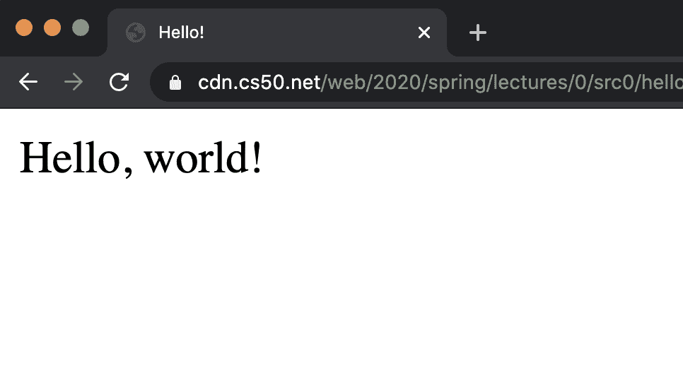

+   现在，让我们花一些时间来谈谈我们刚刚编写的文件，它对于一个如此简单的页面来说似乎相当复杂。

    +   在第一行，我们正在声明（对浏览器来说）我们正在使用 HTML 的最新版本：HTML5。

    +   之后，页面由嵌套的**HTML 元素**（如`html`和`body`）组成，每个元素都有一个**开始和结束标签**，分别用`<element>`表示开始和`</element>`表示结束。

    +   注意到每个内部元素都比上一个元素缩进得更深一些。虽然浏览器不一定要求这样做，但这在您的代码中保持这种缩进将非常有帮助。

    +   HTML 元素可以包括**属性**，这些属性为浏览器提供了关于元素的额外信息。例如，当我们把`lang="en"`包含在我们的初始标签中时，我们是在告诉浏览器我们正在使用英语作为我们的主要语言。

    +   在 HTML 元素内部，我们通常希望包含一个`head`标签和一个`body`标签。`head`标签将包含关于您页面的信息，这些信息不一定显示，而`body`标签将包含访问网站的用户实际看到的内容。

    +   在`head`内部，我们为我们的网页添加了一个`title`，您会注意到它显示在浏览器顶部的标签上。

    +   最后，我们在主体中包含了文本“Hello, world!”，这是页面的可见部分。

### 文档对象模型 (DOM)

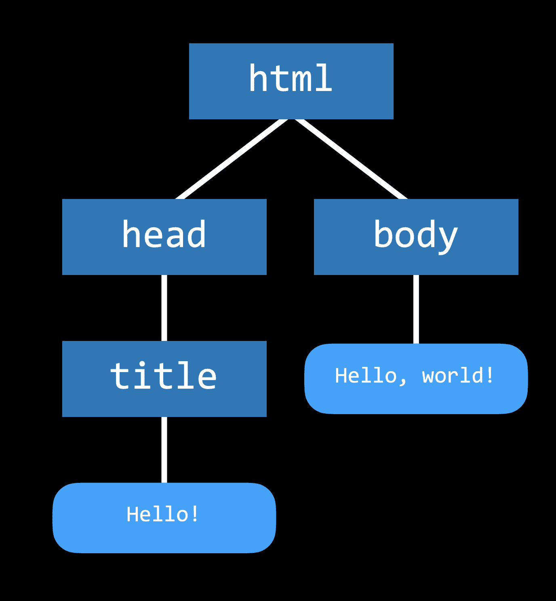

+   DOM 是一种方便的方式来使用树状结构可视化 HTML 元素之间的关系。上面是我们刚刚编写的页面的 DOM 布局示例。

### 更多 HTML 元素

+   您可能想要使用许多 HTML 元素来自定义您的页面，包括标题、列表和加粗部分。在接下来的示例中，我们将看到其中的一些实际应用。

+   另一点需要注意的是：`<!-- -->`在 HTML 中提供了注释，因此我们将在下面使用它来解释一些元素。

```
<!DOCTYPE html>
<html lang="en">
    <head>
        <title>HTML Elements</title>
    </head>
    <body>
        <!-- We can create headings using h1 through h6 as tags. -->
        <h1>A Large Heading</h1>
        <h2>A Smaller Heading</h2>
        <h6>The Smallest Heading</h6>

        <!-- The strong and i tags give us bold and italics respectively. -->
        A <strong>bold</strong> word and an <i>italicized</i> word!

        <!-- We can link to another page (such as cs50's page) using a. -->
        View the <a href="https://cs50.harvard.edu/">CS50 Website</a>!

        <!-- We used ul for an unordered list and ol for an ordered one. both ordered and unordered lists contain li, or list items. -->
        An unordered list:
        <ul>
            <li>foo</li>
            <li>bar</li>
            <li>baz</li>
        </ul>
        An ordered list:
        <ol>
            <li>foo</li>
            <li>bar</li>
            <li>baz</li>
        </ol>

        <!-- Images require a src attribute, which can be either the path to a file on your computer or the link to an image online. It also includes an alt attribute, which gives a description in case the image can't be loaded. -->
        An image:
        
        <!-- We can also see above that for some elements that don't contain other ones, closing tags are not necessary. -->

        <!-- Here, we use a br tag to add white space to the page. -->
        <br/> <br/>

        <!-- A few different tags are necessary to create a table. -->
        <table>
            <thead>
                <th>Ocean</th>
                <th>Average Depth</th>
                <th>Maximum Depth</th>
            </thead>
            <tbody>
                <tr>
                    <td>Pacific</td>
                    <td>4280 m</td>
                    <td>10911 m</td>
                </tr>
                <tr>
                    <td>Atlantic</td>
                    <td>3646 m</td>
                    <td>8486 m</td>
                </tr>
            </tbody>
        </table>
    </body>
<html> 
```

当这个页面渲染时，看起来就像这样：

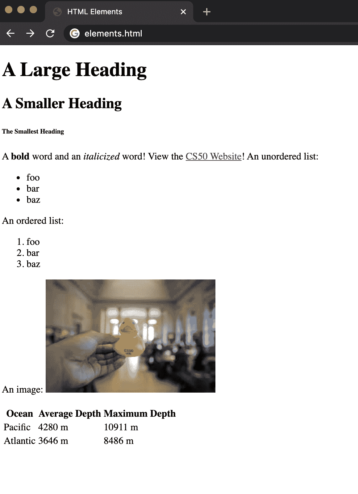

+   如果您对此感到担忧，请知道您永远不需要记住这些元素。简单地搜索“HTML 中的图片”就能找到`img`标签，这非常容易。学习这些元素的一个特别有用的资源是[W3 Schools](https://www.w3schools.com/html/html_elements.asp)。

### 表单

+   在创建网站时，另一组非常重要的元素是如何从用户那里收集信息。您可以使用 HTML 表单允许用户输入信息，该表单可以包含几种不同类型的输入。在课程的后期，我们将学习如何处理表单提交后的信息。

+   正如其他 HTML 元素一样，您不需要记住这些，W3 Schools 是学习这些元素的一个很好的资源！

```
<!DOCTYPE html>
<html lang="en">
<head>
    <title>Forms</title>
</head>
<body>
    <form>
        <input type="text" placeholder="First Name" name="first">
        <input type="password" placeholder="Password" name="password">
        <div>
            Favorite Color:
            <input name="color" type="radio" value="blue"> Blue
            <input name="color" type="radio" value="green"> Green
            <input name="color" type="radio" value="yellow"> Yellow
            <input name="color" type="radio" value="red"> Red

        </div>
        <input type="submit">
    </form>
</body>
</html> 
```

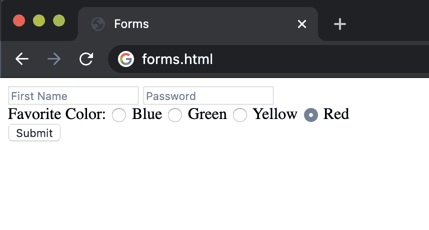

## CSS（层叠样式表）

+   CSS 用于自定义网站的样式。

+   在我们刚开始的时候，我们可以向任何 HTML 元素添加一个 style 属性，以便将其应用于一些 CSS。

+   我们通过改变元素的 CSS 属性来更改样式，例如写`color: blue`或`text-align: center`。

+   在下面的示例中，我们对我们的第一个文件进行了一些微小的修改，以使其标题更加多彩：

```
<!DOCTYPE html>
<html lang="en">
    <head>
        <title>Hello!</title>
    </head>
    <body>
        <h1 style="color: blue; text-align: center;">A Colorful Heading!</h1>
        Hello, world!
    </body>
<html> 
```

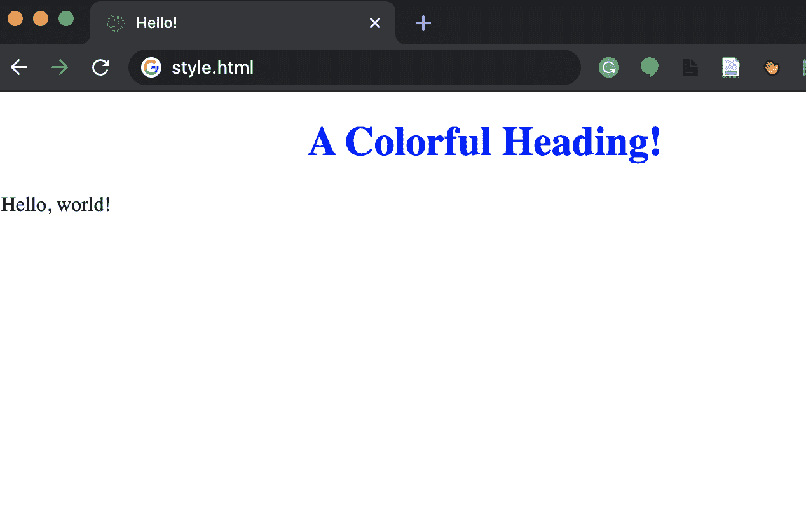

+   如果我们为一个外部元素进行样式设置，所有内部元素将自动采用该样式。如果我们把刚才应用在标题标签上的样式移动到`body`标签上，我们就可以看到这一点：

```
<!DOCTYPE html>
<html lang="en">
    <head>
        <title>Hello!</title>
    </head>
    <body style="color: blue; text-align: center;">
        <h1 >A Colorful Heading!</h1>
        Hello, world!
    </body>
<html> 
```

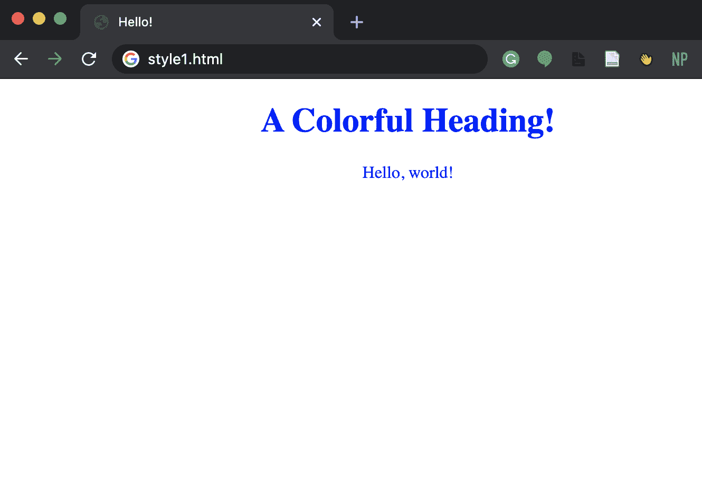

+   虽然我们可以像上面那样为我们的网页进行样式设置，但要实现更好的设计，我们应该能够将样式从单个行中移除。

    +   一种方法是在`head`中的`<style>`标签之间添加你的样式。在这些标签内部，我们写上我们想要样式的元素类型以及我们希望应用给它们的样式。例如：

    ```
     <html lang="en">
      <!DOCTYPE html>
      <head>
          <title>Hello!</title>
          <style>
              h1 {
                  color: blue;
                  text-align: center;
              }
          </style>
      </head>
      <body>
          <h1 >A Colorful Heading!</h1>
          Hello, world!
      </body>
      </html> 
    ```

    +   另一种方法是在`head`中包含一个指向包含一些样式的`styles.css`文件的`<link>`元素。这意味着 HTML 文件将看起来像这样：

    ```
     <html lang="en">
      <!DOCTYPE html>
      <head>
          <title>Hello!</title>
          <link rel="stylesheet" href="styles.css">
      </head>
      <body>
          <h1 >A Colorful Heading!</h1>
          Hello, world!
      </body>
      </html> 
    ```

    我们名为`styles.css`的文件将看起来像这样：

    ```
     h1 {
          color: blue;
          text-align: center;
      } 
    ```

+   这里的 CSS 属性太多，无法一一介绍，但就像 HTML 元素一样，通常很容易在 Google 上搜索类似“将字体改为蓝色 CSS”的内容来获取结果。其中一些最常见的是：

    +   `color`: 文本的颜色

    +   `text-align`: 元素在页面上的放置位置

    +   `background-color`: 可以设置为任何颜色

    +   `width`: 以像素或页面百分比为单位

    +   `height`: 以像素或页面百分比为单位

    +   `padding`: 在元素内部应留出多少空间

    +   `margin`: 在元素外部应留出多少空间

    +   `font-family`: 页面上文本的字体类型

    +   `font-size`: 以像素为单位

    +   `border`: 大小、类型（实线、虚线等）和颜色

+   让我们利用我们刚刚学到的知识来改进上面的海洋表格。以下是一些 HTML 代码作为起点：

```
<!DOCTYPE html>
<html lang="en">
    <head>
        <title>Nicer Table</title>
    </head>
    <body>
        <table>
            <thead>
                <th>Ocean</th>
                <th>Average Depth</th>
                <th>Maximum Depth</th>
            </thead>
            <tbody>
                <tr>
                    <td>Pacific</td>
                    <td>4280 m</td>
                    <td>10911 m</td>
                </tr>
                <tr>
                    <td>Atlantic</td>
                    <td>3646 m</td>
                    <td>8486 m</td>
                </tr>
            </tbody>
        </table>
    </body>
<html> 
```

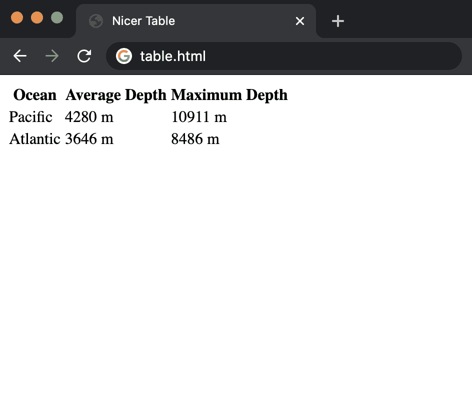

+   上面看起来和之前我们有的很相似，但现在，通过在头部元素中包含一个`style`标签或一个指向样式表的`link`，我们添加以下 CSS：

```
table {
    border: 1px solid black;
    border-collapse: collapse;
}

td {
    border: 1px solid black;
    padding: 2px;
}

th {
    border: 1px solid black;
    padding: 2px;
} 
```

这使我们得到了这个看起来更漂亮的表格：

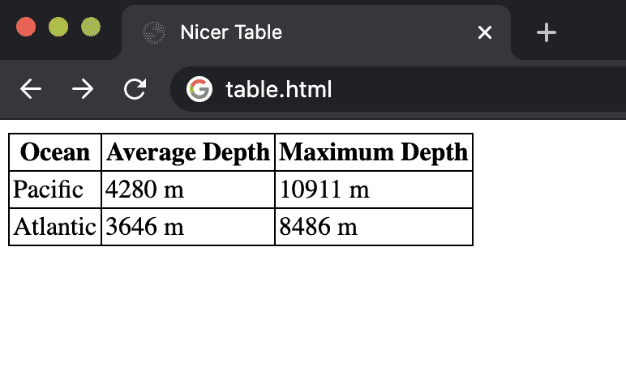

+   你可能已经想到了，我们当前的 CSS 中存在一些不必要的重复，因为`td`和`th`具有相同的样式。我们可以（并且应该）将其压缩为以下代码，使用逗号来表示样式应应用于多个元素类型。

```
table {
    border: 1px solid black;
    border-collapse: collapse;
}

td, th {
    border: 1px solid black;
    padding: 2px;
} 
```

+   这是对所谓的[CSS 选择器](https://www.w3schools.com/cssref/css_selectors.asp)的良好介绍。有许多方法可以确定你正在样式的 HTML 元素，其中一些我们将在下面提到：

    +   **元素类型**：这是我们迄今为止一直在做的事情：为相同类型的所有元素进行样式设置。

    +   **ID**: 另一个选择是给我们的 HTML 元素一个 ID，如下所示：`<h1 id="first-header">Hello!</h1>` 然后使用 `#first-header{...}` 通过使用井号来显示我们正在通过 ID 进行搜索。重要的是，没有两个元素可以有相同的 ID，并且没有元素可以有多个 ID。

    +   **类**: 这与 ID 类似，但类可以被多个元素共享，并且单个元素可以有多个类。我们像这样给 HTML 元素添加类：`<h1 class="page-text muted">Hello!</h1>`（注意我们只给元素添加了两个类：`page-text` 和 `muted`）。然后我们根据类使用点而不是井号进行样式化：`.muted {...}`

+   现在，我们还得处理可能冲突的 CSS 问题。当标题应该根据其类名是红色，但根据其 ID 是蓝色时会发生什么？CSS 有一个特定的顺序：

    1.  内联样式

    1.  id

    1.  class

    1.  元素类型

+   除了逗号用于多个选择器之外，还有几种其他方式可以指定您想要样式的元素。这个来自讲座的表格提供了一些，我们将在下面通过几个示例进行说明：

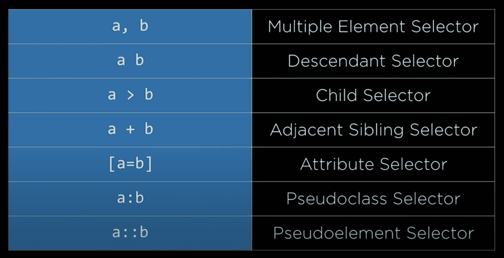

**后代选择器**: 在这里，我们使用后代选择器来仅对位于无序列表中的列表项应用样式：

```
<!DOCTYPE html>
<html lang="en">
    <head>
        <title>Using Selectors</title>
        <style>
            ul li {
                color: blue;
            }
        </style>
    </head>
    <body>
        <ol>
            <li>foo</li>
            <li> bar
                <ul>
                    <li>hello</li>
                    <li>goodbye</li>
                    <li>hello</li>
                </ul>
            </li>
            <li>baz</li>
        </ol>

    </body>
<html> 
```

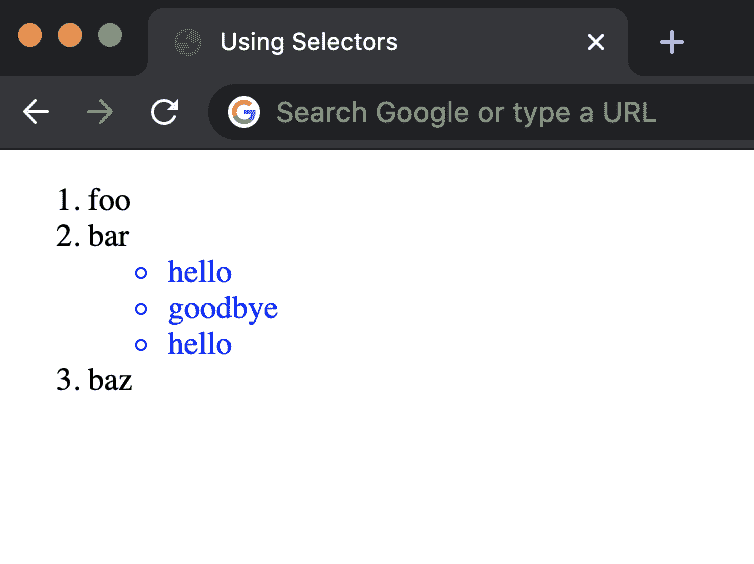

**属性作为选择器**: 我们还可以根据分配给 HTML 元素的属性来缩小我们的选择范围，使用方括号。例如，在以下链接列表中，我们选择仅使指向亚马逊的链接变红：

```
<!DOCTYPE html>
<html lang="en">
    <head>
        <title>Using Selectors</title>
        <style>
            a[href="https://www.amazon.com/"] {
                color: red;
            }
        </style>
    </head>
    <body>
        <ol>
            <li><a href="https://www.google.com/">Google</a></li>
            <li><a href="https://www.amazon.com/">Amazon</a> </li>
            <li><a href="https://www.facebook.com/">Facebook</a></li>
        </ol>

    </body>
<html> 
```

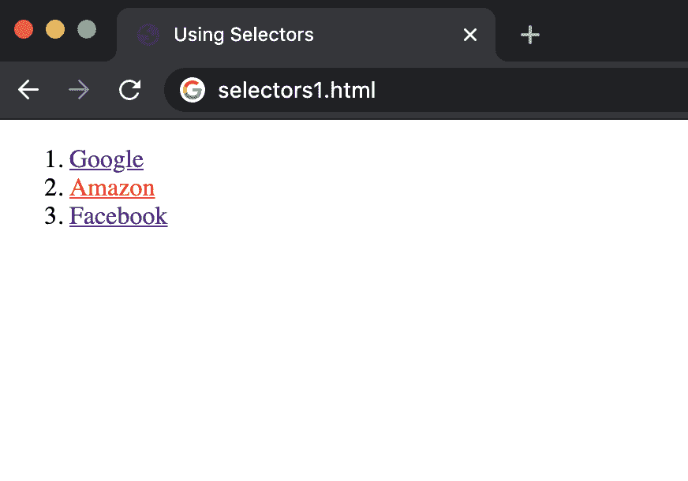

+   我们不仅可以使用 CSS 永久改变元素的外观，还可以改变其在特定条件下的外观。例如，如果我们想让按钮在鼠标悬停时改变颜色怎么办？我们可以通过使用[CSS 伪类](https://www.w3schools.com/css/css_pseudo_classes.asp)来实现这一点，它会在特殊情况下提供额外的样式。我们通过在选择器后添加冒号，然后在该冒号后添加情况来实现这一点。

+   在按钮的情况下，我们会在按钮选择器中添加 `:hover` 以指定仅在悬停时的设计：

```
<!DOCTYPE html>
<html lang="en">
    <head>
        <title>Pseudoclasses</title>
        <style>
            button {
                background-color: red;
                width: 200px;
                height: 50px;
                font-size: 24px;
            }

            button:hover {
                background-color: green;
            }
        </style>
    </head>
    <body>
        <button>Button 1</button>
        <button>Button 2</button>
        <button>Button 3</button>

    </body>
<html> 
```

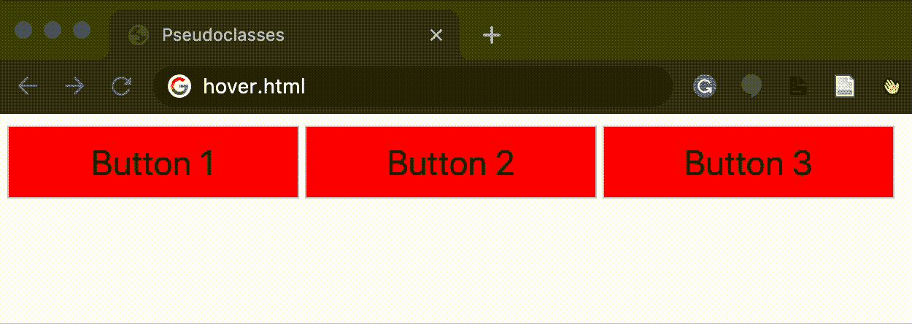

## **响应式设计**

+   现在，许多人使用除电脑以外的设备浏览网站，例如智能手机和平板电脑。确保您的网站对所有设备上的用户都是可读的非常重要。

+   我们可以通过了解**视口**来实现这一点。视口是屏幕上在任何给定时间内对用户实际可见的部分。默认情况下，许多网页假设视口在所有设备上都是相同的，这就是导致许多网站（尤其是较老的网站）在移动设备上难以交互的原因。

+   在移动设备上改善网站外观的一个简单方法是在我们 HTML 文件的头部添加以下行。这一行告诉移动设备使用一个与您使用的设备相同宽度的视口，而不是一个更大的视口。

```
<meta name="viewport" content="width=device-width, initial-scale=1.0"> 
```

+   另一种处理不同设备的方法是通过[媒体查询](https://www.w3schools.com/cssref/css3_pr_mediaquery.asp)。媒体查询是一种根据页面如何被查看来改变页面样式的方法。

+   以下是一个媒体查询的例子，让我们尝试在屏幕缩小到一定大小时简单地改变屏幕颜色。我们通过输入`@media`后跟括号中的查询类型来表示媒体查询：

```
<!DOCTYPE html>
<html lang="en">
    <head>
        <title>Screen Size</title>
        <style>
            @media (min-width: 600px) {
                body {
                    background-color: red;
                }
            }

            @media (max-width: 599px) {
                body {
                    background-color: blue;
                }
            }
        </style>
    </head>
    <body>
        <h1>Welcome to the page!</h1>
    </body>
</html> 
```

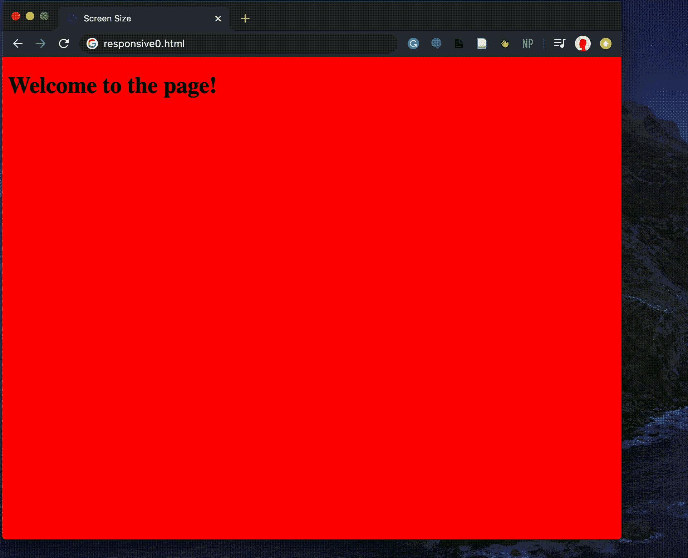

+   处理不同屏幕尺寸的另一种方法是使用一个新的 CSS 属性，称为[flexbox](https://www.w3schools.com/css/css3_flexbox.asp)。这允许我们在元素水平方向上不适应时轻松地将它们包裹到下一行。我们通过将所有元素放入一个我们称之为容器的`div`中来实现这一点。然后我们添加一些样式到这个`div`中，指定我们想要在其中的元素上使用 flexbox 显示。我们还添加了一些额外的样式到内部`div`中，以更好地说明这里发生的包裹。

```
<!DOCTYPE html>
<html lang="en">
    <head>
        <title>Screen Size</title>
        <style>
            #container {
                display: flex;
                flex-wrap: wrap;
            }

            #container > div {
                background-color: green;
                font-size: 20px;
                margin: 20px;
                padding: 20px;
                width: 200px;
            }
        </style>
    </head>
    <body>
        <div id="container">
            <div>Some text 1!</div>
            <div>Some text 2!</div>
            <div>Some text 3!</div>
            <div>Some text 4!</div>
            <div>Some text 5!</div>
            <div>Some text 6!</div>
            <div>Some text 7!</div>
            <div>Some text 8!</div>
            <div>Some text 9!</div>
            <div>Some text 10!</div>
            <div>Some text 11!</div>
            <div>Some text 12!</div>
        </div>
    </body>
</html> 
```

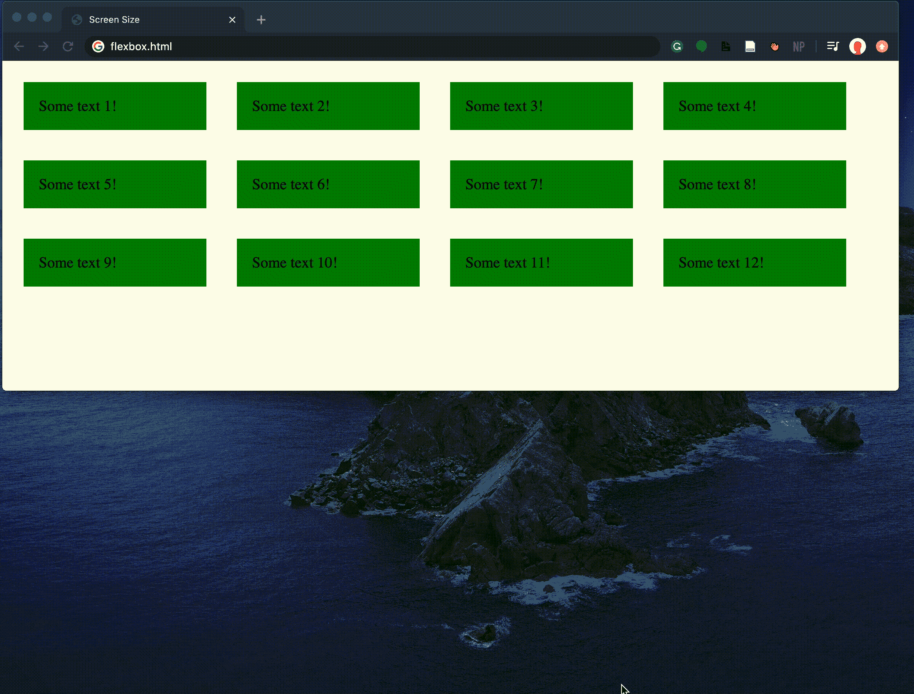

+   另一种流行的页面样式方法是使用 HTML [网格](https://www.w3schools.com/css/css_grid.asp)。在这个网格中，我们可以指定样式属性，如列宽和列与行之间的间隙，如下所示。注意，当我们指定列宽时，我们说第三个是`auto`，这意味着它应该填充页面的剩余部分。

```
<!DOCTYPE html>
<html lang="en">
    <head>
        <title>My Web Page!</title>
        <meta name="viewport" content="width=device-width, initial-scale=1.0">
        <style>
            .grid {
                background-color: green;
                display: grid;
                padding: 20px;
                grid-column-gap: 20px;
                grid-row-gap: 10px;
                grid-template-columns: 200px 200px auto;
            }

            .grid-item {
                background-color: white;
                font-size: 20px;
                padding: 20px;
                text-align: center;
            }
        </style>
    </head>
    <body>
        <div class="grid">
            <div class="grid-item">1</div>
            <div class="grid-item">2</div>
            <div class="grid-item">3</div>
            <div class="grid-item">4</div>
            <div class="grid-item">5</div>
            <div class="grid-item">6</div>
            <div class="grid-item">7</div>
            <div class="grid-item">8</div>
            <div class="grid-item">9</div>
            <div class="grid-item">10</div>
            <div class="grid-item">11</div>
            <div class="grid-item">12</div>
        </div>
    </body>
</html> 
```

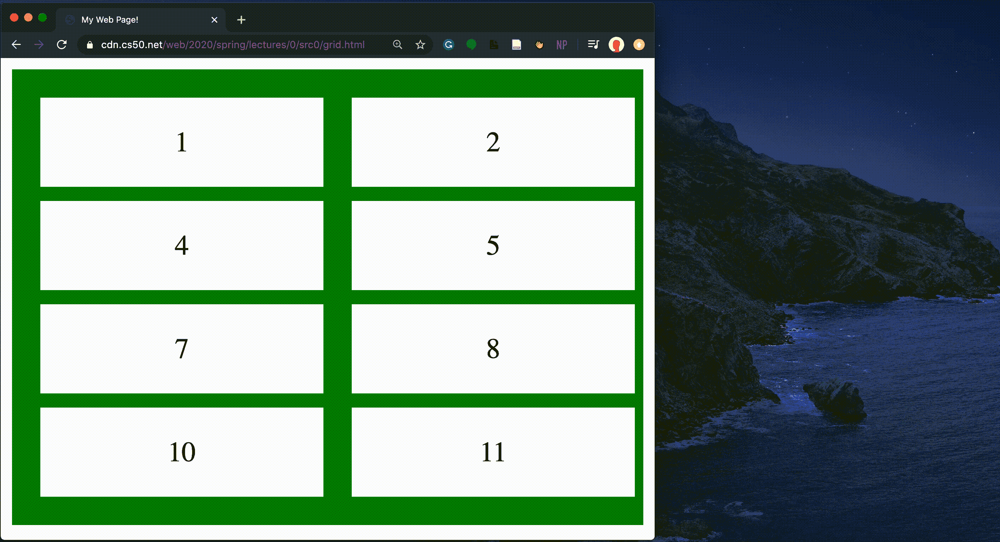

## Bootstrap

+   结果表明，有许多库是其他人已经编写的，可以使网页的样式化更加简单。在本课程中，我们将使用的一个流行库被称为[bootstrap](https://getbootstrap.com/)。

+   我们可以通过在 HTML 文件的头部添加一行来将 Bootstrap 包含到我们的代码中：

```
<link rel="stylesheet" href="https://stackpath.bootstrapcdn.com/bootstrap/4.5.0/css/bootstrap.min.css" integrity="sha384-9aIt2nRpC12Uk9gS9baDl411NQApFmC26EwAOH8WgZl5MYYxFfc+NcPb1dKGj7Sk" crossorigin="anonymous"> 
```

+   接下来，我们可以通过导航到他们网站的[文档](https://getbootstrap.com/docs/4.5/components/)部分来查看一些 Bootstrap 的特性。在这个页面上，你会找到许多可以添加到元素上的类，这些类允许使用 Bootstrap 进行样式化。

+   Bootstrap 的一个流行特性是它们的[网格系统](https://getbootstrap.com/docs/4.0/layout/grid/)。Bootstrap 自动将页面分成 12 列，我们可以通过添加类`col-x`（其中`x`是 1 到 12 之间的数字）来决定一个元素占用多少列。例如，在以下页面中，我们有一行等宽的列，然后是一行中间的列更宽：

```
<!DOCTYPE html>
<html lang="en">
    <head>
        <title>My Web Page!</title>
        <link rel="stylesheet" href="https://stackpath.bootstrapcdn.com/bootstrap/4.4.1/css/bootstrap.min.css" integrity="sha384-Vkoo8x4CGsO3+Hhxv8T/Q5PaXtkKtu6ug5TOeNV6gBiFeWPGFN9MuhOf23Q9Ifjh" crossorigin="anonymous">
        <style>
            .row > div {
                padding: 20px;
                background-color: teal;
                border: 2px solid black;
            }
        </style>
    </head>
    <body>
        <div class="container">
            <div class="row">
                <div class="col-4">
                    This is a section.
                </div>
                <div class="col-4">
                    This is another section.
                </div>
                <div class="col-4">
                    This is a third section.
                </div>
            </div>
        </div>
        <br/>
        <div class="container">
            <div class="row">
                <div class="col-3">
                    This is a section.
                </div>
                <div class="col-6">
                    This is another section.
                </div>
                <div class="col-3">
                    This is a third section.
                </div>
            </div>
        </div>
    </body>
</html> 
```

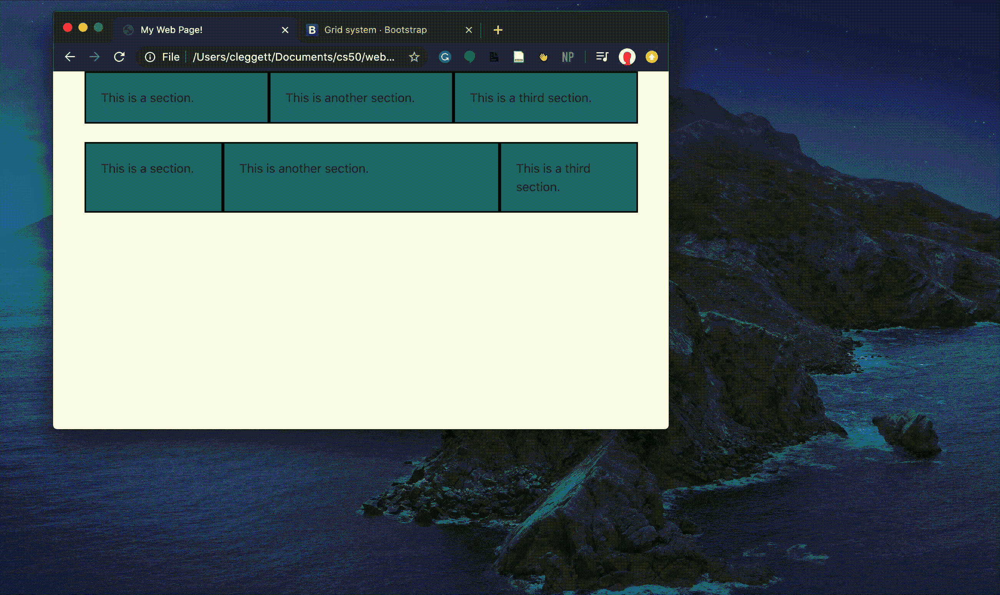

+   为了提高移动端的响应性，Bootstrap 还允许我们根据屏幕大小指定不同的列宽。在下面的示例中，我们使用 `col-lg-3` 来表示在大型屏幕上元素应占用 3 列，而 `col-sm-6` 表示在屏幕较小时元素应占用 6 列：

```
<!DOCTYPE html>
<html lang="en">
    <head>
        <title>My Web Page!</title>
        <link rel="stylesheet" href="https://stackpath.bootstrapcdn.com/bootstrap/4.4.1/css/bootstrap.min.css" integrity="sha384-Vkoo8x4CGsO3+Hhxv8T/Q5PaXtkKtu6ug5TOeNV6gBiFeWPGFN9MuhOf23Q9Ifjh" crossorigin="anonymous">
        <style>
            .row > div {
                padding: 20px;
                background-color: teal;
                border: 2px solid black;
            }
        </style>
    </head>
    <body>
        <div class="container">
            <div class="row">
                <div class="col-lg-3 col-sm-6">
                    This is a section.
                </div>
                <div class="col-lg-3 col-sm-6">
                    This is another section.
                </div>
                <div class="col-lg-3 col-sm-6">
                    This is a third section.
                </div>
                <div class="col-lg-3 col-sm-6">
                    This is a fourth section.
                </div>
            </div>
        </div>
    </body>
</html> 
```

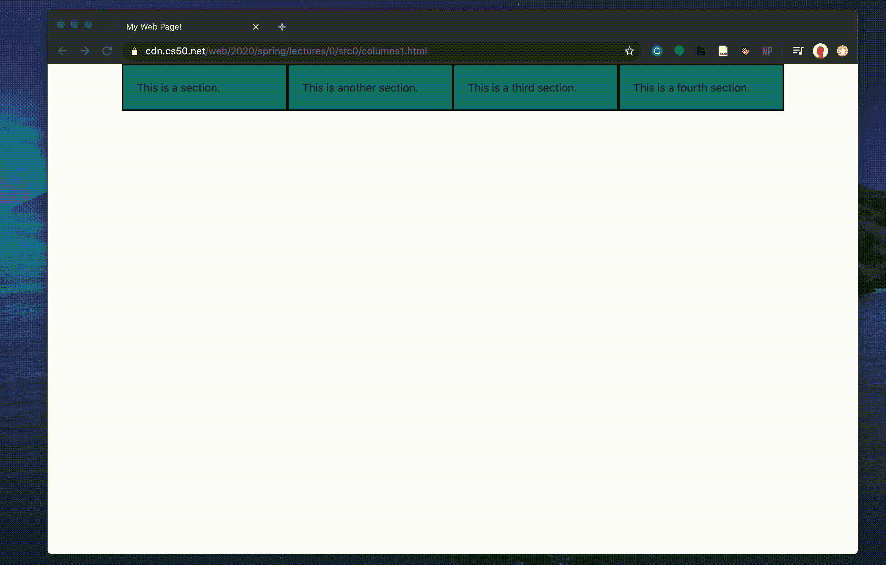

## Sass（Syntactically Awesome Style Sheets）

+   到目前为止，我们已经找到了几种消除 CSS 中冗余的方法，例如将其移动到单独的文件或使用 Bootstrap，但仍有一些地方我们可以进行改进。例如，如果我们想让几个元素有不同的样式，但所有元素的颜色都相同，怎么办？如果我们后来决定要更改颜色，那么我们就需要在几个不同的元素中更改它。

+   [Sass](https://sass-lang.com/) 是一种语言，它以多种方式使我们能够更有效地编写 CSS，其中之一就是允许我们使用变量，如下面的示例所示。

+   当使用 Sass 编写代码时，我们创建一个扩展名为 `filename.scss` 的新文件。在这个文件中，我们可以通过在名称前添加一个 `$` 符号，然后是一个冒号，再然后是一个值来创建一个新的变量。例如，我们可以写 `$color: red` 来设置变量 `color` 的值为红色。然后我们使用 `$color` 来访问这个变量。以下是我们 `variables.scss` 文件的一个示例：

```
$color: red;

ul {
    font-size: 14px;
    color: $color;
}

ol {
    font-size: 18px;
    color: $color;
} 
```

+   现在，为了将这种样式链接到我们的 HTML 文件，我们不能只是链接到 `.scss` 文件，因为大多数网络浏览器只识别 `.css` 文件。为了解决这个问题，我们必须在我们的计算机上下载一个名为 Sass 的程序。[下载 Sass](https://sass-lang.com/install)。然后，在我们的终端中，我们输入 `sass variables.scss:variables.css` 命令。这个命令会将名为 `variables.scss` 的 .scss 文件编译成名为 `variables.css` 的 .css 文件，你可以在你的 HTML 页面中添加对该文件的链接。

+   为了加快这个流程，我们可以使用命令 `sass --watch variables.scss:variables.css`，这个命令会在检测到 `.scss` 文件中的更改时自动更改 `.css` 文件。

+   在使用 Sass 的同时，我们还可以物理地嵌套我们的样式，而不是使用我们之前提到的 CSS 选择器。例如，如果我们只想将一些样式应用于 div 中的段落和无序列表，我们可以编写以下代码：

```
div {
    font-size: 18px;

    p {
        color: blue;
    }

    ul {
        color: green;
    }
} 
```

一旦编译成 CSS，我们就会得到一个看起来像这样的文件：

```
div {
    font-size: 18px;
}

div p {
    color: blue;
}

div ul {
    color: green;
} 
```

+   Sass 给我们的另一个特性被称为 [继承](https://sass-lang.com/guide)。这允许我们创建一组基本的样式，可以被多个不同的元素共享。我们通过在类名前添加一个 `%` 符号，添加一些样式，然后在某些样式的开头添加一行 `@extend %classname` 来实现这一点。例如，以下代码将 `message` 类内的样式应用于下面的每个不同类，从而生成一个看起来像下面的网页。

```
%message {
    font-family: sans-serif;
    font-size: 18px;
    font-weight: bold;
    border: 1px solid black;
    padding: 20px;
    margin: 20px;
}

.success {
    @extend %message;
    background-color: green;
}

.warning {
    @extend %message;
    background-color: orange;
}

.error {
    @extend %message;
    background-color: red;
} 
```

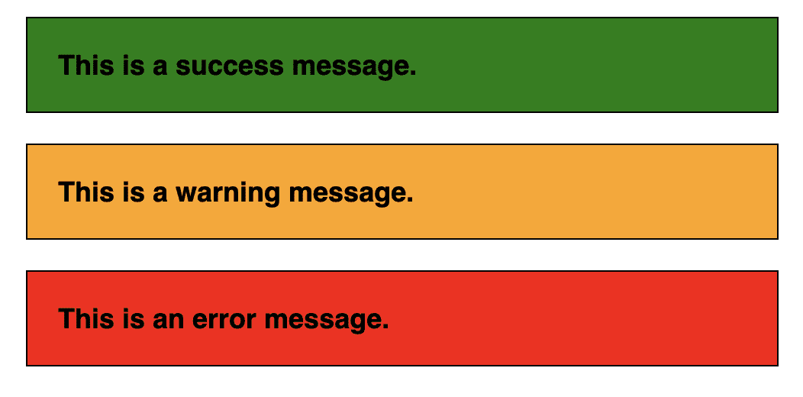

+   今天的内容就到这里了！
