# 第 1 讲

> 原文：[`cs50.harvard.edu/web/notes/1/`](https://cs50.harvard.edu/web/notes/1/)

+   介绍

+   Git

+   GitHub

+   提交

+   合并冲突

+   分支

    +   更多 GitHub 功能

## 介绍

欢迎回到第 1 讲！在第 0 讲中，我们介绍了 HTML、CSS 和 Sass 作为我们可以用来创建一些基本网页的工具。今天，我们将学习如何使用 Git 和 GitHub 来帮助我们开发网络编程应用。

## Git

+   [Git](https://git-scm.com/) 是一个命令行工具，它将以多种方式帮助我们进行版本控制：

    +   允许我们通过在特定时间点保存代码的快照来跟踪我们对代码所做的更改。

    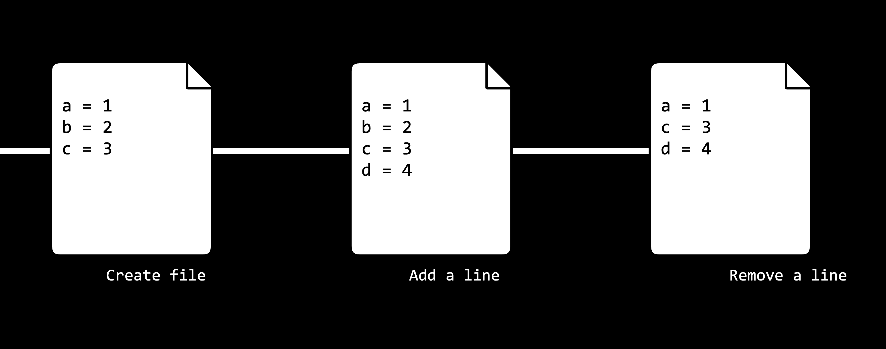

    +   允许我们通过允许多个人从存储在网上的仓库中拉取信息和向仓库推送信息，轻松地在不同的人之间同步代码。

    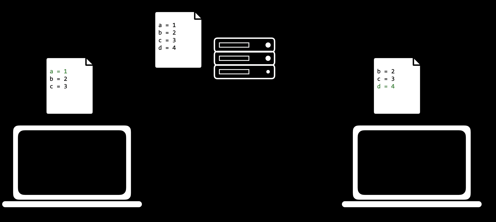

    +   允许我们在不影响主代码库的情况下，在不同的 *分支* 上进行代码更改和测试，然后将两个分支合并在一起。

    +   允许我们在意识到我们犯了一个错误后，将代码回滚到之前的版本。

+   在上述解释中，我们使用了“仓库”这个词，我们还没有解释过。Git 仓库是一个文件位置，我们将存储与特定项目相关的所有文件。这些可以是远程的（存储在线上）或本地的（存储在你的电脑上）。

## GitHub

+   [GitHub](https://www.github.com) 是一个网站，允许我们在网上远程存储 Git 仓库。

+   让我们从创建一个在线新仓库开始

    1.  确保你已经设置了 GitHub 账户。如果你还没有，你可以在 [这里](https://github.com/join?ref_cta=Sign+up&ref_loc=header+logged+out&ref_page=%2F&source=header-home) 创建一个。

    1.  点击右上角的 **+** 按钮，然后点击“新建仓库”

    1.  创建一个描述你项目的仓库名称

    1.  （可选）为你的仓库提供描述

    1.  选择仓库应该是公开的（对任何在网络上的人可见）还是私有的（仅对你和你特别授权的人可见）

    1.  （可选）决定你是否想添加一个 README 文件，这是一个描述你的新仓库的文件。

    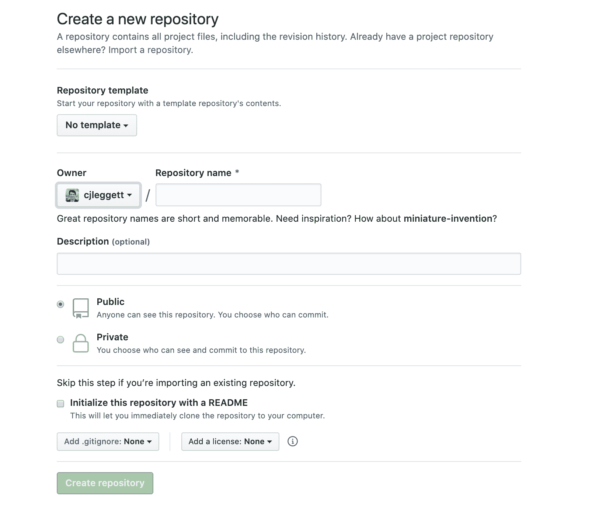

+   一旦我们有了仓库，我们可能还想向其中添加一些文件。为了做到这一点，我们将创建一个新的 *远程* 仓库的副本，或者克隆，将其作为我们电脑上的 *本地* 仓库。

    1.  通过在终端中输入 `git` 来确保你的电脑上已安装 git。如果没有安装，你可以从这里下载它 [这里](https://git-scm.com/downloads)。

    1.  点击你仓库页面上的绿色“克隆或下载”按钮，并复制弹出的 url。如果你没有创建一个 README，这个链接将出现在页面顶部的“快速设置”部分。

        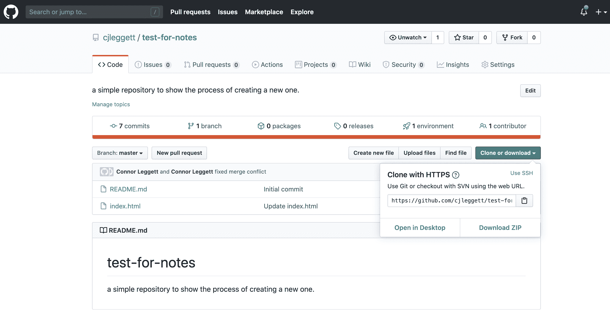

    1.  在你的终端中，运行 `git clone <repository url>`。这将把仓库下载到你的电脑上。如果你没有创建一个 README 文件，你会收到警告：`You appear to have cloned into an empty repository.` 这是正常的，无需为此担心。

        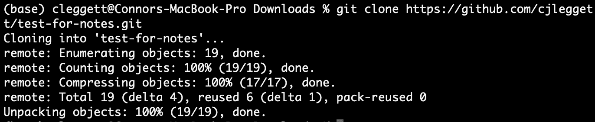

    1.  运行 `ls`，这是一个列出你当前目录中所有文件和文件夹的命令。你应该能看到你刚刚克隆的仓库的名称。

    1.  运行 `cd <repository name>` 来更改目录到那个文件夹。

    1.  运行 `touch <new file name>` 在该文件夹中创建一个新文件。你现在可以编辑该文件。或者，你也可以在你的文本编辑器中打开该文件夹并手动添加新文件。

    1.  现在，为了让 Git 知道它应该跟踪你新创建的文件，运行 `git add <new file name>` 来跟踪那个特定的文件，或者运行 `git add .` 来跟踪该目录下的所有文件。

        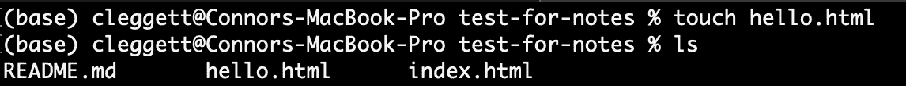

## 提交

+   现在，我们将开始了解 Git 真正有用的功能。在修改一个文件后，我们可以 *提交* 这些更改，对代码的当前状态进行快照。为此，我们运行：`git commit -m "some message"`，其中消息描述了你刚刚所做的更改。

+   在此更改之后，我们可以运行 `git status` 来查看我们的代码与远程仓库上的代码如何比较。

+   当我们准备好将本地提交发布到 GitHub 时，我们可以运行 `git push`。现在，当我们用网络浏览器访问 GitHub 时，我们的更改将会反映出来。

+   如果你只修改了现有文件而没有创建新文件，我们不需要使用 `git add .` 然后执行 `git commit...`，我们可以将这压缩成一个命令：`git commit -am "some message"`。这个命令将提交你做的所有更改。

+   有时候，GitHub 上的远程仓库可能比本地版本更新。在这种情况下，你首先需要提交任何更改，然后运行 `git pull` 将任何远程更改拉到你的仓库中。

## 合并冲突

+   当使用 Git 工作时，特别是当你与其他人协作时，可能会出现一个称为 **合并冲突** 的问题。合并冲突发生在两个人试图以相互冲突的方式更改文件时。

+   这通常发生在你执行 `git push` 或 `git pull` 时。当这种情况发生时，Git 会自动将文件转换为一种格式，清楚地说明冲突是什么。以下是一个示例，其中相同的行以两种不同的方式被添加：

```
a = 1
<<<<< HEAD
b = 2
=====
b = 3
>>>>> 56782736387980937883
c = 3
d = 4
e = 5 
```

+   在上面的例子中，你添加了 `b = 2` 这一行，而另一个人写下了 `b = 3`，现在我们必须选择其中一个来保留。这个长数字是一个 *哈希*，它代表与你的编辑冲突的提交。许多文本编辑器也会提供高亮显示和简单的选项，例如“接受当前”或“接受传入”，这可以节省你删除上面添加的行的时间。

+   另一个可能很有用的 git 命令是 `git log`，它为你提供了在该仓库上所有提交的历史记录。

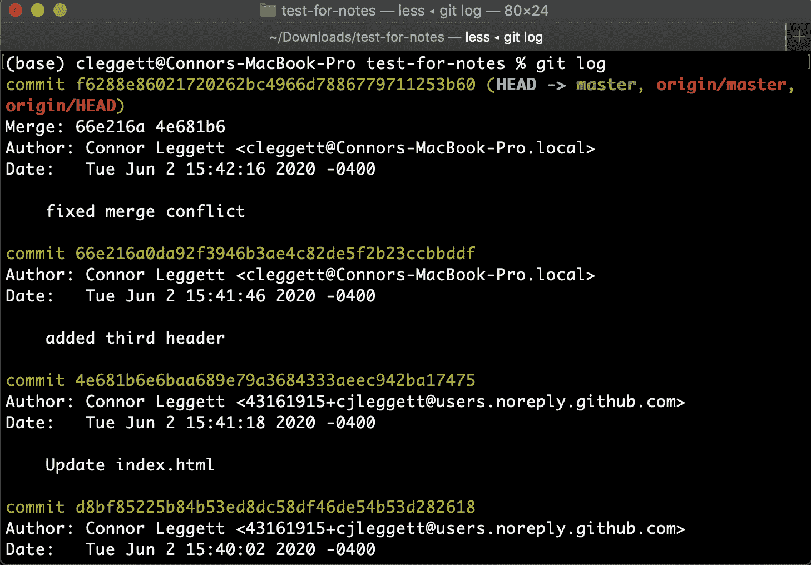

+   如果你意识到你犯了一个错误，你可以使用命令 `git reset` 以两种方式之一回滚到之前的提交：

    +   `git reset --hard <commit>` 将你的代码回滚到指定提交后的确切状态。要指定提交，请使用与提交关联的提交哈希，这可以通过如上所示的 `git log` 查找。

    +   `git reset --hard origin/master` 将你的代码回滚到目前在 Github 上存储的版本。

## 分支

在你为一个项目工作了一段时间之后，你可能决定想要添加一个额外的功能。目前，我们可能只是像下面图形所示那样提交这个新功能的更改。

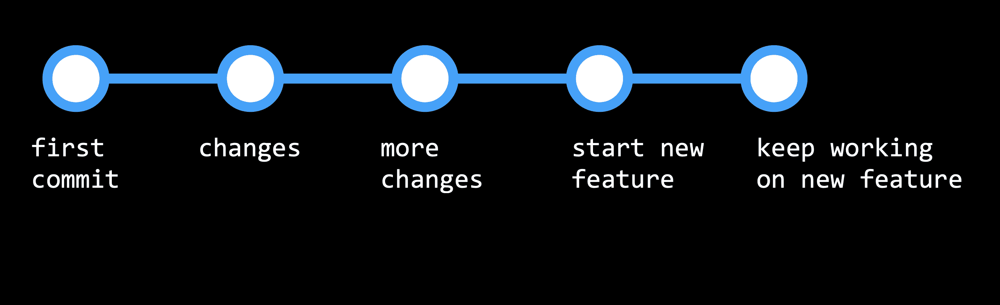

但如果我们随后发现原始代码中有一个错误，并想要回滚而不更改新功能，这可能会变得有问题。这就是分支变得非常有用的地方。

+   分支是在创建新功能时转向新方向的一种方法，一旦完成，只将这个新功能与你的代码的主要部分或主分支结合起来。这个工作流程看起来更像是下面的图形：

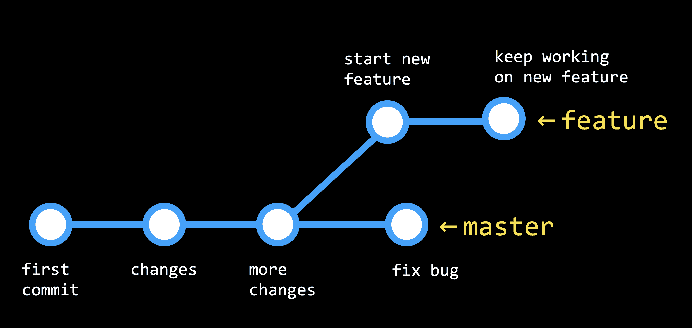

+   你目前正在查看的分支是由 `HEAD` 决定的，它指向两个分支中的一个。默认情况下，`HEAD` 指向主分支，但我们可以检出其他分支。

+   现在，让我们深入了解如何在我们的 git 仓库中实际实现分支：

    1.  运行 `git branch` 来查看你目前正在工作的分支，它在其名称左侧会有一个星号。

    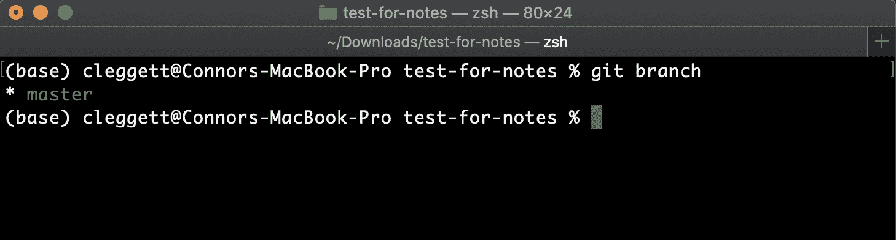

    1.  要创建一个新分支，我们将运行 `git checkout -b <新分支名称>`

    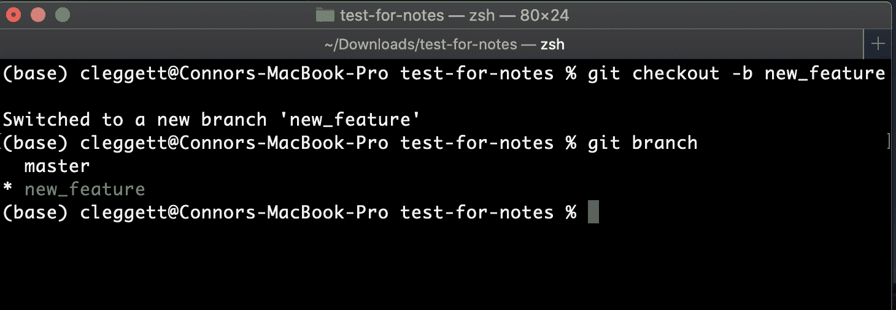

    1.  使用命令 `git checkout <分支名称>` 在分支之间切换，并对每个分支提交任何更改。

    1.  当我们准备好合并两个分支时，我们将检出我们希望保留的分支（几乎总是主分支），然后运行命令 `git merge <其他分支名称>`。这将被处理得类似于推送或拉取，并且可能会出现合并冲突。

### 更多 GitHub 功能

有一些特定于 GitHub 的有用功能，可以在你工作在项目时提供帮助：

+   **Forking**：作为一个 GitHub 用户，你有权限“Fork”任何你能够访问的仓库，这将创建一个属于你的仓库的副本。我们通过点击右上角的“Fork”按钮来完成这个操作。

+   **Pull Requests**：一旦你 fork 了一个仓库并对你的版本进行了更改，你可能希望请求将这些更改添加到仓库的主版本中。例如，如果你想向 Bootstrap 添加一个新功能，你可以 fork 仓库，进行一些更改，然后提交一个 pull request。这个 pull request 然后可以被 Bootstrap 仓库的管理人员评估，并可能被接受。人们进行一些编辑然后请求将它们合并到主仓库的过程对于所谓的“开源软件”至关重要，或者说是由多个开发者的贡献创建的软件。

+   **GitHub Pages**：GitHub Pages 是一种简单的方式来将静态站点发布到网络上。（我们稍后会学习静态站点与动态站点的区别。）为了做到这一点：

    1.  创建一个新的 GitHub 仓库。

    1.  克隆仓库并在本地进行更改，确保包含一个 `index.html` 文件，这将是你网站的着陆页。

    1.  将这些更改推送到 GitHub。

    1.  导航到你的仓库的设置页面，滚动到 GitHub Pages，并在下拉菜单中选择 master 分支。

    1.  滚动到设置页面中的 GitHub Pages 部分，几分钟后，你应该会看到一个通知，显示“您的站点已发布在：…”，包括一个你可以找到你站点的 URL！

这节课的内容就到这里！下次，我们将探讨 Python！
