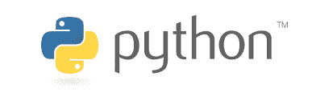
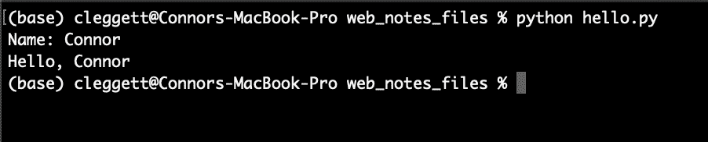
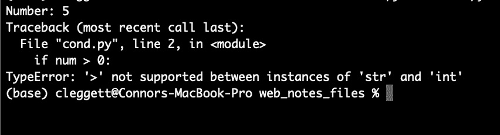
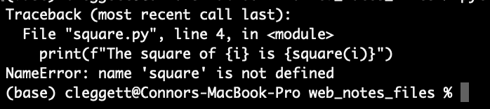
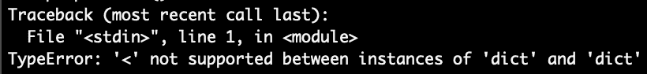
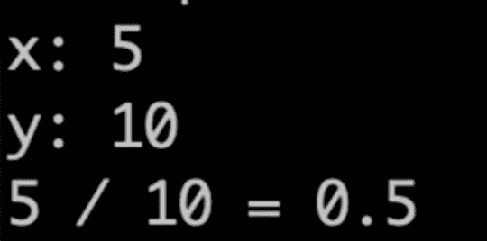
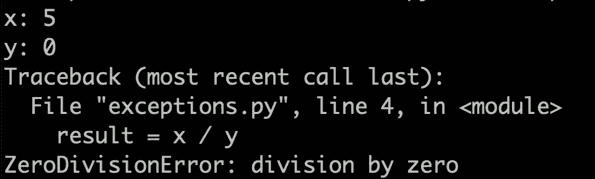
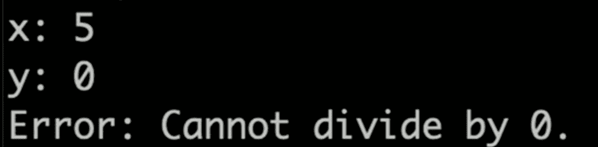
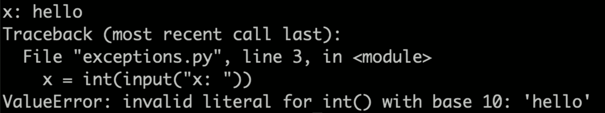

# 讲座 2

> 原文：[`cs50.harvard.edu/web/notes/2/`](https://cs50.harvard.edu/web/notes/2/)

+   简介

+   Python

+   变量

+   字符串格式化

+   条件

+   序列

    +   字符串

    +   列表

    +   元组

    +   集合

    +   字典

    +   循环

+   函数

+   模块

+   面向对象编程

+   函数式编程

    +   装饰器

    +   Lambda 函数

+   异常

## 简介

+   到目前为止，我们已经讨论了如何使用 HTML 和 CSS 构建简单的网页，以及如何使用 Git 和 GitHub 来跟踪代码的更改并与他人协作。

+   今天，我们将深入探讨 Python，这是我们将在整个课程中使用的两种主要编程语言之一。

## Python

+   Python 是一种非常强大且广泛使用的语言，它将使我们能够快速构建相当复杂的网络应用程序。在本课程中，我们将使用 Python 3，尽管 Python 2 在某些地方仍在使用。在查看外部资源时，请务必确保它们使用的是同一版本。

+   让我们从许多编程语言开始的地方开始：Hello, world。这个用 Python 编写的程序看起来是这样的：

[PRE0]

+   要分解那行代码中发生的事情，Python 语言内置了一个名为`print`的**函数**，它接受括号中的**参数**，并在命令行上显示该参数。

+   要在实际的计算机上编写和运行此程序，你首先需要将此行输入你选择的文本编辑器中，然后将文件保存为`something.py`。接下来，你将前往终端，导航到包含你的文件的目录，并输入`python something.py`。在上面的程序中，单词“Hello, world!”将随后在终端中显示。

+   根据你的计算机配置，你可能需要在文件名前输入`python3`而不是`python`，如果你还没有安装 Python，你可能甚至需要[下载 Python](https://www.python.org/downloads/)。安装 Python 后，我们建议你还要[下载 Pip](https://pip.pypa.io/en/stable/installing/)，因为你在课程中稍后需要它。

+   当你在终端中输入`python file.py`时，一个名为**解释器**的程序（你与 Python 一起下载的）会逐行读取你的文件，并执行每一行代码。这与像**C**或**Java**这样的语言不同，这些语言在运行之前需要**编译**成机器代码。

## 变量

任何编程语言的关键部分都是创建和操作变量的能力。为了在 Python 中给变量赋值，其语法看起来像这样：

[PRE1]

每一行都将`=`右侧的值取出来，并存储在左侧的变量名中。

与某些其他编程语言不同，Python 变量类型是推断的，这意味着虽然每个变量都有一个类型，但我们创建变量时不必明确声明它是哪种类型。最常见的变量类型包括：

+   **int**: 一个整数

+   **float**: 一个十进制数

+   **str**: 一个字符串，或字符序列

+   **bool**: 一个值为`True`或`False`的值

+   **NoneType**: 表示没有值的一个特殊值（`None`）。

现在，我们将编写一个更有趣的程序，可以从用户那里获取输入并问候该用户。为此，我们将使用另一个内置函数`input`，它向用户显示一个提示，并返回用户提供的任何输入。例如，我们可以在名为`name.py`的文件中编写以下内容：

[PRE2]

当在终端上运行时，程序看起来是这样的：

在这里有一些要点需要指出：

+   在第一行中，我们不是将变量名赋给一个显式的值，而是将其赋给`input`函数返回的任何值。

+   在第二行中，我们使用`+`运算符来组合，或**连接**两个字符串。在 Python 中，`+`运算符可以用来加数字或连接字符串和列表。

## 格式化字符串

+   虽然我们可以使用`+`运算符来组合字符串，就像我们上面做的那样，但在 Python 的最新版本中，还有更简单的方法来处理字符串，称为[格式化字符串](https://realpython.com/python-f-strings/)，或简称为**f-字符串**。

+   要表示我们正在使用格式化字符串，我们只需在引号前添加一个`f`。例如，我们可以在`"Hello, " + name`的用法上写`f"Hello, {name}"`以获得相同的结果。我们甚至可以在这个字符串中插入一个函数，并将我们上面的程序转换为一行：

[PRE3]

## 条件

+   就像在其他编程语言中一样，Python 让我们能够根据不同的[条件](https://realpython.com/python-conditional-statements/)运行不同的代码段。例如，在下面的程序中，我们将根据用户输入的数字改变我们的输出：

[PRE4]

+   了解上述程序的工作原理，Python 中的条件语句包含一个关键字（`if`、`elif`或`else`），然后（除了`else`情况外）是一个布尔表达式，或者是一个评估为`True`或`False`的表达式。然后，我们想要在某个表达式为真时运行的代码将直接缩进在语句下方。缩进是 Python 语法的一部分。

+   然而，当我们运行这个程序时，我们会遇到一个[异常](https://docs.python.org/3/tutorial/errors.html)，看起来像这样：

+   当我们在运行 Python 代码时发生错误，异常就会发生，随着时间的推移，你会越来越擅长解释这些错误，这是一个非常有价值的技能。

+   让我们更仔细地看看这个特定的异常：如果我们看到底部，我们会看到我们遇到了一个`TypeError`，这通常意味着 Python 期望某个变量是某种类型，但发现它是另一种类型。在这种情况下，异常告诉我们我们不能使用`>`符号来比较一个`str`和一个`int`，然后在上面的代码行 2 中我们可以看到这个比较发生了。

+   在这种情况下，很明显`0`是一个整数，所以我们的`num`变量必须是字符串。这是因为`input`函数总是返回一个字符串，我们必须指定使用`int`函数将其转换为（或**强制类型转换**为）整数。这意味着我们的第一行现在看起来像这样：

[PRE5]

+   现在，程序将按我们预期的那样工作！

## 序列

Python 语言最强大的部分之一是它能够处理数据序列，而不仅仅是单个变量。

几种序列在某些方面相似，但在其他方面不同。在解释这些差异时，我们将使用术语**可变/不可变**和**有序/无序**。**可变**意味着一旦定义了一个序列，我们就可以改变该序列的各个元素，而**有序**意味着对象的顺序很重要。

### 字符串

**有序**: 是

**可变**: 否

我们已经稍微了解了一些字符串，但除了变量之外，我们可以将字符串视为字符序列。这意味着我们可以在字符串中访问单个元素！例如：

[PRE6]

打印出字符串中的第一个（或索引-0）字符，在这个例子中恰好是`H`，然后打印出第二个（或索引-1）字符，它是`a`。

### 列表

**有序**: 是

**可变**: 是

[Python 列表](https://www.w3schools.com/python/python_lists.asp)允许你存储任何变量类型。我们使用方括号和逗号创建列表，如下所示。类似于字符串，我们可以打印整个列表，或者打印一些单个元素。我们还可以使用`append`向列表中添加元素，并使用`sort`对列表进行排序。

[PRE7]

### 元组

**有序**: 是

**可变**: 否

[元组](https://www.w3schools.com/python/python_tuples.asp)通常用于需要存储两个或三个值的情况，例如一个点的 x 和 y 值。在 Python 代码中，我们使用括号：

[PRE8]

### 集合

**有序**: 否

**可变**: 不适用

[集合](https://www.w3schools.com/python/python_sets.asp)与列表和元组不同，因为它们是无序的。它们还不同，因为虽然你可以在列表/元组中包含两个或更多相同的元素，但集合只会存储每个值一次。我们可以使用`set`函数定义一个空集合。然后我们可以使用`add`和`remove`向集合中添加和删除元素，并使用`len`函数来找到集合的大小。请注意，`len`函数在 Python 的所有序列中都有效。另外，尽管我们两次向集合中添加了`4`和`3`，但每个项目在集合中只能出现一次。

[PRE9]

### 字典

**有序**：否

**可变**：是

[Python 字典](https://www.w3schools.com/python/python_dictionaries.asp)或`dict`在本课程中特别有用。字典是一组**键值对**，其中每个键都有一个相应的值，就像字典中的每个词（键）都有一个相应的定义（值）。在 Python 中，我们使用花括号来包含字典，并使用冒号来表示键和值。例如：

[PRE10]

### 循环

循环是任何编程语言中极其重要的部分，在 Python 中，它们主要有两种形式：[for 循环](https://www.w3schools.com/python/python_for_loops.asp)和[while 循环](https://www.w3schools.com/python/python_while_loops.asp)。目前，我们将专注于 for 循环。

+   循环用于遍历一系列元素，并对序列中的每个元素执行一些代码块（如下所示缩进）。例如，以下代码将打印出从 0 到 5 的数字：

[PRE11]

+   我们可以使用 Python 的`range`函数来简化这段代码，它允许我们轻松地获取一个数字序列。以下代码与上面的代码产生相同的结果：

[PRE12]

+   这种循环可以适用于任何序列！例如，如果我们想打印列表中的每个名字，我们可以编写以下代码：

[PRE13]

+   如果我们想更具体一些，我们可以遍历单个名字中的每个字符！

[PRE14]

## 函数

我们已经看到了一些 Python 函数，例如`print`和`input`，但现在我们将深入编写我们自己的函数。为了开始，我们将编写一个接受一个数字并将其平方的函数：

[PRE15]

注意我们如何使用`def`关键字来表示我们正在定义一个函数，我们正在接受一个名为`x`的单个输入，并且我们使用`return`关键字来表示函数的输出应该是什么。

我们可以像调用其他函数一样调用这个函数：使用括号：

[PRE16]

## 模块

随着我们的项目越来越大，能够在一个文件中编写函数并在另一个文件中运行它们将变得非常有用。在上面的例子中，我们可以创建一个名为`functions.py`的文件，其中包含以下代码：

[PRE17]

另一个名为`square.py`的文件，其中包含以下代码：

[PRE18]

然而，当我们尝试运行`square.py`时，我们遇到了以下错误：

我们遇到这个问题是因为默认情况下，Python 文件之间并不知道彼此，所以我们必须显式地 `import` 我们刚刚编写的 `functions` **模块**中的 `square` 函数。现在，当 `square.py` 看起来像这样：

[PRE19]

或者，我们可以选择导入整个 `functions` 模块，然后使用点符号来访问 `square` 函数：

[PRE20]

我们可以导入许多内置的 Python 模块，例如 `math` 或 `csv`，这些模块为我们提供了访问更多函数的权限。此外，我们还可以下载更多的模块来访问更多的功能！我们将花费大量时间使用 `Django` 模块，我们将在下一讲中讨论。

## 面向对象编程

[面向对象编程](https://en.wikipedia.org/wiki/Object-oriented_programming)是一种编程范式，或者说是关于编程的一种思考方式，它以可以存储信息和执行动作的对象为中心。

+   **类**：我们已经看到了 Python 中的一些不同类型的变量，但如果我们想创建自己的类型呢？一个 [Python 类](https://www.w3schools.com/python/python_classes.asp) 实质上是一个新类型对象的模板，它可以存储信息并执行动作。以下是一个定义二维点的类：

[PRE21]

+   注意，在上面的代码中，我们使用关键字 `self` 来表示我们正在处理的对象。`self` 应该是 Python 类中任何方法的第一个参数。

现在，让我们看看我们如何实际使用上面的类来创建一个对象：

[PRE22]

现在，让我们看看一个更有趣的例子，在这个例子中，我们不仅存储一个点的坐标，而是创建一个表示航空公司航班的类：

[PRE23]

然而，这个类是有缺陷的，因为我们虽然设定了容量，但我们仍然可能添加过多的乘客。让我们增强它，以便在添加乘客之前检查航班上是否有空位：

[PRE24]

注意，在上面，我们使用 `if not self.open_seats()` 这一行来确定是否有空位。这之所以有效，是因为在 Python 中，数字 0 可以解释为 `False` 的意思，我们还可以使用关键字 `not` 来表示以下语句的相反，所以 `not True` 是 `False`，`not False` 是 `True`。因此，如果 `open_seats` 返回 0，整个表达式将评估为 `True`

现在，让我们通过实例化一些对象来尝试我们创建的类：

[PRE25]

## 函数式编程

除了支持面向对象编程，Python 还支持 [函数式编程范式](https://en.wikipedia.org/wiki/Functional_programming)，在这个范式中，函数被当作值来对待，就像任何其他变量一样。

### 装饰器

函数式编程使得装饰器的概念成为可能，装饰器是一种高阶函数，可以修改另一个函数。例如，我们可以编写一个装饰器，用于在函数开始和结束时发出通知。然后，我们可以使用一个 `@` 符号应用这个装饰器。

[PRE26]

### Lambda 函数

Lambda 函数为 Python 中创建函数提供了另一种方式。例如，如果我们想定义之前定义过的相同的`square`函数，我们可以这样写：

[PRE27]

其中输入位于`:`的左侧，输出位于右侧。

这在我们不想为单个、小规模的使用编写整个单独的函数时非常有用。例如，如果我们想要对一些对象进行排序，但一开始不清楚如何排序。想象一下，我们有一个包含人名和房屋的人名列表，但我们希望按人名排序：

[PRE28]

然而，这却给我们留下了错误：

这是因为 Python 不知道如何比较两个字典以检查一个是否小于另一个。

我们可以通过在排序函数中包含一个`key`参数来解决此问题，该参数指定我们希望用于排序的字典部分：

[PRE29]

虽然这样做是可行的，但我们不得不编写一个只使用一次的整个函数，我们可以通过使用 lambda 函数来使我们的代码更易读：

[PRE30]

## 异常

在这次讲座中，我们遇到了几种不同的异常，所以现在我们将探讨一些处理它们的新方法。

在下面的代码块中，我们将从用户那里获取两个整数，并尝试除以它们：

[PRE31]

在许多情况下，这个程序运行良好：

然而，当我们尝试除以 0 时，我们会遇到问题：

我们可以使用[异常处理](https://www.w3schools.com/python/python_try_except.asp)来处理这种混乱的错误。在下面的代码块中，我们将尝试除以两个数字，如果遇到`ZeroDivisionError`，则`except`：

[PRE32]

在这种情况下，当我们再次尝试时：

然而，当用户输入非数字的 x 和 y 时，我们仍然会遇到错误：

我们可以用类似的方式解决这个问题！

[PRE33]

这就是本次讲座的全部内容！下次，我们将使用 Python 的`Django`模块来构建一些应用程序！
