# 第 3 讲

> 原文：[`cs50.harvard.edu/web/notes/3/`](https://cs50.harvard.edu/web/notes/3/)

+   介绍

+   Web 应用程序

+   HTTP

+   Django

+   路由

+   模板

    +   条件语句：

    +   样式

+   任务

+   表单

    +   Django 表单

+   会话

## 介绍

+   到目前为止，我们已经讨论了如何使用 HTML 和 CSS 构建简单的网页，以及如何使用 Git 和 GitHub 来跟踪代码更改并与他人协作。我们还熟悉了 Python 编程语言。

+   今天，我们将使用 Python 的`Django`框架来创建动态应用程序。

## Web 应用程序

到目前为止，我们编写的所有 Web 应用程序都是**静态的**。这意味着每次我们打开那个网页时，它看起来都完全一样。然而，我们每天访问的许多网站在每次访问时都会发生变化。例如，如果你访问了《纽约时报》（https://www.nytimes.com/）或 Facebook（https://www.facebook.com/），你今天看到的内容很可能与明天不同。对于像这些大型网站，员工每次更改时手动编辑大型 HTML 文件是不合理的，这就是**动态网站**非常有用的地方。动态网站是利用编程语言（如 Python）动态生成 HTML 和 CSS 文件的网站。在本讲中，我们将学习如何创建我们的第一个动态应用程序。

## HTTP

HTTP，或超文本传输协议，是一种广泛接受的协议，用于在互联网上传输消息。通常，在线信息是在客户端（用户）和服务器之间传递的。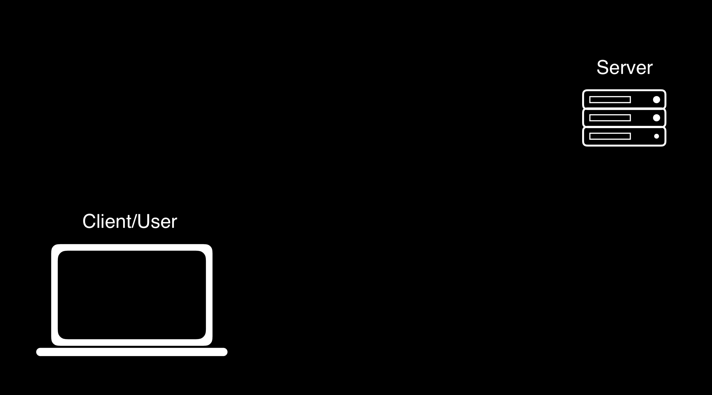

在此协议中，客户端将向服务器发送一个**请求**，可能看起来像下面的示例。在下面的示例中，`GET`只是一个请求类型，我们将在本课程中讨论的三种类型之一。`/`通常表示我们正在寻找网站的首页，而三个点表示我们还可以传递更多信息。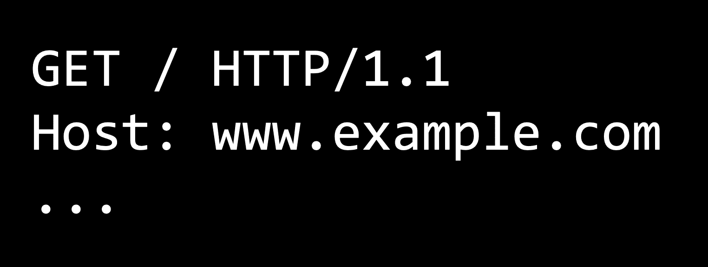

在收到请求后，服务器将发送一个 HTTP 响应，可能看起来像下面的示例。这样的响应将包括 HTTP 版本、状态码（200 表示 OK）、内容描述以及一些附加信息。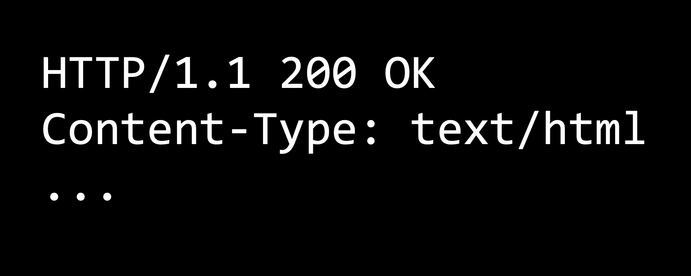

200 只是许多状态码中的一个，其中一些你可能以前见过：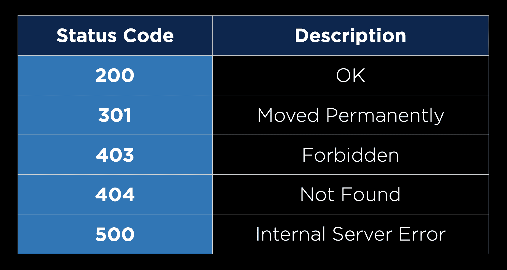

## Django

[Django](https://www.djangoproject.com/) 是一个基于 Python 的 Web 框架，它将允许我们编写动态生成 HTML 和 CSS 的 Python 代码。使用像 Django 这样的框架的优势在于，已经为我们编写了很多代码，我们可以利用这些代码。

+   要开始，我们必须安装 Django，这意味着如果您还没有这样做，您还必须[安装 pip](https://pip.pypa.io/en/stable/installing/)。

+   一旦您安装了 Pip，您可以在终端中运行 `pip3 install Django` 来安装 Django。

在安装 Django 后，我们可以通过以下步骤创建一个新的 Django 项目：

1.  运行 `django-admin startproject PROJECT_NAME` 以创建我们项目的一些起始文件。

1.  运行 `cd PROJECT_NAME` 以进入您的新项目目录。

1.  在您选择的文本编辑器中打开该目录。您会注意到已经为您创建了某些文件。现在我们不需要查看这些文件中的大多数，但有三件从开始起就非常重要：

    +   `manage.py` 是我们在终端上执行命令时使用的。我们不需要编辑它，但我们会经常使用它。

    +   `settings.py` 包含了我们新项目的一些重要配置设置。有一些默认设置，但我们可能希望不时地更改其中的一些。

    +   `urls.py` 包含了用户在导航到特定 URL 后应被路由到的指示。

1.  通过运行 `python manage.py runserver` 启动项目。这将打开一个开发服务器，您可以通过访问提供的 URL 来访问它。这个开发服务器是在您的机器上本地运行的，这意味着其他人无法访问您的网站。这应该会带您到一个默认的着陆页：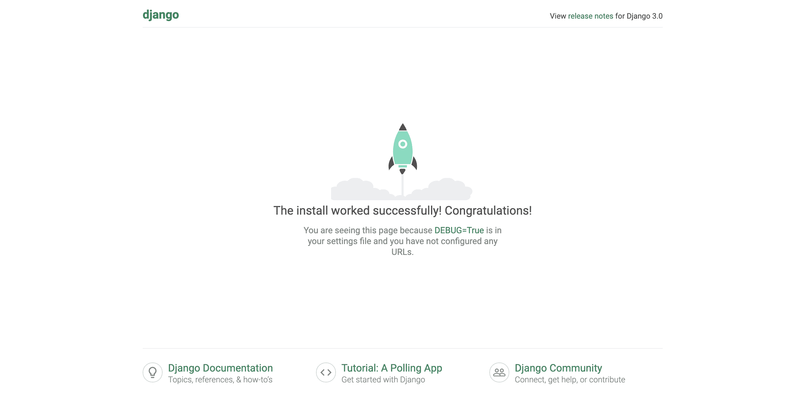

1.  接下来，我们必须创建一个应用。Django 项目分为一个或多个**应用**。我们的大多数项目只需要一个应用，但较大的网站可以利用这种将网站拆分为多个应用的能力。要创建一个应用，我们运行 `python manage.py startapp APP_NAME`。这将创建一些额外的目录和文件，这些文件将很快变得有用，包括 `views.py`。

1.  现在，我们必须安装我们的新应用。为此，我们进入 `settings.py`，向下滚动到 `INSTALLED_APPS` 列表，并将我们新应用的名称添加到该列表中。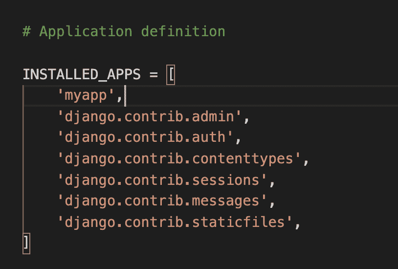

## 路由

现在，为了开始我们的应用：

1.  接下来，我们将导航到 `views.py`。这个文件将包含多个不同的视图，我们可以将视图现在视为用户可能希望看到的一页。为了创建我们的第一个视图，我们将编写一个接受 `request` 的函数。现在，我们将简单地返回一个 `HttpResponse`（一个非常简单的响应，包括一个 200 的响应代码和一个可以在网页浏览器中显示的文本字符串）。为了做到这一点，我们包含了 `from django.http import HttpResponse`。我们的文件现在看起来像：

    [PRE0]

1.  现在，我们需要以某种方式将我们刚刚创建的视图与一个特定的 URL 关联起来。为此，我们将在与 `views.py` 相同的目录中创建另一个名为 `urls.py` 的文件。我们已经有了一个整个项目的 `urls.py` 文件，但最好为每个单独的应用程序都保留一个。

1.  在我们的新 `urls.py` 中，我们将创建一个用户在使用我们的网站时可能会访问的 URL 模式列表。为了做到这一点：

    1.  我们必须做一些导入：`from django.urls import path` 将给我们重定向 URL 的能力，而 `from . import views` 将导入我们在 `views.py` 中创建的任何函数。

    1.  创建一个名为 `urlpatterns` 的列表

    1.  对于每个期望的 URL，向 `urlpatterns` 列表中添加一个项目，该项目包含对 `path` 函数的调用，该函数有两个或三个参数：一个表示 URL 路径的字符串，一个在访问该 URL 时希望调用的 `views.py` 中的函数，以及（可选的）该路径的名称，格式为 `name="something"`。例如，这就是我们简单的应用程序现在看起来像：

    [PRE1]

1.  现在，我们已经为这个特定应用程序创建了一个 `urls.py` 文件，并且是时候编辑为我们整个项目创建的 `urls.py` 文件了。当你打开这个文件时，你应该会看到已经有一个名为 `admin` 的路径，我们将在后面的课程中讲解。我们想要为我们的新应用程序添加另一个路径，所以我们将向 `urlpatterns` 列表中添加一个项目。这遵循了我们之前路径相同的模式，除了我们不想将 `views.py` 中的函数作为第二个参数添加，而是希望能够包含我们应用程序中 `urls.py` 文件内的所有路径。为此，我们写下：`include("APP_NAME.urls")`，其中 `include` 是我们通过从 `django.urls` 中也导入 `include` 获得的函数，如下面的 `urls.py` 所示：

    [PRE2]

1.  通过这样做，我们指定了当用户访问我们的网站，然后在搜索栏中添加 `/hello` 到 URL 时，他们将被重定向到我们新应用程序中的路径。

现在，当我使用`python manage.py runserver`启动应用程序并访问提供的 URL 时，我遇到了这个屏幕：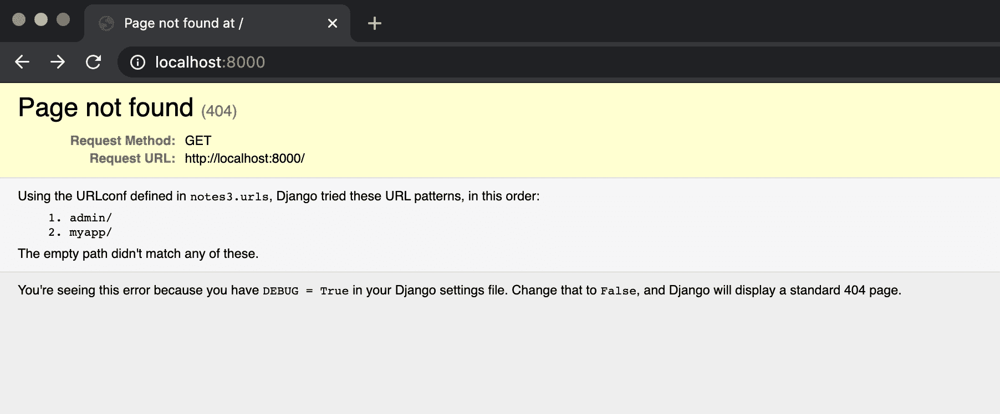 但这是因为我们只定义了 URL `localhost:8000/hello`，但没有定义末尾没有任何内容的 URL `localhost:8000`。所以，当我在搜索栏中的 URL 中添加`/hello`时：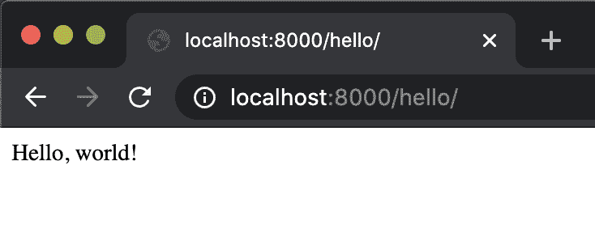 现在我们已经取得了一些成功，让我们回顾一下我们是如何到达这个点的：

1.  当我们访问 URL `localhost:8000/hello/`时，Django 查看基本 URL（`localhost:8000/`）之后的内容，然后前往我们的项目`urls.py`文件并搜索与`hello`匹配的模式。

1.  它之所以发现扩展，是因为我们定义了它，并且看到当遇到这种扩展时，它应该`包含`我们应用程序内的`urls.py`文件。

1.  然后，Django 在重定向时忽略了它已经使用的 URL 部分（`localhost:8000/hello/`，或者全部），并在我们的其他`urls.py`文件中寻找与 URL 剩余部分匹配的模式。

1.  它发现我们迄今为止的唯一路径（`""`）与 URL 剩余部分匹配，因此它将我们导向与该路径关联的`views.py`中的函数。

1.  最后，Django 在`views.py`中运行该函数，并将结果（`HttpResponse("Hello, world!")`）返回到我们的网页浏览器。

现在，如果我们想的话，我们可以将`views.py`中的`index`函数更改为返回我们想要的任何内容！我们甚至可以在函数中跟踪变量并进行计算，然后再返回某些内容。

现在，让我们看看我们如何将多个视图添加到我们的应用程序中。我们可以在应用程序内部遵循许多相同的步骤来创建向布莱恩和大卫打招呼的页面。

在`views.py`内部：

[PRE3]

在`urls.py`（在我们的应用程序内部）

[PRE4]

现在，当我们访问`localhost:8000/hello`时，我们的网站保持不变，但当我们向 URL 中添加`brian`或`david`时，我们会得到不同的页面：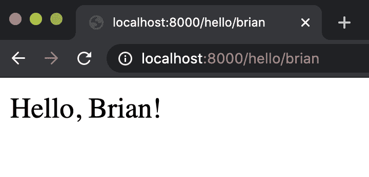 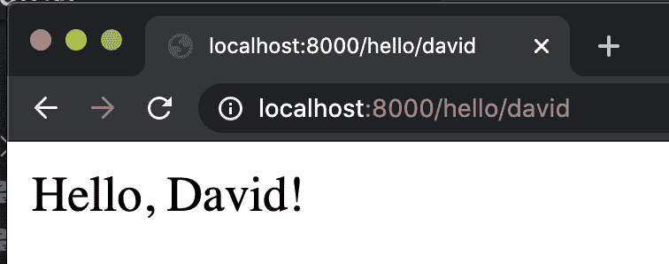

许多网站通过 URL 中包含的项目进行参数化。例如，访问[www.twitter.com/cs50](https://twitter.com/cs50)将显示 CS50 的所有推文，而访问[www.github.com/cs50](https://github.com/cs50)将带您到 CS50 的 GitHub 页面。您甚至可以通过导航到`www.github.com/YOUR_USERNAME`找到您自己的公共 GitHub 仓库！

在考虑如何实现这一点时，似乎不可能 GitHub 和 Twitter 这样的网站为每个用户都有一个单独的 URL 路径，因此让我们看看我们如何创建一个更灵活的路径。我们将从向`views.py`添加一个更通用的函数`greet`开始：

[PRE5]

这个函数不仅接受一个请求，还接受一个额外的参数，即用户的名称，然后根据该名称返回一个自定义的 HTTP 响应。接下来，我们必须在 `urls.py` 中创建一个更灵活的路径，这可能看起来像这样：

[PRE6]

这是一种新的语法，但本质上这里发生的事情是我们不再寻找 URL 中的特定单词或名称，而是任何用户可能输入的字符串。现在，我们可以尝试使用几个其他的 URL 来测试网站：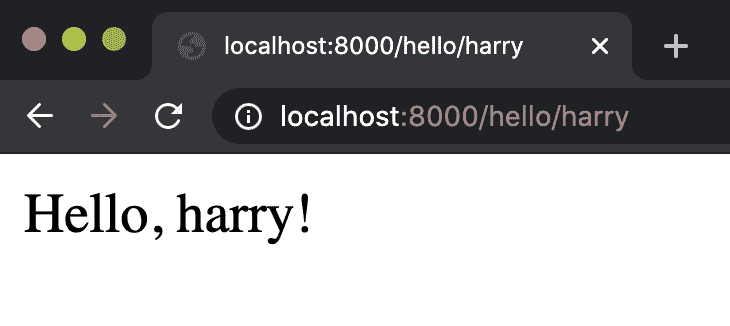 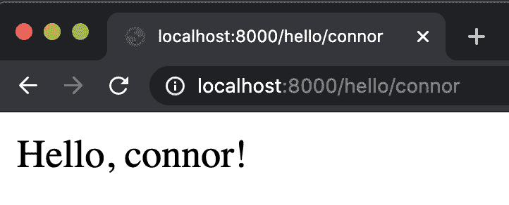

我甚至可以通过增强 `greet` 函数来利用 Python 的 `capitalize` 函数，使其字符串首字母大写，使这些看起来更美观一些：

[PRE7]

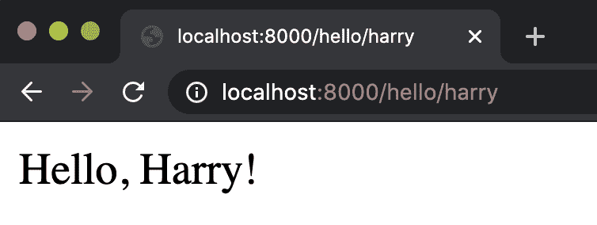 

这很好地说明了我们如何在 Python 中拥有的任何功能在返回之前都可以在 Django 中使用。

## 模板

到目前为止，我们的 HTTP 响应只是文本，但我们可以包含我们想要的任何 HTML 元素！例如，我可以在 `index` 函数中决定返回一个蓝色标题而不是纯文本：

[PRE8]

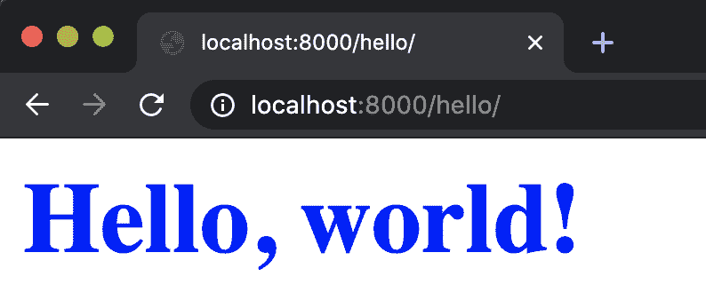

在 `views.py` 中编写整个 HTML 页面会非常繁琐。这也会构成不良设计，因为我们希望在可能的情况下将项目的不同部分保存在不同的文件中。

这就是为什么我们现在要介绍 [Django 的模板](https://docs.djangoproject.com/en/4.0/topics/templates/)，它将允许我们在单独的文件中编写 HTML 和 CSS，并使用 Django 渲染这些文件。我们将用于渲染模板的语法看起来是这样的：

[PRE9]

现在，我们需要创建这个模板。为此，我们将在我们的应用中创建一个名为 `templates` 的文件夹，然后在其中创建一个名为 `hello`（或我们应用的名称）的文件夹，最后添加一个名为 `index.html` 的文件。

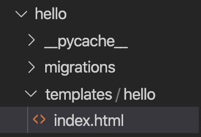

接下来，我们将添加我们想要添加到新文件中的内容：

[PRE10]

现在，当我们访问我们应用程序的主页时，我们可以看到标题和标题已经更新了：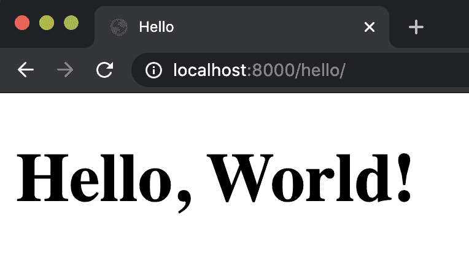

除了编写一些静态的 HTML 页面外，我们还可以使用 [Django 的模板语言](https://docs.djangoproject.com/en/4.0/ref/templates/language/) 来根据访问的 URL 改变我们 HTML 文件的内容。让我们通过更改之前的 `greet` 函数来试一试：

[PRE11]

注意，我们在 `render` 函数中传递了第三个参数，这个参数被称为 **上下文**。在这个上下文中，我们可以提供我们希望在 HTML 文件中可用的信息。这个上下文以 Python 字典的形式存在。现在，我们可以创建一个 `greet.html` 文件：

[PRE12]

您会注意到我们使用了一些新的语法：双大括号。这种语法允许我们访问在 `context` 参数中提供的变量。现在，当我们尝试它时：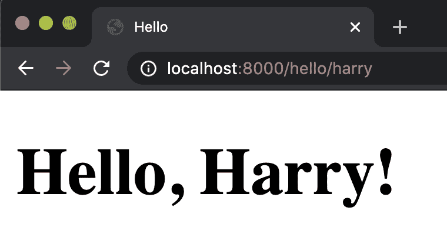 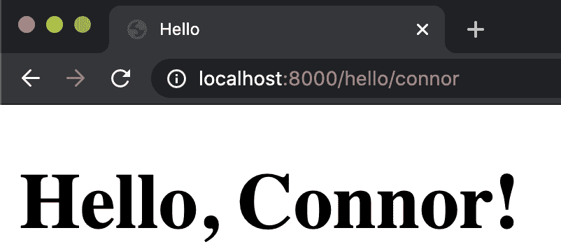

现在，我们已经看到了如何根据我们提供的上下文修改我们的 HTML 模板。然而，Django 模板语言比这更强大，所以让我们看看它还有哪些其他方式可以帮助我们：

### 条件语句：

我们可能希望根据某些条件更改我们网站上显示的内容。例如，如果您访问网站 [www.isitchristmas.com](https://www.isitchristmas.com)，您可能会看到一个看起来像这样的页面：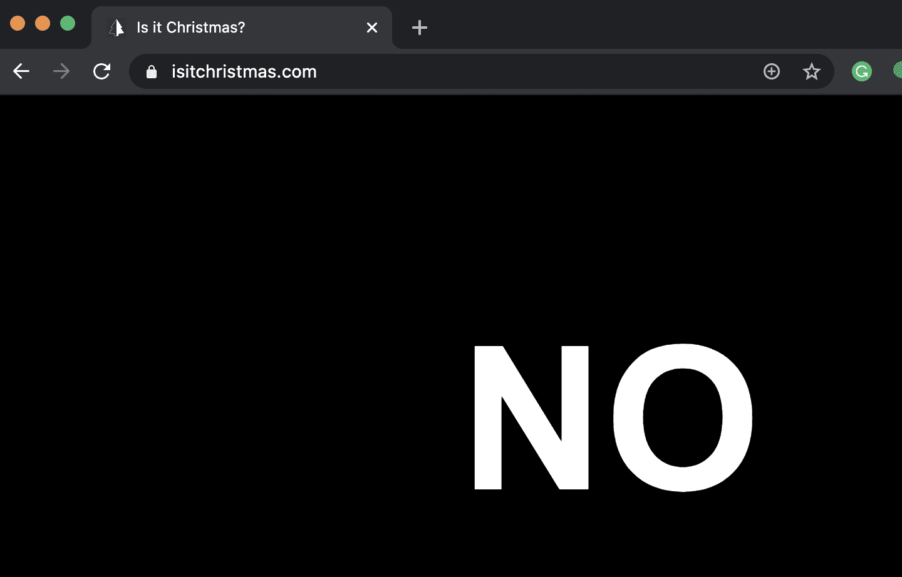 但这个网站在圣诞节那天会改变，届时网站会说 **YES**。为了创建类似的东西，让我们尝试创建一个类似的应用程序，其中我们检查是否是新年第一天。让我们创建一个新的应用程序来完成这个任务，回顾我们创建新应用程序的过程：

1.  在终端中运行 `python manage.py startapp newyear`。

1.  编辑 `settings.py`，将“newyear”添加为我们的 `INSTALLED_APPS` 之一

1.  编辑我们项目的 `urls.py` 文件，并包含一个类似于为 `hello` 应用程序创建的路径：

[PRE13]

1.  在我们新应用程序的目录中创建另一个 `urls.py` 文件，并更新它以包含类似于 `hello` 中索引路径的路径：

[PRE14]

1.  在 `views.py` 中创建一个索引函数。

现在我们已经设置好了我们的新应用程序，让我们弄清楚如何检查是否是新年第一天。为此，我们可以导入 Python 的 [datetime](https://docs.python.org/3/library/datetime.html) 模块。为了了解这个模块的工作方式，我们可以查看 [文档](https://docs.python.org/3/library/datetime.html)，然后使用 Python 解释器在 Django 之外测试它。

+   **Python 解释器** 是一个我们可以用来测试小块 Python 代码的工具。要使用它，请在您的终端中运行 `python`，然后您将能够在终端中输入并运行 Python 代码。当您完成使用解释器后，运行 `exit()` 退出。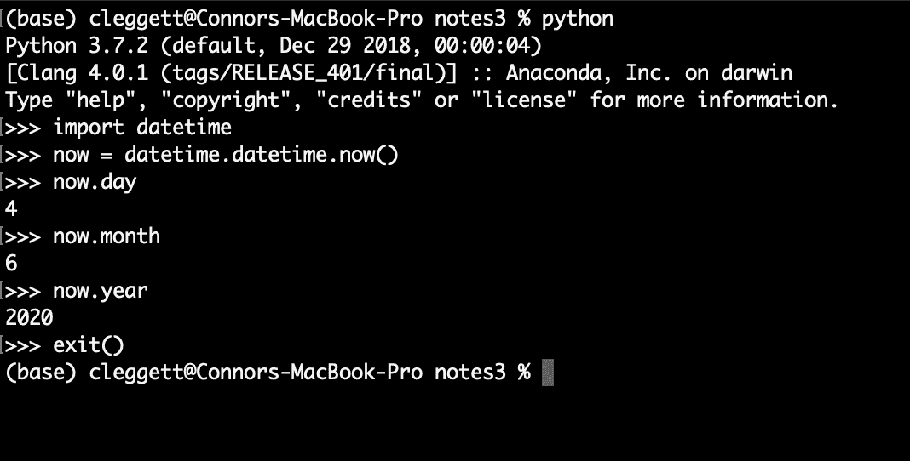

+   我们可以使用这个知识来构建一个布尔表达式，该表达式仅在今天是新年第一天时评估为 True：`now.day == 1 and now.month == 1`

+   现在我们有一个可以用来评估是否是新年第一天的表达式，我们可以更新 `views.py` 中的索引函数：

[PRE15]

现在，让我们创建我们的 `index.html` 模板。我们再次需要创建一个名为 `templates` 的新文件夹，该文件夹位于其中，然后是一个名为 `newyear` 的文件夹，以及一个名为 `index.html` 的文件。在该文件中，我们将编写如下内容：

[PRE16]

在上面的代码中，请注意，当我们希望在 HTML 文件中包含逻辑时，我们使用 `` 作为逻辑语句的开启和关闭标签。此外，请注意 Django 的格式化语言要求你包含一个结束标签，表示我们已完成 `if-else` 块。现在，我们可以打开我们的页面来查看：

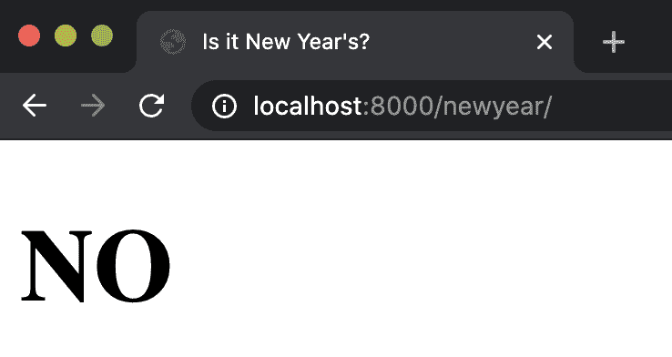

现在，为了更好地了解幕后发生的事情，让我们检查这个页面的元素：

注意，实际上发送到你的网页浏览器的 HTML 只包括 NO 标题，这意味着 Django 正在使用我们编写的 HTML 模板来创建一个新的 HTML 文件，并将其发送到我们的网页浏览器。如果我们稍微作弊一下，确保我们的条件始终为真，我们会看到相反的情况被填充：

[PRE17]

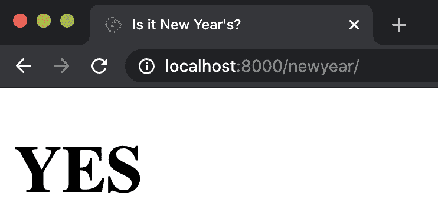 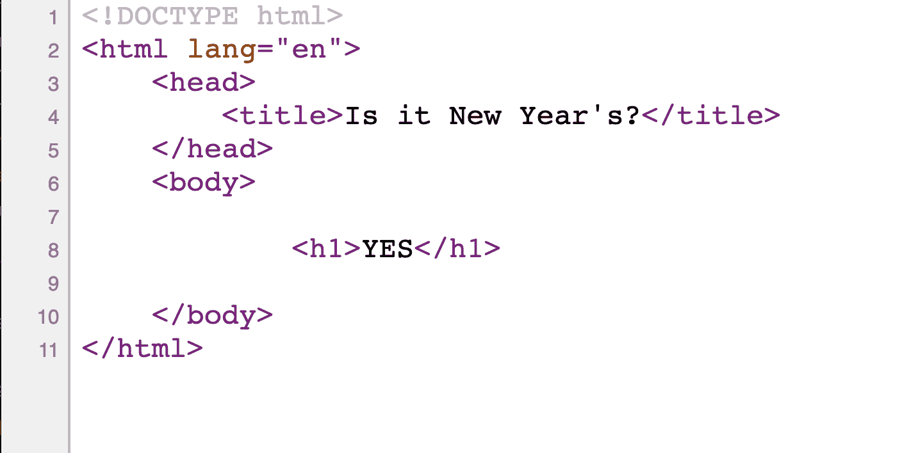

### 样式

如果我们想添加一个 CSS 文件，它是一个 *静态* 文件，因为它不会改变，我们首先创建一个名为 `static` 的文件夹，然后在其中创建一个 `newyear` 文件夹，最后在该文件夹中创建一个 `styles.css` 文件。在这个文件中，我们可以添加任何我们想要的样式，就像我们在第一节课中做的那样：

[PRE18]

现在，为了在 HTML 文件中包含这个样式，我们在 HTML 模板顶部添加一行 ``，这向 Django 信号我们希望访问 `static` 文件夹中的文件。然后，而不是像之前那样硬编码样式表的链接，我们将使用一些 Django 特定的语法：

[PRE19]

现在，如果我们重新启动服务器，我们可以看到样式更改确实已经应用：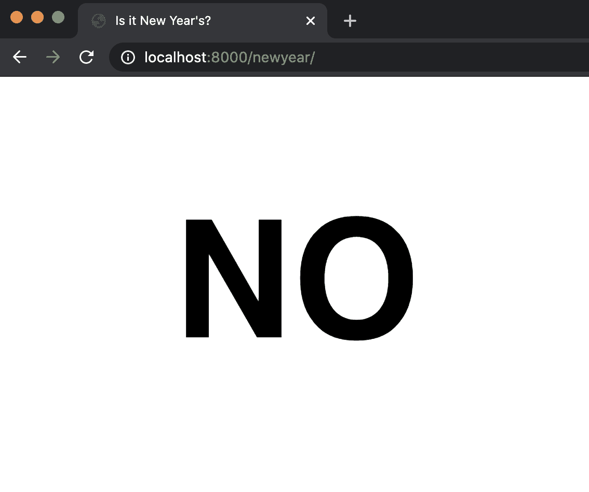

## 任务

现在，让我们将我们迄今为止学到的知识应用到一个小型项目中：创建一个 TODO 列表。让我们再次创建一个新的应用：

1.  在终端中运行 `python manage.py startapp tasks`。

1.  编辑 `settings.py`，将“tasks”添加为我们的 `INSTALLED_APPS` 之一

1.  编辑我们项目的 `urls.py` 文件，并包含一个类似于为 `hello` 应用创建的路径：

    [PRE20]

1.  在我们新应用的目录中创建另一个 `urls.py` 文件，并将其更新为包含一个类似于 `hello` 中的索引路径：

    [PRE21]

1.  在 `views.py` 中创建一个索引函数。

现在，让我们先尝试简单地创建一个任务列表，并将其显示在页面上。让我们在 `views.py` 的顶部创建一个 Python 列表，我们将在这里存储我们的任务。然后，我们可以更新我们的 `index` 函数以渲染一个模板，并提供我们新创建的列表作为上下文。

[PRE22]

现在，让我们着手创建我们的模板 HTML 文件：

[PRE23]

注意这里，我们能够使用类似于我们之前条件语句的语法，以及类似于第二部分课中 Python 循环的语法来遍历我们的任务。当我们现在访问任务页面时，我们可以看到我们的列表被渲染：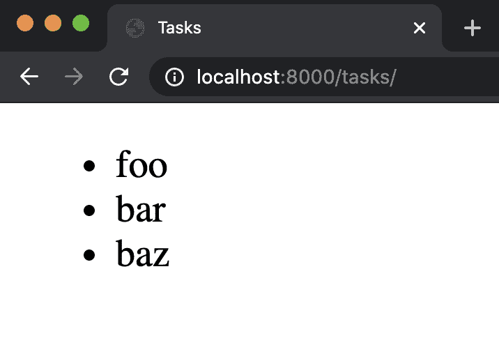

## 表单

现在我们可以看到所有当前任务作为一个列表，我们可能想要能够添加一些新任务。为此，我们将开始查看如何使用表单来更新网页。让我们首先向 `views.py` 添加另一个函数，该函数将渲染一个带有添加新任务表单的页面：

[PRE24]

接下来，确保向 `urls.py` 添加另一个路径：

[PRE25]

现在，我们将创建我们的 `add.html` 文件，它与 `index.html` 非常相似，只是在主体中我们将包含一个表单而不是列表：

[PRE26]

然而，我们刚刚所做的不一定是最佳设计，因为我们已经在两个不同的文件中重复了大部分 HTML。Django 的模板语言为我们提供了一种消除这种糟糕设计的方法：[模板继承](https://tutorial.djangogirls.org/en/template_extending/)。这允许我们创建一个包含我们页面通用结构的 `layout.html` 文件：

[PRE27]

注意我们再次使用了 `` 来表示某种非 HTML 逻辑，在这种情况下，我们告诉 Django 用来自另一个文件的一些文本填充这个“块”。现在，我们可以修改我们其他两个 HTML 文件，使其看起来像这样：

`index.html`:

[PRE28]

`add.html`:

[PRE29]

注意我们现在可以通过 *扩展* 我们的布局文件来删除大部分重复的代码。现在，我们的索引页面保持不变，我们现在还有一个添加页面：

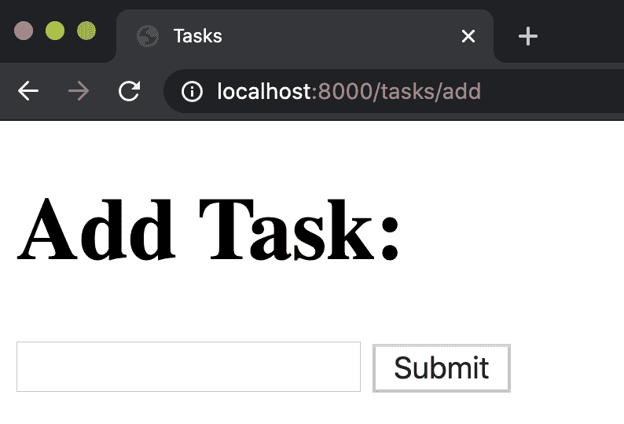

接下来，每次我们想要添加一个新任务时，在 URL 中输入“/add”并不是很理想，所以我们可能想要在页面之间添加一些链接。但是，我们不是硬编码链接，现在我们可以使用在 `urls.py` 中为每个路径分配的 `name` 变量，创建一个看起来像这样的链接：

[PRE30]

其中 'add' 是该路径的名称。我们可以在 `add.html` 中做类似的事情：

[PRE31]

这可能会产生问题，因为我们有多个名为 `index` 的路由分布在不同的应用中。我们可以通过进入每个应用的 `urls.py` 文件，并添加一个 `app_name` 变量来解决此问题，这样文件现在看起来就像这样：

[PRE32]

然后，我们可以将链接从简单的 `index` 和 `add` 改为 `tasks:index` 和 `tasks:add`

[PRE33]

现在，让我们确保当用户提交表单时表单实际上会做一些事情。我们可以通过向 `add.html` 中创建的表单添加一个 `action` 来做到这一点：

[PRE34]

这意味着一旦表单提交，我们将被路由回 `add` URL。在这里，我们指定我们将使用 *post* 方法而不是 *get* 方法，这通常是我们在表单可能改变该网页状态时使用的方法。

现在，我们需要对这个表单添加更多内容，因为 Django 需要一个令牌来防止[跨站请求伪造（CSRF）攻击](https://portswigger.net/web-security/csrf)。这种攻击是指恶意用户试图从你的网站之外发送请求到你的服务器。这对某些网站来说可能是一个大问题。比如说，一个银行网站有一个表单，允许一个用户向另一个用户转账。如果有人能够从银行网站之外提交转账，那将是一场灾难！

为了解决这个问题，当 Django 发送响应渲染模板时，它还会提供一个**CSRF 令牌**，该令牌在每个新的会话中都是唯一的。然后，当提交请求时，Django 会检查请求关联的 CSRF 令牌是否与它最近提供的令牌匹配。因此，如果另一个网站上的恶意用户试图提交请求，他们将会因为无效的 CSRF 令牌而被阻止。这种 CSRF 验证是内置在[Django 中间件](https://docs.djangoproject.com/en/4.0/topics/http/middleware/)框架中的，它可以干预 Django 应用的请求-响应处理。我们在这门课程中不会进一步讨论中间件，但如果感兴趣，请查看[文档](https://docs.djangoproject.com/en/4.0/topics/http/middleware/)！

要将这项技术整合到我们的代码中，我们必须在`add.html`表单中添加一行代码。

[PRE35]

这行代码添加了一个由 Django 提供的 CSRF 令牌的隐藏输入字段，这样当我们重新加载页面时，看起来好像没有变化。然而，如果我们检查元素，我们会注意到添加了一个新的输入字段：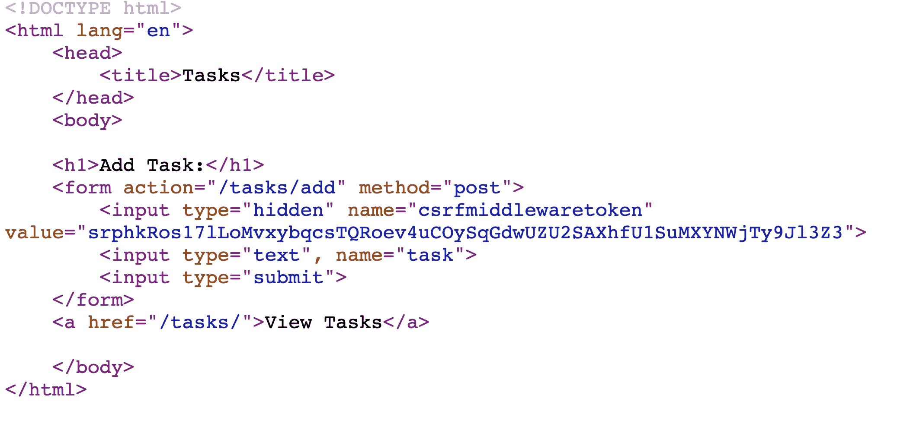

### Django 表单

尽管我们可以像刚才那样通过编写原始 HTML 来创建表单，但 Django 提供了一个更简单的方法来收集用户信息：[Django 表单](https://docs.djangoproject.com/en/4.0/ref/forms/api/)。为了使用这种方法，我们需要在`views.py`的顶部添加以下内容以导入`forms`模块：

[PRE36]

现在，我们可以在`views.py`中创建一个新的表单，通过创建一个名为`NewTaskForm`的 Python 类来实现：

[PRE37]

现在，让我们来看看这个类中发生了什么：

+   在`NewTaskForm`括号后面，我们看到我们使用了`forms.Form`。这是因为我们的新表单[继承自](https://www.w3schools.com/python/python_inheritance.asp)一个名为`Form`的类，该类包含在`forms`模块中。我们已经看到了如何在 Django 的模板语言和 Sass 样式中使用继承。这是继承如何被用来从一个更通用的描述（`forms.Form`类）缩小到我们想要的（我们的新表单）的另一个例子。继承是面向对象编程的关键部分，我们在这门课程中不会详细讨论，但关于这个主题有[许多在线资源](https://www.w3schools.com/python/python_inheritance.asp)可供学习！

+   在这个类内部，我们可以指定我们希望从用户那里收集哪些信息，在这种情况下是任务的名称。

+   我们通过编写`forms.CharField`来指定这是一个文本输入，但 Django 的表单模块中包含了[许多其他输入字段](https://docs.djangoproject.com/en/4.0/ref/forms/fields/#built-in-field-classes)，我们可以从中选择。

+   在这个`CharField`中，我们指定一个`label`，当用户加载页面时会显示出来。`label`只是我们可以传递给表单字段的[许多参数](https://docs.djangoproject.com/en/4.0/ref/forms/fields/#core-field-arguments)之一。

现在我们已经创建了`NewTaskForm`类，我们可以在渲染`add`页面时将其包含在上下文中：

[PRE38]

现在，在`add.html`中，我们可以用我们刚刚创建的表单替换我们的输入字段：

[PRE39]

使用`forms`模块而不是手动编写 HTML 表单有几个优点：

+   如果我们想在表单中添加新字段，我们可以在`views.py`中简单地添加它们，而无需编写额外的 HTML。

+   Django 自动执行[客户端验证](https://developer.mozilla.org/en-US/docs/Learn/Forms/Form_validation)，或用户机器本地的验证。这意味着它不会允许用户提交不完整的表单。

+   Django 提供了简单的[服务器端验证](https://developer.mozilla.org/en-US/docs/Learn/Forms/Form_validation)，或验证在表单数据到达服务器后发生。

+   在下一讲中，我们将开始使用**模型**来存储信息，Django 使得根据模型创建表单变得非常简单。

现在我们已经设置好了表单，让我们来处理用户点击提交按钮时会发生什么。当用户通过点击链接或输入 URL 导航到添加页面时，他们向服务器发送一个`GET`请求，我们已经在`add`函数中处理了它。但是，当用户提交表单时，他们向服务器发送一个`POST`请求，目前这个请求在`add`函数中没有被处理。我们可以通过在函数接收的`request`参数上添加条件来处理`POST`方法。下面代码中的注释解释了每行的目的：

[PRE40]

简要说明：为了在成功提交后重定向用户，我们需要导入一些额外的模块：

[PRE41]

## 会话

到目前为止，我们已经成功构建了一个应用程序，允许我们向不断增长的任务列表中添加任务。然而，将任务存储为全局变量可能是一个问题，因为它意味着所有访问页面的用户都会看到完全相同的列表。为了解决这个问题，我们将使用一个称为[sessions](https://docs.djangoproject.com/en/4.0/topics/http/sessions/)的工具。

会话是存储在服务器端为每个新访问网站的唯一数据的方式。

要在我们的应用程序中使用会话，我们首先会删除全局`tasks`变量，然后修改我们的`index`函数，最后确保在之前任何使用变量`tasks`的地方，我们都将其替换为`request.session["tasks"]`。

[PRE42]

最后，在 Django 能够存储这些数据之前，我们必须在终端中运行`python manage.py migrate`。下周我们将更详细地讨论迁移是什么，但现阶段只需知道上述命令允许我们存储会话。

这节课的内容就到这里！下次我们将讨论如何使用 Django 来存储、访问和操作数据。
