# 讲座 4

> 原文：[`cs50.harvard.edu/web/notes/4/`](https://cs50.harvard.edu/web/notes/4/)

+   介绍

+   SQL

    +   数据库

    +   列类型

+   表格

+   选择

    +   在终端中使用 SQL

    +   函数

    +   更新

    +   删除

    +   其他子句

+   连接表

    +   JOIN 查询

    +   索引

    +   SQL 漏洞

+   Django 模型

+   迁移

+   Shell

    +   启动我们的应用程序

+   Django 管理员

+   多对多关系

+   用户

## 介绍

+   到目前为止，我们已经讨论了如何使用 HTML 和 CSS 构建简单的网页，以及如何使用 Git 和 GitHub 来跟踪代码更改并与他人协作。我们还熟悉了 Python 编程语言，并开始使用 Django 来创建网络应用程序。

+   今天，我们将学习如何使用 SQL 和 Django 模型高效地存储和访问数据。

## SQL

[SQL](https://www.w3schools.com/sql/)，或结构化查询语言，是一种编程语言，允许我们更新和查询数据库。

### 数据库

在我们深入探讨如何使用 SQL 语言之前，我们应该讨论我们的数据是如何存储的。当使用 SQL 时，我们将与一个 [关系数据库](https://www.oracle.com/database/what-is-a-relational-database/#:~:text=A%20relational%20database%20is%20a,of%20representing%20data%20in%20tables.) 一起工作，在那里我们可以找到所有数据存储在多个 [表格](https://www.essentialsql.com/what-is-a-database-table/) 中。这些表格中的每一个都由一定数量的列和灵活数量的行组成。

为了说明如何使用 SQL，我们将使用一个航空公司的网站示例，该网站用于跟踪航班和乘客。在下面的表格中，我们可以看到我们正在跟踪多个航班，每个航班都有一个 `origin`（起点）、一个 `destination`（目的地）和一个 `duration`（时长）。

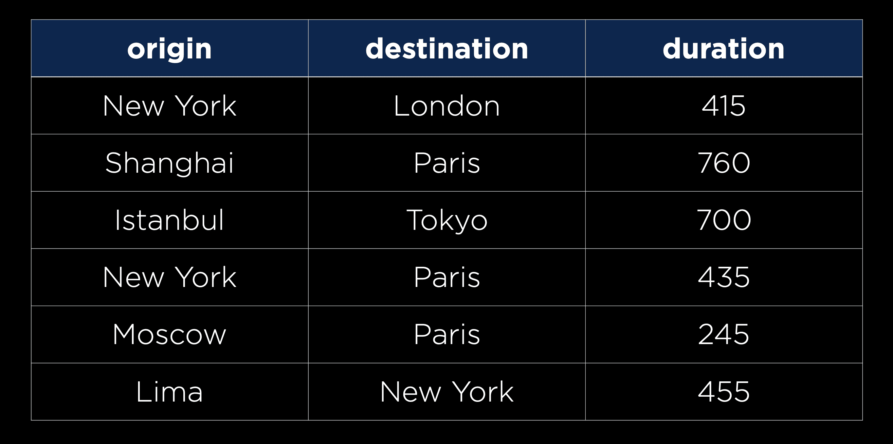

有几种不同的关系数据库管理系统被广泛用于存储信息，并且可以轻松与 SQL 命令交互：

+   [MySQL](https://www.mysql.com/)

+   [PostgreSQL](https://www.postgresql.org/)

+   [SQLite](https://www.sqlite.org/index.html)

+   …

前两个，MySQL 和 PostgreSQL，是更重型的数据库管理系统，通常在运行网站的独立服务器上运行。另一方面，SQLite 是一个更轻量级的系统，可以将所有数据存储在一个单独的文件中。在本课程中，我们将使用 SQLite，因为它是 Django 默认使用的系统。

### 列类型

正如我们在 Python 中使用了几种不同的变量类型一样，SQLite 有 [类型](https://www.sqlite.org/datatype3.html) 代表不同形式的信息。其他管理系统可能有不同的数据类型，但它们都与 SQLite 的类型相当相似：

+   `TEXT`: 用于文本字符串（例如，一个人的名字）

+   `NUMERIC`: 一种更通用的数值数据形式（例如，日期或布尔值）

+   `INTEGER`: 任何非十进制数字（例如，一个人的年龄）

+   `REAL`: 任何实数（例如，一个人的体重）

+   `BLOB` (二进制大对象): 我们可能想要存储在数据库中的任何其他二进制数据（例如，一张图片）

## 表

现在，为了真正开始使用 SQL 与数据库交互，让我们首先创建一个新表。创建新表的 [命令](https://www.w3schools.com/sql/sql_create_table.asp) 大概是这样的：

[PRE0]

在上述命令中，我们创建了一个新表，我们决定将其命名为 `flights`，并且我们向这个表添加了四个列：

1.  `id`: 有一个允许我们唯一标识表中每一行的数字通常很有帮助。在这里，我们指定 `id` 是一个整数，并且它也是我们的 [主键](https://www.w3schools.com/sql/sql_primarykey.ASP)，这意味着它是我们的唯一标识符。我们还指定了它将 `AUTOINCREMENT`，这意味着我们每次向表中添加时不需要提供 id，因为它会自动完成。

1.  `origin`: 在这里我们指定这是一个文本字段，并且通过写入 `NOT NULL` 我们要求它必须有一个值。

1.  `destination`: 同样，我们指定这将是一个文本字段，并阻止它为空。

1.  `duration`: 同样，这个值不能为空，但这次它是一个整数而不是文本。

我们在创建列时刚刚看到了 `NOT NULL` 和 `PRIMARY KEY` 约束，但还有其他几个 [约束](https://www.tutorialspoint.com/sqlite/sqlite_constraints.htm) 可供我们使用：

+   `CHECK`: 确保在允许添加/修改行之前满足某些约束

+   `DEFAULT`: 如果没有给出值，则提供默认值

+   `NOT NULL`: 确保提供值

+   `PRIMARY KEY`: 表示这是在数据库中搜索行的主要方式

+   `UNIQUE`: 确保该列中不会有两个行具有相同的值。

+   …

现在我们已经看到了如何创建表，让我们看看我们如何可以向其中添加行。在 SQL 中，我们使用 `INSERT` 命令来完成这个操作：

[PRE1]

在上述命令中，我们指定了我们要插入的表名，然后提供了一列列名列表，我们将提供有关这些列的信息，然后指定我们想要填充表中该行的 `VALUES`，确保 `VALUES` 的顺序与我们的列名列表相对应。请注意，我们不需要为 `id` 提供值，因为它会自动递增。

## SELECT

一旦表格被填充了一些行，我们可能希望有一种方法来访问该表中的数据。我们通过使用 SQL 的[SELECT](https://www.w3schools.com/sql/sql_select.asp)查询来实现这一点。最简单的`SELECT`查询到我们的航班表可能看起来像这样：

[PRE2]

上述命令（*）检索了我们航班表中的所有数据

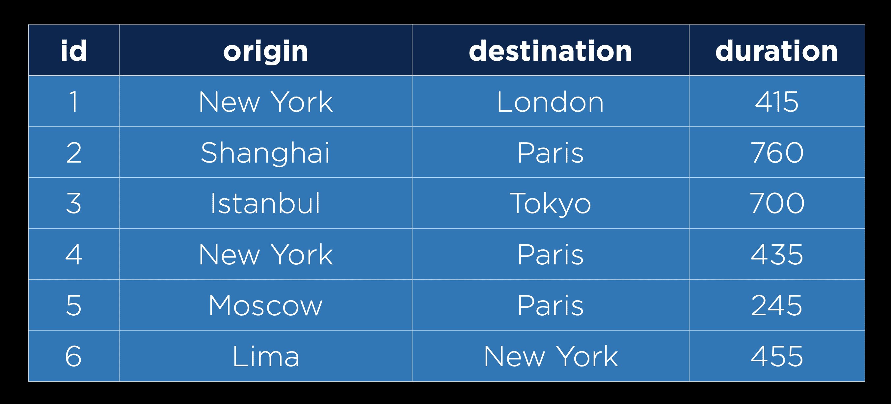

然而，可能我们并不真的需要数据库中的所有列，只需要起点和目的地。为了只访问这些列，我们可以用我们想要访问的列名替换`*`。以下查询返回所有起点和目的地。

[PRE3]

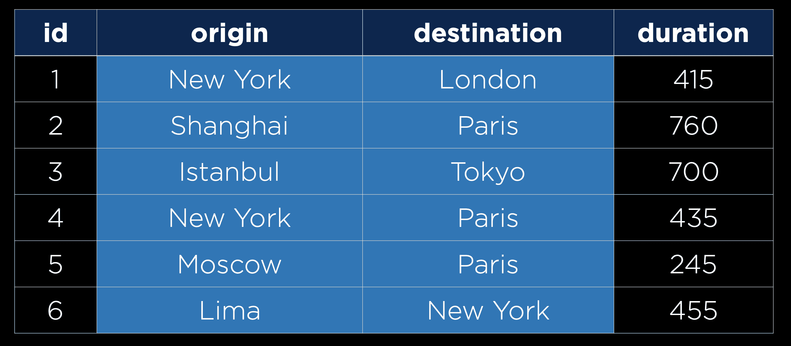

随着我们的表格越来越大，我们可能还想缩小查询返回的行数。我们通过添加一个[WHERE](https://www.w3schools.com/sql/sql_where.asp)并跟上一个条件来实现这一点。例如，以下命令只选择`id`为`3`的行：

[PRE4]

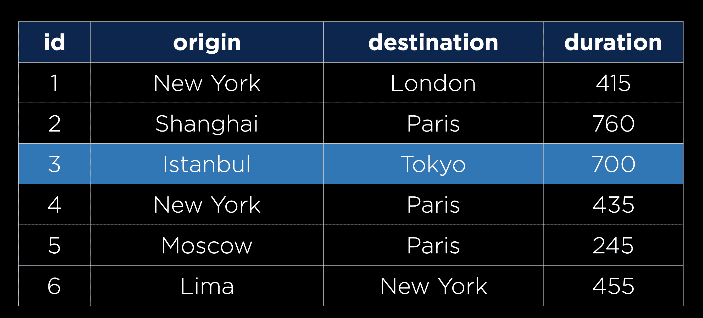

我们可以按任何列过滤，而不仅仅是`id`！

[PRE5]

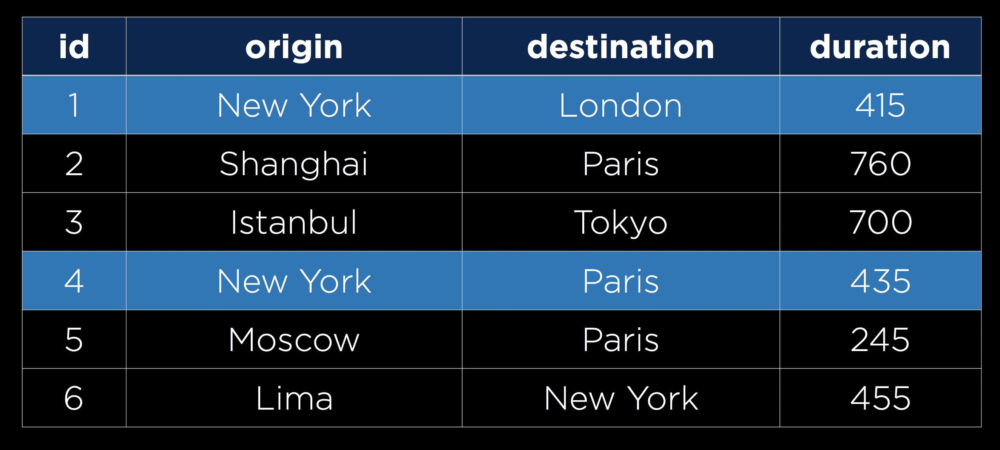

### 在终端中使用 SQL

现在我们已经了解了一些基本的 SQL 命令，让我们在终端中测试它们！为了在您的计算机上使用 SQLite，您必须首先[下载 SQLite](https://www.sqlite.org/download.html)。（我们不会在讲座中使用它，但您也可以[下载 DB Browser](https://sqlitebrowser.org/dl/)以更用户友好的方式运行 SQL 查询。）

我们可以通过手动创建一个新文件或在终端中运行`touch flights.sql`来为我们的数据库创建一个文件。现在，如果我们通过终端运行`sqlite3 flights.sql`，我们将进入一个 SQLite 提示符，在那里我们可以运行 SQL 命令：

[PRE6]

我们还可以使用不仅仅是等于来过滤我们的航班。对于整数和实数值，我们可以使用大于或小于：

[PRE7]

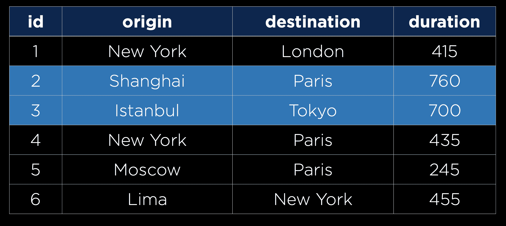

我们还可以使用其他逻辑（[AND, OR](https://www.w3schools.com/sql/sql_and_or.asp)）如 Python 中的逻辑：

[PRE8]

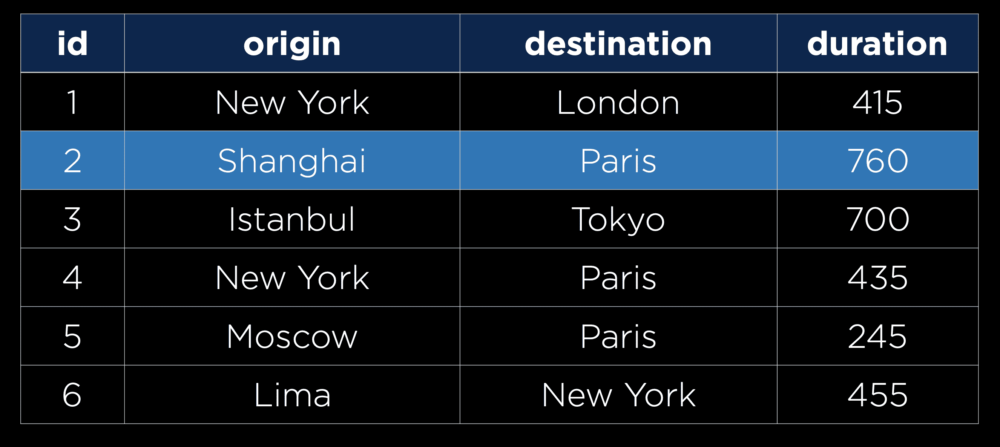

[PRE9]

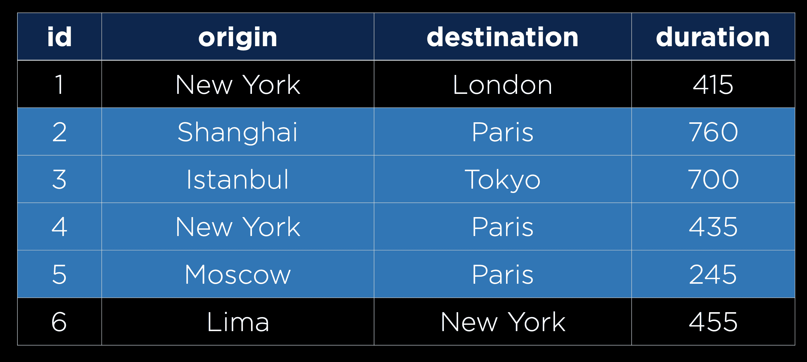

我们还可以使用关键字[IN](https://www.w3schools.com/sql/sql_in.asp)来查看数据是否是几个选项之一：

[PRE10]

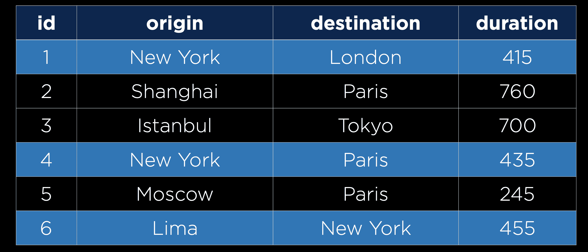

我们甚至可以使用正则表达式通过使用[LIKE](https://www.w3schools.com/sql/sql_like.asp)关键字更广泛地搜索单词。以下查询通过使用`%`作为通配符字符，找到所有在起点中有`a`的结果。

[PRE11]

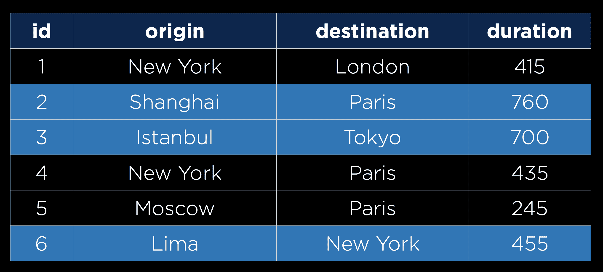

### 函数

此外，我们还可以将一些 SQL 函数应用于查询结果。如果我们不需要查询返回的所有数据，而只需要一些数据的摘要统计信息，这些函数可能很有用。

+   [平均值](https://www.w3schools.com/sql/sql_count_avg_sum.asp)

+   [COUNT](https://www.w3schools.com/sql/sql_count_avg_sum.asp)

+   [MAX](https://www.w3schools.com/sql/sql_min_max.asp)

+   [MIN](https://www.w3schools.com/sql/sql_min_max.asp)

+   [SUM](https://www.w3schools.com/sql/sql_count_avg_sum.asp)

+   …

### UPDATE

我们现在已经看到了如何添加和搜索表，但我们可能还希望能够更新已存在的表的行。我们可以使用[UPDATE](https://www.w3schools.com/sql/sql_update.asp)命令来完成这个操作，如下所示。正如你可能通过大声读出来所猜到的，该命令找到所有从纽约飞往伦敦的航班，并将它们的持续时间设置为 430。

[PRE12]

### DELETE

我们还可能想要有从我们的数据库中删除行的能力，我们可以使用[DELETE](https://www.w3schools.com/sql/sql_delete.asp)命令来完成这个操作。以下代码将删除所有飞往东京的航班：

[PRE13]

### 其他子句

我们可以使用许多额外的子句来控制返回给我们的查询

+   [LIMIT](https://www.w3schools.com/sql/sql_top.asp)：限制查询返回的结果数量

+   [ORDER BY](https://www.w3schools.com/sql/sql_orderby.asp)：根据指定的列对结果进行排序

+   [GROUP BY](https://www.w3schools.com/sql/sql_groupby.asp)：根据指定的列对结果进行分组

+   [HAVING](https://www.w3schools.com/sql/sql_having.asp)：允许基于结果数量进行额外的约束

## 表的连接

到目前为止，我们一直是在一次处理一个表，但实践中许多数据库都是由多个相互关联的表组成的。在我们的航班示例中，让我们想象我们还想添加一个机场代码与城市一起。按照我们目前表的结构，我们可能需要为每一行添加两个额外的列。我们也会重复信息，因为我们必须在多个地方写上城市 X 与代码 Y 相关联。

我们可以解决这个问题的方法之一是决定有一个表来跟踪航班，然后另一个表来跟踪机场。第二个表可能看起来像这样

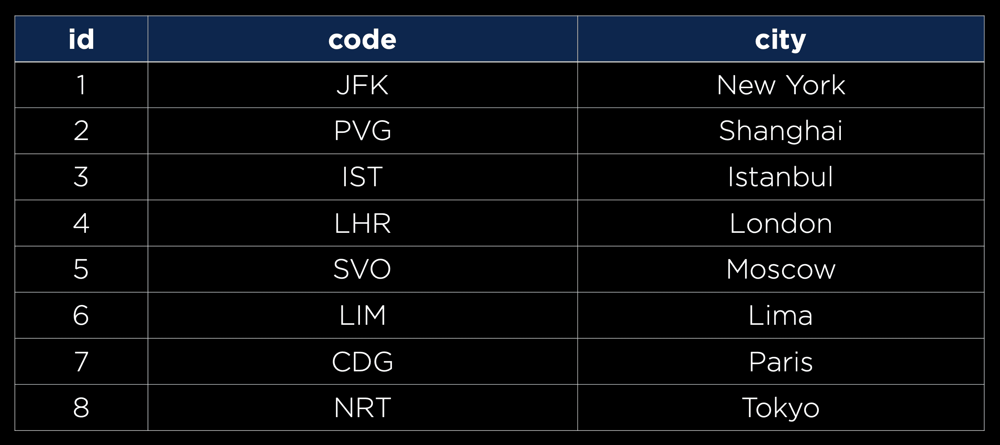

现在我们有一个与代码和城市相关的表，而不是在我们的航班表中存储整个城市名称，如果我们能够只保存那个机场的`id`，那么这将节省存储空间。因此，我们应该相应地重写航班表。由于我们正在使用机场表的`id`列来填充`origin_id`和`destination_id`，我们称这些值为[外键](https://www.w3schools.com/sql/sql_foreignkey.asp)

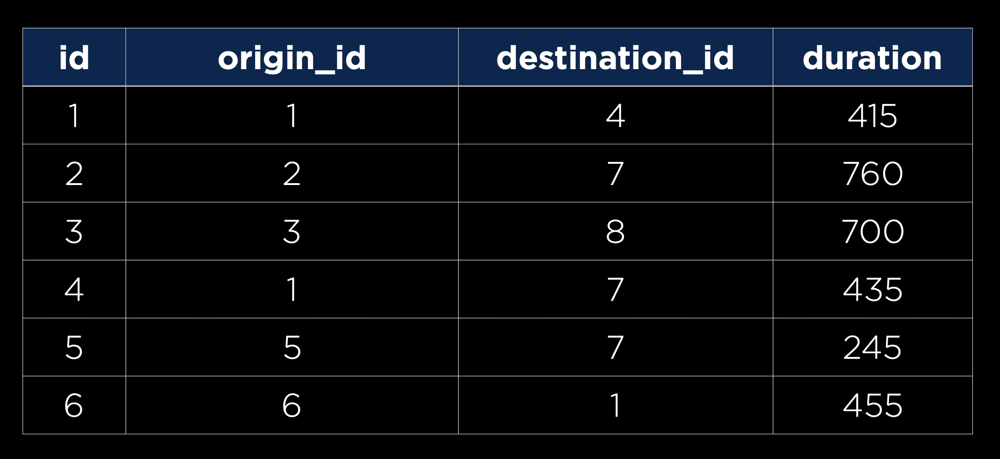

除了航班和机场，航空公司可能还想要存储有关其乘客的数据，比如每个乘客将乘坐哪班航班。利用关系型数据库的力量，我们可以添加另一个表来存储姓名和代表他们所乘坐航班的键

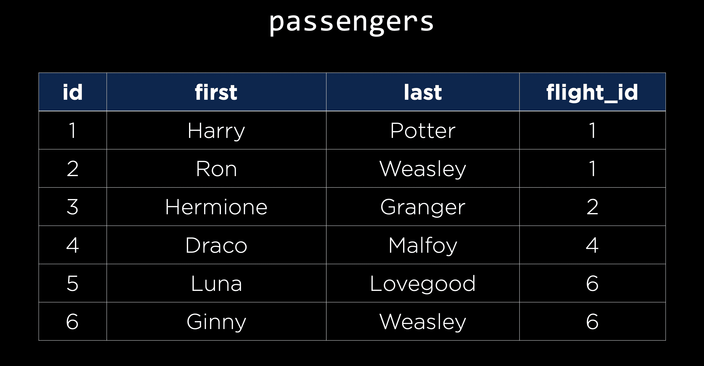

尽管如此，我们还能做得更好，因为同一个人可能乘坐多趟航班。为了解决这个问题，我们可以创建一个`people`表来存储姓名，以及一个`passengers`表来将人与航班配对

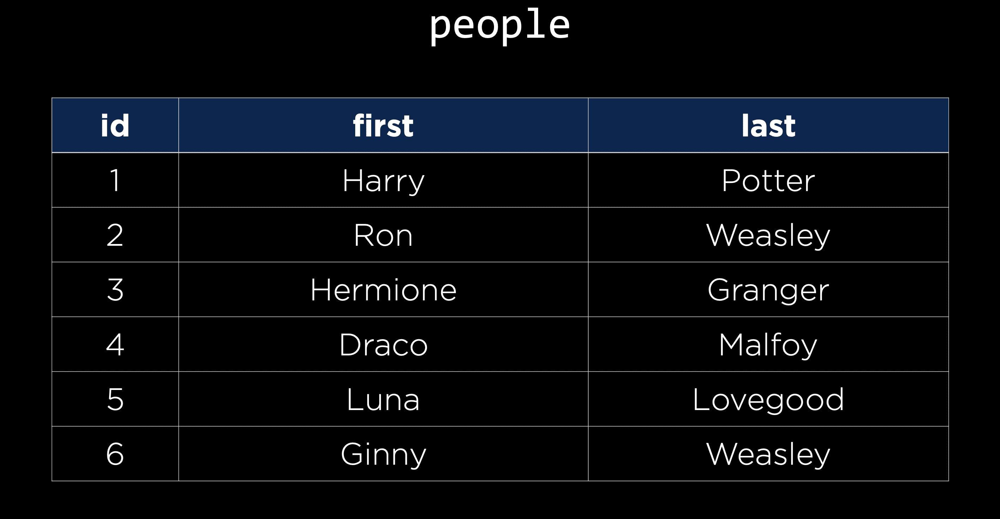

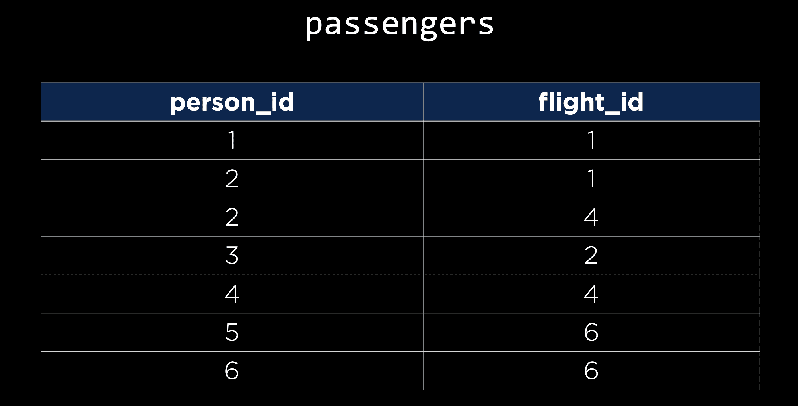

由于在这种情况下，一个人可以乘坐多趟航班，而一趟航班可以有很多人，我们称`flights`和`people`之间的关系为**多对多**关系。连接这两个表的`passengers`表被称为**关联表**。

### JOIN 查询

虽然我们的数据现在存储得更高效，但似乎查询数据可能更困难。幸运的是，SQL 有一个[JOIN](https://www.w3schools.com/sql/sql_join.asp)查询，我们可以用它来合并两个表以进行另一个查询。

例如，假设我们想找到乘客正在乘坐的每次旅行的出发地、目的地和姓名。为了简化这个表，我们将使用包含航班 ID、名和姓的非优化`passengers`表。这个查询的第一部分看起来相当熟悉：

[PRE14]

但在这里我们遇到了一个问题，因为`first`存储在`passengers`表中，而`origin`和`destination`存储在`flights`表中。我们通过使用`passengers`表中的`flight_id`与`flights`表中的`id`相对应的事实来连接这两个表：

[PRE15]

我们刚刚使用了叫做[INNER JOIN](https://www.w3schools.com/sql/sql_join_inner.asp)的东西，这意味着我们正在忽略两个表之间没有匹配的行，但还有其他类型的连接，包括[**LEFT JOIN**](https://www.w3schools.com/sql/sql_join_left.asp)、[**RIGHT JOIN**](https://www.w3schools.com/sql/sql_join_right.asp)和[**FULL OUTER JOIN**](https://www.w3schools.com/sql/sql_join_full.asp)，我们在这里不会详细讨论。

### 索引

当处理大型表时，我们可以通过创建一个类似于教科书背面的索引来使我们的查询更高效。例如，如果我们知道我们经常通过姓氏查找乘客，我们可以使用以下命令创建一个从姓氏到 ID 的索引：

[PRE16]

### SQL 漏洞

现在我们已经了解了使用 SQL 处理数据的基础知识，重要的是要指出与使用 SQL 相关的主要漏洞。我们将从[SQL 注入](https://www.w3schools.com/sql/sql_injection.asp)开始。

SQL 注入攻击是指恶意用户在网站上输入 SQL 代码作为输入，以绕过网站的安全措施。例如，假设我们有一个存储用户名和密码的表，然后在页面的主页上有一个登录表单。我们可能使用以下查询来搜索用户：

[PRE17]

一个名为 Harry 的用户可能会访问这个网站，并输入`harry`作为用户名，`12345`作为密码，在这种情况下，查询看起来会是这样：

[PRE18]

另一方面，一个黑客可能会输入`harry" --`作为用户名，密码为空。结果是`--`在 SQL 中表示注释，这意味着查询看起来会是这样：

[PRE19]

因为在这个查询中，密码检查已经被注释掉了，黑客可以在不知道密码的情况下登录 Harry 的账户。为了解决这个问题，我们可以使用：

+   转义字符以确保 SQL 将输入视为纯文本而不是 SQL 代码。

+   在 SQL 之上有一个抽象层，它包括自己的转义序列，所以我们不需要自己编写 SQL 查询。

当涉及到 SQL 时，另一个主要漏洞被称为[竞态条件](https://searchstorage.techtarget.com/definition/race-condition#:~:text=A%20race%20condition%20is%20an,sequence%20to%20be%20done%20correctly.).

竞态条件是在同时对数据库进行多个查询时发生的情况。当这些查询没有得到妥善处理时，数据库更新时的精确时间可能会出现问题。例如，假设我银行账户中有 150 美元。如果我在手机和笔记本电脑上同时登录我的银行账户，并在每个设备上尝试提取 100 美元，就可能发生竞态条件。如果银行的软件开发者没有正确处理竞态条件，那么我可能能够从只有 150 美元的账户中提取 200 美元。解决这个问题的一个潜在方案是锁定数据库。我们不允许在完成一个事务之前与数据库进行任何其他交互。在银行示例中，在我电脑上点击导航到“提取”页面后，银行可能不允许我在手机上导航到该页面。

## Django Models

[Django 模型](https://docs.djangoproject.com/en/4.0/topics/db/models/)是在 SQL 之上的一个[抽象](https://techterms.com/definition/abstraction)层，它允许我们使用 Python 类和对象而不是直接 SQL 查询来与数据库交互。

让我们开始使用模型，为我们的航空公司创建一个 Django 项目，并在该项目中创建一个应用程序。

[PRE20]

现在我们将像通常添加应用程序一样进行添加应用程序的过程：

1.  在`settings.py`中将`flights`添加到`INSTALLED_APPS`列表中

1.  在`urls.py`中添加`flights`的路由：

    [PRE21]

1.  在`flights`应用程序中创建一个`urls.py`文件。并填充标准的`urls.py`导入和列表。

现在，我们不再创建实际的路径，而是从`views.py`开始，我们将在`models.py`文件中创建一些模型。在这个文件中，我们将概述我们希望在应用程序中存储的数据。然后，Django 将确定存储我们每个模型所需的信息的 SQL 语法。让我们看看单个航班模型的例子：

[PRE22]

让我们看看这个模型定义中发生了什么：

+   在第一行中，我们创建了一个新的模型，该模型**扩展**了 Django 的模型类。

+   下面，我们添加了起点、终点和持续时间的字段。前两个是[Char Fields](https://docs.djangoproject.com/en/4.0/ref/forms/fields/#charfield)，意味着它们存储字符串，第三个是[Integer Field](https://docs.djangoproject.com/en/4.0/ref/forms/fields/#integerfield)。这些只是许多[内置 Django 字段类](https://docs.djangoproject.com/en/4.0/ref/forms/fields/#built-in-field-classes)中的两个

+   我们为两个字符字段指定了最大长度为 64。你可以通过检查[文档](https://docs.djangoproject.com/en/4.0/ref/forms/fields/#built-in-field-classes)来查看给定字段的可用规格。

## Migrations

现在，尽管我们已经创建了一个模型，但我们还没有数据库来存储这些信息。要从我们的模型创建数据库，我们导航到项目的根目录并运行以下命令。

[PRE23]

此命令创建了一些 Python 文件，这些文件将创建或编辑我们的数据库，以便能够存储我们在模型中的内容。你应该得到一个类似于下面的输出，如果你导航到你的`migrations`目录，你会注意到为我们创建了一个新文件

接下来，要应用这些迁移到我们的数据库，我们运行以下命令

[PRE24]

现在，你会看到一些默认迁移已经应用，并且你也会注意到我们现在在项目的目录中有一个名为`db.sqlite3`的文件

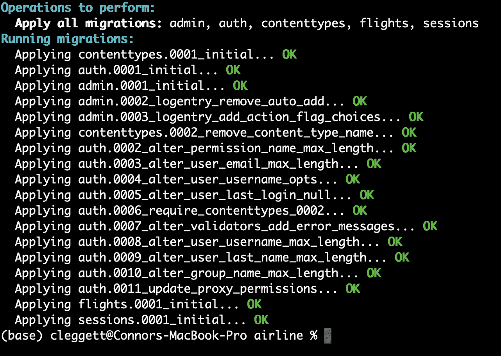

## Shell

现在，为了开始向数据库添加信息并对其进行操作，我们可以进入 Django 的 shell，在那里我们可以在项目中运行 Python 命令。

[PRE25]

[PRE26]

当我们查询数据库时，我们看到我们只得到一个名为`Flight object (1)`的航班。这个名字不是很 informative，但我们可以修复它。在`models.py`中，我们将定义一个`__str__`函数，该函数提供将 Flight 对象转换为字符串的指令：

[PRE27]

现在，当我们回到 shell 时，我们的输出更易于阅读：

[PRE28]

这是一个好的开始，但回想一下之前，我们不想为每个航班存储城市名称作为起点和终点，所以我们可能需要一个与航班模型相关联的机场模型：

[PRE29]

我们在新的`Airport`类中已经看到了所有内容，但`Flight`类中`origin`和`destination`字段的变化对我们来说是新的：

+   我们指定`origin`和`destination`字段是每个[外键](https://docs.djangoproject.com/en/4.0/topics/db/examples/many_to_one/)，这意味着它们引用另一个对象。

+   通过将`Airport`作为我们的第一个参数输入，我们指定了这个字段所引用的对象的类型。

+   下一个参数 `on_delete=models.CASCADE` 指示了如果删除机场时应该发生什么。在这种情况下，我们指定当删除机场时，与其关联的所有航班也应该被删除。除了 `CASCADE` 之外，还有 [其他几个选项](https://docs.djangoproject.com/en/4.0/ref/models/fields/#django.db.models.ForeignKey.on_delete)。

+   我们提供了一个 [相关名称](https://docs.djangoproject.com/en/4.0/ref/models/fields/#django.db.models.ForeignKey.related_name)，这为我们提供了一种通过给定机场作为起点或终点来搜索所有航班的途径。

每次我们在 `models.py` 中进行更改时，我们必须进行迁移然后迁移。请注意，您可能需要删除现有的从纽约到伦敦的航班，因为它不符合新的数据库结构。

[PRE30]

现在，让我们在 Django 命令行中尝试这些新的模型：

[PRE31]

### 启动我们的应用程序

我们现在可以开始构建一个应用程序，该应用程序围绕使用模型与数据库交互的过程。让我们首先为我们的航空公司创建一个索引路由。在 `urls.py` 中：

[PRE32]

在 `views.py` 文件中：

[PRE33]

在我们的新 `layout.html` 文件中：

[PRE34]

在新的 `index.html` 文件中：

[PRE35]

我们在这里所做的是创建了一个默认页面，其中列出了我们迄今为止创建的所有航班。当我们现在打开这个页面时，它看起来像这样

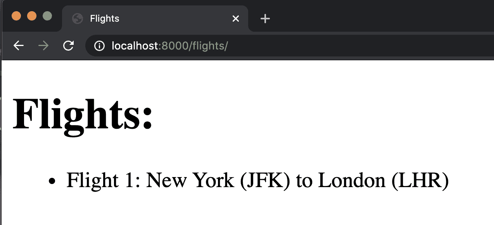

现在，让我们通过返回 Django 命令行来为我们的应用程序添加更多航班：

[PRE36]

现在，当我们再次访问我们的网站时

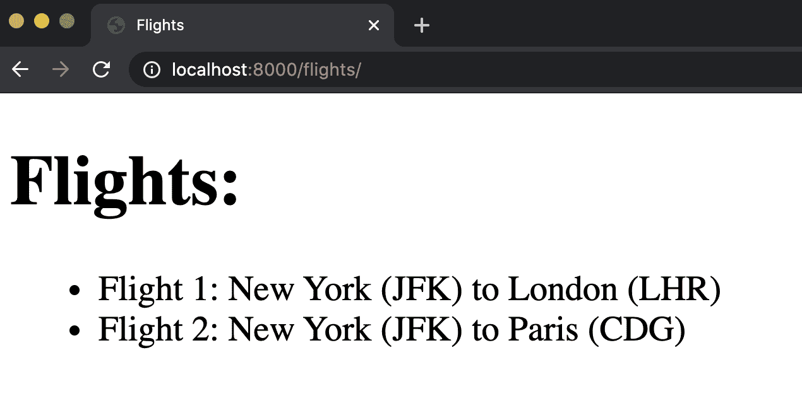

## Django 管理员

由于开发者经常需要创建新对象，就像我们在 shell 中所做的那样，Django 提供了一个 [默认管理界面](https://docs.djangoproject.com/en/4.0/ref/contrib/admin/)，这使得我们可以更容易地完成这项工作。要开始使用这个工具，我们必须首先创建一个管理用户：

[PRE37]

现在，我们必须通过在我们的应用中进入 `admin.py` 文件，并导入和注册我们的模型，将我们的模型添加到管理应用程序中。这告诉 Django 我们希望在管理应用程序中访问哪些模型。

[PRE38]

现在，当我们访问我们的网站并将 `/admin` 添加到 URL 中时，我们可以登录到一个看起来像这样的页面

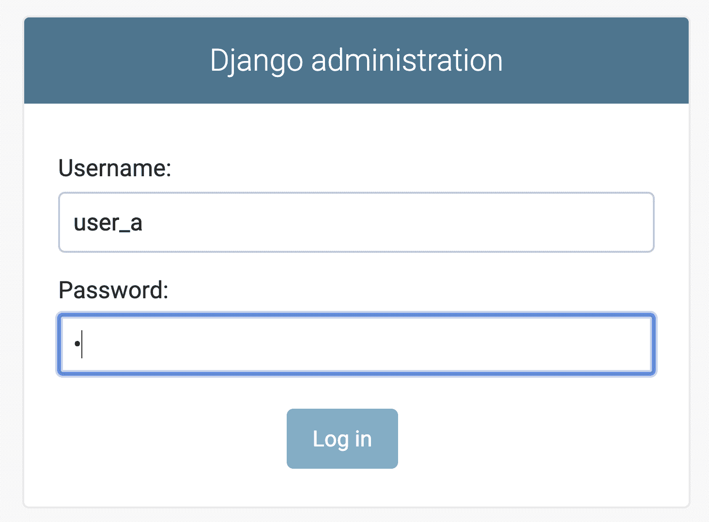

登录后，您将被带到下面的页面，您可以在其中创建、编辑和删除存储在数据库中的对象

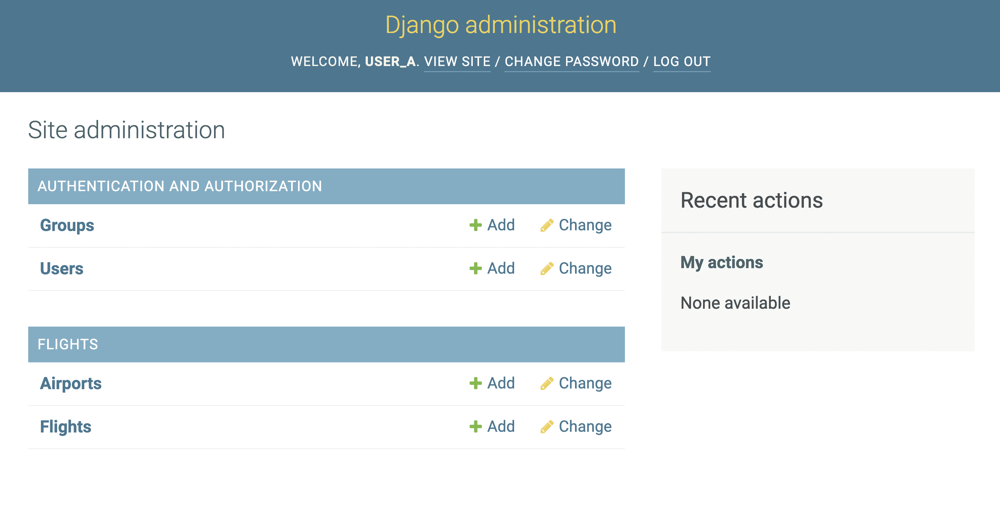

现在，让我们为我们的网站添加更多页面。我们将首先添加点击航班以获取更多航班信息的功能。为此，让我们创建一个包含航班 `id` 的 URL 路径：

[PRE39]

然后，在 `views.py` 中，我们将创建一个 `flight` 函数，它接受一个航班 ID 并渲染一个新的 HTML 页面：

[PRE40]

现在，我们将创建一个模板来显示这些航班信息，并包含一个链接回到主页

[PRE41]

最后，我们需要添加从一页链接到另一页的能力，因此我们将修改我们的索引页面以包含链接：

[PRE42]

现在主页看起来是这样的

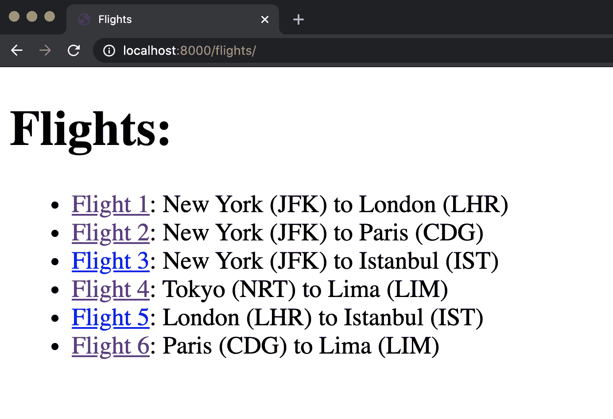

例如，当我们点击航班 5 时，我们会来到这个页面

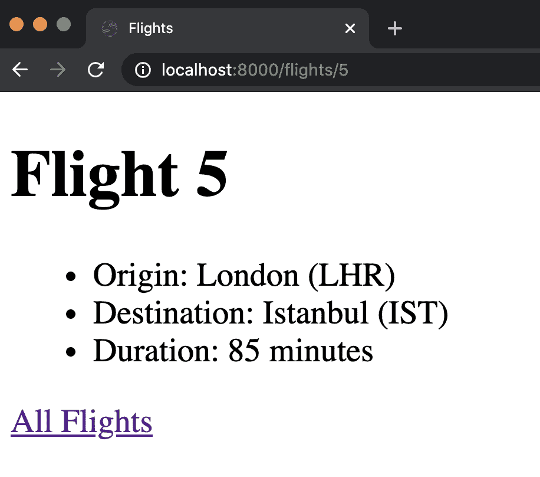

## 多对多关系

现在，让我们将乘客集成到我们的模型中。我们将首先创建一个乘客模型：

[PRE43]

+   正如我们讨论的那样，乘客与航班有 **多对多** 的关系，我们在 Django 中使用 ManyToManyField 来描述这种关系。

+   此字段中的第一个参数是与该对象相关联的类的类型。

+   我们提供了 `blank=True` 参数，这意味着乘客可以没有航班

+   我们添加了一个 `related_name`，它具有与之前相同的作用：它将允许我们找到给定航班上的所有乘客。

要实际应用这些更改，我们必须进行迁移并执行迁移。然后我们可以在 `admin.py` 中注册 `Passenger` 模型，并访问管理页面来创建一些乘客！

现在我们已经添加了一些乘客，让我们更新我们的航班页面，以便它显示航班上的所有乘客。我们首先访问 `views.py` 并更新我们的航班视图，以提供乘客列表作为上下文。我们使用之前定义的相关名称来访问列表。

[PRE44]

现在，将乘客列表添加到 `flight.html`：

[PRE45]

在这一点上，当我们点击航班 5 时，我们看到

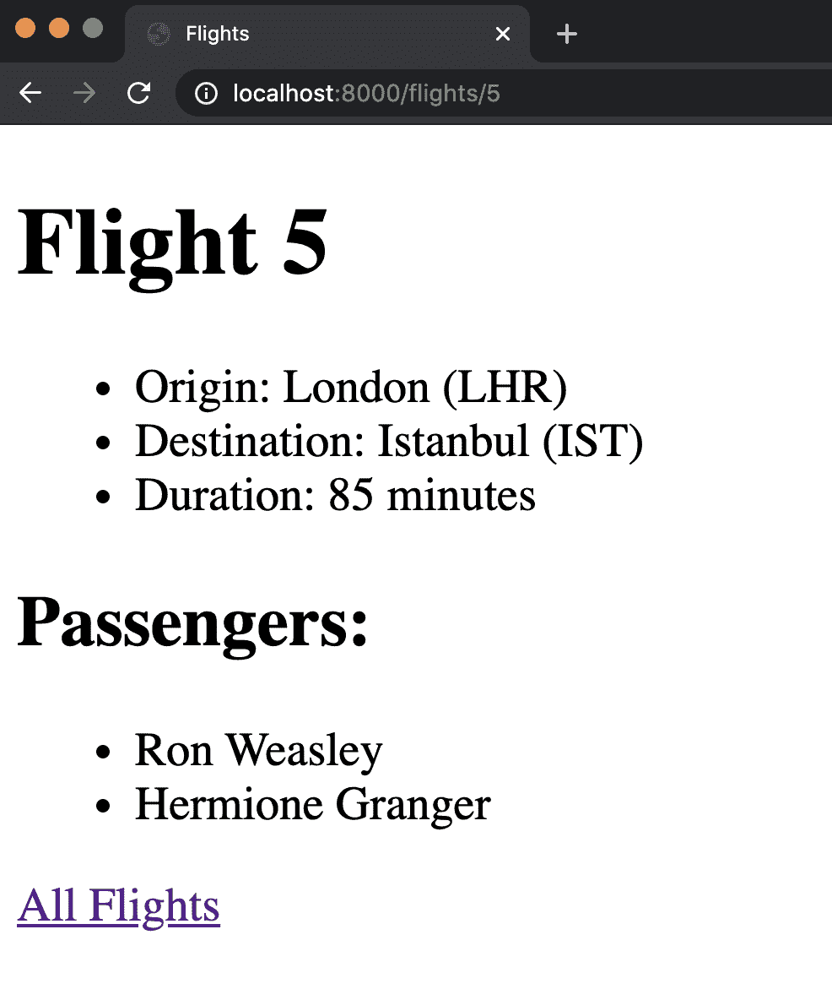

现在，让我们来为网站访客提供预订航班的能力。我们将通过在 `urls.py` 中添加一个预订路由来实现这一点：

[PRE46]

现在，我们将在 `views.py` 中添加一个名为 `book` 的函数，该函数将乘客添加到航班中：

[PRE47]

接下来，我们将向我们的航班模板添加一些上下文，以便页面可以通过 Django 的能力从查询中排除某些对象来访问当前不是航班乘客的每个人：

[PRE48]

现在，我们将向我们的航班页面 HTML 添加一个表单，使用选择输入字段：

[PRE49]

现在，让我们看看我访问航班页面并添加乘客后网站看起来像什么

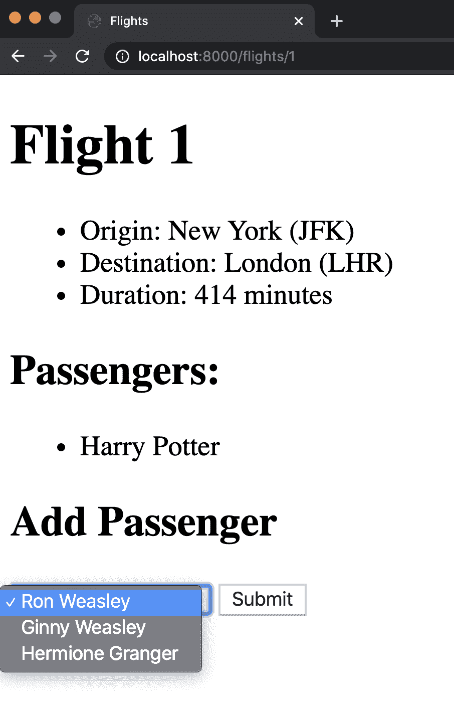

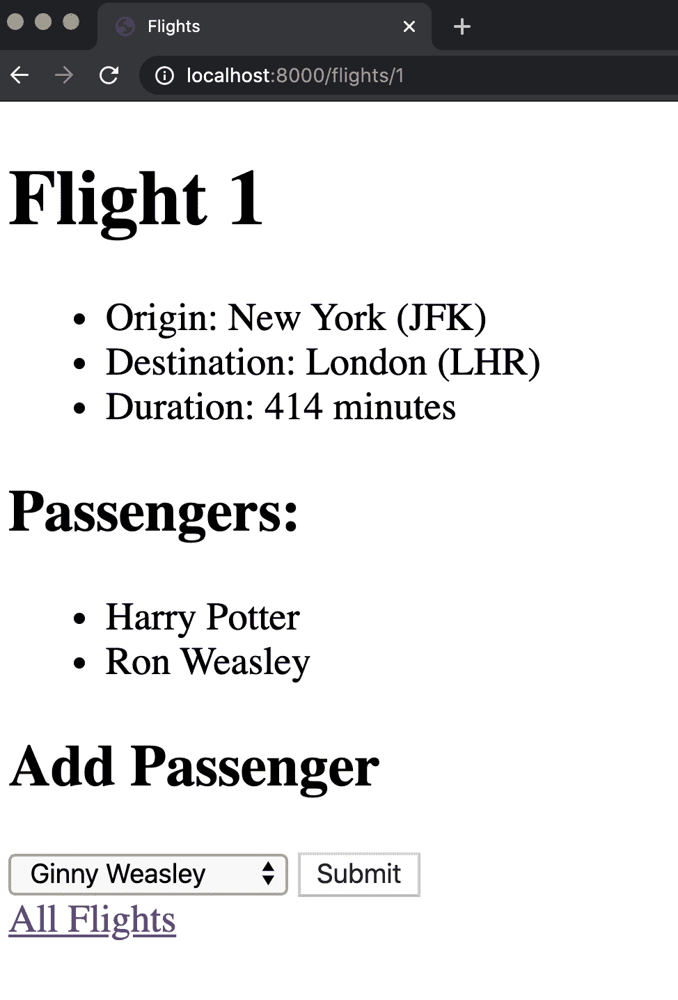

使用 Django 管理应用的一个优点是它可以自定义。例如，如果我们希望在管理界面中看到航班的各个方面，我们可以在 `admin.py` 中创建一个新的类，并在注册 `Flight` 模型时将其作为参数添加：

[PRE50]

现在，当我们访问航班的管理页面时，我们还可以看到 `id`

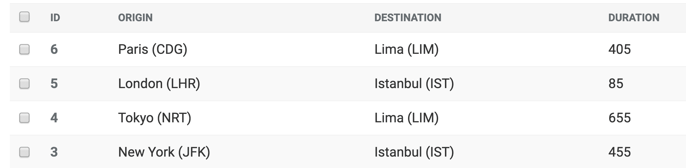

查阅 [Django 的管理文档](https://docs.djangoproject.com/en/4.0/ref/contrib/admin/) 以找到更多自定义管理应用的方法。

## 用户

今天讲座的最后我们将讨论认证的概念，即允许用户登录和退出网站。幸运的是，Django 为我们简化了这一过程，让我们通过一个示例来看看我们如何实现。我们首先创建一个名为`users`的新应用。在这里，我们将完成创建新应用的所有常规步骤，但在我们的新`urls.py`文件中，我们将添加一些额外的路由：

[PRE51]

让我们从创建一个用户可以登录的表单开始。我们将像往常一样创建一个`layout.html`文件，然后创建一个`login.html`文件，该文件包含一个表单，并在存在消息时显示该消息。

[PRE52]

现在，在`views.py`中，我们将添加三个函数：

[PRE53]

接下来，我们可以前往管理站点并添加一些用户。完成之后，我们将回到`views.py`并更新我们的`login_view`函数以处理带有用户名和密码的`POST`请求：

[PRE54]

现在，我们将创建一个`user.html`文件，当用户认证时，`index`函数将渲染此文件：

[PRE55]

最后，为了允许用户登出，我们将更新`logout_view`函数，使其使用 Django 的内置`logout`函数：

[PRE56]

现在我们已经完成，这是一个网站的演示

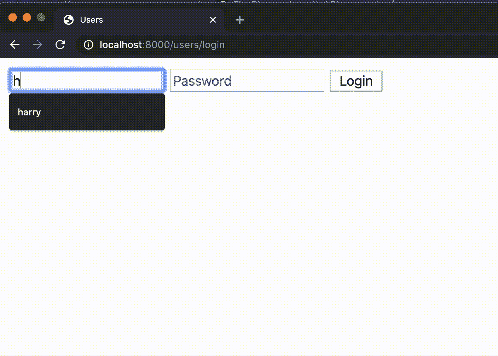

这节课就到这里！下次，我们将学习课程中的第二种编程语言：JavaScript。
