# 第五讲

> 原文：[`cs50.harvard.edu/web/notes/5/`](https://cs50.harvard.edu/web/notes/5/)

+   简介

+   JavaScript

+   事件

+   变量

+   querySelector

+   DOM 操作

    +   JavaScript 控制台

    +   箭头函数

    +   待办事项列表

+   间隔

+   本地存储

+   APIs

    +   JavaScript 对象

    +   货币兑换

## 简介

+   到目前为止，我们已经讨论了如何使用 HTML 和 CSS 构建简单的网页，以及如何使用 Git 和 GitHub 来跟踪代码更改并与他人协作。我们还熟悉了 Python 编程语言，开始使用 Django 创建网络应用程序，并学习了如何使用 Django 模型在我们的网站上存储信息。

+   今天，我们将介绍一种新的编程语言：JavaScript。

## JavaScript

让我们从几节课前的一个图表开始回顾：

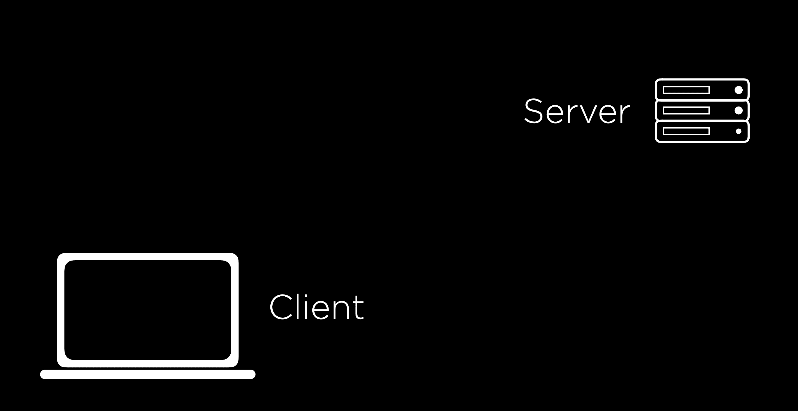

回想一下，在大多数在线交互中，我们有一个客户端/用户向服务器发送 HTTP 请求，服务器发送 HTTP 响应。我们迄今为止使用 Django 编写的所有 Python 代码都在服务器上运行。JavaScript 将允许我们在客户端运行代码，这意味着在运行时不需要与服务器交互，使我们的网站变得更加互动。

为了在我们的页面上添加一些 JavaScript，我们可以在 HTML 页面的某个位置添加一对 `<script>` 标签。我们使用 `<script>` 标签来通知浏览器，在两个标签之间写入的任何内容都是我们希望在用户访问我们的网站时执行的 JavaScript 代码。我们的第一个程序可能看起来像这样：

```
alert('Hello, world!'); 
```

JavaScript 中的 `alert` 函数向用户显示一条消息，然后他们可以将其关闭。为了展示这在实际 HTML 文档中的位置，这里有一个包含一些 JavaScript 的简单页面的示例：

```
<!DOCTYPE html>
<html lang="en">
    <head>
        <title>Hello</title>
        <script>
            alert('Hello, world!');
        </script>
    </head>
    <body>
        <h1>Hello!</h1>
    </body> </html> 
```

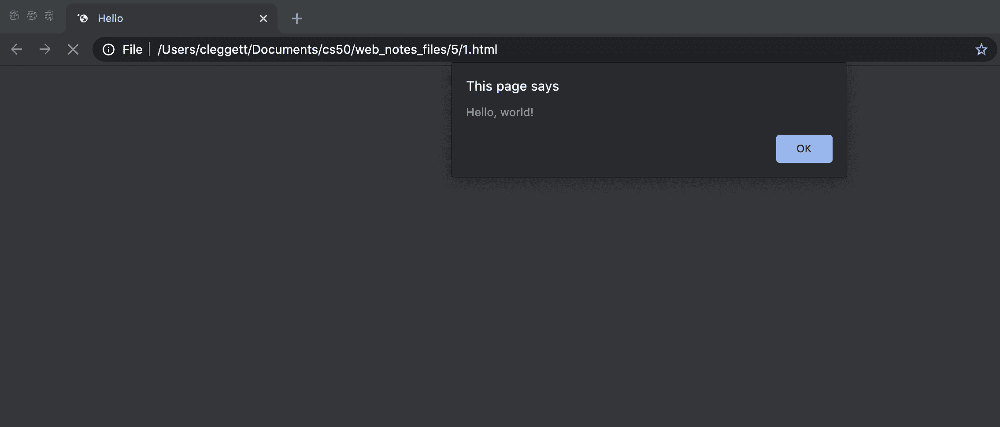

## 事件

JavaScript 的一个特性是它支持 [事件驱动编程](https://medium.com/@vsvaibhav2016/introduction-to-event-driven-programming-28161b79c223)，这使得它在网页编程中非常有用。

事件驱动编程是一种编程范式，它围绕事件的检测以及检测到事件时应采取的操作展开。

事件可以是几乎任何东西，包括按钮被点击、光标移动、输入响应或页面加载。几乎用户与网页交互的每一件事都可以被视为一个事件。在 JavaScript 中，我们使用 [事件监听器](https://www.w3schools.com/js/js_htmldom_eventlistener.asp) 来等待某些事件的发生，然后执行一些代码。

让我们从将上面的 JavaScript 转换为名为`hello`的[函数](https://www.w3schools.com/js/js_functions.asp)开始：

```
function hello() {
    alert('Hello, world!')
} 
```

现在，让我们工作在每次点击按钮时运行这个函数。为此，我们将在页面上创建一个带有`onclick`属性的 HTML 按钮，该属性为浏览器提供了当按钮被点击时应执行的操作的指令：

```
<button onclick="hello()">Click Here</button> 
```

这些更改允许我们在某些事件发生之前等待运行 JavaScript 代码的某些部分。

## 变量

JavaScript 是一种编程语言，就像 Python、C 或你之前工作过的任何其他语言一样，这意味着它具有与其他语言相同的许多功能，包括变量。在 JavaScript 中，我们可以使用以下三个关键字来分配值：

+   `var`：用于在全局范围内定义变量

```
var age = 20; 
```

+   `let`：用于在当前块（如函数或循环）中定义作用域有限的变量

```
let counter = 1; 
```

+   `const`：用于定义不会改变的值

```
const PI = 3.14; 
```

为了说明我们可以如何使用变量，让我们看看一个跟踪计数器的页面：

```
<!DOCTYPE html>
<html lang="en">
    <head>
        <title>Count</title>
        <script>
            let counter = 0;
            function count() {
                counter++;
                alert(counter);
            }
        </script>
    </head>
    <body>
        <h1>Hello!</h1>
        <button onclick="count()">Count</button>
    </body>
</html> 
```

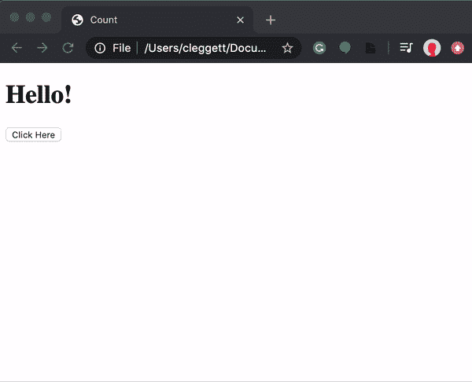

## `querySelector`

除了允许我们通过弹窗显示消息外，JavaScript 还允许我们更改页面上的元素。为了做到这一点，我们首先需要介绍一个名为`document.querySelector`的函数。这个函数会搜索并返回 DOM 中的元素。例如，我们会使用：

```
let heading = document.querySelector('h1'); 
```

以提取一个标题。然后，为了操作我们最近找到的元素，我们可以更改其`innerHTML`属性：

```
heading.innerHTML = `Goodbye!`; 
```

就像在 Python 中一样，我们也可以在 JavaScript 中利用[条件](https://www.w3schools.com/js/js_if_else.asp)。例如，让我们说，如果我们不想总是将标题更改为`Goodbye!`，我们希望在不同之间切换`Hello!`和`Goodbye!`。我们的页面可能看起来像下面这样。注意，在 JavaScript 中，我们使用`===`作为两个项目之间更强的比较，它还会检查对象是否属于同一类型。我们通常尽可能使用`===`。

```
<!DOCTYPE html>
<html lang="en">
    <head>
        <title>Count</title>
        <script>
            function hello() {
                const header = document.querySelector('h1');
                if (header.innerHTML === 'Hello!') {
                    header.innerHTML = 'Goodbye!';
                }
                else {
                    header.innerHTML = 'Hello!';
                }
            }
        </script>
    </head>
    <body>
        <h1>Hello!</h1>
        <button onclick="hello()">Click Here</button>
    </body>
</html> 
```

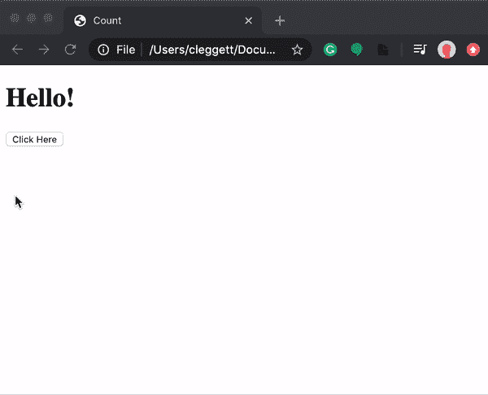

## DOM 操作

让我们利用 DOM 操作这个想法来改进我们的计数页面：

```
<!DOCTYPE html>
<html lang="en">
    <head>
        <title>Count</title>
        <script>
            let counter = 0;
            function count() {
                counter++;
                document.querySelector('h1').innerHTML = counter;
            }
        </script>
    </head>
    <body>
        <h1>0</h1>
        <button onclick="count()">Count</button>
    </body>
</html> 
```

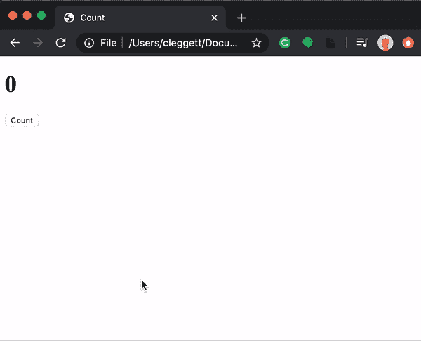

我们可以通过在计数器达到十的倍数时显示一个弹窗来使这个页面更有趣。在这个弹窗中，我们想要格式化一个字符串以自定义消息，在 JavaScript 中我们可以使用[模板字符串](https://developer.mozilla.org/en-US/docs/Web/JavaScript/Reference/Template_literals)来完成。模板字符串要求整个表达式周围有反引号（`` ` ``），任何替换项周围有美元符号和花括号。例如，让我们改变我们的计数函数

```
function count() {
    counter++;
    document.querySelector('h1').innerHTML = counter;

    if (counter % 10 === 0) {
        alert(`Count is now ${counter}`)
    }
} 
```


现在，让我们看看我们可以如何改进这个页面的设计。首先，就像我们试图避免使用 CSS 的内联样式一样，我们希望尽可能避免内联 JavaScript。在我们的计数器示例中，我们可以通过添加一行脚本，改变页面按钮的 `onclick` 属性，并从 `button` 标签内部移除 `onclick` 属性来实现这一点。

```
document.querySelector('button').onclick = count; 
```

关于我们刚刚所做的一件事需要注意的一点是，我们不是通过在后面添加括号来调用 `count` 函数，而是仅仅命名这个函数。这指定了我们只希望在按钮被点击时调用这个函数。这之所以可行，是因为，像 Python 一样，JavaScript 支持函数式编程，因此函数可以被当作值本身来处理。

仅通过上述更改是不够的，正如我们通过检查页面和查看浏览器控制台所看到的那样：

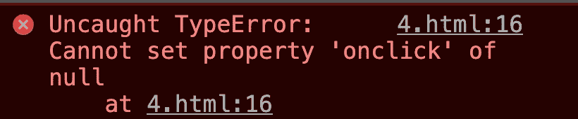

这个错误出现是因为当 JavaScript 使用 `document.querySelector('button')` 搜索元素时，它没有找到任何东西。这是因为页面加载需要一点时间，而我们的 JavaScript 代码在按钮被渲染之前就运行了。为了解决这个问题，我们可以指定代码只有在页面加载后才会运行，使用 [addEventListener](https://www.w3schools.com/jsref/met_document_addeventlistener.asp) 函数。这个函数接受两个参数：

1.  要监听的事件（例如：`'click'`）

1.  当检测到事件时运行的函数（例如：上面的 `hello`）

我们可以使用这个函数来确保代码只在所有内容加载完毕后运行：

```
document.addEventListener('DOMContentLoaded', function() {
    // Some code here
}); 
```

在上面的例子中，我们使用了一个 [匿名函数](https://www.w3schools.com/js/js_function_definition.asp)，这是一个从未被赋予名称的函数。将这些放在一起，我们的 JavaScript 现在看起来是这样的：

```
let counter = 0;

function count() {
    counter++;
    document.querySelector('h1').innerHTML = counter;

    if (counter % 10 === 0) {
        alert(`Count is now ${counter}`)
    }
}

document.addEventListener('DOMContentLoaded', function() {
    document.querySelector('button').onclick = count;
}); 
```

我们可以通过将 JavaScript 移入一个单独的文件来改进我们的设计。我们这样做的方式与我们为样式将 CSS 放入单独文件的方式非常相似：

1.  将所有的 JavaScript 代码都写入一个以 `.js` 结尾的单独文件中，比如 `index.js`。

1.  给 `<script>` 标签添加一个 `src` 属性，指向这个新文件。

对于我们的计数器页面，我们可以有一个名为 `counter.html` 的文件，其内容如下：

```
<!DOCTYPE html>
<html lang="en">
    <head>
        <title>Count</title>
        <script src="counter.js"></script>
    </head>
    <body>
        <h1>0</h1>
        <button>Count</button>
    </body>
</html> 
```

以及一个名为 `counter.js` 的文件，其内容如下：

```
let counter = 0;

function count() {
    counter++;
    document.querySelector('h1').innerHTML = counter;

    if (counter % 10 === 0) {
        alert(`Count is now ${counter}`)
    }
}

document.addEventListener('DOMContentLoaded', function() {
    document.querySelector('button').onclick = count;
}); 
```

将 JavaScript 放在单独的文件中有几个原因：

+   视觉吸引力：我们的单个 HTML 和 JavaScript 文件变得更加易读。

+   HTML 文件之间的访问：现在我们可以有多个 HTML 文件，它们共享相同的 JavaScript。

+   协作：现在，我们可以轻松地让一个人处理 JavaScript，而另一个人处理 HTML。

+   导入：我们可以导入其他人已经编写的 JavaScript 库。例如 [Bootstrap](https://getbootstrap.com/docs/4.5/getting-started/introduction/#js) 有自己的 JavaScript 库，你可以包含它来使你的网站更具交互性。

让我们开始另一个示例页面，这个页面可以更加互动。下面，我们将创建一个页面，用户可以在其中输入他们的名字以获取自定义问候。

```
<!DOCTYPE html>
<html lang="en">
<head>
    <title>Hello</title>
    <script>
        document.addEventListener('DOMContentLoaded', function() {
            document.querySelector('form').onsubmit = function() {
                const name = document.querySelector('#name').value;
                alert(`Hello, ${name}`);
            };
        });
    </script>
</head>
<body>
    <form>
        <input autofocus id="name" placeholder="Name" type="text">
        <input type="submit">
    </form>
</body>
</html> 
```

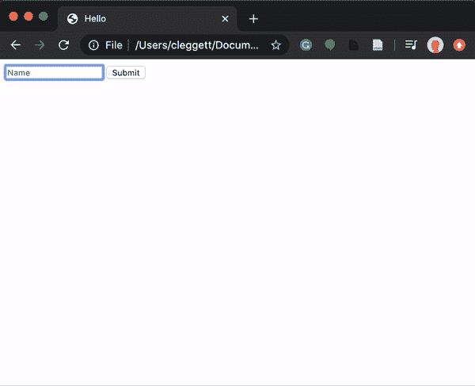

关于上面页面的几点说明：

+   我们在`name`输入的`autofocus`字段中使用了`data-SOMETHING`属性来指示光标应在页面加载时立即设置在该输入内。

+   我们在`document.querySelector`内部使用`#name`来查找具有`id`为`name`的元素。在这个函数中，我们可以使用与 CSS 中相同的所有选择器。

+   我们使用输入字段的`value`属性来查找当前输入的内容。

我们可以使用 JavaScript 不仅向页面添加 HTML，还可以更改页面的样式！在下面的页面中，我们使用按钮来更改标题的颜色。

```
<!DOCTYPE html>
<html lang="en">
<head>
     <title>Colors</title>
     <script>
         document.addEventListener('DOMContentLoaded', function() {
            document.querySelectorAll('button').forEach(function(button) {
                button.onclick = function() {
                    document.querySelector("#hello").style.color = button.dataset.color;
                }
            });
         });
     </script>
</head>
<body>
    <h1 id="hello">Hello</h1>
    <button data-color="red">Red</button>
    <button data-color="blue">Blue</button>
    <button data-color="green">Green</button>
</body>
</html> 
```

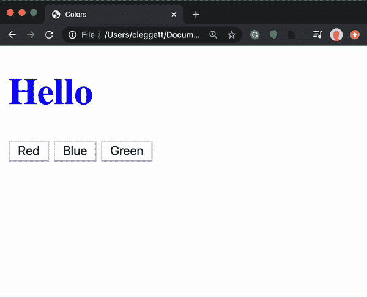

关于上面页面的几点说明：

+   我们使用`style.SOMETHING`属性来更改元素的风格。

+   我们使用`data-SOMETHING`属性将数据分配给 HTML 元素。我们可以在 JavaScript 中使用元素的`dataset`属性稍后访问该数据。

+   我们使用`querySelectorAll`函数来获取一个包含所有匹配查询的元素的[Node List](https://www.w3schools.com/js/js_htmldom_nodelist.asp)（类似于 Python 列表或 JavaScript [数组](https://www.w3schools.com/js/js_arrays.asp)）。

+   JavaScript 中的`forEach`函数接受另一个函数，并将该函数应用于列表或数组中的每个元素。

### JavaScript 控制台

控制台是一个有用的工具，可以用来测试小块代码和调试。你可以在控制台中编写和运行 JavaScript 代码，这可以通过在网页浏览器中检查元素然后点击`console`来实现。（具体过程可能因浏览器而异。）调试的一个有用工具是向控制台打印，你可以使用`console.log`函数来完成。例如，在上面的`colors.html`页面中，我可以添加以下行：

```
console.log(document.querySelectorAll('button')); 
```

这在控制台给出了以下结果：

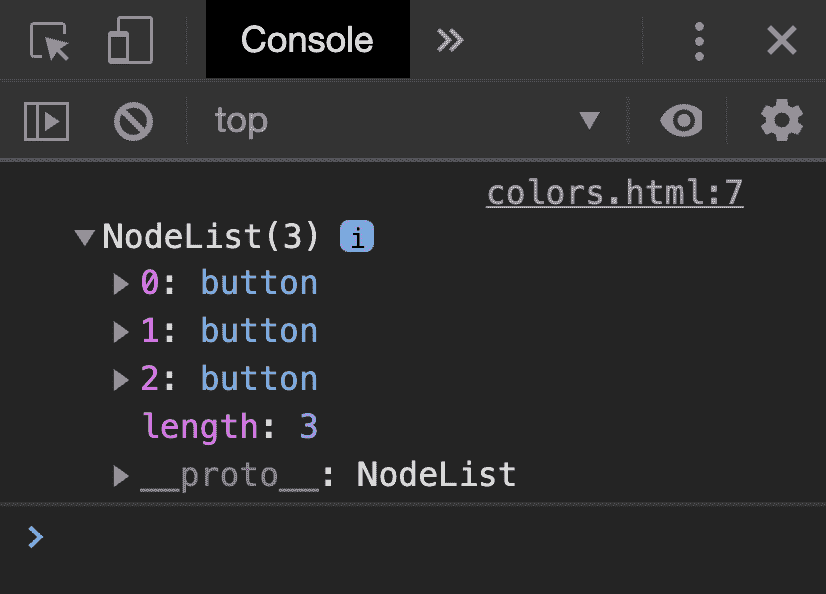

### 箭头函数

除了我们之前已经看到的传统函数表示法之外，JavaScript 现在还允许我们使用[箭头函数](https://www.w3schools.com/js/js_arrow_function.asp)，其中有一个输入（或当没有输入时括号）后跟`=>`，然后是执行一些代码。例如，我们可以修改上面的脚本以使用匿名箭头函数：

```
document.addEventListener('DOMContentLoaded', () => {
    document.querySelectorAll('button').forEach(button => {
        button.onclick = () => {
            document.querySelector("#hello").style.color = button.dataset.color;
        }
    });
}); 
```

我们也可以有命名函数，使用箭头，就像对`count`函数的这种重写：

```
count = () => {
    counter++;
    document.querySelector('h1').innerHTML = counter;

    if (counter % 10 === 0) {
        alert(`Count is now ${counter}`)
    }
} 
```

要了解我们可以使用的一些其他事件，让我们看看如何使用下拉菜单而不是三个单独的按钮来实现我们的颜色切换器。我们可以使用`onchange`属性检测`select`元素的变化。在 JavaScript 中，[this](https://www.w3schools.com/js/js_this.asp)是一个根据其使用上下文而变化的关键字。在事件处理程序的情况下，`this`指的是触发事件的那个对象。

```
<!DOCTYPE html>
<html lang="en">
    <head>
        <title>Colors</title>
        <script>
            document.addEventListener('DOMContentLoaded', function() {
                document.querySelector('select').onchange = function() {
                    document.querySelector('#hello').style.color = this.value;
                }
            });
        </script>
    </head>
    <body>
        <h1 id="hello">Hello</h1>
        <select>
            <option value="black">Black</option>
            <option value="red">Red</option>
            <option value="blue">Blue</option>
            <option value="green">Green</option>
        </select>

    </body>
</html> 
```

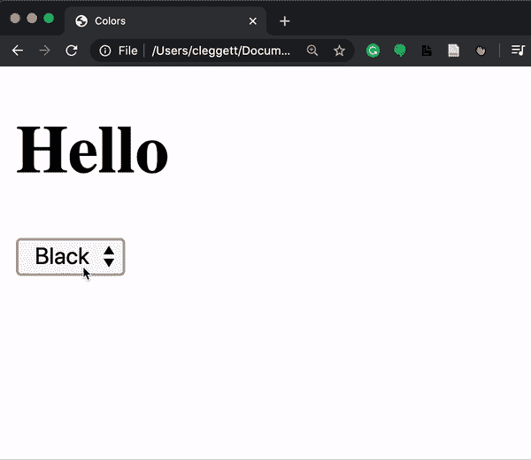

在 JavaScript 中，我们可以检测许多其他[事件](https://www.w3schools.com/js/js_events.asp)，包括以下常见的：

+   `onclick`

+   `onmouseover`

+   `onkeydown`

+   `onkeyup`

+   `onload`

+   `onblur`

+   …

### TODO 列表

为了将本节课学到的几个知识点结合起来，让我们尝试使用 JavaScript 制作一个完全基于 JavaScript 的 TODO 列表。我们将从编写页面的 HTML 布局开始。注意以下内容，我们为无序列表留出了空间，但我们还没有添加任何内容。同时注意，我们在`tasks.js`中添加了一个链接，我们将在这里编写 JavaScript。

```
<!DOCTYPE html>
<html lang="en">
    <head>
        <title>Tasks</title>
        <script src="tasks.js"></script>
    </head>
    <body>
        <h1>Tasks</h1>
        <ul id="tasks"></ul>
        <form>
            <input id="task" placeholder = "New Task" type="text">
            <input id="submit" type="submit">
        </form>
    </body>
</html> 
```

现在，这是我们的代码，我们可以将其保存在`tasks.js`中。以下是一些关于您将看到的内容的说明：

+   这段代码与讲座中的代码略有不同。在这里，我们只在开始时查询我们的提交按钮和输入任务字段一次，并将这两个值存储在变量`submit`和`newTask`中。

+   我们可以通过设置其`disabled`属性为`false`/`true`来启用/禁用按钮。

+   在 JavaScript 中，我们使用`.length`来查找字符串和数组等对象的长短。

+   在脚本的末尾，我们添加一行`return false`。这防止了表单的默认提交，这可能涉及重新加载当前页面或重定向到新页面。

+   在 JavaScript 中，我们可以使用[createElement](https://www.w3schools.com/jsref/met_document_createelement.asp)函数创建 HTML 元素。然后我们可以使用`append`函数将这些元素添加到 DOM 中。

```
// Wait for page to load
document.addEventListener('DOMContentLoaded', function() {

    // Select the submit button and input to be used later
    const submit = document.querySelector('#submit');
    const newTask = document.querySelector('#task');

    // Disable submit button by default:
    submit.disabled = true;

    // Listen for input to be typed into the input field
    newTask.onkeyup = () => {
        if (newTask.value.length > 0) {
            submit.disabled = false;
        }
        else {
            submit.disabled = true;
        }
    }

    // Listen for submission of form
    document.querySelector('form').onsubmit = () => {

        // Find the task the user just submitted
        const task = newTask.value;

        // Create a list item for the new task and add the task to it
        const li = document.createElement('li');
        li.innerHTML = task;

        // Add new element to our unordered list:
        document.querySelector('#tasks').append(li);

        // Clear out input field:
        newTask.value = '';

        // Disable the submit button again:
        submit.disabled = true;

        // Stop form from submitting
        return false;
    }
}); 
```

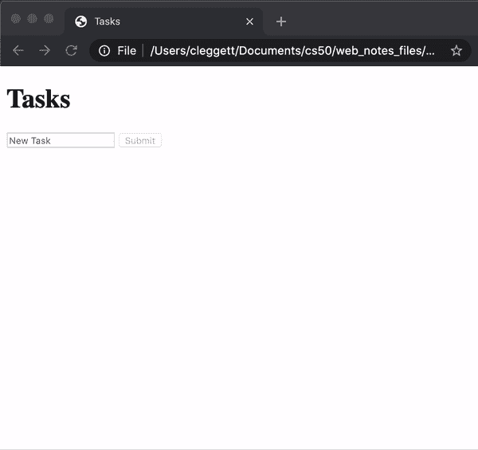

## 间隔

除了指定在事件触发时运行函数外，我们还可以设置函数在设定的时间后运行。例如，让我们回到我们的计数器页面的脚本，并添加一个间隔，即使用户没有点击任何东西，计数器也会每秒增加。为此，我们使用[setInterval](https://www.w3schools.com/jsref/met_win_setinterval.asp)函数，该函数接受一个要运行的函数和一个函数运行之间的时间（以毫秒为单位）作为参数。

```
let counter = 0;

function count() {
    counter++;
    document.querySelector('h1').innerHTML = counter;
}

document.addEventListener('DOMContentLoaded', function() {
    document.querySelector('button').onclick = count;

    setInterval(count, 1000);
}); 
```

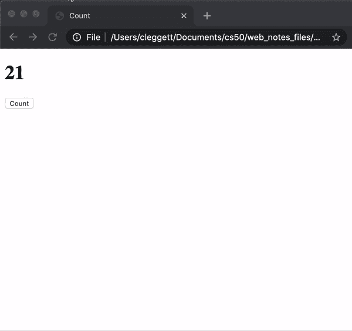

## 本地存储

到目前为止，我们所有的网站都有一个需要注意的事情，那就是每次我们重新加载页面时，我们所有的信息都会丢失。标题颜色会变回黑色，计数器会回到 0，所有的任务都会被清除。有时这是我们想要的，但有时我们希望能够存储信息，以便用户返回网站时可以使用。

我们可以这样做的一种方式是使用[本地存储](https://www.w3schools.com/jsref/prop_win_localstorage.asp)，或者将信息存储在用户的网页浏览器中，我们可以在以后访问它。这些信息以一组键值对的形式存储，几乎就像 Python 字典一样。为了使用本地存储，我们将使用两个关键函数：

+   `localStorage.getItem(key)`: 这个函数在本地存储中搜索具有给定键的条目，并返回与该键关联的值。

+   `localStorage.setItem(key, value)`: 这个函数在本地存储中设置一个条目，将键与一个新值关联。

让我们看看如何使用这些新功能来更新我们的计数器！在下面的代码中，

```
// Check if there is already a value in local storage
if (!localStorage.getItem('counter')) {

    // If not, set the counter to 0 in local storage
    localStorage.setItem('counter', 0);
}

function count() {
    // Retrieve counter value from local storage
    let counter = localStorage.getItem('counter');

    // update counter
    counter++;
    document.querySelector('h1').innerHTML = counter;

    // Store counter in local storage
    localStorage.setItem('counter', counter);
}

document.addEventListener('DOMContentLoaded', function() {
    // Set heading to the current value inside local storage
    document.querySelector('h1').innerHTML = localStorage.getItem('counter');
    document.querySelector('button').onclick = count;
}); 
```

## APIs

### JavaScript 对象

一个[JavaScript 对象](https://www.w3schools.com/js/js_objects.asp)与 Python 字典非常相似，因为它允许我们存储键值对。例如，我可以创建一个代表哈利·波特的 JavaScript 对象：

```
let person = {
    first: 'Harry',
    last: 'Potter'
}; 
```

我可以使用括号或点符号来访问或更改该对象的部分：

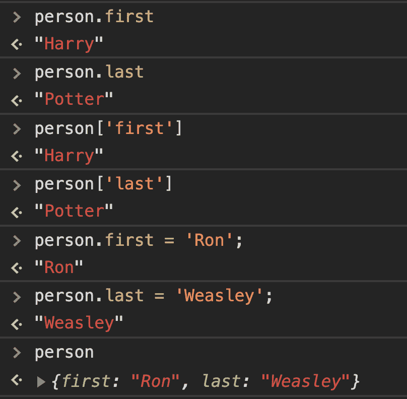

JavaScript 对象的一个非常有用的用途是在一个网站和另一个网站之间传输数据，尤其是在使用[APIs](https://www.mulesoft.com/resources/api/what-is-an-api)时

API，或应用程序编程接口，是两个不同应用程序之间结构化通信的形式。

例如，我们可能希望我们的应用程序从谷歌地图、亚马逊或某些天气预报服务中获取信息。我们可以通过调用服务的 API 来实现这一点，它将返回结构化数据给我们，通常以[JSON](https://www.w3schools.com/js/js_json_intro.asp)（JavaScript 对象表示法）的形式。例如，一个航班在 JSON 形式中可能看起来像这样：

```
{  "origin":  "New York",  "destination":  "London",  "duration":  415  } 
```

JSON 中的值不必仅仅是字符串和数字，如上面的例子所示。我们还可以存储列表，甚至其他 JavaScript 对象：

```
{  "origin":  {  "city":  "New York",  "code":  "JFK"  },  "destination":  {  "city":  "London",  "code":  "LHR"  },  "duration":  415  } 
```

### 货币兑换

为了展示我们如何在应用程序中使用 API，让我们构建一个应用程序，我们可以找到两种货币之间的汇率。在整个练习中，我们将使用[欧洲中央银行的汇率 API](https://exchangeratesapi.io)。通过访问他们的网站，你会看到 API 的文档，这通常是当你想使用 API 时开始的好地方。我们可以通过访问 URL 来测试这个 API：[`api.exchangeratesapi.io/latest?base=USD`](https://api.exchangeratesapi.io/latest?base=USD)。当你访问这个页面时，你会看到美元与其他许多货币之间的汇率，以 JSON 形式呈现。你还可以通过将 URL 中的 GET 参数从`USD`更改为任何其他货币代码来更改你得到的汇率。

让我们通过创建一个名为`currency.html`的新 HTML 文件并将其链接到一个 JavaScript 文件来实现将此 API 集成到应用程序中，但保持主体为空：

```
<!DOCTYPE html>
<html lang="en">
    <head>
        <title>Currency Exchange</title>
        <script src="currency.js"></script>
    </head>
    <body></body>
</html> 
```

现在，我们将使用一种叫做 [AJAX](https://www.w3schools.com/js/js_ajax_intro.asp) 的东西，或者称为异步 JavaScript 和 XML，它允许我们在页面加载后访问外部页面的信息。为了做到这一点，我们将使用 [fetch](https://javascript.info/fetch) 函数，这将允许我们发送 HTTP 请求。`fetch` 函数返回一个 [promise](https://web.dev/promises/)。我们在这里不会详细讨论 promise 的细节，但我们可以将其视为某个时刻会传递过来的值，但不一定是立即。我们通过给它们一个 `.then` 属性来处理 promise，该属性描述了在接收到 `response` 时应该执行的操作。下面的代码片段将把我们的响应记录到控制台。

```
document.addEventListener('DOMContentLoaded', function() {
    // Send a GET request to the URL
    fetch('https://api.exchangeratesapi.io/latest?base=USD')
    // Put response into json form
    .then(response => response.json())
    .then(data => {
        // Log data to the console
        console.log(data);
    });
}); 
```

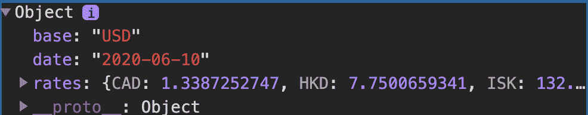

关于上述代码的一个重要观点是，`.then` 的参数始终是一个函数。尽管看起来我们正在创建 `response` 和 `data` 这两个变量，但这些变量仅仅是两个匿名函数的参数。

而不是简单地记录这些数据，我们可以使用 JavaScript 在屏幕上显示一条消息，如下面的代码所示：

```
document.addEventListener('DOMContentLoaded', function() {
    // Send a GET request to the URL
    fetch('https://api.exchangeratesapi.io/latest?base=USD')
    // Put response into json form
    .then(response => response.json())
    .then(data => {

        // Get rate from data
        const rate = data.rates.EUR;

        // Display message on the screen
        document.querySelector('body').innerHTML = `1 USD is equal to ${rate.toFixed(3)} EUR.`;
    });
}); 
```

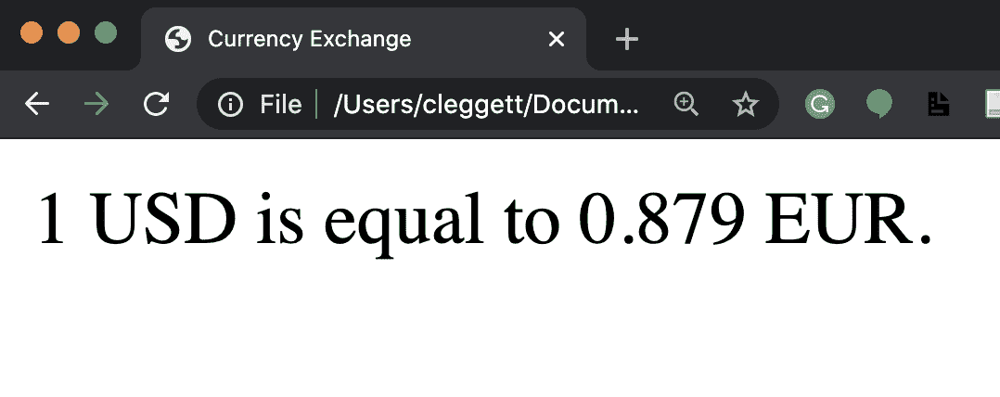

现在，让我们通过允许用户选择他们想看到的货币来使网站更加互动。我们将首先修改我们的 HTML，以便用户可以输入货币：

```
<!DOCTYPE html>
<html lang="en">
    <head>
        <title>Currency Exchange</title>
        <script src="currency.js"></script>
    </head>
    <body>
        <form>
            <input id="currency" placeholder="Currency" type="text">
            <input type="submit" value="Convert">
        </form>
        <div id="result"></div>
    </body>
</html> 
```

现在，我们将对 JavaScript 进行一些修改，使其仅在表单提交时才改变，并考虑到用户的输入。我们还将在这里添加一些错误检查：

```
document.addEventListener('DOMContentLoaded', function() {
    document.querySelector('form').onsubmit = function() {

        // Send a GET request to the URL
        fetch('https://api.exchangeratesapi.io/latest?base=USD')
        // Put response into json form
        .then(response => response.json())
        .then(data => {
            // Get currency from user input and convert to upper case
            const currency = document.querySelector('#currency').value.toUpperCase();

            // Get rate from data
            const rate = data.rates[currency];

            // Check if currency is valid:
            if (rate !== undefined) {
                // Display exchange on the screen
                document.querySelector('#result').innerHTML = `1 USD is equal to ${rate.toFixed(3)}  ${currency}.`;
            }
            else {
                // Display error on the screen
                document.querySelector('#result').innerHTML = 'Invalid Currency.';
            }
        })
        // Catch any errors and log them to the console
        .catch(error => {
            console.log('Error:', error);
        });
        // Prevent default submission
        return false;
    }
}); 
```

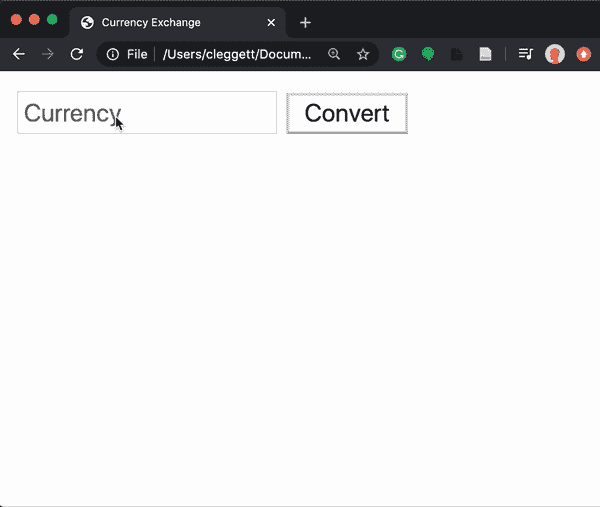

这节课的内容就到这里！下次，我们将探讨如何使用 JavaScript 创建更加吸引人的用户界面！
