# 第 6 讲

> 原文：[`cs50.harvard.edu/web/notes/6/`](https://cs50.harvard.edu/web/notes/6/)

+   简介

+   用户界面

+   单页应用程序

+   滚动

    +   无限滚动

+   动画

+   React

    +   加法

## 简介

+   到目前为止，我们已经讨论了如何使用 HTML 和 CSS 构建简单的网页，以及如何使用 Git 和 GitHub 来跟踪我们代码的变化并与他人协作。我们还熟悉了 Python 编程语言，开始使用 Django 创建 Web 应用程序，并学习了如何使用 Django 模型在我们的网站上存储信息。然后我们介绍了 JavaScript，并学习了如何使用它使网页更加互动。

+   今天，我们将讨论用户界面设计中的常见范式，使用 JavaScript 和 CSS 使我们的网站更加用户友好。

## 用户界面

用户界面是网页访问者与该页面交互的方式。作为 Web 开发者，我们的目标是让这些交互尽可能愉快，我们可以使用许多方法来实现这一点。

## 单页应用程序

以前，如果我们想要一个包含多个页面的网站，我们会通过 Django 应用程序中的不同路由来实现这一点。现在，我们有能力只加载一个页面，然后使用 JavaScript 来操作 DOM。这样做的一个主要优点是我们只需要修改实际改变的部分页面。例如，如果我们有一个不根据你的当前页面变化的导航栏（Nav Bar），我们就不想每次切换到页面的新部分时都要重新渲染那个导航栏。

让我们看看一个如何在 JavaScript 中模拟页面切换的例子：

```
<!DOCTYPE html>
<html lang="en">
    <head>
        <title>Single Page</title>
        <style>
            div {
                display: none;
            }
        </style>
        <script src="singlepage.js"></script>
    </head>
    <body>
        <button data-page="page1">Page 1</button>
        <button data-page="page2">Page 2</button>
        <button data-page="page3">Page 3</button>
        <div id="page1">
            <h1>This is page 1</h1>
        </div>
        <div id="page2">
            <h1>This is page 2</h1>
        </div>
        <div id="page3">
            <h1>This is page 3</h1>
        </div>
    </body>
</html> 
```

注意在上述 HTML 中，我们有三个按钮和三个 div。目前，div 中只包含一小部分文本，但我们可以想象每个 div 包含我们网站上的一页内容。现在，我们将添加一些 JavaScript，允许我们使用按钮在页面之间切换。

```
// Shows one page and hides the other two
function showPage(page) {

    // Hide all of the divs:
    document.querySelectorAll('div').forEach(div => {
        div.style.display = 'none';
    });

    // Show the div provided in the argument
    document.querySelector(`#${page}`).style.display = 'block';
}

// Wait for page to loaded:
document.addEventListener('DOMContentLoaded', function() {

    // Select all buttons
    document.querySelectorAll('button').forEach(button => {

        // When a button is clicked, switch to that page
        button.onclick = function() {
            showPage(this.dataset.page);
        }
    })
}); 
```

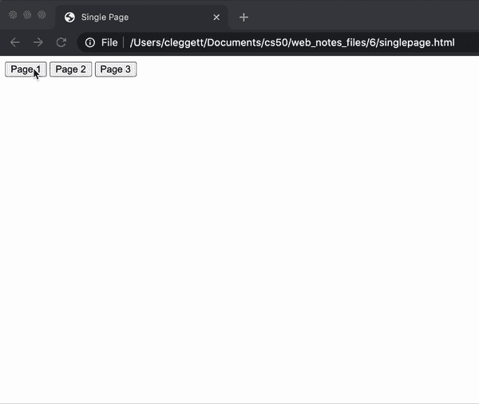

在许多情况下，当我们首次访问一个网站时，加载每一页的全部内容将是不高效的，因此我们需要使用服务器来访问新数据。例如，当你访问一个新闻网站时，如果它在你首次访问页面时必须加载所有可用的文章，那么网站加载将花费非常长的时间。我们可以通过使用与我们在前一次讲座中加载货币汇率时使用的类似策略来避免这个问题。这次，我们将探讨如何使用 Django 从我们的单页应用程序发送和接收信息。为了展示这是如何工作的，让我们看看一个简单的 Django 应用程序。它在`urls.py`中有两个 URL 模式：

```
urlpatterns = [
    path("", views.index, name="index"),
    path("sections/<int:num>", views.section, name="section")
] 
```

以及`views.py`中的两个相应路由。请注意，`section`路由接受一个整数，然后根据该整数返回一个基于 HTTP 响应的文本字符串。

```
from django.http import Http404, HttpResponse
from django.shortcuts import render

# Create your views here. def index(request):
    return render(request, "singlepage/index.html")

# The texts are much longer in reality, but have
# been shortened here to save space texts = ["Text 1", "Text 2", "Text 3"]

def section(request, num):
    if 1 <= num <= 3:
        return HttpResponse(texts[num - 1])
    else:
        raise Http404("No such section") 
```

现在，在我们的`index.html`文件中，我们将利用我们上次讲座中了解到的 AJAX，向服务器发送请求以获取特定部分的文本并在屏幕上显示：

```
<!DOCTYPE html>
<html lang="en">
    <head>
        <title>Single Page</title>
        <style>
        </style>
        <script>

            // Shows given section
            function showSection(section) {

                // Find section text from server
                fetch(`/sections/${section}`)
                .then(response => response.text())
                .then(text => {
                    // Log text and display on page
                    console.log(text);
                    document.querySelector('#content').innerHTML = text;
                });
            }

            document.addEventListener('DOMContentLoaded', function() {
                // Add button functionality
                document.querySelectorAll('button').forEach(button => {
                    button.onclick = function() {
                        showSection(this.dataset.section);
                    };
                });
            });
        </script>
    </head>
    <body>
        <h1>Hello!</h1>
        <button data-section="1">Section 1</button>
        <button data-section="2">Section 2</button>
        <button data-section="3">Section 3</button>
        <div id="content">
        </div>
    </body>
</html> 
```


现在，我们已经创建了一个网站，我们可以从服务器加载新数据，而无需重新加载整个 HTML 页面！

然而，我们网站的缺点是 URL 现在信息量较少。您会注意到在上面的视频中，即使我们从一个部分切换到另一个部分，URL 仍然保持不变。我们可以使用[JavaScript 历史 API](https://developer.mozilla.org/en-US/docs/Web/API/History_API)来解决这个问题。此 API 允许我们将信息推送到浏览器历史记录并手动更新 URL。让我们看看我们如何使用此 API。想象我们有一个与上一个项目相同的 Django 项目，但这次我们希望修改我们的脚本以使用历史 API：

```
// When back arrow is clicked, show previous section
window.onpopstate = function(event) {
    console.log(event.state.section);
    showSection(event.state.section);
}

function showSection(section) {
    fetch(`/sections/${section}`)
    .then(response => response.text())
    .then(text => {
        console.log(text);
        document.querySelector('#content').innerHTML = text;
    });

}

document.addEventListener('DOMContentLoaded', function() {
    document.querySelectorAll('button').forEach(button => {
        button.onclick = function() {
            const section = this.dataset.section;

            // Add the current state to the history
            history.pushState({section: section}, "", `section${section}`);
            showSection(section);
        };
    });
}); 
```

在上面的`showSection`函数中，我们使用了`history.pushState`函数。此函数根据三个参数向我们的浏览历史添加一个新元素：

1.  与状态相关的任何数据。

1.  大多数网络浏览器忽略的标题参数

1.  应该显示在 URL 中的内容

在上面的 JavaScript 中，我们做的另一个更改是在设置`onpopstate`参数，该参数指定了当用户点击后退箭头时应执行的操作。在这种情况下，我们希望在按钮按下时显示上一个部分。现在，网站看起来更加用户友好：

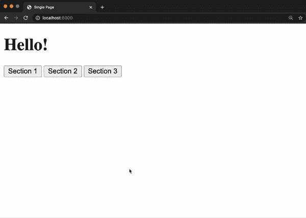

## 滚动

为了更新和访问浏览器历史记录，我们使用了名为[window](https://www.w3schools.com/js/js_window.asp)的重要 JavaScript 对象。窗口还有一些其他属性，我们可以使用它们来使我们的网站看起来更美观：

+   `window.innerWidth`：窗口的像素宽度

+   `window.innerHeight`：窗口的像素高度

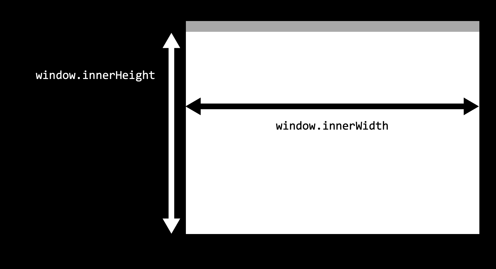

当前的窗口代表用户当前可见的内容，而[document](https://www.w3schools.com/js/js_htmldom_document.asp)则指整个网页，通常比窗口大得多，迫使用户滚动上下才能看到页面内容。为了处理滚动，我们可以访问其他变量：

+   `window.scrollY`：我们从页面顶部滚动的像素数

+   `document.body.offsetHeight`：整个文档的像素高度。

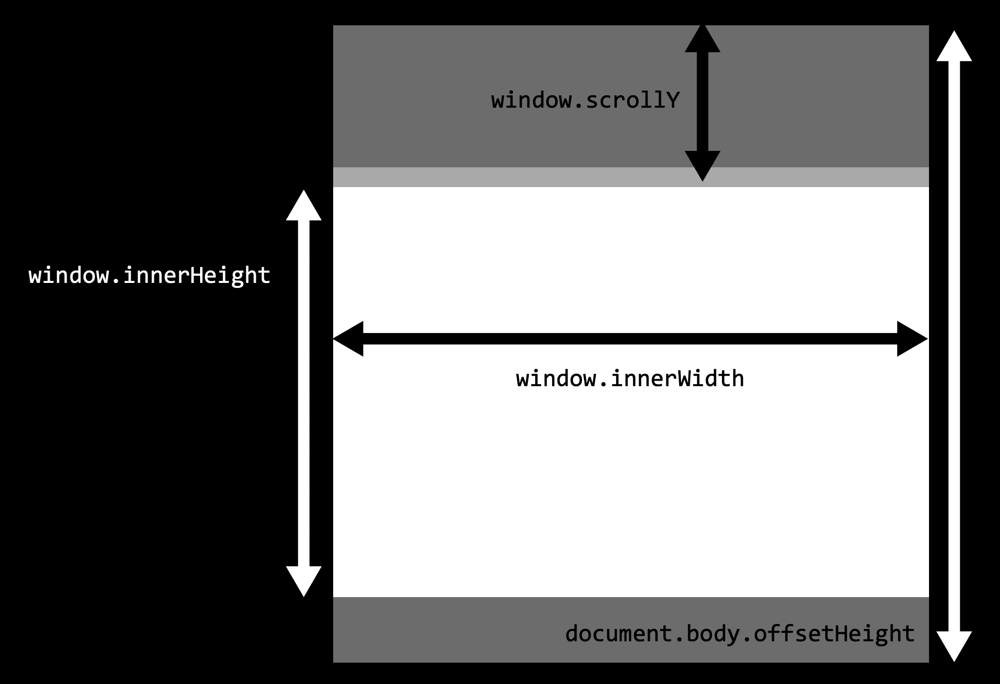

我们可以使用这些措施来确定用户是否已经滚动到页面的底部，使用比较 `window.scrollY + window.innerHeight >= document.body.offsetHeight`。例如，以下页面将在我们到达页面底部时将背景颜色更改为绿色：

```
<!DOCTYPE html>
<html lang="en">
    <head>
        <title>Scroll</title>
        <script>

            // Event listener for scrolling
            window.onscroll = () => {

                // Check if we're at the bottom
                if (window.innerHeight + window.scrollY >= document.body.offsetHeight) {

                    // Change color to green
                    document.querySelector('body').style.background = 'green';
                } else {

                    // Change color to white
                    document.querySelector('body').style.background = 'white';
                }

            };

        </script>
    </head>
    <body>
        <p>1</p>
        <p>2</p>
        <!-- More paragraphs left out to save space -->
        <p>99</p>
        <p>100</p>
    </body>
</html> 
```

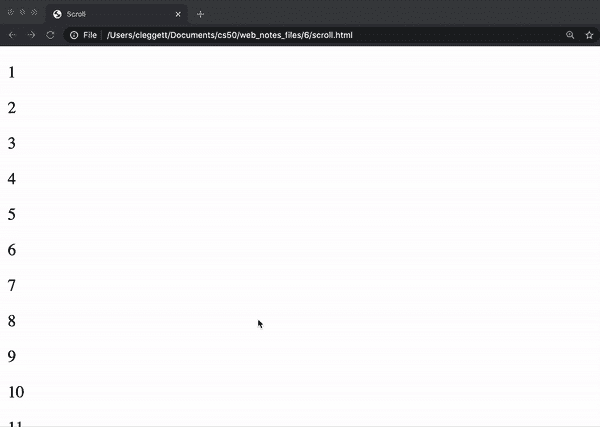

### 无限滚动

在页面底部更改背景颜色可能并不那么有用，但如果我们想实现 **无限滚动**，我们可能需要检测我们是否到达了页面的底部。例如，如果你在一个社交媒体网站上，你不想一次性加载所有帖子，你可能想先加载前十个，然后当用户到达底部时再加载下一个十个。让我们看看一个可以实现这一功能的 Django 应用程序。这个应用程序在 `urls.py` 中有两个路径

```
urlpatterns = [
    path("", views.index, name="index"),
    path("posts", views.posts, name="posts")
] 
```

以及 `views.py` 中的两个相应视图：

```
import time

from django.http import JsonResponse
from django.shortcuts import render

# Create your views here. def index(request):
    return render(request, "posts/index.html")

def posts(request):

    # Get start and end points
    start = int(request.GET.get("start") or 0)
    end = int(request.GET.get("end") or (start + 9))

    # Generate list of posts
    data = []
    for i in range(start, end + 1):
        data.append(f"Post #{i}")

    # Artificially delay speed of response
    time.sleep(1)

    # Return list of posts
    return JsonResponse({
        "posts": data
    }) 
```

注意，`posts` 视图需要两个参数：一个 `start` 点和一个 `end` 点。在这个视图中，我们创建了自己的 **API**，可以通过访问网址 `localhost:8000/posts?start=10&end=15` 来测试，它返回以下 JSON：

```
{  "posts":  [  "Post #10",  "Post #11",  "Post #12",  "Post #13",  "Post #14",  "Post #15"  ]  } 
```

现在，在网站加载的 `index.html` 模板中，我们一开始在主体中只有一个空的 `div` 和一些样式。注意，我们在开始时加载了静态文件，然后在我们 `static` 文件夹中引用了一个 JavaScript 文件。

```
 
<!DOCTYPE html>
<html>
    <head>
        <title>My Webpage</title>
        <style>
            .post {
                background-color: #77dd11;
                padding: 20px;
                margin: 10px;
            }

            body {
                padding-bottom: 50px;
            }
        </style>
        <script scr=""></script>
    </head>
    <body>
        <div id="posts">
        </div>
    </body>
</html> 
```

现在用 JavaScript，我们将等待用户滚动到页面底部，然后使用我们的 API 加载更多帖子：

```
// Start with first post
let counter = 1;

// Load posts 20 at a time
const quantity = 20;

// When DOM loads, render the first 20 posts
document.addEventListener('DOMContentLoaded', load);

// If scrolled to bottom, load the next 20 posts
window.onscroll = () => {
    if (window.innerHeight + window.scrollY >= document.body.offsetHeight) {
        load();
    }
};

// Load next set of posts
function load() {

    // Set start and end post numbers, and update counter
    const start = counter;
    const end = start + quantity - 1;
    counter = end + 1;

    // Get new posts and add posts
    fetch(`/posts?start=${start}&end=${end}`)
    .then(response => response.json())
    .then(data => {
        data.posts.forEach(add_post);
    })
};

// Add a new post with given contents to DOM
function add_post(contents) {

    // Create new post
    const post = document.createElement('div');
    post.className = 'post';
    post.innerHTML = contents;

    // Add post to DOM
    document.querySelector('#posts').append(post);
}; 
```

现在，我们已经创建了一个具有无限滚动的网站！

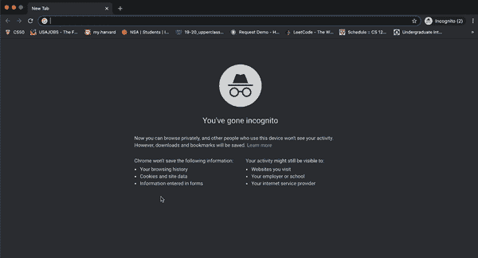

## 动画

我们还可以通过添加一些动画来使我们的网站更有趣。事实证明，除了提供样式外，CSS 还使我们能够轻松地动画化 HTML 元素。

要在 CSS 中创建动画，我们使用以下格式，其中动画的具体内容可以包括起始和结束样式（`to` 和 `from`）或持续时间不同阶段的样式（从 `0%` 到 `100%`）。例如：

```
@keyframes animation_name {
    from {
        /* Some styling for the start */
    }

    to {
        /* Some styling for the end */
    }
} 
```

或者：

```
@keyframes animation_name {
    0% {
        /* Some styling for the start */
    }

    75% {
        /* Some styling after 3/4 of animation */
    }

    100% {
        /* Some styling for the end */
    }
} 
```

然后，为了对一个元素应用动画，我们需要包含 `animation-name`、`animation-duration`（以秒为单位）和 `animation-fill-mode`（通常是 `forwards`）。例如，以下是一个页面，当第一次进入页面时标题会变大：

```
<!DOCTYPE html>
<html lang="en">
    <head>
        <title>Animate</title>
        <style>
            @keyframes grow {
                from {
                    font-size: 20px;
                }
                to {
                    font-size: 100px;
                }
            }

            h1 {
                animation-name: grow;
                animation-duration: 2s;
                animation-fill-mode: forwards;
            }
        </style>
    </head>
    <body>
        <h1>Welcome!</h1>
    </body>
</html> 
```

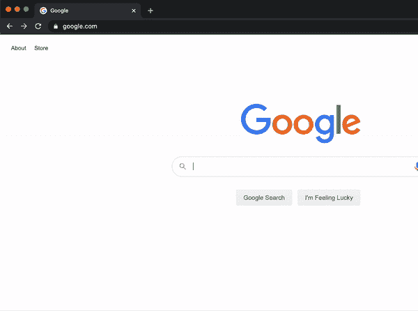

我们不仅可以操纵大小：以下示例展示了我们如何通过更改几行来改变标题的位置：

```
<!DOCTYPE html>
<html lang="en">
    <head>
        <title>Animate</title>
        <style>
            @keyframes move {
                from {
                    left: 0%;
                }
                to {
                    left: 50%;
                }
            }

            h1 {
                position: relative;
                animation-name: move;
                animation-duration: 2s;
                animation-fill-mode: forwards;
            }
        </style>
    </head>
    <body>
        <h1>Welcome!</h1>
    </body>
</html> 
```

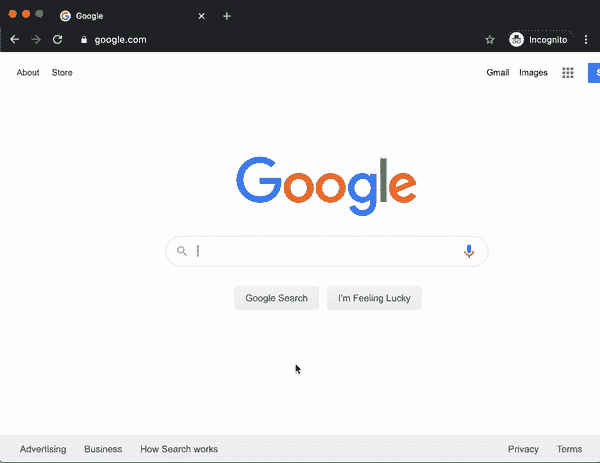

现在，让我们看看设置一些中间 CSS 属性。我们可以在动画的任何百分比处指定样式。在以下示例中，我们将标题从左到右移动，然后通过仅更改上面的动画将其移回左方

```
@keyframes move {
    0% {
        left: 0%;
    }
    50% {
        left: 50%;
    }
    100% {
        left: 0%;
    }
} 
```

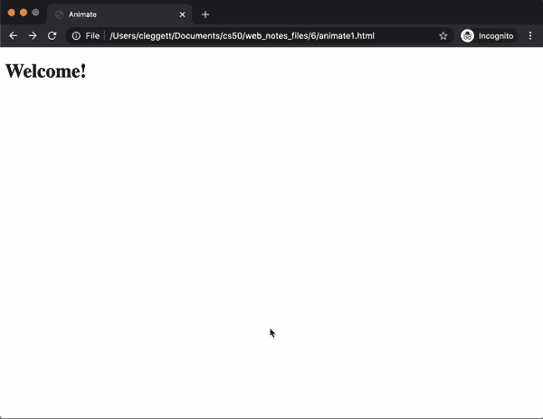

如果我们想要重复动画多次，可以将`animation-iteration-count`属性更改为大于一的数字（甚至可以设置为`infinite`以实现无限动画）。我们可以设置许多[动画属性](https://www.w3schools.com/cssref/css3_pr_animation.asp)，以改变动画的不同方面。

除了 CSS 之外，我们还可以使用 JavaScript 进一步控制动画。让我们使用我们的移动标题示例（具有无限重复）来展示我们如何创建一个开始和停止动画的按钮。假设我们已经有了一个动画、按钮和标题，我们可以添加以下脚本以开始和暂停动画：

```
document.addEventListener('DOMContentLoaded', function() {

    // Find heading
    const h1 = document.querySelector('h1');

    // Pause Animation by default
    h1.style.animationPlayState = 'paused';

    // Wait for button to be clicked
    document.querySelector('button').onclick = () => {

        // If animation is currently paused, begin playing it
        if (h1.style.animationPlayState == 'paused') {
            h1.style.animationPlayState = 'running';
        }

        // Otherwise, pause the animation
        else {
            h1.style.animationPlayState = 'paused';
        }
    }

}) 
```

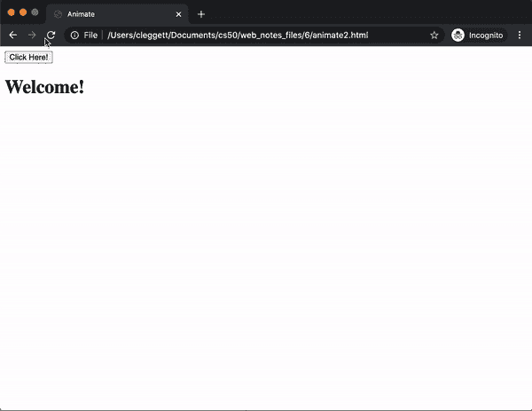

现在，让我们看看如何将我们对动画的新知识应用到我们之前制作的帖子页面。具体来说，假设我们希望在阅读完帖子后能够隐藏帖子。让我们想象一个与刚刚创建的项目相同的 Django 项目，但有一些 HTML 和 JavaScript 的细微差别。我们将做的第一个更改是修改`add_post`函数，这次也在帖子的右侧添加了一个按钮：

```
// Add a new post with given contents to DOM
function add_post(contents) {

    // Create new post
    const post = document.createElement('div');
    post.className = 'post';
    post.innerHTML = `${contents} <button class="hide">Hide</button>`;

    // Add post to DOM
    document.querySelector('#posts').append(post);
}; 
```

现在，我们将处理在点击“隐藏”按钮时隐藏帖子。为此，我们将添加一个事件监听器，它在用户点击页面上的任何地方时被触发。然后我们编写一个函数，该函数接受`event`作为参数，这很有用，因为我们可以使用`event.target`属性来访问被点击的元素。我们还可以使用`parentElement`类在 DOM 中找到给定元素的父元素。

```
// If hide button is clicked, delete the post
document.addEventListener('click', event => {

    // Find what was clicked on
    const element = event.target;

    // Check if the user clicked on a hide button
    if (element.className === 'hide') {
        element.parentElement.remove()
    }

}); 
```

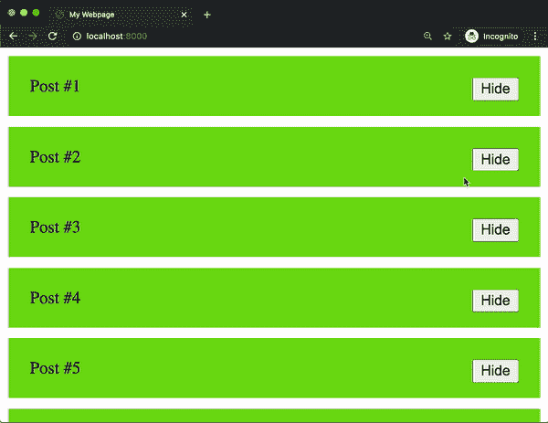

我们现在可以看到我们已经实现了隐藏按钮，但它看起来并没有可能那么漂亮。也许我们希望帖子在移除之前先淡出并缩小。为了做到这一点，我们首先创建一个 CSS 动画。下面的动画将花费 75%的时间将`opacity`从 1 变为 0，这本质上使得帖子缓慢淡出。然后，它将剩余的时间将所有与`height`相关的属性移动到 0，有效地将帖子缩小到无。

```
@keyframes hide {
    0% {
        opacity: 1;
        height: 100%;
        line-height: 100%;
        padding: 20px;
        margin-bottom: 10px;
    }
    75% {
        opacity: 0;
        height: 100%;
        line-height: 100%;
        padding: 20px;
        margin-bottom: 10px;
    }
    100% {
        opacity: 0;
        height: 0px;
        line-height: 0px;
        padding: 0px;
        margin-bottom: 0px;
    }
} 
```

接下来，我们将添加此动画到我们帖子的 CSS 中。注意，我们最初将`animation-play-state`设置为`paused`，这意味着帖子默认不会隐藏。

```
.post {
    background-color: #77dd11;
    padding: 20px;
    margin-bottom: 10px;
    animation-name: hide;
    animation-duration: 2s;
    animation-fill-mode: forwards;
    animation-play-state: paused;
} 
```

最后，我们希望在点击“隐藏”按钮后开始动画，然后移除帖子。我们可以通过编辑上面的 JavaScript 来实现这一点：

```
// If hide button is clicked, delete the post
document.addEventListener('click', event => {

    // Find what was clicked on
    const element = event.target;

    // Check if the user clicked on a hide button
    if (element.className === 'hide') {
        element.parentElement.style.animationPlayState = 'running';
        element.parentElement.addEventListener('animationend', () => {
            element.parentElement.remove();
        });
    }

}); 
```


如您所见，隐藏功能现在看起来好多了！

## React

到目前为止，你可以想象在一个更复杂的网站上需要多少 JavaScript 代码。我们可以通过使用 JavaScript 框架来减轻我们实际上需要编写的代码量，就像我们使用 Bootstrap 作为 CSS 框架来减少我们实际上需要编写的 CSS 量一样。最受欢迎的 JavaScript 框架之一是一个名为[React](https://reactjs.org/)的库。

到目前为止，在这个课程中，我们一直在使用**命令式编程**方法，其中我们给计算机一组要执行的语句。例如，为了更新 HTML 页面中的计数器，我们可能有一段看起来像这样的代码：

查看视图：

```
<h1>0</h1> 
```

逻辑：

```
let num = parseInt(document.querySelector("h1").innerHTML);
num += 1;
document.querySelector("h1").innerHTML = num; 
```

React 允许我们使用**声明式编程**，这将使我们能够简单地编写代码来解释我们希望显示的内容，而不用担心**如何**显示它。在 React 中，计数器可能看起来更像是这样：

查看视图：

```
<h1>{num}</h1> 
```

逻辑：

```
num += 1; 
```

React 框架围绕组件的概念构建，每个组件都可以有一个底层状态。组件可以是网页上可见的任何东西，比如帖子或导航栏，而状态是与该组件相关的一组变量。React 的美丽之处在于，当状态发生变化时，React 会自动相应地更改 DOM。

有许多种使用 React 的方法（包括 Facebook 发布的流行[create-react-app](https://reactjs.org/docs/create-a-new-react-app.html)命令），但今天我们将专注于直接在 HTML 文件中开始。为此，我们必须导入三个 JavaScript 包：

+   `React`：定义组件及其行为

+   `ReactDOM`：将 React 组件插入到 DOM 中

+   `Babel`：将[JSX](https://reactjs.org/docs/introducing-jsx.html)，我们在 React 中使用的语言，转换为浏览器可以解释的纯 JavaScript。JSX 与 JavaScript 非常相似，但有一些额外的功能，包括在代码中表示 HTML 的能力。

让我们深入其中，创建我们的第一个 React 应用！

```
<!DOCTYPE html>
<html lang="en">
    <head>
        <script src="https://unpkg.com/react@17/umd/react.production.min.js" crossorigin></script>
        <script src="https://unpkg.com/react-dom@17/umd/react-dom.production.min.js" crossorigin></script>
        <script src="https://unpkg.com/babel-standalone@6/babel.min.js"></script>
        <title>Hello</title>
    </head>
    <body>
        <div id="app"></div>

        <script type="text/babel">
            function App() {
                return (
                    <div>
                        Hello!
                    </div>
                );
            }

            ReactDOM.render(<App />, document.querySelector("#app"));
        </script>
    </body>
</html> 
```

由于这是我们第一个 React 应用，让我们详细看看这段代码的每个部分都在做什么：

+   在标题上方三行中，我们导入 React、ReactDOM 和 Babel 的最新版本。

+   在主体中，我们包含一个具有`id`为`app`的单个`div`。我们几乎总是想留空，并在下面的 React 代码中填充。

+   我们包含一个脚本标签，指定`type="text/babel"`。这向浏览器发出信号，表示以下脚本需要使用 Babel 进行翻译。

+   接下来，我们创建一个名为`App`的组件。React 中的组件可以用 JavaScript 函数表示。

+   我们的组件返回我们想要渲染到 DOM 中的内容。在这种情况下，我们简单地返回`<div>Hello!</div>`。

+   我们脚本中的最后一行使用了`ReactDOM.render`函数，它接受两个参数：

    1.  一个要渲染的组件

    1.  DOM 中的一个元素，其中应该渲染组件

现在我们已经理解了代码的作用，我们可以看看生成的网页：


React 的一个有用特性是能够在其他组件内渲染组件。为了演示这一点，让我们创建另一个名为`Hello`的组件：

```
function Hello(props) {
    return (
        <h1>Hello</h1>
    );
} 
```

现在，让我们在`App`组件内部渲染三个`Hello`组件：

```
function App() {
    return (
        <div>
            <Hello />
            <Hello />
            <Hello />
        </div>
    );
} 
```

这给我们一个看起来像这样的页面：

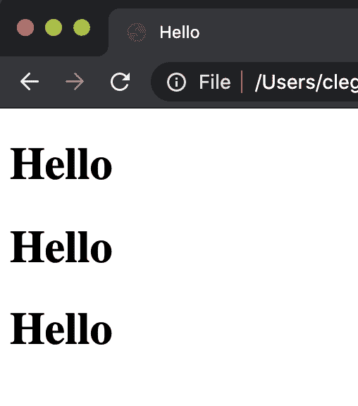

到目前为止，组件并没有那么有趣，因为它们都是完全相同的。我们可以通过为它们添加额外的属性（在 React 术语中称为**props**）来使这些组件更加灵活。例如，假设我们希望向三个人打招呼。我们可以在一个类似于 HTML 属性的方法中提供这些人的名字：

```
function App() {
    return (
        <div>
            <Hello name="Harry" />
            <Hello name="Ron" />
            <Hello name="Hermione" />
        </div>
    );
} 
```

我们可以使用`props.PROP_NAME`来访问这些 props。然后我们可以使用花括号将其插入到我们的 JSX 中：

```
function Hello(props) {
    return (
        <h1>Hello, {props.name}!</h1>
    );
} 
```

现在，我们的页面显示了三个名字！

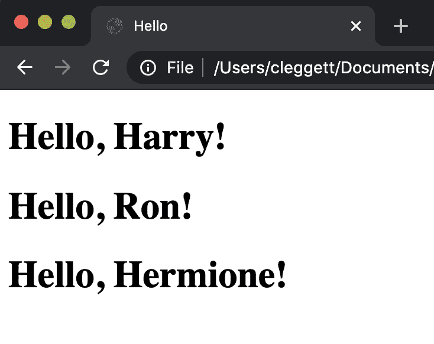

现在，让我们看看我们如何使用 React 重新实现我们在首次使用 JavaScript 时构建的计数器页面。我们的整体结构将保持不变，但在我们的`App`组件内部，我们将使用 React 的`useState`钩子为我们的组件添加状态。`useState`的参数是状态的初始值，我们将将其设置为`0`。该函数返回表示状态的变量和一个允许我们更新状态的函数。

```
const [count, setCount] = React.useState(0); 
```

现在，我们可以工作于函数将渲染的内容，我们将指定一个标题和一个按钮。我们还将添加一个事件监听器，当按钮被点击时，React 使用`onClick`属性来处理：

```
return (
    <div>
        <h1>{count}</h1>
        <button onClick={updateCount}>Count</button>
    </div>
); 
```

最后，让我们定义`updateCount`函数。为此，我们将使用`setCount`函数，它可以接受作为状态的新值作为参数。

```
function updateCount() {
    setCount(count + 1);
} 
```

现在我们有一个功能齐全的计数器网站！


### 加法

现在我们已经对 React 框架有了感觉，让我们利用所学知识来构建一个类似游戏的网站，用户将在网站上解决加法问题。我们将首先创建一个与我们的其他 React 页面设置相同的文件。为了开始构建这个应用程序，让我们思考我们可能想要在状态中跟踪的内容。我们应该包括任何我们认为用户在我们页面上可能会改变的内容。我们的状态可能包括：

+   `num1`：要相加的第一个数字

+   `num2`：要相加的第二个数字

+   `response`：用户输入的内容

+   `score`：用户回答正确的题目数量。

现在，我们的状态可以是一个包含所有这些信息的 JavaScript 对象：

```
const [state, setState] = React.useState({
    num1: 1,
    num2: 1,
    response: "",
    score: 0
}); 
```

现在，使用状态中的值，我们可以渲染一个基本的用户界面。

```
return (
    <div>
        <div>{state.num1} + {state.num2}</div>
        <input value={state.response} />
        <div>Score: {state.score}</div>
    </div>
); 
```

现在，网站的基本布局看起来像这样：

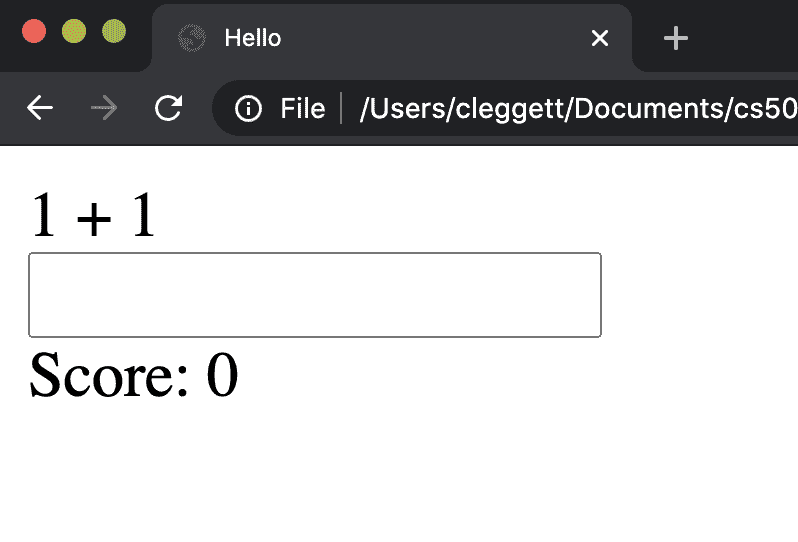

在这个阶段，用户无法在输入框中输入任何内容，因为它的值被固定为`state.response`，当前是空字符串。为了解决这个问题，让我们给输入元素添加一个`onChange`属性，并将其设置为名为`updateResponse`的函数。

```
onChange={updateResponse} 
```

现在，我们必须定义`updateResposne`函数，它接受触发函数的事件，并将`response`设置为输入的当前值。这个函数允许用户输入，并将输入的内容存储在`state`中。

```
function updateResponse(event) {
    setState({
        ...state,
        response: event.target.value
    });
} 
```

现在，让我们添加用户提交问题的功能。我们首先添加另一个事件监听器，并将其链接到我们将要编写的函数：

```
onKeyPress={inputKeyPress} 
```

现在，我们将定义`inputKeyPress`函数。在这个函数中，我们首先检查是否按下了`Enter`键，然后检查答案是否正确。当用户回答正确时，我们希望增加 1 分，为下一个问题选择随机数字，并清除响应。如果答案不正确，我们希望减少 1 分并清除响应。

```
function inputKeyPress(event) {
    if (event.key === "Enter") {
        const answer = parseInt(state.response);
        if (answer === state.num1 + state.num2) {
            // User got question right
            setState({
                ...state,
                score: state.score + 1,
                response: "",
                num1: Math.ceil(Math.random() * 10),
                num2: Math.ceil(Math.random() * 10)
            });
        } else {
            // User got question wrong
            setState({
                ...state,
                score: state.score - 1,
                response: ""
            })
        }
    }
} 
```

为了给应用程序添加一些收尾工作，让我们给页面添加一些样式。我们将使应用中的所有内容居中，然后通过给包含问题的 div 添加`id`为`problem`，并添加以下 CSS 到样式标签来使问题更大：

```
#app {
    text-align: center;
    font-family: sans-serif;
}

#problem {
    font-size: 72px;
} 
```

最后，让我们添加在获得 10 分后赢得游戏的能力。为此，我们将在`render`函数中添加一个条件，一旦我们获得 10 分，就返回完全不同的内容：

```
if (state.score === 10) {
    return (
        <div id="winner">You won!</div>
    );
} 
```

为了使胜利更加激动人心，我们还将给替代 div 添加一些样式：

```
#winner {
    font-size: 72px;
    color: green;
} 
```

现在，让我们看看我们的应用程序！

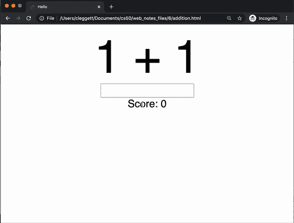

今天的内容就到这里！下次，我们将讨论构建大型 Web 应用程序的一些最佳实践。
