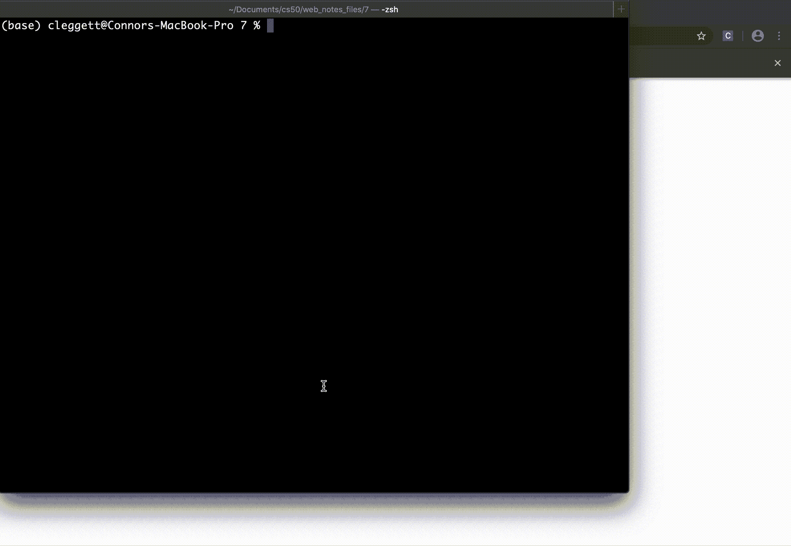
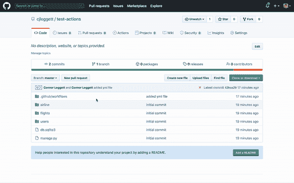
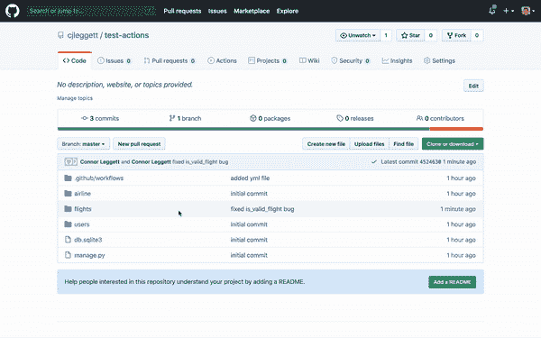

# 第 7 讲

> 原文：[`cs50.harvard.edu/web/notes/7/`](https://cs50.harvard.edu/web/notes/7/)

+   简介

+   测试

+   断言

    +   测试驱动开发

+   单元测试

+   Django 测试

    +   客户端测试

+   Selenium

+   持续集成/持续部署

+   GitHub Actions

+   Docker

## 简介

+   到目前为止，我们讨论了如何使用 HTML 和 CSS 构建简单的网页，以及如何使用 Git 和 GitHub 来跟踪我们代码的变化并与他人协作。我们还熟悉了 Python 编程语言，开始使用 Django 创建 Web 应用程序，并学习了如何使用 Django 模型在我们的网站上存储信息。然后我们介绍了 JavaScript，并学习了如何使用它使网页更加互动，还讨论了使用动画和 React 来进一步改进我们的用户界面。

+   今天，我们将学习关于在处理和发布大型项目时的最佳实践。

## 测试

软件开发过程中的一个重要部分是**测试**我们所编写的代码，以确保一切按预期运行。在本讲座中，我们将讨论几种我们可以改进测试代码的方法。

## 断言

我们可以在 Python 中运行测试的最简单方法之一是使用`assert`命令。此命令后面跟一个应该为`True`的表达式。如果表达式为`True`，则不会发生任何事情，如果为`False`，则会抛出异常。让我们看看我们如何将命令集成到测试我们在学习 Python 时编写的`square`函数中。当函数编写正确时，由于`assert`为`True`，所以不会发生任何事情

```
def square(x):
    return x * x

assert square(10) == 100

""" Output: """ 
```

如果编写错误，则会抛出异常。

```
def square(x):
    return x + x

assert square(10) == 100

""" Output:
Traceback (most recent call last):
  File "assert.py", line 4, in <module>
    assert square(10) == 100
AssertionError """ 
```

### 测试驱动开发

当你开始构建更大的项目时，你可能想要考虑使用**测试驱动开发**，这是一种开发风格，每次修复一个错误时，你都会添加一个测试来检查该错误，并将其添加到一个不断增长的测试集中，每次你进行更改时都会运行这些测试。这将帮助你确保你添加到项目中的新功能不会干扰现有的功能。

现在，让我们看看一个稍微复杂一些的函数，并思考编写测试如何帮助我们找到错误。我们现在将编写一个名为`is_prime`的函数，该函数在其输入是质数时返回`True`：

```
import math

def is_prime(n):

    # We know numbers less than 2 are not prime
    if n < 2:
        return False

    # Checking factors up to sqrt(n)
    for i in range(2, int(math.sqrt(n))):

        # If i is a factor, return false
        if n % i == 0:
            return False

    # If no factors were found, return true
    return True 
```

现在，让我们看看我们编写的测试`prime`函数的函数：

```
from prime import is_prime

def test_prime(n, expected):
    if is_prime(n) != expected:
        print(f"ERROR on is_prime({n}), expected {expected}") 
```

到目前为止，我们可以进入我们的 Python 解释器并测试一些值：

```
>>> test_prime(5, True)
>>> test_prime(10, False)
>>> test_prime(25, False)
ERROR on is_prime(25), expected False 
```

从上面的输出中我们可以看到，5 和 10 被正确地识别为质数和非质数，但 25 被错误地识别为质数，所以我们的函数肯定有问题。在我们查看函数的问题之前，让我们看看一种自动化测试的方法。我们可以这样做的一种方法是通过创建一个 **shell 脚本**，或者可以在我们的终端中运行的脚本。这些文件需要 `.sh` 扩展名，所以我们的文件将被称为 `tests0.sh`。下面每一行都包含

1.  使用 `python3` 指定我们正在运行的 Python 版本

1.  `-c` 表示我们希望运行一个命令

1.  一个以字符串格式运行的命令

```
python3 -c "from tests0 import test_prime; test_prime(1, False)"
python3 -c "from tests0 import test_prime; test_prime(2, True)"
python3 -c "from tests0 import test_prime; test_prime(8, False)"
python3 -c "from tests0 import test_prime; test_prime(11, True)"
python3 -c "from tests0 import test_prime; test_prime(25, False)"
python3 -c "from tests0 import test_prime; test_prime(28, False)" 
```

现在，我们可以在终端中运行这些命令，通过运行 `./tests0.sh`，得到这个结果：

```
ERROR on is_prime(8), expected False
ERROR on is_prime(25), expected False 
```

## 单元测试

尽管我们能够使用上述方法自动运行测试，但我们仍然可能希望避免逐个编写这些测试。幸运的是，我们可以使用 Python 的 `unittest` 库使这个过程变得容易一些。让我们看看我们的 `is_prime` 函数的测试程序可能是什么样子。

```
# Import the unittest library and our function import unittest
from prime import is_prime

# A class containing all of our tests class Tests(unittest.TestCase):

    def test_1(self):
        """Check that 1 is not prime."""
        self.assertFalse(is_prime(1))

    def test_2(self):
        """Check that 2 is prime."""
        self.assertTrue(is_prime(2))

    def test_8(self):
        """Check that 8 is not prime."""
        self.assertFalse(is_prime(8))

    def test_11(self):
        """Check that 11 is prime."""
        self.assertTrue(is_prime(11))

    def test_25(self):
        """Check that 25 is not prime."""
        self.assertFalse(is_prime(25))

    def test_28(self):
        """Check that 28 is not prime."""
        self.assertFalse(is_prime(28))

# Run each of the testing functions if __name__ == "__main__":
    unittest.main() 
```

注意到我们 `Tests` 类中的每个函数都遵循了一个模式：

+   函数的名称以 `test_` 开头。这对于函数在调用 `unittest.main()` 时自动运行是必要的。

+   每个测试都接受 `self` 参数。这是在 Python 类中编写方法时的标准做法。

+   每个函数的第一行包含一个由三个引号包围的 **文档字符串**。这些不仅是为了代码的可读性。当测试运行时，如果测试失败，注释将作为测试的描述显示。

+   每个函数的下一行包含了一个形式为 `self.assertSOMETHING` 的断言。你可以做出很多不同的断言，包括 `assertTrue`、`assertFalse`、`assertEqual` 和 `assertGreater`。你可以通过查看 [文档](https://docs.python.org/3/library/unittest.html#unittest.TestCase.assertEqual) 来找到这些以及其他断言。

现在，让我们检查这些测试的结果：

```
...F.F
======================================================================
FAIL: test_25 (__main__.Tests)
Check that 25 is not prime.
----------------------------------------------------------------------
Traceback (most recent call last):
  File "tests1.py", line 26, in test_25
    self.assertFalse(is_prime(25))
AssertionError: True is not false

======================================================================
FAIL: test_8 (__main__.Tests)
Check that 8 is not prime.
----------------------------------------------------------------------
Traceback (most recent call last):
  File "tests1.py", line 18, in test_8
    self.assertFalse(is_prime(8))
AssertionError: True is not false

----------------------------------------------------------------------
Ran 6 tests in 0.001s

FAILED (failures=2) 
```

运行测试后，`unittest` 会提供一些关于它发现的有用信息。在第一行，它按测试编写的顺序给出了成功的一系列 `.` 和失败的一系列 `F`。

```
...F.F 
```

接下来，对于每个失败的测试，我们还会得到失败函数的名称：

```
FAIL: test_25 (__main__.Tests) 
```

我们之前提供的描述性注释：

```
Check that 25 is not prime. 
```

以及异常的跟踪信息：

```
Traceback (most recent call last):
  File "tests1.py", line 26, in test_25
    self.assertFalse(is_prime(25))
AssertionError: True is not false 
```

最后，我们得到了一个关于运行了多少个测试、花费了多少时间以及有多少失败的概述：

```
Ran 6 tests in 0.001s

FAILED (failures=2) 
```

现在，让我们看看如何修复我们函数中的错误。结果是，我们需要在我们的 `for` 循环中测试一个额外的数字。例如，当 `n` 是 `25` 时，平方根是 `5`，但当它是 `range` 函数的一个参数时，`for` 循环在数字 `4` 处终止。因此，我们可以简单地改变 `for` 循环的头部为：

```
for i in range(2, int(math.sqrt(n)) + 1): 
```

现在，当我们再次使用我们的单元测试运行测试时，我们得到以下输出，表明我们的更改修复了错误。

```
......
----------------------------------------------------------------------
Ran 6 tests in 0.000s

OK 
```

随着你对这个函数进行优化，这些自动化测试将变得更加有用。例如，你可能想利用这样一个事实，即你不需要检查所有整数作为因子，只需检查较小的质数（如果一个数不能被 3 整除，它也不能被 6、9、12 等整除），或者你可能想使用更高级的概率性质数测试，如[Fermat](https://en.wikipedia.org/wiki/Fermat_primality_test)和[Miller-Rabin](https://en.wikipedia.org/wiki/Miller%E2%80%93Rabin_primality_test)质数测试。无论何时你修改此函数以改进它，你都需要能够轻松地再次运行你的单元测试，以确保你的函数仍然正确。

## Django 测试

现在，让我们看看在创建 Django 应用程序时如何应用自动化测试的理念。在处理这个项目时，我们将使用我们在第一次学习 Django 模型时创建的`flights`项目。我们首先将向我们的`Flight`模型添加一个方法，该方法通过检查两个条件来验证航班是否有效：

1.  起点与目的地不同

1.  持续时间大于 0 分钟

现在，我们的模型可能看起来像这样：

```
class Flight(models.Model):
    origin = models.ForeignKey(Airport, on_delete=models.CASCADE, related_name="departures")
    destination = models.ForeignKey(Airport, on_delete=models.CASCADE, related_name="arrivals")
    duration = models.IntegerField()

    def __str__(self):
        return f"{self.id}: {self.origin} to {self.destination}"

    def is_valid_flight(self):
        return self.origin != self.destination or self.duration > 0 
```

为了确保我们的应用程序按预期工作，每次我们创建一个新的应用程序时，我们都会自动获得一个`tests.py`文件。当我们第一次打开这个文件时，我们看到 Django 的[TestCase](https://docs.djangoproject.com/en/4.0/topics/testing/overview/)库被自动导入：

```
from django.test import TestCase 
```

使用`TestCase`库的一个优点是，当我们运行测试时，将仅用于测试目的创建一个全新的数据库。这很有帮助，因为我们避免了意外修改或删除数据库中现有条目的风险，我们也不必担心移除仅用于测试而创建的虚拟条目。

要开始使用这个库，我们首先想要导入我们所有的模型：

```
from .models import Flight, Airport, Passenger 
```

然后我们将创建一个新的类，该类扩展了我们刚刚导入的`TestCase`类。在这个类中，我们将定义一个`setUp`函数，该函数将在测试过程开始时运行。在这个函数中，我们可能想要创建。我们的类将如下所示：

```
class FlightTestCase(TestCase):

    def setUp(self):

        # Create airports.
        a1 = Airport.objects.create(code="AAA", city="City A")
        a2 = Airport.objects.create(code="BBB", city="City B")

        # Create flights.
        Flight.objects.create(origin=a1, destination=a2, duration=100)
        Flight.objects.create(origin=a1, destination=a1, duration=200)
        Flight.objects.create(origin=a1, destination=a2, duration=-100) 
```

现在我们测试数据库中有了一些条目，让我们向这个类添加一些函数来执行一些测试。首先，让我们确保我们的`departures`和`arrivals`字段工作正常，通过尝试计算从机场`AAA`出发的航班数量（我们知道应该是 3）和到达数量（应该是 1）：

```
def test_departures_count(self):
    a = Airport.objects.get(code="AAA")
    self.assertEqual(a.departures.count(), 3)

def test_arrivals_count(self):
    a = Airport.objects.get(code="AAA")
    self.assertEqual(a.arrivals.count(), 1) 
```

我们还可以测试我们添加到`Flight`模型中的`is_valid_flight`函数。我们将首先断言当航班有效时，该函数确实返回 true：

```
def test_valid_flight(self):
    a1 = Airport.objects.get(code="AAA")
    a2 = Airport.objects.get(code="BBB")
    f = Flight.objects.get(origin=a1, destination=a2, duration=100)
    self.assertTrue(f.is_valid_flight()) 
```

接下来，让我们确保具有无效目的地和持续时间的航班返回 false：

```
def test_invalid_flight_destination(self):
    a1 = Airport.objects.get(code="AAA")
    f = Flight.objects.get(origin=a1, destination=a1)
    self.assertFalse(f.is_valid_flight())

def test_invalid_flight_duration(self):
    a1 = Airport.objects.get(code="AAA")
    a2 = Airport.objects.get(code="BBB")
    f = Flight.objects.get(origin=a1, destination=a2, duration=-100)
    self.assertFalse(f.is_valid_flight()) 
```

现在，为了运行我们的测试，我们将运行`python manage.py test`。这个输出的结果几乎与使用 Python `unittest`库时的输出相同，尽管它也记录了它正在创建和销毁测试数据库：

```
Creating test database for alias 'default'...
System check identified no issues (0 silenced).
..FF.
======================================================================
FAIL: test_invalid_flight_destination (flights.tests.FlightTestCase)
----------------------------------------------------------------------
Traceback (most recent call last):
  File "/Users/cleggett/Documents/cs50/web_notes_files/7/django/airline/flights/tests.py", line 37, in test_invalid_flight_destination
    self.assertFalse(f.is_valid_flight())
AssertionError: True is not false

======================================================================
FAIL: test_invalid_flight_duration (flights.tests.FlightTestCase)
----------------------------------------------------------------------
Traceback (most recent call last):
  File "/Users/cleggett/Documents/cs50/web_notes_files/7/django/airline/flights/tests.py", line 43, in test_invalid_flight_duration
    self.assertFalse(f.is_valid_flight())
AssertionError: True is not false

----------------------------------------------------------------------
Ran 5 tests in 0.018s

FAILED (failures=2)
Destroying test database for alias 'default'... 
```

从上面的输出中我们可以看到，有时`is_valid_flight`在应该返回`False`的时候返回了`True`。进一步检查我们的函数后，我们发现错误在于使用了`or`而不是`and`，这意味着只有当飞行要求中的一项被满足时，航班才被认为是有效的。如果我们把函数改为这样：

```
 def is_valid_flight(self):
    return self.origin != self.destination and self.duration > 0 
```

我们可以再次运行测试，并得到更好的结果：

```
Creating test database for alias 'default'...
System check identified no issues (0 silenced).
.....
----------------------------------------------------------------------
Ran 5 tests in 0.014s

OK
Destroying test database for alias 'default'... 
```

### Client Testing

在创建 Web 应用程序时，我们可能不仅想要检查特定函数是否工作，还想要检查单个 Web 页面是否按预期加载。我们可以通过在我们的 Django 测试类中创建一个`Client`对象，然后使用该对象进行请求来实现这一点。为了做到这一点，我们首先必须将`Client`添加到我们的导入中：

```
from django.test import Client, TestCase 
```

例如，现在让我们添加一个测试来确保我们得到 HTTP 响应代码 200，并且我们的三个航班都被添加到响应的上下文中：

```
def test_index(self):

    # Set up client to make requests
    c = Client()

    # Send get request to index page and store response
    response = c.get("/flights/")

    # Make sure status code is 200
    self.assertEqual(response.status_code, 200)

    # Make sure three flights are returned in the context
    self.assertEqual(response.context["flights"].count(), 3) 
```

我们可以类似地检查以确保我们得到有效页面的有效响应代码，以及不存在页面的无效响应代码。（注意，我们使用`Max`函数来找到最大的`id`，我们通过在文件顶部包含`from django.db.models import Max`来访问它）

```
def test_valid_flight_page(self):
    a1 = Airport.objects.get(code="AAA")
    f = Flight.objects.get(origin=a1, destination=a1)

    c = Client()
    response = c.get(f"/flights/{f.id}")
    self.assertEqual(response.status_code, 200)

def test_invalid_flight_page(self):
    max_id = Flight.objects.all().aggregate(Max("id"))["id__max"]

    c = Client()
    response = c.get(f"/flights/{max_id + 1}")
    self.assertEqual(response.status_code, 404) 
```

最后，让我们添加一些测试以确保乘客和非乘客列表被按预期生成：

```
def test_flight_page_passengers(self):
    f = Flight.objects.get(pk=1)
    p = Passenger.objects.create(first="Alice", last="Adams")
    f.passengers.add(p)

    c = Client()
    response = c.get(f"/flights/{f.id}")
    self.assertEqual(response.status_code, 200)
    self.assertEqual(response.context["passengers"].count(), 1)

def test_flight_page_non_passengers(self):
    f = Flight.objects.get(pk=1)
    p = Passenger.objects.create(first="Alice", last="Adams")

    c = Client()
    response = c.get(f"/flights/{f.id}")
    self.assertEqual(response.status_code, 200)
    self.assertEqual(response.context["non_passengers"].count(), 1) 
```

现在，我们可以一起运行所有的测试，看到目前我们没有错误！

```
Creating test database for alias 'default'...
System check identified no issues (0 silenced).
..........
----------------------------------------------------------------------
Ran 10 tests in 0.048s

OK
Destroying test database for alias 'default'... 
```

## Selenium

到目前为止，我们已经能够使用 Python 和 Django 测试我们编写的服务器端代码，但随着我们构建应用程序，我们还将想要为我们的客户端代码创建测试。例如，让我们回顾一下我们的`counter.html`页面，并为其编写一些测试。

我们将开始编写一个稍微不同的计数页面，其中包含一个用于减少计数的按钮：

```
<!DOCTYPE html>
<html lang="en">
    <head>
        <title>Counter</title>
        <script>

            // Wait for page to load
            document.addEventListener('DOMContentLoaded', () => {

                // Initialize variable to 0
                let counter = 0;

                // If increase button clicked, increase counter and change inner html
                document.querySelector('#increase').onclick = () => {
                    counter ++;
                    document.querySelector('h1').innerHTML = counter;
                }

                // If decrease button clicked, decrease counter and change inner html
                document.querySelector('#decrease').onclick = () => {
                    counter --;
                    document.querySelector('h1').innerHTML = counter;
                }
            })
        </script>
    </head>
    <body>
        <h1>0</h1>
        <button id="increase">+</button>
        <button id="decrease">-</button>
    </body>
</html> 
```

现在如果我们想测试这段代码，我们只需打开我们的网页浏览器，点击两个按钮，观察发生了什么。然而，随着你编写越来越大的单页应用程序，这会变得非常繁琐，这就是为什么有几个框架被创建出来以帮助进行浏览器内测试，其中一个叫做[Selenium](https://www.selenium.dev/)。

使用 Selenium，我们可以在 Python 中定义一个测试文件，在那里我们可以模拟用户打开一个网络浏览器，导航到我们的页面，并与它交互。我们在做这件事时使用的主要工具被称为**Web Driver**，它将在您的计算机上打开一个网络浏览器。让我们看看我们如何开始使用这个库来与页面进行交互。注意，以下我们使用了`selenium`和`ChromeDriver`。Selenium 可以通过运行`pip install selenium`来为 Python 安装，而`ChromeDriver`可以通过运行`pip install chromedriver-py`来安装

```
import os
import pathlib
import unittest

from selenium import webdriver

# Finds the Uniform Resourse Identifier of a file def file_uri(filename):
    return pathlib.Path(os.path.abspath(filename)).as_uri()

# Sets up web driver using Google chrome driver = webdriver.Chrome() 
```

上述代码是我们需要的所有基本设置，因此现在我们可以通过使用 Python 解释器来探索一些更有趣的用途。关于前几行的一个注意事项是，为了针对特定的页面，我们需要该页面的**统一资源标识符（URI**），这是一个唯一的字符串，代表该资源。

```
# Find the URI of our newly created file >>> uri = file_uri("counter.html")

# Use the URI to open the web page >>> driver.get(uri)

# Access the title of the current page >>> driver.title
'Counter'

# Access the source code of the page >>> driver.page_source
'<html lang="en"><head>\n <title>Counter</title>\n <script>\n  \n // Wait for page to load\n document.addEventListener(\'DOMContentLoaded\', () => {\n\n // Initialize variable to 0\n let counter = 0;\n\n // If increase button clicked, increase counter and change inner html\n document.querySelector(\'#increase\').onclick = () => {\n counter ++;\n document.querySelector(\'h1\').innerHTML = counter;\n }\n\n // If decrease button clicked, decrease counter and change inner html\n document.querySelector(\'#decrease\').onclick = () => {\n counter --;\n document.querySelector(\'h1\').innerHTML = counter;\n }\n })\n </script>\n </head>\n <body>\n <h1>0</h1>\n <button id="increase">+</button>\n <button id="decrease">-</button>\n  \n</body></html>'

# Find and store the increase and decrease buttons: >>> increase = driver.find_element_by_id("increase")
>>> decrease = driver.find_element_by_id("decrease")

# Simulate the user clicking on the two buttons >>> increase.click()
>>> increase.click()
>>> decrease.click()

# We can even include clicks within other Python constructs: >>> for i in range(25):
...     increase.click() 
```

现在，让我们看看我们如何使用这个模拟来创建我们页面的自动化测试：

```
# Standard outline of testing class class WebpageTests(unittest.TestCase):

    def test_title(self):
        """Make sure title is correct"""
        driver.get(file_uri("counter.html"))
        self.assertEqual(driver.title, "Counter")

    def test_increase(self):
        """Make sure header updated to 1 after 1 click of increase button"""
        driver.get(file_uri("counter.html"))
        increase = driver.find_element_by_id("increase")
        increase.click()
        self.assertEqual(driver.find_element_by_tag_name("h1").text, "1")

    def test_decrease(self):
        """Make sure header updated to -1 after 1 click of decrease button"""
        driver.get(file_uri("counter.html"))
        decrease = driver.find_element_by_id("decrease")
        decrease.click()
        self.assertEqual(driver.find_element_by_tag_name("h1").text, "-1")

    def test_multiple_increase(self):
        """Make sure header updated to 3 after 3 clicks of increase button"""
        driver.get(file_uri("counter.html"))
        increase = driver.find_element_by_id("increase")
        for i in range(3):
            increase.click()
        self.assertEqual(driver.find_element_by_tag_name("h1").text, "3")

if __name__ == "__main__":
    unittest.main() 
```

现在，如果我们运行 `python tests.py`，我们的模拟将在浏览器中执行，然后测试结果将被打印到控制台。以下是一个示例，当代码中存在错误且测试失败时，它可能看起来是这样的：



## CI/CD

**CI/CD**，代表**持续集成和持续交付**，是一套软件开发最佳实践，它规定了由一组人员编写的代码，以及该代码如何随后交付给应用程序的用户。正如其名所示，这种方法由两个主要部分组成：

+   持续集成：

    +   主分支上的频繁合并

    +   每次合并时进行自动单元测试

+   持续交付：

    +   短发布周期，意味着应用程序的新版本会频繁发布。

CI/CD 由于以下原因在软件开发团队中越来越受欢迎：

+   当不同的团队成员正在开发不同的功能时，当多个功能同时结合时，可能会出现许多兼容性问题。持续集成允许团队在出现冲突时解决小问题。

+   由于单元测试是在每次合并时运行的，因此当测试失败时，更容易隔离导致问题的代码部分。

+   经常发布新版本的应用程序允许开发者在发布后隔离可能出现的问题。

+   逐步发布小而渐进的变化，使用户能够逐渐适应新的应用程序功能，而不是被一个全新的版本所淹没

+   不等待发布新功能使公司能够在竞争激烈的市场中保持领先。

## GitHub Actions

一个用于帮助持续集成的流行工具被称为 [GitHub Actions](https://github.com/features/actions)。GitHub Actions 允许我们创建工作流程，其中我们可以指定每次有人向 git 仓库推送时需要执行的操作。例如，我们可能希望在每次推送时检查是否遵循了样式指南，或者是否通过了一组单元测试。

为了设置 GitHub Action，我们将使用一种名为 **YAML** 的配置语言。YAML 将其数据结构化为键值对（类似于 JSON 对象或 Python 字典）。以下是一个简单的 YAML 文件示例：

```
key1: value1
key2: value2
key3:
    - item1
    - item2
    - item3 
```

现在，让我们看看一个配置 YAML 文件（其形式为 `name.yml` 或 `name.yaml`）的例子，这个文件与 GitHub Actions 一起工作。为此，我将在我的仓库中创建一个 `.github` 目录，然后在其中创建一个 `workflows` 目录，最后在这个目录中创建一个 `ci.yml` 文件。在这个文件中，我们将编写：

```
name: Testing
on: push

jobs:
  test_project:
    runs-on: ubuntu-latest
    steps:
    - uses: actions/checkout@v2
    - name: Run Django unit tests
      run: |
        pip3 install --user django
        python3 manage.py test 
```

由于这是我们第一次使用 GitHub Actions，让我们看看这个文件的每个部分都在做什么：

+   首先，我们给工作流程一个 `name`，在我们的例子中是 Testing。

+   接下来，使用 `on` 键，我们指定工作流程应该在何时运行。在我们的情况下，我们希望在有人向仓库推送时执行测试。

+   文件的其余部分包含在 `jobs` 键中，它指示每次推送时应运行哪些工作。

    +   在我们的情况下，唯一的工作是 `test_project`。每个工作都必须定义两个组件

        +   `runs-on` 键指定我们希望我们的代码在 GitHub 的哪个虚拟机上运行。

        +   `steps` 键提供了在运行此工作时应发生的操作

            +   在 `uses` 键中，我们指定我们希望使用哪个 GitHub Action。`actions/checkout@v2` 是 GitHub 编写的我们可以使用的操作。

            +   在这里，`name` 键允许我们提供对所采取操作的描述

            +   在 `run` 键之后，我们输入希望在 GitHub 服务器上运行的命令。在我们的例子中，我们希望安装 Django 然后运行测试文件。

现在，让我们在 GitHub 中打开我们的仓库，并查看页面顶部附近的一些标签页：

+   **代码**：这是我们使用频率最高的标签页，因为它允许我们查看目录中的文件和文件夹。

+   **问题**：在这里，我们可以打开和关闭问题，这些问题是请求修复错误或新功能。我们可以将其视为我们应用程序的待办事项列表。

+   **拉取请求**：希望将某个分支的代码合并到另一个分支的人的请求。这是一个有用的工具，因为它允许人们在代码集成到主分支之前进行 **代码审查**，并发表评论和提供建议。

+   **GitHub Actions**：这是我们进行持续集成时使用的标签页，因为它提供了每次推送后发生的操作日志。

这里，让我们假设我们在修复 `models.py` 文件中 `airport` 项目内的 `is_valid_flight` 函数中的错误之前，已经推送了我们的更改。我们现在可以导航到 **GitHub Actions** 选项卡，点击我们最近的推送，点击失败的操作，并查看日志：



现在，在修复了错误之后，我们可以再次尝试并找到更好的结果：



## Docker

在软件开发的世界中，当你的电脑配置与应用程序运行时的配置不同时，可能会出现问题。你可能有一个不同的 Python 版本或安装了一些额外的包，这些包允许应用程序在你的电脑上顺利运行，而它在服务器上可能会崩溃。为了避免这些问题，我们需要确保所有参与项目的人都使用相同的环境。一种方法是通过使用名为 **Docker** 的工具来实现，这是一个容器化软件，意味着它可以在你的电脑中创建一个隔离的环境，可以在许多协作者和运行你网站的服务器之间标准化。虽然 Docker 有点像 **虚拟机**，但它们实际上是不同的技术。虚拟机（如 GitHub Actions 或当你启动 AWS 服务器时使用的）实际上是一个完整的虚拟计算机，具有自己的操作系统，这意味着它在任何运行的地方都会占用很多空间。另一方面，Docker 通过在现有计算机中设置容器来工作，因此占用的空间更少。

现在我们已经了解了 Docker 容器的概念，让我们看看如何在我们的电脑上配置一个。我们做这件事的第一步将是创建一个名为 `Dockerfile` 的 **Docker 文件**。在这个文件中，我们将提供创建 **Docker 镜像** 的指令，该镜像描述了我们希望在容器中包含的库和二进制文件。以下是我们 `Dockerfile` 可能的样子示例：

```
FROM python:3
COPY .  /usr/src/app
WORKDIR /usr/src/app
RUN pip install -r requirements.txt
CMD ["python3", "manage.py", "runserver", "0.0.0.0:8000"] 
```

这里，我们将深入探讨上述文件实际上做了什么：

+   `FROM python3`: 这表明我们是以安装了 Python 3 的标准镜像为基础构建这个镜像。这在编写 Docker 文件时相当常见，因为它允许你避免在每个新镜像中重新定义相同的基本设置。

+   `COPY . /usr/src/app`: 这表明我们希望将当前目录（`.`）中的所有内容复制到新容器中的 `/usr/src/app` 目录。

+   `WORKDIR /usr/src/app`: 这设置了我们在容器内运行命令的位置。（有点像终端上的 `cd` 命令）

+   `RUN pip install -r requirements.txt`: 在这一行中，假设你已经将所有需求包含在一个名为 `requirements.txt` 的文件中，它们都将被安装到容器内。

+   `CMD ["python3", "manage.py", "runserver", "0.0.0.0:8000"]`：最后，我们指定了启动容器时应运行的命令。

到目前为止，在这个课程中，我们只使用了 SQLite，因为它是 Django 的默认数据库管理系统。然而，在实际的用户应用程序中，SQLite 几乎从不使用，因为它不像其他系统那样容易扩展。幸运的是，如果我们希望为我们的数据库运行一个单独的服务器，我们只需添加另一个 Docker 容器，并使用一个称为**Docker Compose**的功能将它们一起运行。这将允许两个不同的服务器在不同的容器中运行，同时还能相互通信。为了指定这一点，我们将使用一个名为`docker-compose.yml`的 YAML 文件：

```
version: '3'

services:
    db:
        image: postgres

    web:
        build: .
        volumes:
            - .:/usr/src/app
        ports:
            - "8000:8000" 
```

在上面的文件中，我们：

+   指定我们使用 Docker Compose 的版本 3。

+   概述两个服务：

    +   `db`根据 Postgres 已经编写好的镜像设置我们的数据库容器。

    +   `web`通过指示 Docker 设置我们的服务器容器：

        +   在当前目录中使用 Dockerfile。

        +   在容器中使用指定的路径。

        +   将容器内的端口 8000 链接到我们电脑上的端口 8000。

现在，我们准备好使用命令`docker-compose up`启动我们的服务。这将启动我们两个服务器，并在新的 Docker 容器内运行。

在这一点上，我们可能想要在我们的 Docker 容器中运行命令来添加数据库条目或运行测试。为此，我们首先运行`docker ps`来显示所有正在运行的 Docker 容器。然后，我们将找到我们想要进入的容器的`CONTAINER ID`，并运行`docker exec -it CONTAINER_ID bash -l`。这将把你移动到我们在容器内设置的`usr/src/app`目录中。我们可以在那个容器内运行任何我们想要的命令，然后通过运行`CTRL-D`来退出。

这节课的内容就到这里！下次，我们将致力于扩展我们的项目并确保它们的安全性。
