# 第 8 讲

> 原文：[`cs50.harvard.edu/web/notes/8/`](https://cs50.harvard.edu/web/notes/8/)

+   简介

+   可扩展性

+   扩展

+   负载均衡

+   自动扩展

    +   服务器故障

+   扩展数据库

    +   数据库复制

+   缓存

+   安全

    +   Git 和 GitHub

+   HTML

+   HTTPS

    +   密钥加密

    +   公钥加密

+   数据库

    +   APIs

    +   环境变量

+   JavaScript

    +   跨站请求伪造

+   接下来是什么？

## 简介

+   到目前为止，我们讨论了如何使用 HTML 和 CSS 构建简单的网页，以及如何使用 Git 和 GitHub 来跟踪我们代码的变化并与他人协作。我们还熟悉了 Python 编程语言，开始使用 Django 创建 Web 应用程序，并学习了如何使用 Django 模型在我们的网站上存储信息。然后我们介绍了 JavaScript，并学习了如何使用它使网页更加互动，并讨论了使用动画和 React 来进一步改进我们的用户界面。然后我们讨论了一些软件开发的最佳实践和一些常用于实现这些最佳实践的技术。

+   今天，在我们的最后一讲中，我们将讨论扩展和确保我们的 Web 应用程序安全的问题。

## 可扩展性

到目前为止，在本课程中，我们构建的应用程序仅在本地计算机上运行，但最终，我们希望发布我们的网站，以便任何互联网用户都可以访问。为了做到这一点，我们在**服务器**上运行我们的网站，这些服务器是专门用于运行应用程序的物理硬件。服务器可以是本地（我们拥有并维护物理服务器，我们的应用程序托管在其中）或云上（服务器由不同的公司拥有，如亚马逊或谷歌，我们支付租用服务器空间以托管我们的应用程序）。这两种选择都有其优点和缺点：

+   **定制**：托管自己的服务器让您能够决定它们如何工作，这比基于云的托管提供了更多的灵活性。

+   **专业知识**：在云上托管应用程序比维护自己的服务器要简单得多。

+   **成本**：由于服务器托管网站需要盈利，它们将向您收取比维护本地服务器成本更高的费用，这使得基于云的服务器更昂贵。然而，运行本地服务器的启动成本可能很高，因为您需要购买物理服务器，并可能需要聘请具有设置这些服务器所需专业知识的人。

+   **可扩展性（Scalability**）: 当在云上托管时，扩展通常更容易。例如，如果我们托管一个每天有 500 次访问的本地网站，然后它开始每天有 500,000 次访问，我们就必须订购和设置更多的物理服务器来处理请求，同时许多用户将无法访问该网站。大多数云托管网站将允许你灵活地租用服务器空间，根据你的网站活动量来支付费用。

当用户向这个服务器发送 HTTP 请求时，服务器应该发送回一个响应。然而，在现实中，大多数服务器一次会接收到远超过一个请求，如下所示：

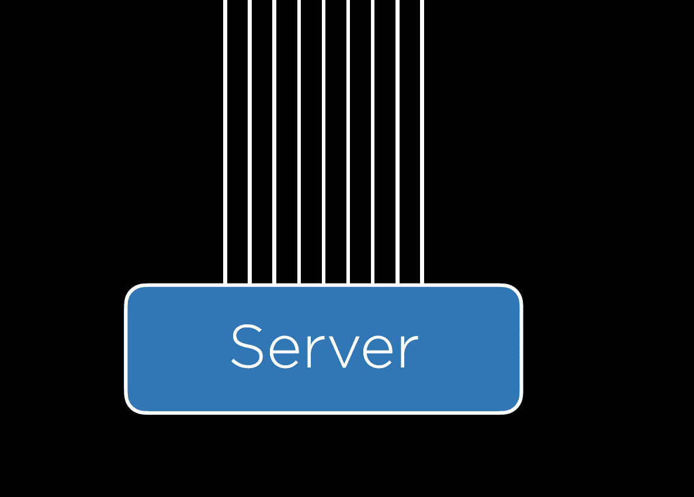

这就是我们会遇到可扩展性问题的地方。单个服务器一次只能处理这么多请求，迫使我们制定计划，当我们的一个服务器过载时我们将如何处理。无论我们决定在本地还是云上托管，我们都必须确定服务器可以处理而不崩溃的请求数量，这可以使用任何数量的**基准测试**工具来完成，包括 Apache Bench。

## 扩展

一旦我们确定我们的服务器可以处理多少请求的上限，我们就可以开始考虑我们想要如何处理应用程序的扩展。两种不同的扩展方法包括：

1.  **垂直扩展（Vertical Scaling**）: 在垂直扩展中，当我们的服务器过载时，我们只是购买或构建一个更大的服务器。然而，这种策略是有限的，因为单个服务器的强大程度有一个上限。

1.  **水平扩展（Horizontal Scaling**）: 在水平扩展中，当我们的服务器过载时，我们购买或构建更多的服务器，然后将请求分配给我们的多个服务器。

## 负载均衡

当我们使用水平扩展时，我们面临的一个额外问题是决定哪些服务器被分配给哪些请求。我们通过采用**负载均衡器**来回答这个问题，这是一种拦截传入请求并分配给我们的服务器的另一件硬件。有几种不同的方法来决定哪个服务器接收哪个请求，但这里有一些：

+   **随机（Random**）: 在这个简单的方法中，负载均衡器将随机决定将请求分配给哪个服务器。

+   **轮询（Round-Robin**）: 在这种方法中，负载均衡器将交替选择哪个服务器接收传入的请求。如果我们有三个服务器，第一个请求可能会发送到服务器 A，第二个发送到服务器 B，第三个发送到服务器 C，第四个又回到服务器 A。

+   **最少连接（Fewest Connections**）: 在这种方法中，负载均衡器会寻找当前处理最少请求的服务器，并将传入的请求分配给该服务器。这确保了我们不会过度使用某个特定的服务器，但这也使得负载均衡器计算每个服务器当前处理的请求数量所需的时间比随机选择服务器要长。

没有一种负载均衡方法在所有其他方法中绝对优于其他方法，实践中使用了许多不同的方法。在水平扩展时可能出现的一个问题是，我们可能会有存储在一个服务器上的会话，但不在另一个服务器上，我们不希望用户因为负载均衡器将他们的请求推送到新的服务器而不得不重新输入信息。像许多可扩展性问题一样，解决会话问题的方法有多种：

+   **粘性会话**：一旦用户访问了一个网站，负载均衡器会记住他们最初被发送到哪个服务器，并确保将他们发送到同一个服务器。这种方法的一个主要担忧是，我们可能会让大量用户粘附在一个服务器上，导致该服务器崩溃。

+   **数据库会话**：所有会话都存储在一个所有服务器都可以访问的数据库中。这样，无论用户被分配到哪个服务器，他们的信息都将可用。这里的缺点是，从数据库中读取和写入需要额外的时间和计算能力。

+   **客户端会话**：而不是在我们的服务器上存储信息，我们可以选择将它们作为 cookie 存储在用户的网络浏览器中。这种方法的不利之处包括用户创建虚假 cookie 以允许他们以其他用户身份登录的安全问题，以及每次请求都要来回发送 cookie 信息的计算问题。

就像负载均衡一样，对于会话问题没有最好的答案，你选择的方法通常会取决于你的具体情况。

## 自动扩展

我们可能遇到另一个问题是，许多网站在特定时间访问频率要高得多。例如，如果我们决定从早些时候启动我们的“是新年吗？”应用程序，我们可能会预计它在年底到一月初的流量会比一年中的任何其他时间都要多。如果我们为网站购买足够的服务器以保持冬季的活跃状态，那么这些服务器在其余的时间里将处于闲置状态，浪费空间和能源。这种场景催生了**自动扩展**的概念，这在云计算中已成为常见做法，即网站使用的服务器数量可以根据接收到的请求数量增长和缩小。尽管如此，自动扩展并不是一个完美的解决方案，因为它需要时间来确定需要新的服务器并启动该服务器。另一个潜在的问题是，你拥有的运行服务器越多，出现故障的机会就越多。

### 服务器故障

虽然拥有多个服务器可以帮助避免所谓的**单点故障**，即一个硬件设备在故障后会导致整个网站崩溃。在水平扩展时，负载均衡器可以通过向每个服务器发送定期的**心跳**请求来检测哪些服务器已崩溃，然后停止将新请求分配给已崩溃的服务器。此时，似乎我们只是将单点故障从服务器转移到了负载均衡器，但我们可以通过备用负载均衡器的可用性来解决这个问题，以防原始负载均衡器意外崩溃。

## 数据库扩展

除了扩展处理请求的服务器外，我们还需要考虑如何扩展我们的数据库。在本课程中，我们使用 SQLite，它将数据存储在服务器上的文件中，但随着我们存储的数据越来越多，有时将数据存储在多个不同的文件中，甚至可能是在单独的服务器上，可能更有意义。这引发了一个问题，即当我们的数据库服务器无法处理所有传入的请求时应该怎么办。与其他可扩展性问题一样，我们可以使用多种方法来减轻这个问题：

+   **垂直分区**：这是一种与我们最初讨论 SQL 时使用的方法类似的方法，其中我们将数据拆分到多个不同的表中，而不是在一个表中保留冗余信息。（请随时回顾第 4 讲，其中我们将`flights`表拆分为`flights`表和`airports`表）。

+   **水平分区**：这种方法涉及存储具有相同格式但不同信息的多个表。例如，我们可以将`flights`表拆分为`domestic_flights`表和`international_flights`表。这样，当我们希望搜索从 JFK 到 LHR 的航班时，我们不必浪费时间搜索一个充满国内航班的表。这种方法的一个缺点是，一旦表被拆分，连接多个表可能会很昂贵。

### 数据库复制

即使我们在数据库进行了扩展，似乎我们仍然面临一个单点故障的问题。如果我们的数据库服务器崩溃，我们所有的数据可能会丢失。正如我们添加更多服务器以避免单点故障一样，我们也可以添加数据库的副本来确保一个数据库的故障不会使我们的应用程序关闭。同样，之前也有不同的数据库复制方法，其中两种最受欢迎的是：

+   **单主复制**：在这种方法中，有多个数据库，但只有一个被认为是主数据库，这意味着你可以从其中一个数据库中读取和写入，但只能从每个其他数据库中读取。当主数据库更新时，其他数据库随后更新以匹配主数据库。这种方法的一个缺点是，在写入数据库时仍然存在单点故障。

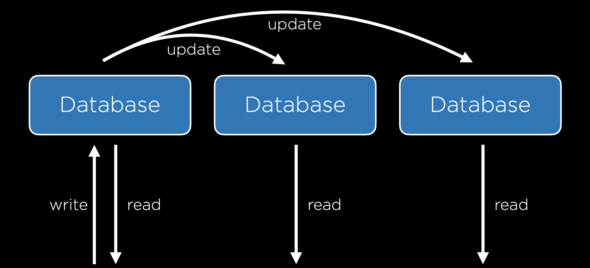

+   **多主复制**：在这种方法中，所有数据库都可以读取和写入。这解决了单点故障的问题，但代价是现在要使所有数据库保持最新状态变得更加困难，因为每个数据库都必须了解所有其他数据库的变化。这个系统也使我们面临一些冲突的可能性：

    +   **更新冲突**：在多个数据库中，一个用户可能尝试在一个数据库中编辑一行，而另一个用户可能尝试在另一个数据库中编辑同一行，当数据库同步时，这会导致问题。

    +   **唯一性冲突**：SQL 数据库中的每一行都必须有一个唯一的标识符，我们可能会遇到在两个不同的数据库中为两个不同的条目分配相同 ID 的问题。

    +   **删除冲突**：一个用户可能删除一行，而另一个用户可能尝试更新它。

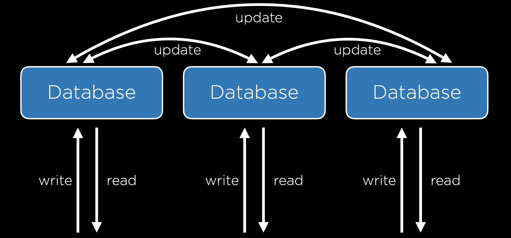

## 缓存

无论我们与大型数据库交互时，都应认识到每一次与数据库的交互都是昂贵的。因此，我们希望最小化对数据库服务器的调用次数。以[纽约时报](https://www.nytimes.com/)网站为例。纽约时报可能有一个包含所有文章的数据库，每次有人加载主页时都会查询该数据库，并渲染一些模板，但这样做会浪费资源，因为主页上显示的文章很可能每秒变化不大。我们可以通过使用**缓存**来解决这个问题，即如果我们预计在不久的将来需要再次使用某些信息，就将它们存储在更易于访问的位置。

缓存的一种实现方式是将数据存储在用户的网络浏览器中，这样当用户加载某些页面时，甚至不需要向服务器发送请求。实现这一点的办法之一是在 HTTP 响应的头部包含以下这一行：

[PRE0]

这将告诉浏览器，当访问页面时，只要我在过去 86400 毫秒内访问过该页面，就不需要向服务器发送请求。这种方法通常用于浏览器，特别是对于不太可能在短时间内更改的文件，如 CSS 文件。为了更多地控制这个过程，我们还可以在 HTTP 响应头中添加一个`ETag`，它是一串唯一的字符序列，代表文档的特定版本。这很有用，因为未来的请求可以包含这个标签，并将其与服务器上最新文档的标签进行比较，只有当两者不同时才返回整个文档。

除了上面讨论的客户端缓存外，通常在服务器端包含一个缓存也很有帮助。有了这个缓存，我们的后端设置将类似于下面的一个，其中所有服务器都可以访问缓存。

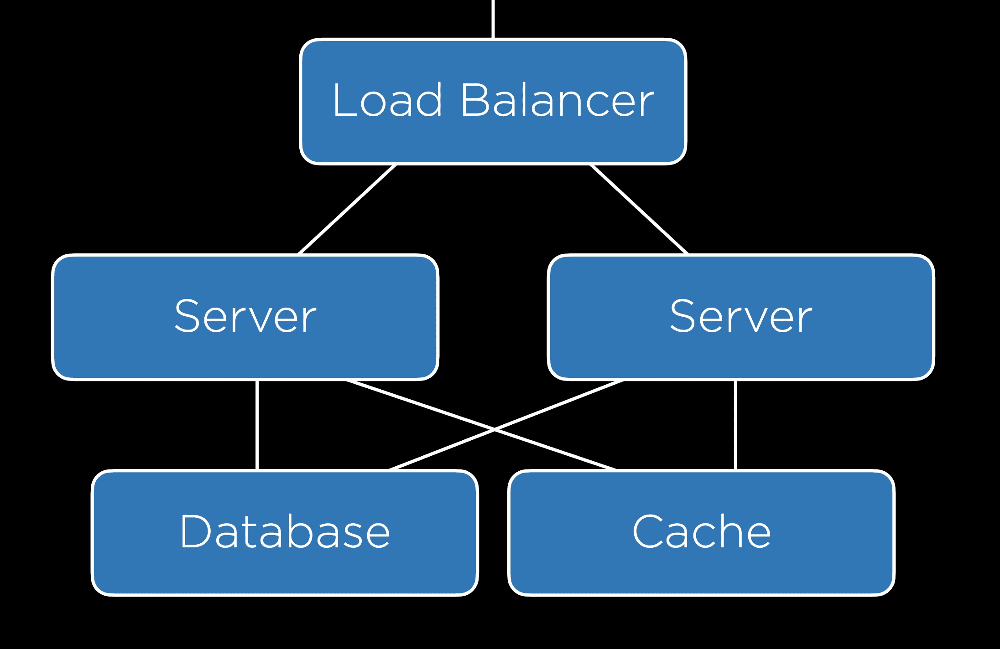

Django 提供了一个自己的[缓存框架](https://docs.djangoproject.com/en/4.0/topics/cache/)，这将允许我们在项目中实现缓存。这个框架提供了几种实现缓存的方法：

+   **视图级缓存**：这允许我们决定一旦加载了特定的视图，该视图可以在不经过下一个指定时间内通过函数的情况下渲染。

+   **模板片段缓存**：这种缓存可以缓存模板的特定部分，这样它们就不需要重新渲染。例如，我们可能有一个很少改变的导航栏，这意味着我们可以通过不重新加载它来节省时间。

+   **低级缓存 API**：这允许你进行更灵活的缓存，本质上可以存储你想要的任何信息。

我们在这里不会详细介绍如何在 Django 中实现缓存，但如果您感兴趣，请查看[文档](https://docs.djangoproject.com/en/4.0/topics/cache/)！

## 安全

现在，我们将开始讨论如何确保我们的 Web 应用程序安全，这将涉及许多不同的措施，几乎涵盖了我们在本课程中讨论的几乎所有主题。

### Git 和 GitHub

Git 和 GitHub 最大的优势之一是它们使共享和贡献**开源软件**变得非常容易，任何互联网用户都可以查看和贡献。这个缺点是，如果你在任何时候提交了一个包含一些私人凭证（如密码或 API 密钥）的文件，这些凭证可能会公开可用。

## HTML

使用 HTML 会引发许多漏洞。其中一种常见的弱点被称为**钓鱼攻击**，当用户认为他们将要访问一个页面时，实际上却被带到了另一个页面。这些并不是我们在设计网站时可以预见的，但我们在自己与网络互动时应该肯定要考虑到它们。例如，一个恶意用户可能会编写以下 HTML 代码：

[PRE1]

它的作用如下：

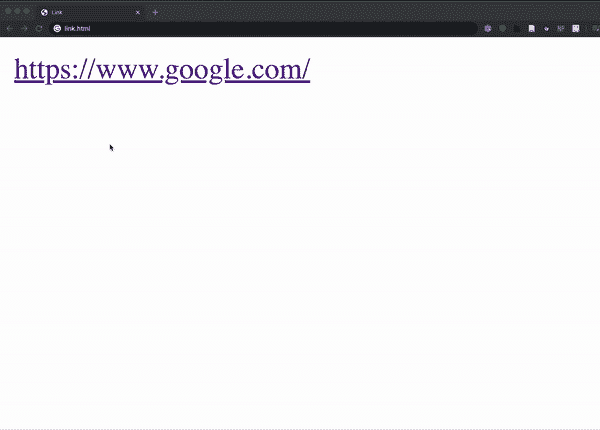

HTML 实际上作为请求的一部分发送给用户，这增加了更多的漏洞，因为每个人都可以访问到允许你创建网站的布局和样式。例如，黑客可以访问[bankofamerica.com](https://cs50.harvard.edu/)，复制他们的所有 HTML，并将其粘贴到自己的网站上，创建一个看起来与美洲银行一模一样的网站。然后黑客可以重定向页面上的登录表单，使得所有用户名和密码都发送给他们。（此外，这里还有[真正的美洲银行链接](https://www.bankofamerica.com/)——只是想看看你在点击之前是否检查了 URL！）

## HTTPS

如我们之前在课程中讨论的那样，大多数在线交互都遵循 HTTP 协议，尽管现在越来越多的交易使用 HTTPS，这是 HTTP 的加密版本。在使用这些协议时，信息通过一系列服务器以如图所示的方式从一个计算机传输到另一个计算机。

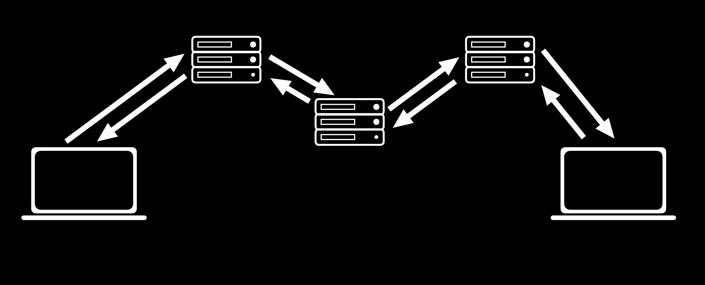

通常没有方法可以确保所有这些传输都是安全的，因此确保所有传输的信息都是**加密的**非常重要，这意味着消息的字符被改变，以便发送者和接收者可以理解它，但其他人不能。

### 秘密密钥密码学

一种处理方式被称为**秘密密钥密码学**。在这种方法中，发送者和接收者都拥有一个只有他们知道的秘密密钥。然后，发送者使用这个秘密密钥来加密一条消息，并将其发送给接收者，接收者使用秘密密钥来解密这条消息。这种方法非常安全，但当它涉及到实际应用时会产生一个大问题。为了使其工作，发送者和接收者都必须能够访问秘密密钥，这意味着他们必须亲自会面来安全地交换密钥。考虑到我们每天与不同网站互动的数量，很明显，面对面会面不是一个可行的选择。

### 公钥密码学

一种在密码学中令人难以置信的进步，使得互联网能够像今天这样运行，被称为**公钥密码学**。在这种方法中，有两个密钥：一个是公开的，可以共享，另一个必须保密。一旦这些密钥被建立（有几种不同的数学方法可以创建密钥对，这本身可以构成一门完整的课程，所以我们在这里不会讨论它们），发送者可以查找接收者的公钥并使用它来加密一条消息，然后接收者可以使用他们的私钥来解密这条消息。当我们使用 HTTPS 而不是 HTTP 时，我们知道我们的请求正在使用公钥加密来得到保护。

## 数据库

除了我们的请求和响应之外，我们还必须确保我们的数据库是安全的。我们需要存储的一个常见信息是用户信息，包括用户名和密码，如下表所示：

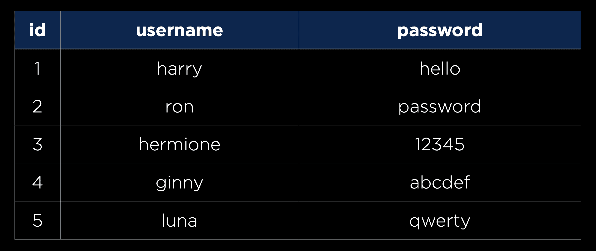

然而，你绝对不希望以明文形式存储密码，以防未经授权的人访问你的数据库。相反，我们将想要使用一个**哈希函数**，这是一个接受一些文本并输出一个看似随机的字符串的函数，为每个密码创建一个哈希值，如下表所示：

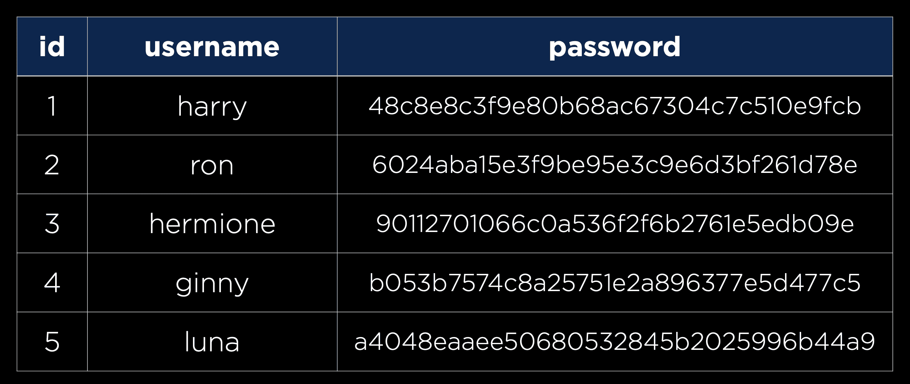

重要的是要注意，哈希函数是**单向的**，这意味着它可以将密码转换为哈希值，但不能将哈希值转换回密码。这意味着任何以这种方式存储用户信息的公司实际上并不知道任何用户的密码，这意味着每次用户尝试登录时，输入的密码将被哈希并与其现有的哈希值进行比较。幸运的是，这个过程已经被 Django 为我们处理了。这种存储技术的一个影响是，当用户忘记他们的密码时，公司无法告诉他们他们的旧密码是什么，这意味着他们必须创建一个新的密码。

有一些情况下，作为开发者，你必须决定你愿意泄露多少信息。例如，许多网站都有一个看起来像这样的忘记密码页面：

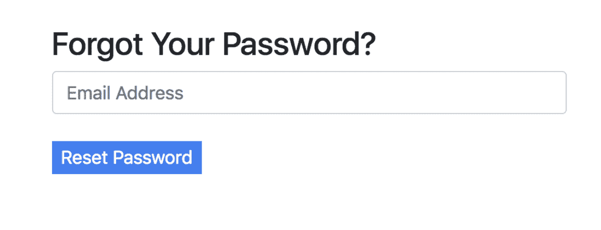

作为一名开发者，你可能在提交后想要包含成功或错误信息：

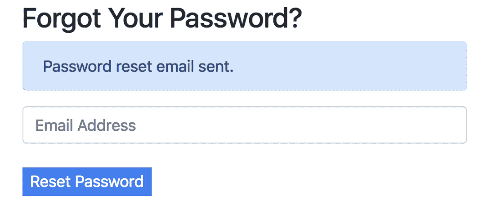

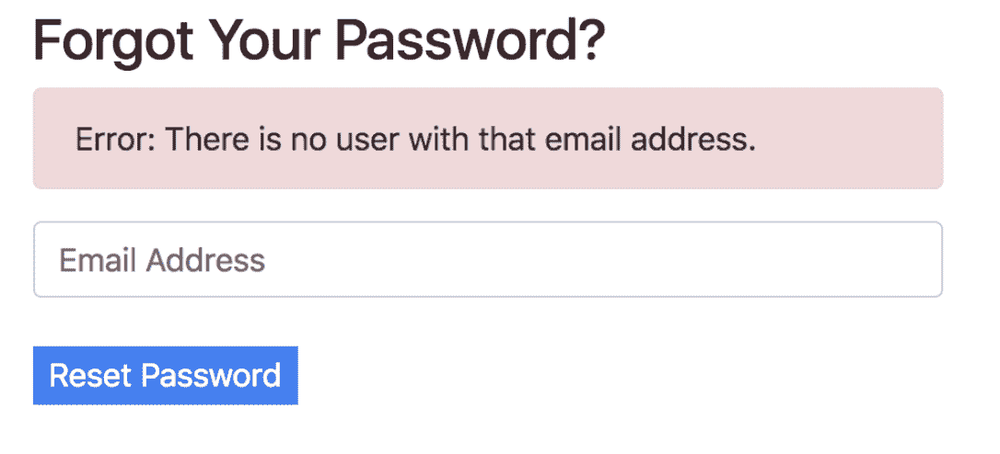

但请注意，通过输入电子邮件，任何人都可以确定谁在该网站上注册了电子邮件。在一个人是否使用该网站无关紧要的情况下（比如 Facebook），这可能完全没问题，但如果你是某个网站的成员可能会让你处于危险之中（比如虐待受害者的在线支持小组），这就会非常鲁莽。

数据可能泄露的另一种方式是在响应返回所需的时间。拒绝一个电子邮件地址无效的人可能比拒绝一个电子邮件地址正确但密码错误的人更快。

如我们在课程中之前讨论过的，每次我们在代码中使用直接的 SQL 查询时，都必须警惕 SQL 注入攻击。

### APIs

我们经常将 JavaScript 与 API 结合使用来构建单页应用程序。当我们自己构建 API 时，我们可以使用一些方法来保持我们的 API 安全：

+   **API 密钥**：只处理你提供给 API 客户端的密钥的请求。

+   **速率限制**：限制任何用户在给定时间段内可以发出的请求数量。这有助于防止**拒绝服务（DoS）攻击**，恶意用户通过向你的 API 发出大量调用，使其崩溃。

+   **路由认证**：有许多情况下我们不希望让每个人都访问我们的所有数据，因此我们可以使用路由认证来确保只有特定的用户可以看到特定的数据。

### 环境变量

正如我们想要避免以明文形式存储密码一样，我们也会想要避免在我们的源代码中包含 API 密钥。避免这种情况的一种常见方法就是使用**环境变量**，或者存储在你的操作系统或服务器环境中的变量。然后，而不是在我们的源代码中包含一串文本，我们可以包含对环境变量的引用。

## JavaScript

恶意用户可能会尝试使用 JavaScript 进行几种类型的攻击。一个例子是**跨站脚本攻击**，即用户在自己的网站上编写并运行自己的 JavaScript 代码。例如，让我们想象我们有一个 Django 应用程序，它有一个单一的 URL：

[PRE2]

以及一个单一视图：

[PRE3]

该网站本质上告诉用户他们导航到的 URL 是什么：

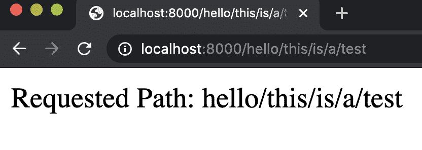

但用户现在可以通过在 URL 中输入来轻松地将一些 JavaScript 插入页面：

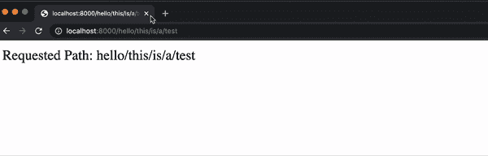

虽然这个`alert`示例相对无害，但要包含一些操纵 DOM 或使用`fetch`发送请求的 JavaScript 并不会更困难。

### 跨站请求伪造

我们已经讨论了如何使用 Django 来防止 CSRF 攻击，但让我们看看没有这种保护会发生什么。作为一个例子，想象一家银行有一个你可以访问的 URL，可以从你的账户中转账。一个人可以轻松地创建一个链接来执行这种转账：

[PRE4]

这种攻击甚至可能比链接更微妙。如果 URL 被放在图片中，那么它将在浏览器尝试加载图片时被访问：

[PRE5]

由于这个原因，每次你构建一个可以接受某些状态变化的应用程序时，都应该使用 POST 请求。即使银行要求 POST 请求，隐藏表单字段仍然可以诱使用户意外提交请求。以下表单甚至不需要用户点击；它会自动提交！

[PRE6]

上述示例展示了**跨站请求伪造**可能的样子。我们可以通过在加载网页时创建 CSRF 令牌来阻止此类攻击，并且只接受带有有效令牌的表单。

## 接下来是什么？

我们在本课程中讨论了许多 Web 框架，如 Django 和 React，但还有更多你可能感兴趣的框架：

+   服务器端

    +   [Express.js](https://expressjs.com/)

    +   [Ruby on Rails](https://rubyonrails.org/)

    +   [Flask](https://flask.palletsprojects.com/en/1.1.x/)

    +   …

+   客户端

    +   [Angular JS](https://angularjs.org/)

    +   [React](https://reactjs.org/)

    +   [Vue.js](https://vuejs.org/)

    +   [React Native](https://reactnative.dev/)

    +   …

在未来，你可能还希望能够通过多种不同的服务将你的网站部署到网络上：

+   [Amazon Web Services](https://aws.amazon.com/getting-started/hands-on/websites/)

+   [GitHub](https://github.com/)

+   [Heroku](https://www.heroku.com/)

+   [Netlify](https://app.netlify.com/)

+   [Google Cloud](https://cloud.google.com/)

+   [Microsoft Azure](https://azure.microsoft.com/en-gb/)

+   …

我们自从这门课程开始以来已经走得很远了，覆盖了大量的材料，但在网络编程的世界里还有很多东西要学习。尽管有时可能会感到压倒性，但学习更多知识的最佳方法之一就是投身到一个项目中，看看你能将它推进多远。我们相信，在这个阶段，你在网络设计概念方面已经打下了坚实的基础，而且你已经拥有了将一个想法转化为你自己的工作网站所需的一切！
