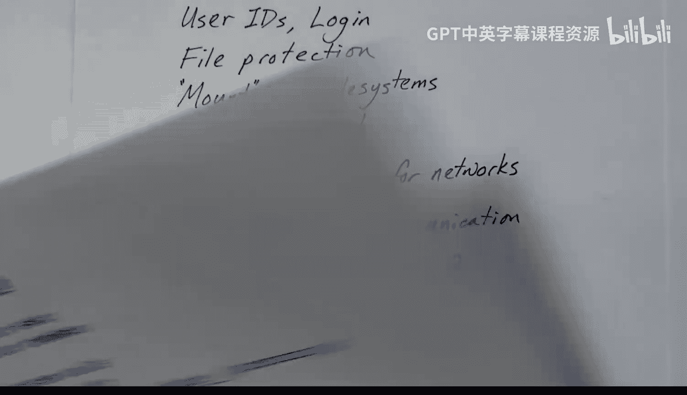

# 01：介绍与概述 🖥️

在本节课中，我们将要学习 XV6 操作系统内核的基本介绍。XV6 是一个用于教学目的的、简短而精悍的类 Unix 操作系统。它由麻省理工学院开发，也被其他机构使用。这个操作系统主要供学生在操作系统课程中使用。

## 内核版本与运行环境

XV6 内核有两个实现版本：一个用于 X86 架构，另一个用于 RISC-V 架构。在本系列视频中，我们将讨论 RISC-V 版本。该版本使用 64 位处理器。无论使用哪个版本，您很可能需要通过 QEMU 等模拟器以模拟方式运行它，因为您不太可能拥有一台备用的 RISC-V 处理器计算机。它是一个旨在运行在裸机上的多核操作系统，而 QEMU 能够模拟多核系统。

## 代码规模与语言

XV6 内核代码非常简短，总共只有大约 6000 行。其中大部分代码使用 C 编程语言编写，大约有 300 行是汇编语言。代码结构简单、编写良好且清晰，是学习优秀编码技巧的绝佳范例。

## 学习目标与前提

本系列视频将对几乎所有代码进行逐行讲解，以帮助您理解其工作原理。我们不会假设您具备 RISC-V 指令集架构的知识，但会假设您有一些汇编语言编码的基础。我们将详细讲解汇编指令。如果您正在学习操作系统课程，本系列将是一个很好的补充。

## 核心特性

上一节我们介绍了 XV6 的基本背景，本节中我们来看看它的核心功能特性。

XV6 内核具备以下主要特性：
*   **进程**：进程运行在各自的虚拟地址空间中，每个地址空间都有对应的页表支持。
*   **文件系统**：支持类 Unix 的文件和目录层次结构。
*   **管道**：支持将数据从一个程序管道传输到另一个程序。
*   **多任务处理**：通过定时中断实现时间片轮转，使多个进程并行运行。

## 系统调用

XV6 实现了 21 个系统调用。虽然与拥有约 300 到 500 个系统调用的生产级 Unix 系统相比数量不多，但这足以展示 Unix 的核心思想。

以下是 XV6 中提供的一些系统调用列表：
*   `fork()`: 创建新进程。
*   `wait()`: 等待子进程终止。
*   `exit()`: 终止进程。
*   `pipe()`: 创建管道。
*   `open()`, `close()`, `read()`, `write()`: 用于文件操作。
*   `kill()`: 终止进程。
*   `exec()`: 加载并执行文件。
*   `mkdir()`, `link()`, `unlink()`: 用于目录和链接操作。
*   `fstat()`: 获取文件信息。
*   `chdir()`: 改变当前工作目录。
*   `dup()`: 复制文件描述符。
*   `getpid()`: 获取当前进程 ID。
*   `sbrk()`: 增长堆内存。
*   `sleep()`: 使进程休眠。
*   `uptime()`: 获取内核运行时间。

## 用户程序

XV6 附带了一系列用户程序，用以展示操作系统的能力。操作系统可以运行一个简单的 shell 程序。其他常见的 Unix 程序包括：
*   `cat`
*   `echo`
*   `grep`
*   `kill`
*   `ln`
*   `ls`
*   `mkdir`
*   `rm`
*   `wc`

## 局限性说明

尽管 XV6 可以被视为一个真正的 Unix 系统，但它缺失了许多复杂功能。例如，像 Linux 这样的真实操作系统内核代码量可能是其 100 倍。XV6 缺少的功能包括：
*   用户 ID 和登录验证。
*   文件的读写执行保护位。
*   `mount` 命令，因此只有一个文件系统。
*   虚拟地址空间换出到磁盘的功能。
*   网络支持和进程间通信同步机制。
*   大量的设备驱动程序。
*   丰富的应用程序。

## 总结

本节课中我们一起学习了 XV6 操作系统内核的概述。我们了解了它的开发背景、代码规模、核心特性、提供的系统调用和用户程序，以及它与完整操作系统相比的局限性。在接下来的视频中，我们将开始深入详细地分析代码。