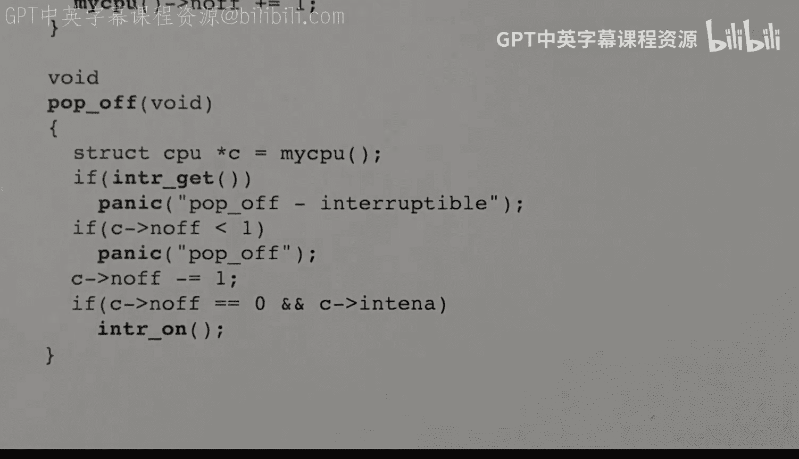

# XV6 操作系统内核：04：自旋锁 🔒


在本节课中，我们将学习 XV6 操作系统内核中自旋锁的实现原理。自旋锁是一种基础的同步原语，用于在多核或多线程环境中保护共享数据，确保同一时间只有一个执行单元能进入临界区。我们将从基本概念开始，逐步深入到 XV6 的具体实现细节，包括如何避免死锁和处理中断。

## 自旋锁的基本概念

自旋锁的核心是一个表示其状态的单字变量。这个变量通常只有两个值：
*   **0**：表示锁是**空闲的**、**未锁定的**或**已释放的**。
*   **1**：表示锁是**被持有的**、**已获取的**或**已锁定的**。

在 XV6 中，自旋锁的结构体定义如下：
```c
struct spinlock {
    int locked;       // 锁的状态，0 表示空闲，1 表示被持有
    char *name;       // 用于调试的锁名称
    struct cpu *cpu;  // 指向当前持有锁的 CPU 结构体
};
```
其中，`name` 和 `cpu` 字段主要用于调试目的。每个 CPU 核心都有一个对应的 `cpu` 结构体，`cpu` 字段指向当前持有该锁的 CPU 核心的结构体。

## 关键操作函数

自旋锁（以及大多数锁）的关键操作函数是 `acquire`（获取）和 `release`（释放）。此外，还有初始化锁的 `init` 函数和用于检查当前核心是否持有锁的 `holding` 函数。

### 一个简单的（但有问题的）获取尝试

获取锁的基本思路是：检查锁是否空闲（值为 0），如果是，则将其设置为 1（持有）。如果锁已被持有，则循环等待（即“自旋”）。一个初步的实现可能如下：
```c
while (lock->locked == 1) // 检查锁是否被持有
    ; // 自旋等待
lock->locked = 1; // 获取锁
```
然而，这段代码在多核并发环境下存在严重问题。两个线程可能**同时**检查到锁是空闲的（值为 0），然后**同时**将其设置为 1，导致双方都认为自己持有了锁，破坏了锁的互斥性。

### 原子操作：AMO Swap

为了解决上述并发问题，我们需要一个**原子操作**。RISC-V 架构提供了 `AMO swap`（原子内存交换）指令。这条指令能**不可分割地**完成两件事：
1.  将一个值写入内存的某个字。
2.  同时，取出该内存字在写入**之前**的值。

其工作流程可以表示为：
```
old_value = atomic_swap(&lock->locked, 1);
```
这个操作保证了在“读取旧值”和“写入新值”之间，不会有其他任何指令（无论是来自当前核心还是其他核心）插入执行。

### 正确的获取与释放实现

利用 `AMO swap`，我们可以实现正确的锁获取逻辑：
1.  使用原子交换指令，尝试将锁的值设置为 1，并获取其旧值。
2.  如果旧值为 0，说明锁之前是空闲的，我们成功获取了锁。
3.  如果旧值为 1，说明锁已被其他执行单元持有，我们需要回到步骤 1 继续循环尝试（自旋）。

释放锁的操作则相对简单：只需将锁的值原子地设置为 0 即可。虽然简单的内存存储操作通常是原子的，但 XV6 为了严谨，同样使用了原子指令。

## XV6 中的自旋锁实现

上一节我们介绍了自旋锁的基本原理和原子操作的必要性。本节中，我们来看看 XV6 内核中自旋锁的具体实现代码。

### 初始化锁

以下是初始化自旋锁的代码（来自 `spinlock.c`）：
```c
void initlock(struct spinlock *lk, char *name) {
    lk->name = name;        // 设置锁的调试名称
    lk->locked = 0;         // 初始状态为未锁定
    lk->cpu = 0;            // 初始时没有 CPU 持有锁
}
```
初始化时，锁被设置为未锁定状态，且没有持有者。

### 获取锁

以下是 `acquire` 函数的核心部分：
```c
void acquire(struct spinlock *lk) {
    push_off(); // 禁用中断，避免死锁
    // 检查是否已经持有该锁（防止重复获取）
    if(holding(lk))
        panic("acquire");

    // 自旋等待，直到成功获取锁
    while(__sync_lock_test_and_set(&lk->locked, 1) != 0)
        ;

    // 告诉编译器和 CPU：临界区内存访问必须严格在锁获取之后进行
    __sync_synchronize();

    // 记录当前持有锁的 CPU
    lk->cpu = mycpu();
}
```
代码解析：
*   `__sync_lock_test_and_set()`：这是一个编译器内置函数，会生成 `AMO swap` 指令。它尝试将 `lk->locked` 设置为 1 并返回旧值。循环会持续直到旧值为 0。
*   `__sync_synchronize()`：这是一个内存屏障指令。它告诉编译器和处理器，不要将临界区内的加载/存储操作重排到锁获取操作之前，确保临界区的访问受到保护。
*   `push_off()`：这是一个关键调用，用于**禁用中断**。我们稍后会详细解释其原因。
*   `holding(lk)`：检查当前 CPU 是否已经持有此锁，如果是则报错（防止递归获取导致死锁）。

### 释放锁

以下是 `release` 函数：
```c
void release(struct spinlock *lk) {
    // 检查当前 CPU 是否确实持有此锁
    if(!holding(lk))
        panic("release");

    lk->cpu = 0; // 清除持有者记录

    // 内存屏障：确保临界区所有操作在释放锁前完成
    __sync_synchronize();

    // 释放锁（原子操作）
    __sync_lock_release(&lk->locked);

    pop_off(); // 恢复中断状态
}
```
代码解析：
*   `__sync_lock_release()`：原子地将锁的值设置为 0。
*   `pop_off()`：与 `push_off()` 配对，用于**恢复中断状态**。

### 检查锁持有状态

`holding` 函数用于检查当前 CPU 是否持有指定的锁：
```c
int holding(struct spinlock *lk) {
    int r;
    // 锁被持有（值为1）且持有者记录是当前 CPU
    r = (lk->locked && lk->cpu == mycpu());
    return r;
}
```

## 自旋锁的使用模式与中断处理

我们已经看到了自旋锁的代码实现。自旋锁的设计决定了它**不应该被长时间持有**，否则其他等待锁的核心会持续空转，浪费 CPU 资源。它通常用于保护非常短小的临界区。

### 典型使用模式

自旋锁的典型使用模式是保护对共享数据的访问：
```c
acquire(&lock);   // 进入临界区前获取锁
// ... 访问或修改共享数据 ... // 临界区
release(&lock);   // 离开临界区后释放锁
```
临界区内的代码一次只能由一个执行单元执行。

### 示例：键盘输入缓冲区

假设一个键盘中断处理程序将字符写入一个共享缓冲区，而另一个线程从中读取字符。这个缓冲区就需要用自旋锁保护。
*   **中断处理程序**：`acquire(&lock)` -> 写入字符 -> `release(&lock)`
*   **读取线程**：`acquire(&lock)` -> 读取字符 -> `release(&lock)`

### 中断与死锁问题

现在，我们来解答之前留下的悬念：为什么在 `acquire` 中需要调用 `push_off` 来禁用中断？

考虑以下可能引发**死锁**的场景：
1.  线程 T 在某个 CPU 上运行，并获取了锁 L。
2.  就在此时，该 CPU 上发生了一个硬件中断（例如键盘输入）。
3.  CPU 开始执行中断处理程序。
4.  该中断处理程序的第一行代码也试图获取**同一个锁 L**。
5.  结果：中断处理程序自旋等待线程 T 释放锁 L，但线程 T 只有在中断处理程序执行完毕返回后**才能继续运行并释放锁**。双方互相等待，形成死锁。

为了避免这种由同一 CPU 上中断导致的死锁，XV6 的策略是：**在获取自旋锁时，禁用当前 CPU 的中断**。这样，持有锁的线程就不会被同一 CPU 上的中断处理程序打断，从而避免了上述死锁场景。这在 `release` 锁时再恢复中断。

### 嵌套锁与中断状态管理

但问题又来了：如果中断在调用 `acquire` 之前就已经被禁用了呢？（例如，在中断处理程序内部）。或者，代码需要连续获取多个锁？我们不应该在释放第一个锁时就冒然重新开启中断。

XV6 的解决方案是使用一个**每 CPU 的计数器 `intena`**（位于 `cpu` 结构体中）来管理中断状态的嵌套。
*   **`push_off()`**：
    *   保存当前中断状态（启用/禁用）。
    *   如果这是第一次进入（计数器从 0 变为 1），则保存旧的中断启用状态。
    *   禁用中断。
    *   增加嵌套计数器。
*   **`pop_off()`**：
    *   减少嵌套计数器。
    *   如果计数器回到 0，并且之前保存的状态是“中断启用”，则重新启用中断。

这种机制确保了中断状态能够被正确、嵌套地保存和恢复。

## 总结

本节课中我们一起学习了 XV6 内核中自旋锁的完整实现。我们从自旋锁的基本概念出发，理解了为什么需要原子操作（`AMO swap`）来保证正确的并发获取。然后，我们详细分析了 XV6 中 `initlock`、`acquire`、`release` 和 `holding` 函数的代码，并了解了内存屏障（`__sync_synchronize`）的作用。



最后，我们探讨了自旋锁使用中最关键的问题之一：**中断与死锁**。通过分析一个典型死锁场景，我们明白了在获取锁时禁用中断（`push_off`）的必要性，以及 XV6 如何通过每 CPU 的嵌套计数器来优雅地管理中断状态的保存与恢复（`pop_off`）。自旋锁是构建操作系统更高级同步机制的基础，理解其原理和实现细节至关重要。