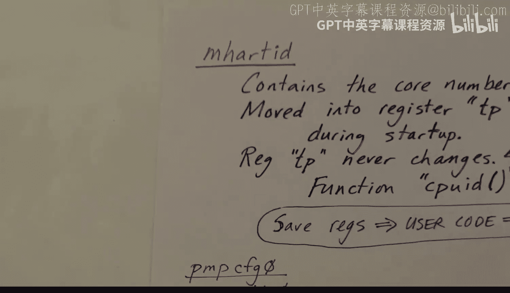

# 07：RISC-V 架构 🏗️

在本节课中，我们将学习 RISC-V 处理器架构的基础知识。了解这些知识对于理解 xv6 内核的工作原理至关重要。我们将从寄存器、处理器模式、控制状态寄存器以及异常和中断等核心概念开始。

## 寄存器

RISC-V 指令集架构拥有 32 个通用寄存器和一个程序计数器，它们都是 64 位的。以下是这些寄存器的简要介绍：

*   **x0**：该寄存器被硬连线为 0，因此在进程间进行上下文切换时无需保存。
*   **ra**：返回地址寄存器。RISC-V 使用一种巧妙的函数调用和返回系统。调用发生时，返回地址保存在此寄存器中，而不是压入栈。返回指令则简单地将此寄存器的值复制回程序计数器。
*   **sp**：栈指针，栈向下增长。
*   **tp**：线程指针。在 xv6 内核中，它包含核心编号，即硬件线程 ID。
*   **gp**：全局指针，由编译器使用，用于高效访问全局和共享变量。
*   **a0-a7**：用于向函数传递参数。**a0** 也用于存放函数返回值。
*   **t0-t6**：临时寄存器，可在函数内自由使用。
*   **s0-s11**：被调用者保存寄存器。调用者假定被调用的函数不会修改这些寄存器。因此，如果函数需要使用它们，必须在使用前保存（通常压入栈），并在返回前恢复。

这 31 个寄存器和程序计数器构成了用户模式线程的完整状态。用户代码无法访问状态寄存器，因此在用户模式下状态寄存器是不可见的。

在每次上下文切换时（即结束一个进程的时间片并开始另一个进程的时间片），内核需要保存前一个线程的状态，并在下一个时间片开始前加载下一个进程的寄存器状态。

## 处理器模式

在任何时刻，RISC-V 处理器都处于以下三种模式之一：

*   **机器模式**：最高权限模式。核心启动或复位后进入此模式。在 xv6 内核中，机器模式使用不多，主要用于启动初始化和处理定时器中断。
*   **监管者模式**：所有内核代码在此模式下运行。特权指令只能在此模式和机器模式下执行。
*   **用户模式**：所有用户应用程序代码在此模式下运行。如果用户程序尝试执行特权操作，将引发陷阱，内核将终止该进程。

每个核心都有自己的寄存器集，并且在任何时刻都只运行于一种模式。

## 控制与状态寄存器

除了通用寄存器，还有一系列控制与状态寄存器。RISC-V 架构最多可容纳 4096 个此类寄存器，但为理解 xv6 内核，我们只关注其中 19 个。

有三个重要的特权指令用于操作 CSR：

*   **读取 CSR**：`csrr a0, sstatus` （将 `sstatus` CSR 的值读入 `a0` 寄存器）
*   **写入 CSR**：`csrw sstatus, a0` （将 `a0` 寄存器的值写入 `sstatus` CSR）
*   **交换 CSR**：`csrrw a0, mscratch, a0` （原子性地将 `mscratch` CSR 的值读入 `a0`，同时将 `a0` 的旧值写入 `mscratch` CSR）

以下是一些关键的 CSR：

*   **mhartid**：包含核心编号。
*   **sstatus**：状态寄存器。
*   **stvec**：陷阱向量，即陷阱发生时将被调用的处理程序的地址。
*   **sepc**：异常程序计数器，保存发生陷阱时的程序计数器值。
*   **scause**：保存陷阱的原因。
*   **stval**：可能保存与陷阱相关的附加信息。
*   **satp**：页表指针，用于地址转换。
*   一系列用于选择性启用和查询中断（在机器模式和监管者模式）的寄存器。
*   用于将异常和中断从机器模式委托到监管者模式的寄存器。
*   物理内存保护相关的寄存器。

## 异常与中断

异常和中断都属于更广义的“陷阱”。陷阱处理程序用于处理异常或中断。

*   **异常**：同步发生，由当前执行的指令引起。例如：
    *   系统调用指令（在 RISC-V 中名为 `ecall`）。
    *   引发错误的指令（如非法指令、对齐错误、页错误等）。
*   **中断**：异步发生，源自当前指令之外。例如：
    *   定时器中断。
    *   设备中断（如串行通信设备、磁盘）。
*   **软件中断**：一种特殊的中断。当定时器中断发生时，运行在机器模式的处理程序需要通知内核（监管者模式代码），它会引发一个软件中断，然后由内核的软件中断处理程序来处理定时器中断的相关事务。

## 核心编号与物理内存保护

上一节我们介绍了 CSR 的概念，本节中我们来看看两个具体的寄存器示例。

*   **核心编号**：`mhartid` CSR 包含核心编号，它是硬连线的，无法修改。内核启动时会立即将此值移动到 `tp` 寄存器，并在内核中保持不变。用户代码可以修改 `tp`，但每当内核从用户代码重新获得控制权时，会首先恢复自己的寄存器（包括 `tp`），因此 `tp` 在内核中永远不会改变。
*   **物理内存保护**：RISC-V 提供了物理内存保护系统，用于限制运行在监管者或用户模式的代码对物理内存的访问。其本意是支持安全启动和虚拟机监控程序代码。在 xv6 中，启动时在机器模式下会将其配置为允许完全访问所有物理内存，之后不再更改。

---

本节课中我们一起学习了 RISC-V 架构的基础知识，包括其寄存器组织、三种处理器模式、关键的控制与状态寄存器，以及异常和中断的处理机制。这些是理解 xv6 内核如何管理硬件资源和执行流程的基石。在下一节课中，我们将深入探讨状态寄存器和页表。