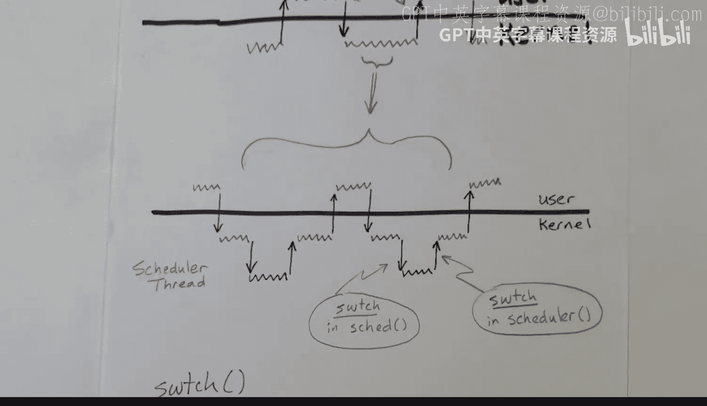

# xv6 操作系统内核：10：上下文切换 🔄

在本节课中，我们将学习 xv6 内核中的上下文切换机制。我们将探讨陷阱（trap）和系统返回（sret）指令如何被用于实现时间片轮转，以及系统如何从一个线程切换到另一个线程。

## 概述 📋

操作系统通过时间片轮转的方式在多个线程之间共享 CPU 资源。上下文切换是实现这一功能的核心机制，它涉及保存当前线程的状态，并恢复下一个要运行线程的状态。这个过程主要通过陷阱进入内核，再由内核调度器决定切换到哪个线程。

## 时间片与执行流程 ⏱️

上一节我们介绍了操作系统的基本概念，本节中我们来看看线程的执行流程。时间沿着页面垂直向下流动。一个用户线程持续执行指令，直到某个时刻发生陷阱（trap），随后系统切换到内核模式执行内核指令。

*   用户线程指令在用户模式下执行。
*   任何在内核模式下执行的指令都属于内核的一部分。

从用户模式切换到内核模式是陷阱的结果。这可能是由设备请求关注的中断，也可能是用户线程自身通过系统调用发起的请求，或者是用户线程的程序异常（某种错误）导致的。

内核执行完毕后，准备返回用户线程时，会执行 `sret`（系统返回）指令，使系统回到用户模式。如果陷阱是中断，用户线程将不会察觉到陷阱的发生，它只是继续执行指令。

在陷阱发生时，用户线程的所有寄存器都会被保存。在系统返回时，这些寄存器将被恢复。因此，线程可以从它中断的地方继续执行。

随着时间的推移，用户线程会经历一系列时间片。如果陷阱是定时器中断的结果，那么就标志着一个时间片的结束。内核会去处理其他线程，但最终会决定再次给予该用户线程一个时间片并返回。

## 调度器的视角 👁️

以下是调度器视角下的线程切换流程：

*   左侧红色部分代表调度器线程。
*   线程 X 和线程 Y 交替执行。

从线程 X 的视角看，它执行一段时间后发生陷阱，然后在某个稍后的时间点，系统返回发生，它继续执行，如此循环。当内核活动时，它可能选择运行线程 Y 的一个时间片。因此，系统返回到线程 Y，线程 Y 执行直到它发生陷阱。

在这张图中，一个有趣的现象是：陷阱之后跟着返回，有点像调用之后跟着返回。对于系统调用，用户线程可以想象成它在调用内核，而内核最终会返回。但在调度场景下则不同，返回和陷阱的顺序是“颠倒”的——一个陷阱发生后，并不会立即返回，而是会先执行一些其他操作（如切换到另一个线程）。

从调度器的角度看，它通过 `sret` 指令进入线程 X 并开始其时间片，而该时间片以一条陷阱指令结束。

## 陷阱发生时 🔍

现在，让我们更仔细地看看陷阱发生时的情况。当陷阱发生时，内核开始执行，最终进行系统返回。这个过程相当复杂，但基本流程是：用户代码执行 -> 发生陷阱 -> 内核处理 -> 系统返回 -> 用户代码恢复。

在陷阱发生的最初阶段，寄存器和程序计数器会被保存。在底部的系统返回之前，用户寄存器被恢复，然后执行 `sret` 指令。内核处理过程包含一个大的条件判断：可能是设备请求服务，需要运行特定设备的处理程序；可能是用户代码请求系统调用；也可能是定时器中断或程序异常。但至少在这几种情况下，最终都会回到用户代码。

## 多核系统上的上下文切换 🖥️🖥️

接下来，我们讨论多核系统上的情况。之前的图示展示的是单核系统。在多核系统中，情况类似，但涉及多个核心。

*   蓝色代表一个核心上的调度器。
*   红色代表另一个核心。
*   进程 X, Y, Z, W 在不同核心上获得时间片。

从进程 Z 的视角看，它在一个核心上获得一个时间片，然后等待一段时间，接着在另一个核心上获得另一个时间片。任何进程的时间片都可以在任何核心上发生，在 xv6 中这很大程度上是随机的。

在这个陷阱发生时（进程 Z 从核心 0 切换出来），进程 Z 在该核心上的所有状态（即其通用寄存器和程序计数器）会被保存。在稍后的时间点，红色核心决定给 Z 一个时间片，于是它执行另一个上下文切换到进程 Z，并将进程 Z 所需的状态从内存加载到核心 1 的寄存器中。

进程 Z 的状态被保存在所有核心共享的内存中。在这个上下文切换时，会访问该共享内存，将状态加载回核心的寄存器。存储进程 Z 状态的共享内存是临界区，需要用锁来保护。在保存状态的上下文切换期间，锁会被持有，直到完成后才释放。这可以防止红色核心过早地尝试启动进程 Z 的时间片。只有在红色核心能够获取锁之后，它才能开始加载进程 Z 的寄存器并执行上下文切换。

## 内核线程与调度器线程 🧵

有时，上下文切换的图示会有所不同。时间水平向右流动。我们看到从用户模式到内核模式发生陷阱，然后在系统返回时，发生从内核模式回到用户模式的上下文切换。

如果是简单操作（例如处理设备中断或某些可以立即处理的系统调用），我们可能只有一次陷阱和一次返回，直接回到被中断的用户模式，这非常高效。

但在其他情况下（例如需要让出 CPU），过程会更复杂。用户模式执行时发生陷阱，进入内核。此时，从某种意义上说，它仍是同一个进程的内核线程。调度器线程是另一个独立的线程（图中标为棕色）。如果我们决定要调度另一个线程，就会进行第二次上下文切换：从当前进程的内核线程切换到调度器线程。调度器选择另一个进程后，再切换到那个进程的内核线程。

每个进程都有一个用户部分（在用户模式执行）和一个内核部分（在内核模式执行），它们同属于一个线程。调度器线程则是不同的线程。这里涉及从进程（内核线程）到调度器线程的上下文切换，以及再次切换回来。

从用户模式切换到内核模式时，需要保存所有通用寄存器和程序计数器。而当我们在内核中切换到调度器线程时，由于已经在内核中，可以做一些假设，不需要保存全部寄存器，因此略有不同。

## 切换函数：`swtch` ⚙️

这个上下文切换（到调度器）和那个上下文切换（从调度器到新进程）都是由一个名为 `swtch`（即 switch）的汇编语言函数处理的。

*   当调度器选择要运行哪个进程时，会在函数 `scheduler` 中调用 `swtch` 来执行上下文切换。
*   当一个进程的内核线程想要让出 CPU 时，会在函数 `sched` 中调用 `swtch` 来切换到调度器。

`swtch` 函数的基本功能是保存一个线程的寄存器，并加载下一个线程的寄存器。

## 总结 🎯

本节课中我们一起学习了 xv6 内核的上下文切换机制。我们了解了：
1.  时间片轮转的基本流程，涉及陷阱进入内核和 `sret` 指令返回用户空间。
2.  从用户线程和调度器线程的不同视角看待执行流。
3.  多核系统中，进程状态在共享内存中保存和恢复，并通过锁进行保护。
4.  进程包含用户线程和内核线程，与独立的调度器线程之间的切换。
5.  上下文切换的核心是由汇编函数 `swtch` 实现的，它负责保存和恢复寄存器状态。

上下文切换、陷阱和系统返回是构建多任务操作系统的基石。在后续课程中，我们将再次深入探讨更详细的“路线图”。