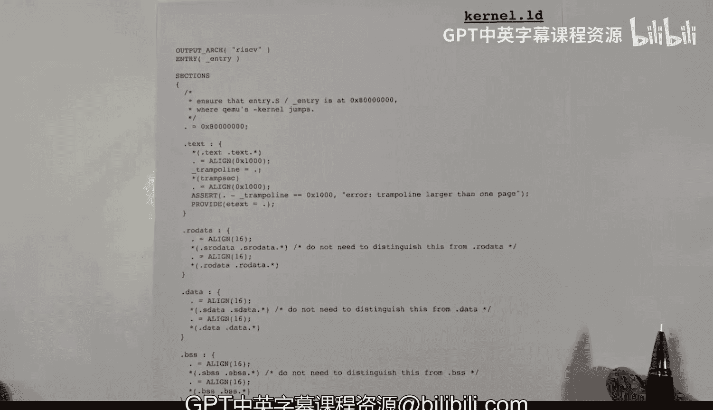

# 12：链接内核 🧩


在本节课中，我们将要学习如何将多个目标文件链接成一个可执行的内核映像文件。我们将重点分析链接器脚本文件 `kernel.ld`，了解它如何指导链接器将代码和数据放置在内存的特定位置。

---

## 内存布局概览

上一节我们介绍了内核代码和数据的编译过程。本节中，我们来看看链接器如何决定它们在内存中的最终位置。

链接器并不实际将内容加载到内存，而是计算出所有内容在内存中的地址。对于大多数用户级C程序，链接器的默认设置就足够了。但在构建操作系统内核时，我们需要更精确地控制内存布局，这就需要使用链接器脚本。

链接器会读取所有目标文件（`.o`文件）中的各个段（section），并将它们合并，生成一个包含所有待加载数据的可执行文件。随后，模拟器（如QEMU）会读取这个可执行文件，并按照链接器指定的地址将内容加载到内存中。

## 理解目标文件中的段

编译或汇编源代码会生成目标文件。每个目标文件包含多个段，每个段包含一组需要在内存中连续存放的数据。编译器或汇编器并不知道这些段最终会被放在内存的哪个位置。

以下是几种常见的段类型：
*   **`.text`**：包含可执行的机器代码。
*   **`.data`**：包含已初始化的全局变量和静态变量，程序可以读写它们。
*   **`.rodata`**：包含只读数据，在运行时不会被修改。
*   **`.bss`**：包含未初始化的全局变量和静态变量。这个段在目标文件中不占用实际空间，但在加载到内存时，其内容会被初始化为零。

## 链接过程详解

链接器需要决定如何将这些来自不同文件的段放置在内存中。在XV6中，内核代码和数据被放置在2GB（`0x80000000`）的内存边界开始处。

链接器按照命令行中目标文件的顺序，将同类型的段合并在一起：
1.  首先放置所有文件的 `.text` 段。
2.  然后放置一个特殊的 `trampsec`（蹦床）段。
3.  接着放置所有文件的 `.rodata` 段。
4.  再放置所有文件的 `.data` 段。
5.  最后放置所有文件的 `.bss` 段。

链接器的一个关键作用是**解析符号地址**。例如，当代码中引用一个变量的地址时，这个地址在编译和汇编时是未知的。只有在链接时，链接器知道了所有段和符号的最终位置，才能回填这些地址值。

此外，内核开始运行后，会建立页表来管理内存，并将 `.text` 段标记为**可执行**，而将其他数据段标记为**可读写**。

链接器还会定义几个重要的全局符号，供内核代码使用：
*   `etext`：指向代码段（`.text`）的结束位置，也就是数据段的开始。
*   `end`：指向整个内核数据（包括 `.bss`）的结束位置。
*   `_trampoline`：指向蹦床代码段在内存中的起始地址。

## 分析链接器脚本 `kernel.ld`

现在，让我们深入看看指导链接器工作的脚本文件 `kernel.ld`。这个文件使用一种链接器能理解的特定语言编写。

以下是脚本的核心内容解析：

```ld
/* 指定输出文件架构为RISC-V，入口点为 `_entry` 符号 */
OUTPUT_ARCH("riscv")
ENTRY(_entry)

/* 定义输出文件的各个段 */
SECTIONS
{
    /* 内核从0x80000000地址开始加载 */
    . = 0x80000000;

    /* 1. 创建 .text 段 */
    .text : {
        /* 收集所有输入文件的 .text 段和名为 .text.* 的段 */
        *(.text .text.*)
        /* 对齐到下一个页边界（4KB） */
        . = ALIGN(0x1000);
        /* 定义符号 _trampoline，其值为当前地址 */
        _trampoline = .;
        /* 放入特殊的蹦床代码段 */
        *(.trampsec)
        /* 再次对齐到页边界 */
        . = ALIGN(0x1000);
        /* 断言：蹦床代码大小不能超过一页 */
        ASSERT(. - _trampoline == 0x1000, "trampoline larger than one page");
        /* 定义符号 etext，标记代码段结束 */
        etext = .;
    }

    /* 2. 创建只读数据段 (.rodata) */
    .rodata : {
        /* 按16字节对齐 */
        . = ALIGN(16);
        /* 收集所有只读数据段 */
        *(.rodata .rodata.*)
    }

    /* 3. 创建可读写数据段 (.data) */
    .data : {
        . = ALIGN(16);
        *(.data .data.*)
    }

    /* 4. 创建 .bss 段 */
    .bss : {
        *(.bss .bss.*)
        /* 定义符号 end，标记所有内核数据的结束 */
        end = .;
    }
}
```

**脚本关键点说明：**
*   `*(.text .text.*)`：通配符 `*` 表示从所有输入文件中收集匹配的段。这确保了 `entry.o`（内核入口）的代码被放在最前面。
*   `ALIGN(0x1000)`：将当前位置计数器对齐到4KB的页边界。这对于内存分页管理至关重要。
*   `_trampoline = .;`：这是一个**赋值语句**，它创建一个符号 `_trampoline`，并将其值设置为当前地址（`.`）。
*   `ASSERT`：这是一个断言检查，确保蹦床代码的大小恰好为一页，否则链接过程会报错。
*   `etext = .;` 和 `end = .;`：同样是在定义符号，分别标记代码段尾和整个数据区尾。

---



本节课中我们一起学习了XV6内核的链接过程。我们了解了目标文件中的不同段（`.text`, `.data`, `.rodata`, `.bss`），并详细分析了链接器脚本 `kernel.ld` 如何指挥链接器将这些段有序地放置在内存的特定地址，同时解析符号地址并定义关键的内存边界符号。理解链接过程对于掌握操作系统内核的启动和内存布局至关重要。