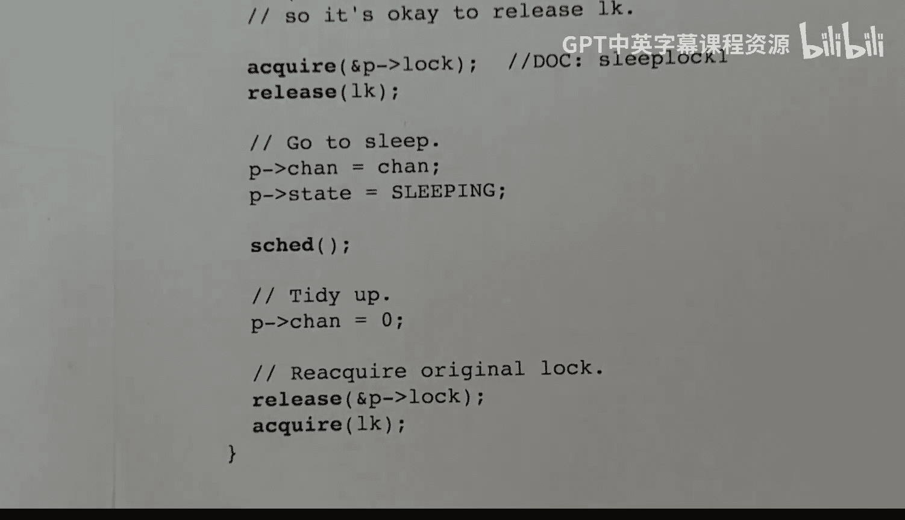

# 17：sleep() 与 wakeup() 函数详解 🧠


在本节课中，我们将要学习 xv6 操作系统中用于进程同步的两个核心函数：`sleep()` 和 `wakeup()`。我们将探讨它们的工作原理、典型的使用模式，以及如何通过“通道”机制来协调进程间的等待与唤醒。

---

## 概述

`sleep()` 和 `wakeup()` 是 xv6 中实现进程间同步的基础机制。一个进程可以调用 `sleep()` 使自己进入休眠状态，直到另一个进程调用 `wakeup()` 将其唤醒。为了精确地唤醒特定的进程，xv6 引入了“通道”的概念。

---

## 通道机制

通道是一个简单的数字标识符。当进程调用 `sleep()` 时，它会指定一个通道号。当其他进程调用 `wakeup()` 并传入相同的通道号时，所有在该通道上休眠的进程都会被唤醒。通道号本身没有特殊含义，它只是一个用于匹配的标识。

在 xv6 中，每个进程的 `proc` 结构体中都有一个字段来存储它正在休眠的通道号。`wakeup()` 函数会遍历所有进程，唤醒那些状态为“休眠”且通道号匹配的进程。

---

## 典型使用模式

以下是 `sleep()` 和 `wakeup()` 的典型使用模式。其核心思想是：检查一个条件，如果条件不满足，则进入休眠等待；当条件可能被其他进程改变后，重新检查。

```c
while (condition_is_false) {
    sleep(channel, lock);
}
// 条件满足后，处理共享数据...
```

然而，这个模式存在一个潜在问题：在检查条件之后、调用 `sleep()` 之前，条件可能已经变为真，并且对应的 `wakeup()` 调用可能已经发生，从而导致当前进程错过唤醒信号，永远休眠下去。

---

## 解决方案：结合锁使用

为了解决上述问题，并遵守“不能在持有自旋锁时休眠”的原则，xv6 采用了以下模式：

1.  获取保护共享数据的锁。
2.  在持有锁的情况下检查条件。
3.  如果条件不满足，调用 `sleep(channel, &lock)`。`sleep()` 函数内部会原子性地释放传入的锁，并将进程状态改为休眠。
4.  进程被唤醒后，在 `sleep()` 函数返回前，它会重新获取之前释放的锁。
5.  循环回到步骤 2，再次检查条件。

这样确保了从检查条件到进入休眠的整个过程是原子的，不会错过任何发生在期间的 `wakeup()` 调用。

---

## 代码实例分析：sleep 系统调用

让我们以 xv6 中处理 `sleep` 系统调用的函数为例，看看上述模式的具体实现。

```c
// 伪代码示意
uint64 sys_sleep(void) {
    int n;
    argint(0, &n); // 获取休眠时长参数（单位：滴答）
    acquire(&tickslock); // 获取保护全局变量 ticks 的锁
    uint64 start_ticks = ticks; // 记录开始时间
    while (ticks - start_ticks < n) { // 条件：是否已休眠足够时长？
        if (myproc()->killed) { // 检查进程是否被终止
            release(&tickslock);
            return -1;
        }
        sleep(&ticks, &tickslock); // 条件不满足，进入休眠
    }
    release(&tickslock); // 条件满足，释放锁并返回
    return 0;
}
```

在这个例子中：
*   **共享数据**：全局变量 `ticks`（系统滴答计数）。
*   **保护锁**：`tickslock`。
*   **条件**：当前 `ticks` 与开始时间的差值是否达到参数 `n`。
*   **通道**：使用了共享变量 `ticks` 的地址作为通道号。

---

## sleep() 函数实现

上一节我们看到了 `sleep()` 如何被使用，本节中我们来看看它的内部实现。`sleep()` 的核心职责是原子性地释放调用者持有的锁，并将进程状态设置为休眠。

```c
// 睡眠函数伪代码
void sleep(void *chan, struct spinlock *lk) {
    struct proc *p = myproc(); // 获取当前进程
    acquire(&p->lock); // 获取进程自身的锁
    release(lk); // 释放调用者传入的锁（例如 tickslock）
    p->chan = chan; // 设置休眠通道
    p->state = SLEEPING; // 修改进程状态为休眠
    sched(); // 让出 CPU，触发调度
    // 当进程在此处被唤醒并重新调度执行时...
    p->chan = 0; // 清空通道字段
    release(&p->lock); // 释放进程锁
    acquire(lk); // 重新获取调用者传入的锁
}
```

关键点在于获取进程锁 (`p->lock`) 和释放调用者锁 (`lk`) 的顺序。这个顺序保证了 `wakeup()` 无法在 `sleep()` 设置好通道和状态之前看到这个进程，从而实现了操作的原子性。

---

## wakeup() 函数实现



接下来，我们看看与 `sleep()` 配对的 `wakeup()` 函数是如何工作的。它的逻辑相对直接：遍历所有进程，唤醒在指定通道上休眠的进程。

```c
// 唤醒函数伪代码
void wakeup(void *chan) {
    struct proc *p;
    for(p = proc; p < &proc[NPROC]; p++) { // 遍历进程表
        acquire(&p->lock); // 获取该进程的锁
        if(p->state == SLEEPING && p->chan == chan) { // 状态为休眠且通道匹配
            p->state = RUNNABLE; // 将状态改为可运行
        }
        release(&p->lock); // 释放进程锁
    }
}
```

`wakeup()` 在修改任何进程状态前，都必须先获取该进程的锁。这与 `sleep()` 中获取进程锁的操作共同构成了同步的基石，确保了不会出现竞态条件。

---

## 原子性保证

现在，让我们总结一下 `sleep()` 和 `wakeup()` 如何协同工作以保证原子性。关键在于进程锁 (`p->lock`) 的互斥作用。

考虑 `sleep()` 中释放调用者锁 (`lk`) 和设置休眠状态的操作：
1.  `sleep()` 先获取进程锁 `p->lock`。
2.  然后释放调用者锁 `lk`。
3.  接着设置 `p->chan` 和 `p->state`。

对于 `wakeup()`：
*   它必须获取进程锁 `p->lock` 后才能检查 `p->state` 和 `p->chan`。
*   因此，对于同一个进程，`sleep()` 中的步骤 1-3 和 `wakeup()` 中的检查是互斥的。
*   `wakeup()` 要么在 `sleep()` 设置好状态之前看到进程（此时进程还未休眠），要么在之后看到（此时进程已正确设置休眠信息）。它不可能看到中间的不一致状态。

这就保证了“检查条件”和“进入休眠”这两个操作作为一个整体是原子的，不会错过任何发生在期间的唤醒信号。

---

## 总结

本节课中我们一起学习了 xv6 操作系统的 `sleep()` 和 `wakeup()` 同步原语。我们了解了：
1.  **通道** 作为进程休眠和唤醒的匹配标识。
2.  结合 **自旋锁** 使用的标准模式，以安全地检查条件并进入休眠，避免错过唤醒。
3.  `sleep()` 函数的内部实现，特别是它如何原子性地 **释放调用者锁** 并 **设置休眠状态**。
4.  `wakeup()` 函数如何遍历进程表并 **唤醒匹配通道** 的进程。
5.  通过 **进程锁** 实现的 **原子性保证** 机制，这是 `sleep()` 和 `wakeup()` 正确协作的核心。

理解这些机制是掌握操作系统内核中进程同步与通信的基础。