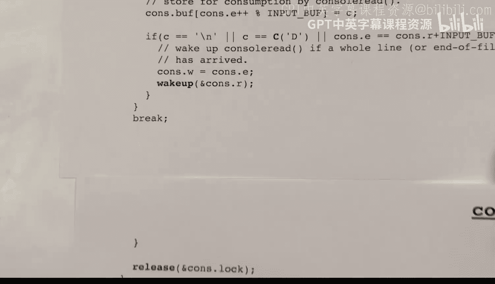

# xv6 操作系统内核：18：uart.c 与 console.c 详解 🖥️


在本节课中，我们将学习 xv6 操作系统中负责串行输入输出的两个核心文件：`uart.c` 和 `console.c`。我们将了解它们如何协同工作，管理来自键盘的输入和发送到显示器的输出，包括缓冲、中断处理和字符回显等关键机制。

## 系统概述

上一节我们介绍了 xv6 内核的总体结构，本节中我们来看看具体的硬件交互模块。xv6 通过模拟的 16550A 芯片与终端进行通信。内核通过向特定内存映射地址写入字节来向显示器发送字符，并通过从特定地址读取字节来从键盘获取字符。

硬件内部可能包含一些 FIFO 缓冲区以使通信更顺畅，但内核可以忽略这些。软件层面，内核维护了两个主要缓冲区：
*   **输出队列**：称为 UART 发送缓冲区。
*   **输入队列**：称为控制台缓冲区。

每个队列都由自己的锁保护。内核通过三个主要函数与外界交互：
*   `printf`：内核用于打印错误信息，这些信息被视为关键，会绕过输出缓冲区立即显示。
*   `consolewrite`：用户模式程序用于向输出写入数据。
*   `consoleread`：用户模式程序用于从输入读取数据。

## 输出处理流程

现在，让我们深入了解输出是如何被缓冲和发送的。输出缓冲区是一个环形缓冲区，称为 UART 发送缓冲区。

以下是其工作原理的关键点：
*   缓冲区有固定大小（实际为32字节）。
*   使用读索引（`r`）和写索引（`w`）来管理。
*   当 `r == w` 时，缓冲区为空。
*   当 `w - r == 缓冲区大小` 时，缓冲区为满。
*   索引值会持续递增，并通过取模运算（`% 缓冲区大小`）来实现环形访问。

由于多个进程和核心可能同时访问此缓冲区，因此它由一个名为 `uart_tx_lock` 的锁保护。

## 输入处理流程

接下来，我们转向输入缓冲区。输入缓冲区（控制台缓冲区）比输出缓冲区更复杂，因为它需要处理行编辑（如退格和整行删除）。

输入缓冲区使用三个索引：
*   `r`：读取索引，指向下一个待读取给用户程序的字符。
*   `w`：写入索引，指向下一个待写入的新行起始位置（或文件结束符）。
*   `e`：编辑索引，指向当前正在输入的行尾。


其工作流程如下：
*   用户键入字符时，字符被添加到 `e` 指向的位置，然后 `e` 递增。
*   按下退格键时，`e` 递减，并回显删除操作。
*   按下 `Ctrl+U` 时，`e` 回退到上一行末尾（或 `w` 的位置），以删除整行。
*   当用户输入换行符或 `Ctrl+D`（文件结束符）时，`w` 被设置为 `e` 的位置，标志着一行输入完成，并唤醒等待输入的 `consoleread` 函数。

## 硬件寄存器映射

为了与硬件通信，内核需要读写特定的内存映射寄存器。UART 设备被映射到物理内存地址空间中的固定地址（`UART0`）。

以下是关键寄存器及其偏移量：
*   **偏移量 0**：**写操作**时是发送保持寄存器（THR），用于输出字节。**读操作**时是接收保持寄存器（RHR），用于输入字节。
*   **偏移量 5**：线路状态寄存器（LSR）。包含两个重要位：
    *   一位指示接收保持寄存器中是否有数据可读。
    *   另一位指示发送保持寄存器是否就绪，可以接收下一个要发送的字节。
*   其他寄存器用于设置波特率、启用中断和 FIFO 等。

## uart.c 文件函数解析

在了解了基本概念后，我们深入代码。`uart.c` 文件包含以下核心函数：

**1. uartputc_sync**
此函数用于尽可能快地将字符发送到硬件输出，绕过输出缓冲区。它被 `printf` 用于打印错误信息，也用于回显输入字符。
```c
void uartputc_sync(int c) {
    // 等待发送寄存器就绪
    while((ReadReg(LSR) & LSR_TX_IDLE) == 0);
    // 写入字符到发送寄存器
    WriteReg(THR, c);
}
```

**2. uartputc**
此函数由 `consolewrite` 调用，用于将字符添加到输出缓冲区。如果缓冲区满，调用者会睡眠等待。
```c
void uartputc(int c) {
    acquire(&uart_tx_lock);
    // 如果缓冲区满，则睡眠
    while(uart_tx_w == uart_tx_r + UART_TX_BUF_SIZE) {
        sleep(&uart_tx_r, &uart_tx_lock);
    }
    // 将字符放入缓冲区并更新写索引
    uart_tx_buf[uart_tx_w % UART_TX_BUF_SIZE] = c;
    uart_tx_w += 1;
    // 尝试启动发送
    uartstart();
    release(&uart_tx_lock);
}
```

**3. uartstart**
此函数检查输出缓冲区是否有数据，以及硬件是否就绪。如果条件满足，则从缓冲区取出一个字符发送给硬件，并唤醒可能正在等待缓冲区空间变空的 `uartputc` 函数。

**4. uartgetc**
此函数从硬件读取一个输入字节（如果就绪）。如果没有数据，则立即返回 -1，不会等待。

**5. uartintr**
这是 UART 设备的中断处理函数。当硬件有输入字符到达或准备好接收下一个输出字符时，会触发中断并调用此函数。它的职责是：
*   读取所有可用的输入字符，并为每个字符调用 `consoleintr`。
*   调用 `uartstart` 来发送输出缓冲区中的下一个字符。

## console.c 文件函数解析

现在，我们来看控制台相关的函数，它们主要管理输入缓冲区。

**1. consolewrite**
此函数被系统调用实现使用，用于将用户空间的数据写入输出。它循环调用 `uartputc` 将每个字符放入输出缓冲区。

**2. consoleread**
此函数被系统调用实现使用，用于从输入缓冲区读取数据到用户空间。它等待直到有一整行数据可用（即 `w > r`），然后将字符复制到用户缓冲区，直到遇到换行符或文件结束符。



**3. consoleintr**
此函数由 `uartintr` 为每个输入的字符调用。它负责处理字符并将其添加到输入缓冲区，同时处理特殊字符：
*   **退格/删除**：将编辑索引 `e` 回退，并回显删除操作。
*   **Ctrl+U**：将 `e` 回退到行首或上一个换行符，删除整行。
*   **换行符/Ctrl+D**：将写入索引 `w` 更新到 `e`，标志一行输入完成，并唤醒所有等待输入的 `consoleread` 进程。
*   **普通字符**：回显字符，并将其存储到 `e` 指向的缓冲区位置。

**4. consoleinit**
初始化函数，设置控制台锁并调用 `uartinit` 来初始化 UART 硬件。

## 总结

本节课中我们一起学习了 xv6 操作系统中串行输入输出子系统的详细工作原理。我们分析了 `uart.c` 和 `console.c` 两个关键文件，了解了它们如何通过环形缓冲区管理输入输出，如何处理硬件中断，以及如何实现字符回显和行编辑功能。核心在于通过锁保护共享缓冲区，并通过睡眠/唤醒机制协调生产者（输入/写入者）和消费者（输出/读取者）的速度。这套机制是理解操作系统设备驱动和系统调用接口的基础。