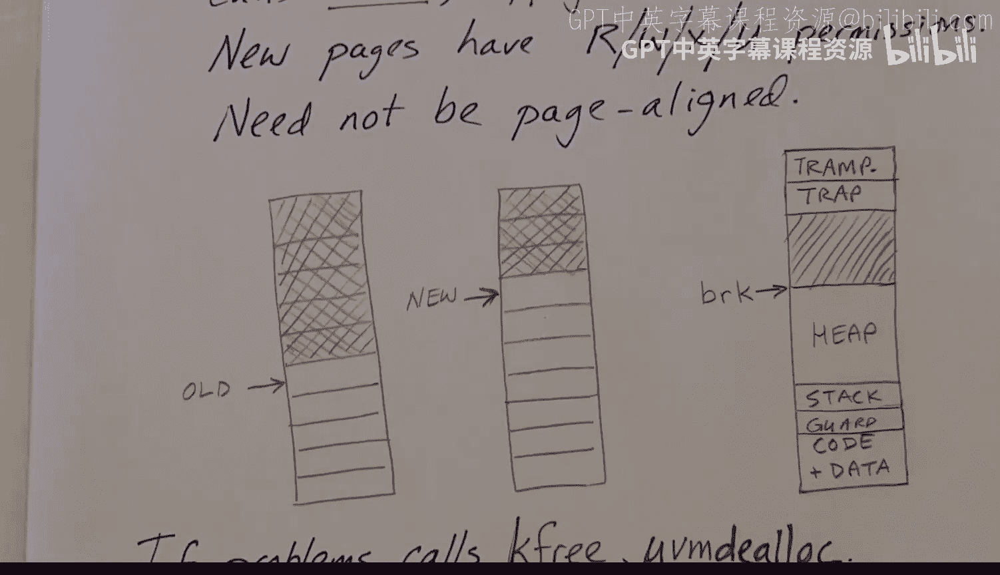

# xv6 操作系统内核：19：虚拟内存辅助函数概述 🧠


在本节课中，我们将学习 xv6 内核中用于虚拟内存管理的一系列辅助函数。这些函数定义在 `vm.c` 文件中，用于操作页表结构。它们相对独立且不涉及锁或休眠操作。为了便于理解，我们将分两部分介绍：本节是函数概述，下一节将详细分析代码。

首先，让我们回顾一下页表的结构。

## 页表结构回顾 🌳

在 xv6 中，页表是一个三级树形结构。我们可以将根节点称为**根页**，所有构成页表的页都称为**索引页**。在最底层，索引页指向**数据页**。

一个虚拟地址的格式如下：

```
| 一级索引 | 二级索引 | 三级索引 | 页内偏移 |
```

我们使用地址的高位字段（一级、二级、三级索引）在页表中逐级向下查找，最后的“页内偏移”用于在数据页内部定位。

页表项（PTE）的格式包含一个**页对齐的指针**（用于指向下一级页表或数据页）和几个标志位：
*   **有效位 (V)**：表示该页表项是否有效。
*   **读/写/执行位 (R/W/X)**：定义页面的访问权限。
*   **用户模式位 (U)**：表示该页面是否可在用户模式下访问。

**请注意**：`R/W/X/U` 这些权限位仅在最后一级（指向数据页）的页表项中有效。在上层的索引页中，只有 `V` 位有意义，其他位应为零。

上一节我们回顾了页表的基本结构，本节中我们来看看操作这些结构的具体函数。

## 核心辅助函数详解 🔧

以下是 `vm.c` 中定义的主要虚拟内存辅助函数及其功能。

### 1. 页表遍历函数 `walk`

`walk` 函数接收一个页表（即指向根页的指针）和一个虚拟地址。它的作用是遍历页表树，并返回指向**最终数据页**的**页表项（PTE）的地址**。

```c
pte_t *walk(pagetable_t pagetable, uint64 va, int alloc);
```

*   **参数 `alloc`**：如果路径上的中间索引页不存在，此参数决定是否创建它们（分配物理页并设置）。
*   **返回值**：成功则返回指向目标 PTE 的指针；如果无法分配所需页面（且 `alloc` 为 0），则返回空指针 `0`。

### 2. 建立映射函数 `mappages`

`mappages` 函数用于向页表中添加一个或多个映射。它接收一个页表、一个起始虚拟地址、一个起始物理地址、要映射的页面数量以及权限标志。

```c
int mappages(pagetable_t pagetable, uint64 va, uint64 size, uint64 pa, int perm);
```



*   **功能**：将一段连续的虚拟页面映射到一段连续的物理页面。
*   **返回值**：成功返回 `0`；如果映射过程中出现错误（如页面已映射），则返回 `-1`。这是 xv6 内核函数常见的错误处理模式。

### 3. 内核页表相关函数

内核只有一个页表，所有 CPU 核心共享它。创建内核页表涉及以下函数：

*   **`kvmmap`**：此函数与 `mappages` 功能类似，但用于构建内核页表。由于内核页表在初始化时必须成功建立，如果 `mappages` 返回错误，`kvmmap` 会直接调用 `panic` 使内核崩溃。
*   **`kvminit`**：这是初始化内核页表的主函数。它调用 `kvmmap` 来：
    1.  建立**直接映射**，将全部物理内存映射到内核虚拟地址空间。
    2.  映射所有内存映射的 I/O 设备。
    3.  为 **trampoline 页**（蹦床页）建立映射。该物理页在虚拟地址空间中有两个映射：一个在其实际物理位置，另一个在虚拟地址空间的最高页。
    4.  调用 `proc_mapstacks` 为每个进程分配内核栈页。
*   **`kvminithart`**：每个 CPU 核心在初始化时调用此函数。它将全局变量 `kernel_pagetable`（由 `kvminit` 设置）的地址写入 `satp` 寄存器。**这步操作实际上为该核心开启了分页机制**。

### 4. 地址翻译函数 `walkaddr`

`walkaddr` 函数用于将用户空间的虚拟地址转换为物理地址。

```c
uint64 walkaddr(pagetable_t pagetable, uint64 va);
```

*   **功能**：调用 `walk` 查找虚拟地址对应的页表项，然后结合页内偏移计算出物理地址。
*   **要求**：目标页面必须标记为有效 (`V`) 且用户可访问 (`U`)。
*   **返回值**：成功返回物理地址；如果地址无效或权限不足，则返回 `0`。由于虚拟地址 `0` 被映射到物理地址 `0`，没有其他虚拟地址会翻译成物理地址 `0`，因此返回 `0` 是安全的错误指示。

### 5. 用户地址空间创建与修改

*   **`uvmcreate`**：创建一个空的用户虚拟地址空间。它分配一个物理页作为页表的根页，并将其内容清零。
*   **`uvminit`**：创建**第一个**用户地址空间（init 进程）。它分配一个页，映射到虚拟地址 `0`，并标记为可读、可写、可执行且用户可访问 (`R|W|X|U`)。然后，它将内核中存储的 `initcode` 字节数组（一段汇编程序）复制到这个页面。这段代码会执行 `exec(“/init”)` 系统调用。
*   **`uvmalloc`**：为用户地址空间**增加**页面（例如扩展堆）。
    ```c
    uint64 uvmalloc(pagetable_t pagetable, uint64 oldsz, uint64 newsz);
    ```
    *   **功能**：分配新的物理页，并使用 `mappages` 将其映射到用户地址空间中 `oldsz` 到 `newsz` 的区域。新页面权限为 `R|W|X|U`。
    *   **返回值**：成功返回新的地址空间大小 (`newsz`)；失败则释放所有已分配的资源并返回 `0`。
*   **`uvmdealloc`**：为用户地址空间**减少**页面（例如收缩堆）。它内部调用 `uvmunmap` 来解除映射并释放物理页。
    ```c
    uint64 uvmdealloc(pagetable_t pagetable, uint64 oldsz, uint64 newsz);
    ```
    *   **注意**：`oldsz` 和 `newsz` 不需要页面对齐。如果 `newsz > oldsz`，该函数不执行任何操作。

### 6. 解除映射与空间释放

*   **`uvmunmap`**：从页表中移除指定虚拟地址范围内的映射。
    ```c
    void uvmunmap(pagetable_t pagetable, uint64 va, uint64 npages, int do_free);
    ```
    *   **参数 `do_free`**：一个布尔值，指示是否在解除映射后调用 `kfree` 释放对应的**数据页**。
    *   **操作**：遍历指定范围内的每个页面，将其页表项的有效位 (`V`) 清零，使其无效。
*   **`uvmfree`**：释放整个用户地址空间。
    ```c
    void uvmfree(pagetable_t pagetable, uint64 sz);
    ```
    *   **功能**：首先调用 `uvmunmap(…, 1)` 释放所有用户数据页（代码、数据、堆、栈）。然后调用 `freewalk` 释放页表本身的所有**索引页**。
    *   **注意**：用户地址空间高位的 **trampoline 页**（所有进程共享）和 **trapframe 页**（每个进程独立预分配）不会被此函数释放。
*   **`freewalk`**：递归地释放页表树中的所有**索引页**，但不释放数据页。
    ```c
    void freewalk(pagetable_t pagetable);
    ```
    *   **递归深度**：由于 xv6 页表只有三级，递归深度有限，不会导致内核栈溢出。

### 7. 地址空间复制 `uvmcopy`

在 `fork` 系统调用中，需要复制父进程的整个地址空间给子进程。`uvmcopy` 负责这项工作。

```c
int uvmcopy(pagetable_t old, pagetable_t new, uint64 sz);
```

*   **功能**：将旧页表 (`old`) 中 `[0, sz)` 范围内的所有**数据页**逐页复制到新分配的物理页，并将这些新页以相同的权限映射到新页表 (`new`) 中。
*   **实现**：对每个需要复制的页面，调用 `walk` 查找 PTE，`kalloc` 分配新物理页，`memmove` 复制数据，`mappages` 建立新映射。
*   **错误处理**：如果中途失败（如内存不足），它会回滚所有操作：释放已分配的新页并解除已建立的新映射。

### 8. 用户空间访问函数

内核经常需要读写用户进程地址空间中的数据（例如，系统调用参数）。由于用户数据可能跨多个不连续的物理页，需要特殊函数来处理。

*   **`copyin`**：从用户空间复制数据到内核缓冲区。
    ```c
    int copyin(pagetable_t pagetable, char *dst, uint64 srcva, uint64 len);
    ```
    *   **功能**：将用户页表 `pagetable` 中，起始于虚拟地址 `srcva` 的 `len` 字节数据，复制到内核地址 `dst`。它逐页处理，确保在内核中获得连续的数据。
*   **`copyout`**：从内核缓冲区复制数据到用户空间。
    ```c
    int copyout(pagetable_t pagetable, uint64 dstva, char *src, uint64 len);
    ```
    *   **功能**：将内核地址 `src` 处的 `len` 字节数据，复制到用户页表 `pagetable` 中起始于虚拟地址 `dstva` 的位置。
*   **`copyinstr`**：`copyin` 的变体，专门用于复制以空字符 (`\0`) 结尾的字符串。
    ```c
    int copyinstr(pagetable_t pagetable, char *dst, uint64 srcva, uint64 max);
    ```
    *   **功能**：从用户空间复制字符串到 `dst`，最多复制 `max` 个字节。如果遇到空终止符则停止。
    *   **返回值**：成功返回 `0`；如果达到 `max` 仍未遇到空终止符，则返回 `-1`。

### 9. 其他工具函数

*   **`uvmclear`**：用于将用户地址空间中的**栈保护页**标记为用户不可访问。它通过清除对应页表项中的 `U` 位来实现。
    ```c
    void uvmclear(pagetable_t pagetable, uint64 va);
    ```

## 总结 📚

本节课我们一起学习了 xv6 内核虚拟内存管理的一系列核心辅助函数。我们了解了如何遍历页表 (`walk`)、建立和解除映射 (`mappages`, `uvmunmap`)、管理用户地址空间的创建、扩展、收缩和复制 (`uvmcreate`, `uvmalloc`, `uvmdealloc`, `uvmcopy`)，以及如何在用户空间和内核空间之间安全地复制数据 (`copyin/out`)。这些函数是 xv6 实现内存隔离、进程创建和系统调用的基础。在下一节中，我们将深入代码，详细查看这些函数的具体实现。