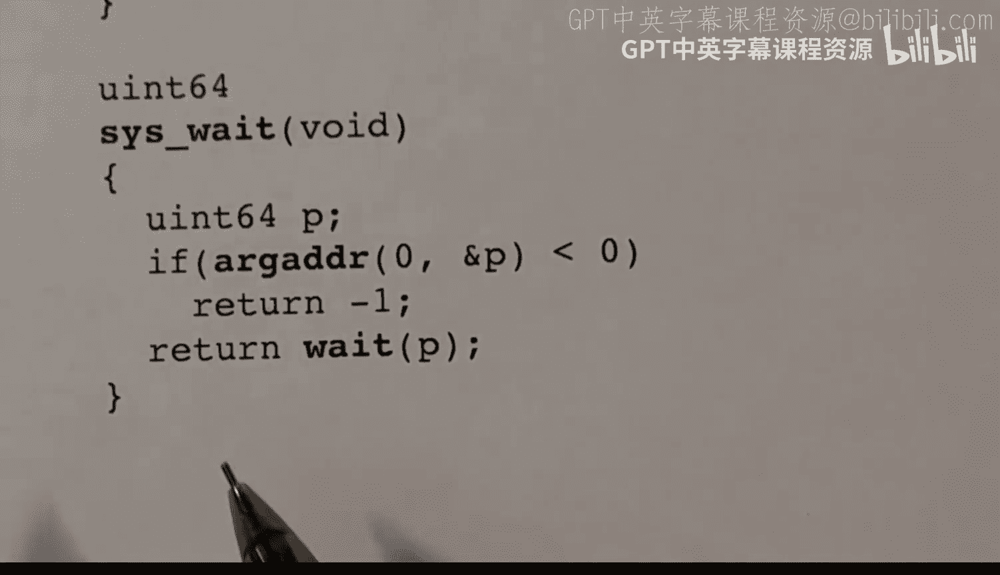

# 24：Exit、Wait、Kill 系统调用 🖥️


## 概述

在本节课中，我们将要学习 xv6 操作系统中用于进程终止和管理的三个核心系统调用：`exit`、`wait` 和 `kill`。我们将探讨进程如何终止、父进程如何回收子进程资源，以及如何强制终止一个进程。理解这些机制是理解操作系统进程生命周期管理的基础。

## Exit 系统调用

上一节我们介绍了进程的基本概念，本节中我们来看看进程如何结束自己的生命。`exit` 系统调用用于终止一个进程。

*   **功能**：`exit` 终止调用它的进程。
*   **参数**：一个整数状态码。在 Unix/Linux 和 xv6 中，状态码 0 通常表示成功，非零值表示错误。
*   **核心行为**：
    1.  进程停止执行指令。
    2.  如果存在正在等待（`wait`）的父进程，则唤醒父进程，并将状态码传递给父进程。
    3.  进程自身变为“僵尸”（Zombie）状态。僵尸进程已停止运行，但其进程结构体（`proc`）仍被保留，用于存放退出状态，等待父进程回收。
    4.  如果父进程没有在等待，则终止的进程必须保持僵尸状态，直到父进程调用 `wait`。
    5.  如果父进程先于子进程退出，子进程会被“重新指定父进程”（reparent）给初始进程 `init`。`init` 进程会负责回收这些孤儿进程。

以下是 `exit` 系统调用在 xv6 内核中的主要代码逻辑框架：

```c
void exit(int status) {
    // 关闭进程打开的文件
    for(int fd = 0; fd < NOFILE; fd++) {
        if(proc->ofile[fd]) {
            // 关闭文件描述符
        }
    }
    // 进程状态变为 ZOMBIE
    proc->state = ZOMBIE;
    // 保存退出状态
    proc->xstate = status;
    // 如果有子进程，将它们重新指定给 init 进程
    reparent(proc);
    // 唤醒可能正在等待的父进程
    wakeup(proc->parent);
    // 跳转到调度器，此进程永远不会再被调度
    sched();
}
```

## Wait 系统调用

了解了进程如何终止后，我们来看看父进程如何得知子进程的结束并清理资源。`wait` 系统调用用于父进程等待子进程终止。

*   **功能**：`wait` 使父进程等待任意一个子进程结束，并获取其退出状态。
*   **参数**：一个用于存放子进程退出状态码的内存地址指针。
*   **返回值**：返回终止子进程的进程 ID（PID）。如果没有子进程，则返回 -1。
*   **核心行为**：
    1.  父进程遍历进程表，寻找状态为 `ZOMBIE` 的子进程。
    2.  如果找到僵尸子进程，则获取其退出状态码，复制到参数指定的用户空间地址，然后释放该子进程的 `proc` 结构体，最后返回该子进程的 PID。
    3.  如果没有僵尸子进程，但存在活着的子进程，则父进程调用 `sleep` 函数进入睡眠状态，等待子进程退出。
    4.  当子进程调用 `exit` 时，会调用 `wakeup` 唤醒正在睡眠的父进程。父进程被唤醒后，再次执行步骤1。

以下是 `wait` 系统调用在 xv6 内核中的主要逻辑：



```c
int wait(uint64 addr) {
    // 循环等待子进程退出
    for(;;) {
        // 遍历所有进程，寻找当前进程的子进程
        for(np = proc; np < &proc[NPROC]; np++) {
            if(np->parent == proc) { // 找到子进程
                acquire(&np->lock);
                if(np->state == ZOMBIE) { // 子进程已终止
                    // 复制退出状态到用户空间 addr
                    copyout(..., addr, np->xstate, ...);
                    // 释放子进程资源
                    freeproc(np);
                    release(&np->lock);
                    return np->pid;
                }
                release(&np->lock);
            }
        }
        // 没有找到可回收的僵尸子进程，但有子进程存活，则睡眠
        sleep(proc, &wait_lock);
    }
}
```

## Kill 系统调用

最后，我们学习如何从外部强制终止一个进程。`kill` 系统调用用于向指定进程发送“终止”信号。

*   **功能**：`kill` 请求终止一个具有指定 PID 的进程。
*   **参数**：目标进程的 PID。
*   **返回值**：成功返回 0，如果 PID 不存在则返回 -1。
*   **核心行为**：
    1.  根据 PID 找到目标进程的 `proc` 结构体。
    2.  将该进程的 `killed` 标志设置为 1（真）。
    3.  如果目标进程正在睡眠（`SLEEPING` 状态），则将其状态改为可运行（`RUNNABLE`），并唤醒它。这是为了确保被 `kill` 的进程能尽快执行到检查 `killed` 标志的代码路径。
    4.  `kill` 系统调用本身并不立即停止目标进程。目标进程会在下次有机会执行内核代码时（例如，从系统调用返回用户空间前）检查自己的 `killed` 标志。如果发现被置位，则会调用 `exit` 来终止自己。

以下是 `kill` 系统调用在 xv6 内核中的主要逻辑：

```c
int kill(int pid) {
    // 遍历进程表
    for(p = proc; p < &proc[NPROC]; p++) {
        acquire(&p->lock);
        if(p->pid == pid) { // 找到目标进程
            p->killed = 1; // 设置终止标志
            if(p->state == SLEEPING) {
                // 如果进程在睡眠，唤醒它以便其能检查 killed 标志
                p->state = RUNNABLE;
            }
            release(&p->lock);
            return 0;
        }
        release(&p->lock);
    }
    return -1; // 未找到指定 PID 的进程
}
```

## 总结

本节课中我们一起学习了 xv6 操作系统中三个关键的进程管理系统调用。

1.  **`exit`**：进程主动终止，保存退出状态，变为僵尸进程，并通知或等待父进程。
2.  **`wait`**：父进程等待并回收僵尸子进程的资源，获取其退出状态。这是防止僵尸进程残留的必要操作。
3.  **`kill`**：向另一个进程发送终止请求。它通过设置标志位并可能唤醒目标进程来实现，实际的终止动作由目标进程在检查到标志后调用 `exit` 来完成。

这三个系统调用协同工作，构成了 xv6 进程从创建、运行到终止和清理的完整生命周期管理机制。理解它们对于掌握操作系统的进程模型至关重要。