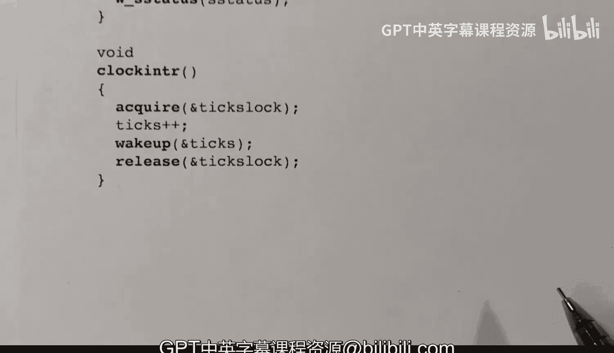

# xv6 操作系统内核：26：内核模式下的陷阱处理


## 概述
在本节课中，我们将要学习当 xv6 操作系统内核在**内核模式**下执行时，如果发生**陷阱**（例如设备中断或时钟中断），系统是如何处理的。我们将分析相关的汇编代码和 C 语言函数，理解寄存器保存、中断处理以及进程调度的具体流程。

## 内核模式陷阱处理流程回顾
上一节我们介绍了用户模式下的陷阱处理流程。本节中我们来看看内核模式下的情况。当内核代码执行时发生陷阱，硬件会跳转到 `kernelvec` 汇编代码处，而不是 `uservec`。

内核模式下的陷阱处理与用户模式有一个关键区别：**寄存器被保存在当前内核栈上**，而不是进程的固定陷阱帧中。这是因为内核在执行时已经拥有一个有效的栈。

## 内核陷阱入口：`kernelvec`
首先，我们查看 `kernelvec.S` 中的汇编代码，这是内核模式陷阱发生后首先执行的地方。

```
.globl kernelvec
.align 4
kernelvec:
    # 在内核栈上分配256字节空间
    addi sp, sp, -256
    # 保存所有通用寄存器（除了始终为0的x0寄存器）
    sd ra, 0(sp)
    sd sp, 8(sp)
    sd gp, 16(sp)
    # ... 保存其他寄存器 t0-t6, s0-s11, a0-a7
    # 调用C语言陷阱处理函数
    call kerneltrap
    # 恢复所有通用寄存器
    ld ra, 0(sp)
    ld sp, 8(sp)
    ld gp, 16(sp)
    # ... 恢复其他寄存器
    # 释放栈空间并返回
    addi sp, sp, 256
    sret
```

这段代码首先在内核栈上预留空间，然后保存所有通用寄存器的状态。接着，它调用C函数 `kerneltrap` 进行具体的陷阱处理。处理完毕后，恢复寄存器状态，并通过 `sret` 指令返回到被中断的内核代码继续执行。

**注意**：`tp`（线程指针）寄存器在此过程中**不会被恢复**。因为陷阱（如时钟中断）可能导致进程被重新调度到不同的CPU核心上执行，而 `tp` 寄存器用于标识当前运行的核心，应由调度器在恢复进程时正确设置。

## 核心陷阱处理函数：`kerneltrap`
`kerneltrap` 函数（位于 `trap.c` 中）是内核模式陷阱处理的核心。它负责诊断陷阱原因并分发给相应的处理程序。

以下是该函数的关键步骤：

1.  **保存关键状态寄存器**：首先保存发生陷阱时的程序计数器（`sepc`）、状态寄存器（`sstatus`）和原因寄存器（`scause`）的值。这些信息对于返回和诊断至关重要。
2.  **完整性检查**：确认陷阱发生时确实处于内核模式（通过检查 `sstatus` 中的特权模式位），并确认中断当时是禁用的。
3.  **调用设备中断处理**：调用 `devintr()` 函数来判断陷阱的具体类型。
4.  **根据返回值处理**：
    *   如果返回 **2**，表示是**时钟中断**，则调用 `yield()` 函数让出CPU。
    *   如果返回 **1**，表示是**设备中断**（如UART或磁盘），`devintr()` 内部已调用相应设备的中断处理程序。
    *   如果返回 **0**，表示是未知原因，则打印错误信息并触发内核恐慌（`panic`）。
5.  **恢复与返回**：最后，恢复之前保存的 `sepc` 和 `sstatus` 寄存器值，然后返回到 `kernelvec` 汇编代码，由后者完成最终的寄存器恢复和 `sret` 返回。

**一个重要的检查**：在因时钟中断调用 `yield()` 之前，代码会检查当前进程的状态是否为 `RUNNING`。这是因为中断也可能发生在**调度器**代码本身（而非某个进程）执行时。例如，当调度器循环寻找可运行进程并临时打开中断时，就可能被中断。此时没有进程处于 `RUNNING` 状态，不应调用 `yield()`。

## 设备中断分发函数：`devintr`
`devintr` 函数负责解析 `scause` 寄存器，以确定具体的中断来源。

其逻辑如下：
1.  读取 `scause` 寄存器。
2.  判断中断类型：
    *   如果是**外部中断**，则来源于平台级中断控制器（PLIC），通常是UART或磁盘设备。函数会查询PLIC是哪个设备触发的，然后调用对应的中断处理程序（`uartintr` 或 `virtio_disk_intr`），最后告知PLIC中断已处理，并返回值 **1**。
    *   如果是**软件中断**，在xv6中，这由机器模式代码在收到时钟中断后模拟产生，因此代表**时钟中断**。函数会清除中断等待位，如果是核心0，还会更新全局时钟滴答数（`ticks`）。最后返回值 **2**。
    *   其他情况返回值 **0**。

时钟滴答数 `ticks` 由一个自旋锁 `tickslock` 保护，对其进行累加操作时需要先获取锁。

## 总结
本节课中我们一起学习了 xv6 内核模式下的陷阱处理机制。关键点在于：
1.  内核陷阱使用当前**内核栈**来保存上下文。
2.  处理入口是 `kernelvec` 汇编代码，它保存/恢复寄存器并调用 `kerneltrap`。
3.  `kerneltrap` 函数进行状态保存、原因诊断，并分发给设备中断处理或调度器（`yield`）。
4.  `devintr` 函数具体区分设备中断和时钟中断。
5.  处理过程需要仔细管理中断的禁用与启用状态，并考虑调度器上下文等特殊情况。



理解内核模式下的陷阱处理，对于掌握操作系统的并发控制、中断响应和进程调度至关重要。