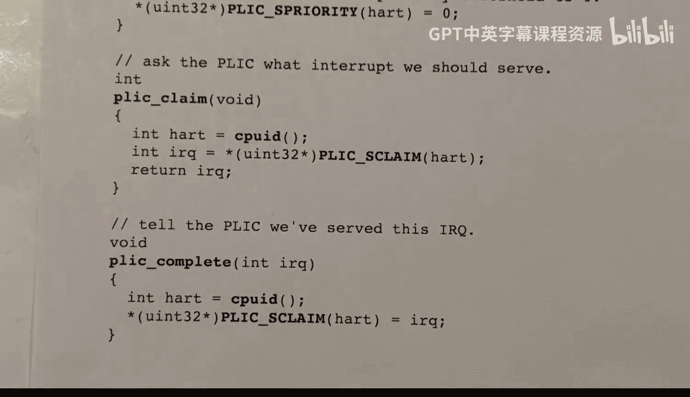

# 27：平台级中断控制器 (PLIC) 🎯


在本节课中，我们将要学习平台级中断控制器（Platform Level Interrupt Controller，简称 PLIC）的工作原理。PLIC 是 RISC-V 处理器生态系统中一个关键的硬件电路，负责管理和路由来自各种输入/输出（I/O）设备的中断信号到处理器核心。理解 PLIC 是理解操作系统如何处理硬件中断的基础。

## 概述：中断路由问题

当 I/O 设备需要中断一个处理器核心时会发生什么？这是一个核心问题。设想我们有一些 I/O 设备，如磁盘、键盘、UART 或网卡，以及多个处理器核心。当设备需要关注时（例如，用户按下键盘或磁盘完成读写操作），它会发送一个中断信号。这个信号需要被路由到某个核心，触发该核心上的陷阱（trap），从而运行相应的中断处理程序。中断处理程序会直接与设备通信，处理请求，然后恢复被中断的工作。PLIC 就是负责这个路由过程的硬件。

## PLIC 的基本架构与工作流程

上一节我们介绍了中断路由的基本问题，本节中我们来看看 PLIC 是如何具体解决这个问题的。

PLIC 与 I/O 设备、处理器核心以及主内存通过某种互连结构（如总线）连接。设备通过内存映射 I/O 寄存器与核心通信，而 PLIC 本身也是一组内存映射寄存器，供核心进行配置和交互。

中断信号通过专门的线路（电线）从设备传送到 PLIC。信号进入 PLIC 后，首先经过一个称为“网关”（gateway）的组件。网关可以理解为一个比特位，当中断到达时，该位被置为 1，表示有一个中断正在等待处理（pending）。此时，PLIC 会根据一个“使能矩阵”（enable matrix）来决定通知哪些核心。

以下是 PLIC 处理单个中断的基本步骤：

1.  **中断发生**：设备发送中断信号，PLIC 网关中对应的“源中断挂起位”（source interrupt pending bit）被置为 1。
2.  **通知核心**：PLIC 查询使能矩阵，向所有为该设备使能的核心发送外部中断信号。
3.  **核心响应**：如果目标核心的中断是启用的，则会立即发生陷阱，并跳转到陷阱处理程序。
4.  **声明中断**：陷阱处理程序的第一件事是向 PLIC “声明”（claim）这个中断。这是通过读取 PLIC 中一个特定的内存映射寄存器来完成的。PLIC 会返回触发中断的**设备 ID**，并（通常）清除对应的源中断挂起位。
5.  **处理中断**：获得设备 ID 的核心会运行对应的设备驱动程序代码，直接与设备交互。
6.  **完成中断**：中断处理完毕后，处理程序通过向同一个声明寄存器**写入**设备 ID 来通知 PLIC 中断处理已完成。
7.  **后续处理**：PLIC 收到完成通知后，会再次检查该设备的源中断挂起位。如果该位仍为 1（表示设备又发出了中断请求），则 PLIC 会再次发起中断流程。

## 中断信号类型：电平敏感与边沿触发

在深入细节之前，我们需要了解设备发送给 PLIC 的两种信号类型，这决定了 PLIC 如何检测中断请求。

*   **电平敏感（Level-sensitive）**：PLIC 持续监测信号线的电平。当信号线为高电平（1）时，PLIC 就认为有中断请求。中断处理完成后，PLIC 会再次检查，如果线仍然是高电平，则会触发下一次中断。
*   **边沿触发（Edge-triggered）**：PLIC 监测信号从低电平到高电平的跳变（上升沿）。每次上升沿代表一次中断请求。网关有两种实现方式：
    *   **单比特位**：上升沿将位置 1，直到中断被处理完成才清零。在此期间的新上升沿被忽略。
    *   **计数器**：每个上升沿使计数器加 1，每次中断被声明时计数器减 1。处理完成后，如果计数器大于 0，则立即触发下一次中断。

## PLIC 的详细机制与配置

现在我们已经了解了 PLIC 的基本流程和信号类型，本节我们来探讨一些更复杂的机制和配置细节。

首先，每个能产生中断的设备都被分配一个唯一的 **ID**（1 到 1023），ID 0 表示“无设备”。其次，现代处理器核心可能支持多个硬件线程（HART），并且 RISC-V 核心可以在不同的特权模式（如机器模式、监管者模式）下运行。PLIC 规范将每个“目标”（target）定义为（HART， 模式）的组合，最多支持 15872 个目标。

PLIC 引入了**优先级**和**阈值**的概念来实现中断仲裁：

*   **设备优先级**：每个设备被赋予一个优先级数字，数字越大优先级越高。快速设备（如磁盘）通常设置高优先级，慢速设备（如键盘）设置低优先级。
*   **核心阈值**：每个目标（核心/模式）有一个优先级阈值。
*   **仲裁规则**：一个设备的中断**只会**发送给一个核心，当且仅当该设备的优先级**高于**该核心的当前阈值。PLIC 会选择优先级最高的待处理中断，并将其发送给阈值低于该中断优先级且使能了该设备的所有核心中，ID 最小的那个核心。

处理器核心通过读写 PLIC 的**内存映射 I/O 寄存器**来控制它。这些寄存器占据了物理地址空间中的一大段区域（例如 64 MB），主要包括：

*   **优先级寄存器**：为每个设备（ID 1-1023）设置优先级。
*   **阈值寄存器**：为每个目标设置优先级阈值。
*   **使能寄存器**：一个大的位矩阵，配置每个设备可以向哪些目标发送中断。
*   **挂起寄存器**：核心可以读取这些位来查询哪些设备有中断正在挂起。
*   **声明/完成寄存器**（每个目标一个）：这是最重要的寄存器。**读取**操作会“声明”一个中断并返回设备 ID；**写入**一个设备 ID 则“完成”该中断的处理。

## 在 xv6 与 QEMU 中的具体实现

理论部分已经介绍完毕，本节我们来看看 PLIC 在 xv6 操作系统和 QEMU 模拟器中的具体实现。

在 xv6 运行的 QEMU 环境中，PLIC 是虚拟模拟的。xv6 支持 8 个核心（`NCPU`），并且只使用监管者模式（supervisor mode）来处理中断，因此总共有 8 个目标。QEMU 模拟了两个主要 I/O 设备：
*   虚拟 I/O 磁盘（VirtIO disk）：设备 ID **1**
*   UART（串口）：设备 ID **10**

xv6 的 PLIC 驱动代码在 `plic.c` 文件中，非常简洁。它主要包含四个函数：

以下是相关函数的简要说明：

1.  `plicinit()`: 由核心 0 在启动时调用一次，用于设置两个设备的优先级。
    ```c
    // 设置磁盘（ID 1）和 UART（ID 10）的优先级为 1
    *(uint32*)(PLIC + UART0_IRQ*4) = 1;
    *(uint32*)(PLIC + VIRTIO0_IRQ*4) = 1;
    ```

2.  `plicinithart()`: 每个核心在启动时调用，用于配置本核心的 PLIC。
    ```c
    int hart = cpuid();
    // 1. 设置使能位：允许磁盘(ID 1)和UART(ID 10)中断本核心
    uint32 enabled = (1 << UART0_IRQ) | (1 << VIRTIO0_IRQ);
    *(uint32*)PLIC_SENABLE(hart) = enabled;
    // 2. 设置本核心的优先级阈值为 0，允许所有优先级的中断
    *(uint32*)PLIC_SPRIORITY(hart) = 0;
    ```

3.  `plic_claim()`: 当核心进入设备中断处理程序时调用，用于向 PLIC 声明并获取中断的设备 ID。
    ```c
    int hart = cpuid();
    int irq = *(uint32*)PLIC_SCLAIM(hart); // 读取声明寄存器
    return irq; // 返回设备ID，若为0则表示本核心未获得中断
    ```

4.  `plic_complete()`: 设备中断处理完毕后调用，通知 PLIC 中断已完成。
    ```c
    int hart = cpuid();
    *(uint32*)PLIC_SCLAIM(hart) = irq; // 向声明寄存器写入设备ID
    ```

当中断发生时，`devintr()` 函数会调用 `plic_claim()`。如果返回非零的设备 ID（1 或 10），则调用相应的设备处理程序（如 `uartintr()` 或 `virtio_disk_intr()`），处理完毕后再调用 `plic_complete()`。如果 `plic_claim()` 返回 0，说明其他核心已经处理了该中断，则本核心直接返回。

## 总结



本节课中我们一起学习了平台级中断控制器（PLIC）的核心概念。我们首先了解了 PLIC 如何解决多设备到多核心的中断路由问题。接着，我们剖析了其工作流程：从中断发生、核心通知、声明中断、处理中断到最终完成中断。我们还区分了电平敏感和边沿触发两种中断信号类型。然后，我们深入探讨了优先级、阈值、内存映射寄存器等详细机制。最后，我们通过分析 xv6 内核中简短的 `plic.c` 代码，看到了 PLIC 在实践中的初始化、声明和完成操作是如何实现的。PLIC 是操作系统与硬件中断交互的关键枢纽，理解它对于掌握操作系统的底层工作原理至关重要。