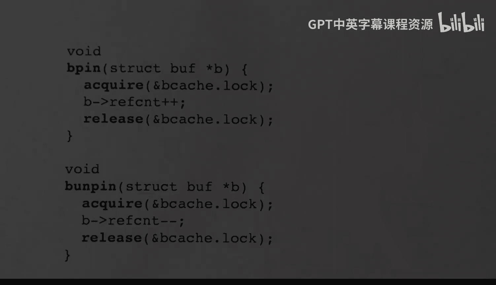

# xv6 操作系统内核：28：磁盘缓冲区缓存 🗃️

在本节课中，我们将学习 Unix 文件系统的底层实现，特别是磁盘系统和缓冲区缓存机制。我们将从磁盘的基本概念开始，逐步深入到 xv6 内核中管理磁盘块缓存的代码实现。

## 概述

在本节中，我们将首先了解磁盘如何以“块”为单位进行数据读写，以及操作系统如何通过“缓冲区缓存”来管理这些磁盘块，以提高性能并协调多个进程对同一数据的访问。我们将重点分析 xv6 中的 `buf.h` 和 `bio.c` 文件。

---

## 磁盘与数据块

上一节我们介绍了课程的整体目标，本节中我们来看看数据存储的基础——磁盘。

磁盘与主内存交换数据的单位不是字节或字，而是一个更大的单位，称为“块”。块是固定大小的字节块。在 xv6 中，块大小由常量 `BSIZE` 定义为 1024 字节。其他系统（如 Linux）可能使用不同的块大小，但在任何操作系统中，块大小都是固定的。

磁盘可以被视为一系列按编号排列的块，编号从 0 开始，直到某个最大值。其中，编号为 1 的第二个块是特殊的，它包含称为“超级块”的信息。超级块是固定的，包含多个参数，其中一个参数是磁盘的大小或块数，文件系统通过读取它来了解可用空间。

磁盘实际读写字节的另一个单位是“扇区”。块和扇区有时被混用，但它们是不同的概念。通常，扇区大小比块小。例如，在 Unix 中，块大小可能是 4096 字节，而某个磁盘模型的扇区大小可能是 512 字节。通过让操作系统以块为单位工作，我们可以忽略不同磁盘驱动器的扇区大小差异。

每当内核需要读写磁盘时，它都会读写整个块，这将导致设备驱动程序读写多个扇区。例如，如果磁盘的扇区大小为 512 字节，那么每次内核读写 4096 字节时，将导致 8 个扇区的读写操作。

在旋转式磁盘设备上，存在多种延迟，例如移动磁头到其他磁道，或等待磁盘旋转使目标扇区位于读写头下方。通过将扇区组合成块，我们可以确保在读取时，大部分扇区是连续读取的，这显著提高了性能。当然，这也有代价：文件的最后一个块可能只被部分填充，最小文件大小将是块大小（如 4096 字节），可能导致一些空间浪费。

---

## 磁盘驱动接口

上一节我们了解了磁盘块的概念，本节中我们来看看 xv6 如何与磁盘交互。

xv6 通过 QEMU 模拟器运行，该模拟器与一个 VirtIO 磁盘设备接口。VirtIO 旨在标准化设备驱动程序与实际硬件之间的接口。xv6 的磁盘驱动程序提供了一个用于读写操作的函数。

这个函数名为 `virtio_disk_rw`，它可以执行读或写操作，具体由第二个参数决定。第一个参数是指向缓冲区（`buf` 结构体实例）的指针。该缓冲区包含足够的空间来存储一个块的数据（在 xv6 中是 1024 字节），以及我们想要读写的块号。

在 xv6 系统中，此函数不返回任何错误报告。如果发生错误（如读取失败），该函数内部会处理（例如重读），直到最终获取数据。在模拟器中，磁盘由主机系统上的文件模拟，因此可能不会发生实际错误。

此函数可能会休眠。例如，如果我们想读取一个缓冲区，该函数会启动读取操作，然后进入睡眠状态。当操作完成时，磁盘会引发一个陷阱，磁盘的中断处理程序将被激活，并唤醒睡眠的函数。此时，调用读/写操作的进程将被重新唤醒并返回。

此外，该函数不会重新排序操作，它会严格按照函数被调用的顺序执行操作，这对于原子事务很重要。

---

## 缓冲区缓存结构

了解了磁盘接口后，现在我们聚焦于核心的缓存机制——缓冲区缓存。

`buf` 结构体被用作磁盘块的缓存。在内核启动时，会预分配固定数量的缓冲区，由常量 `NBUF` 控制。在 xv6 中，恰好有 30 个缓冲区，每个缓冲区都有足够的空间容纳一个数据块（1024 字节）。每个缓冲区还包含其缓存数据对应的磁盘块号，以及其他用于同步的字段。

缓冲区可以是空闲的或正在使用的。我们有一个空闲缓冲区列表，不在列表中的缓冲区正在被使用。

以下是缓冲区的组织方式，它们被组织成一个双向循环链表（也称为环形链表）：
*   有一个特殊的头节点（`head`），它不包含任何数据，仅用于其 `next` 和 `prev` 指针。
*   缓存中的缓冲区（例如 30 个）按“最近最少使用”到“最近最多使用”的顺序组织。我们可以通过头节点的 `next` 指针找到最近最多使用的缓冲区，通过 `prev` 指针找到最近最少使用的缓冲区。
*   使用环形链表可以轻松地移除元素，例如，如果一个元素变为最近最多使用，我们可以将其移到列表前端。

让我们详细查看缓冲区的内容：
*   `next`, `prev`: 指向链表中其他 `buf` 结构的指针。
*   `refcnt`: 引用计数。如果为 0，表示该缓冲区当前未被使用，可以回收重用。如果大于 0，则缓冲区正在使用中。
*   `dev`: 设备号。在 xv6 中只有一个磁盘设备，所以它基本上是常量 1。
*   `blockno`: 指示此缓冲区中存储的数据对应磁盘上的哪个块。
*   `data`: 存储整个数据块的空间（1024 字节）。
*   `valid`: 标志位，指示 `data` 字段是否包含来自磁盘的有效数据。如果不包含，当我们需要使用该数据时，必须从磁盘读入。
*   `disk`: 字段，仅在磁盘驱动程序内部使用（`virtio_disk_rw` 函数），用于指示磁盘操作是否正在进行。
*   `lock`: 睡眠锁，用于保护数据以及 `valid` 和 `disk` 标志位。

缓冲区通过一个名为 `bcache` 的结构体进行分配，它包含三个字段：
*   `lock`: 一个自旋锁。
*   `head`: 一个 `buf` 结构体，作为链表的头节点。
*   `buf`: 一个 `buf` 结构体数组（在 xv6 中是 30 个元素），这些是实际的缓冲区。

我们不直接访问这个数组，而是通过头节点的指针来访问。该数组仅在初始化时用于分配缓冲区并构建初始的循环链表。自旋锁用于保护整个链表，特别是 `next`、`prev`、`refcnt`、`dev` 和 `blockno` 字段。每次我们想要分配或释放缓冲区时，都需要获取这个自旋锁。

---

## 缓存初始化与核心函数

在了解了缓冲区缓存的结构后，本节我们来看看它是如何初始化和运作的。

首先，我们查看 `buf.h` 文件，它包含了 `buf` 结构体的定义，其字段与我们之前描述的一致。

接下来，我们查看 `bio.c` 文件，其中定义了 `bcache` 结构体。文件顶部的注释说明了缓冲区缓存的用途和接口：
*   缓冲区缓存是 `buf` 结构体的链表，用于缓存磁盘块内容。
*   在内存中缓存磁盘块可以减少磁盘读取次数，并为多个进程使用的块提供同步点。
*   接口：
    *   要获取特定磁盘块的缓冲区，应调用 `bread` 函数。
    *   更改缓冲区中的数据后，可以调用 `bwrite` 将其写回磁盘。
    *   使用完缓冲区后，应调用 `brelse` 释放它，之后不应再使用该缓冲区。
    *   一次只能有一个进程使用一个缓冲区，因此需要注意不要过长时间持有缓冲区。

初始化函数 `binit` 在内核启动时被调用。它初始化 `bcache` 锁，并创建缓冲区的链表。它首先创建一个空链表，其中头节点的 `prev` 和 `next` 指针都指向自身。然后遍历 `buf` 数组，初始化每个缓冲区的睡眠锁，并将其添加到链表中。`refcnt`、`dev` 和 `blockno` 字段被隐式初始化为 0。

---

## 缓冲区读写与获取

现在，让我们深入核心的缓冲区操作函数。

`bread` 函数返回一个**已上锁**的缓冲区，其中包含指定磁盘块的内容。它会搜索缓存，如果找到已缓存该磁盘块的缓冲区，则直接返回。否则，它会分配一个新缓冲区，从磁盘读取数据到该块，然后返回。在返回前，它会获取该缓冲区的睡眠锁，并增加其引用计数。

`bread` 接收设备号和块号作为参数。它首先调用 `bget`。`bget` 会搜索循环缓冲区链表，看是否已有该块的缓存副本。如果有，则返回指向该缓冲区的指针。如果没有，`bget` 会返回一个指向新分配的（引用计数为 0 的）缓冲区的指针。无论哪种情况，它都会增加引用计数并获取锁。然后，`bread` 检查 `valid` 标志。如果是从缓存中找到的现有副本，则 `valid` 为真。如果是新分配的缓冲区，则 `valid` 为假，此时需要调用 `virtio_disk_rw` 从磁盘读取数据，然后将 `valid` 标志设为 1，最后返回缓冲区指针。

`bget` 函数首先遍历缓冲区缓存，寻找是否已有包含所需数据的块。如果找到，则返回指向该缓冲区的指针。如果没找到，则分配一个空闲缓冲区。无论哪种情况，它都返回一个指向缓冲区（已上锁且引用计数已增加）的指针。

在 `bget` 中，我们首先获取 `bcache` 锁以保护链表。第一个循环正向遍历链表（跟随 `next` 指针），寻找设备号和块号都匹配的缓冲区。如果找到，则增加其引用计数，释放 `bcache` 锁，然后获取该缓冲区自身的睡眠锁，最后返回指针。

如果遍历链表后没有找到匹配项，则需要获取一个当前未使用的缓冲区。此时，我们反向遍历链表（跟随 `prev` 指针），寻找引用计数为 0 的缓冲区。如果找到，我们将其 `dev` 和 `blockno` 设置为目标值，将其 `valid` 标志设为 0（因为它可能包含其他磁盘块的数据），将其引用计数从 0 增加到 1，释放 `bcache` 锁，然后获取该缓冲区的睡眠锁并返回。如果找不到任何空闲缓冲区，则会触发错误（在预分配足够缓冲区的情况下，这不应发生）。

关于 LRU 列表的维护：xv6 采用的方式是，每次使用完一个缓冲区（即释放时），将其移动到列表的尾部。因此，在 `bget` 中我们看不到缓冲区位置的改变，这将在 `brelse` 函数中完成。

---

## 缓冲区写回与释放

获取和读取缓冲区后，我们还需要知道如何将修改写回磁盘并释放缓冲区。

`bwrite` 函数接收一个指向缓冲区的指针，并将该缓冲区中块的内容写回磁盘上的对应位置。每个要写入磁盘的缓冲区必须首先通过调用 `bread` 函数获取。因此，此时缓冲区已设置好 `dev` 和 `blockno` 字段，并包含数据块中的 1024 字节数据。此外，`bread` 函数返回的缓冲区总是处于上锁状态。`bwrite` 会检查是否持有该缓冲区的锁，然后调用 `virtio_disk_rw` 函数并传入参数 1 来执行写操作。该操作将缓冲区中的块写回磁盘，并在写操作完成后返回。

使用缓冲区的典型流程是：首先调用 `bread` 将数据从磁盘读入缓冲区。此时缓冲区已上锁，并包含数据。然后，我们可以修改该块中的部分或全部字节，接着调用 `bwrite` 将修改后的块写回磁盘。我们还可以继续修改缓冲区中的字节并再次调用 `bwrite`，因为 `bwrite` 函数本身不会释放缓冲区。

当我们准备释放缓冲区时，调用 `brelse` 函数。由于该缓冲区是通过调用 `bread` 获取的，我们应该持有它的锁。`brelse` 首先检查是否确实持有该缓冲区的睡眠锁，然后释放该锁。接着，它减少引用计数，并检查是否变为 0。

每次访问引用计数或 `prev`/`next` 字段时，都需要持有 `bcache` 锁。因此，在 `brelse` 中，我们先获取 `bcache` 锁，然后减少引用计数。如果引用计数变为 0，表示该缓冲区空闲，不再被任何人使用。它仍然包含该特定块的数据，`dev` 和 `blockno` 字段以及 `valid` 标志仍然准确。未来的 `bread` 调用可能会重用这个缓冲区，也可能需要它来缓存不同的块而丢弃现有数据。

如果引用计数变为 0，该缓冲区就成为最近最少使用的缓冲区。随后的代码会修改该缓冲区以及头节点的 `next` 和 `prev` 字段，基本上是将该缓冲区从当前位置解除链接，然后移动到循环链表的尾部（即最近最少使用的一端）。

---

## 其他辅助函数

最后，我们简要介绍两个辅助函数。

`bpin` 和 `bunpin` 函数用于“固定”或“取消固定”缓冲区。固定缓冲区就是增加其引用计数，取消固定则是减少其引用计数。当我们想确保某个缓冲区不会被过早释放时，可以调用 `bpin` 函数来增加其引用计数。当我们用完该缓冲区，并希望允许其他人释放它时，可以调用 `bunpin` 来减少引用计数。为了修改引用计数，必须持有 `bcache` 锁，因此在这两个函数中我们都先获取再释放该锁。

---

## 总结

本节课中，我们一起学习了 xv6 操作系统中磁盘缓冲区缓存的实现。我们从磁盘块的基本概念出发，了解了 VirtIO 磁盘驱动接口，深入探讨了缓冲区缓存的数据结构（`buf` 和 `bcache`）及其组织方式（双向循环链表）。我们分析了核心函数 `bread`、`bget`、`bwrite` 和 `brelse` 的工作原理，它们共同实现了磁盘块的缓存、读取、修改、写回和释放，并维护了 LRU 替换策略。此外，我们还了解了用于缓冲区管理的 `bpin` 和 `bunpin` 辅助函数。这套机制有效减少了磁盘 I/O，并协调了多进程对磁盘数据的访问。