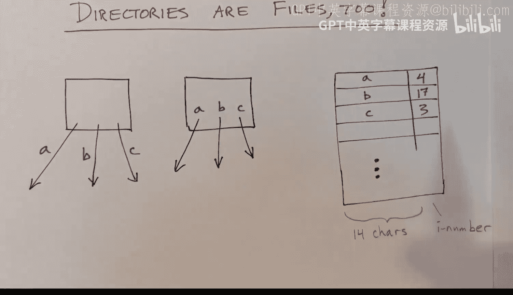

# xv6 操作系统内核：30：文件系统


## 概述
在本节课中，我们将学习 xv6 文件系统在磁盘上的组织方式。我们将了解磁盘布局、文件与目录的表示方法，以及用于创建文件系统的工具。核心概念包括**inode**、**超级块**和**目录结构**。

## 磁盘布局与访问
上一节我们介绍了日志系统，本节我们来看看文件系统数据在磁盘上的具体组织。

磁盘被划分为一系列连续的块。xv6 内核提供了函数来访问这些块。以下是访问磁盘块的核心代码：

```c
struct buf *bp = bread(dev, blockno); // 读取块到内存缓冲区
... // 操作缓冲区数据
log_write(bp); // 将修改写入日志（事务的一部分）
brelse(bp); // 释放缓冲区
```

对磁盘块的修改被包裹在**事务**中，以确保原子性（要么全部写入，要么全部不写入）。

```c
begin_op(); // 开始事务
... // 多次调用 log_write
end_op(); // 结束事务，确保所有写入原子提交
```

## 文件系统结构
一个文件系统包含一棵目录树和位于这些目录中的文件，它们都位于同一个设备（如磁盘）上。

*   **目录** 组织成树形结构（无环图）。
*   **文件** 通过路径名引用，文件本身没有名字。
*   **文件类型**：在 xv6 中，文件有三种类型：**目录**、**普通文件**和**设备文件**。

以下是文件系统类型的对比：
*   **硬链接**：允许多个目录条目指向同一个文件（inode）。xv6 支持。
*   **符号链接（软链接）**：文件内容是一个路径名，内核会间接访问目标文件。xv6 **不支持**。

## Inode：文件的标识符
用户程序通过路径名访问文件，但内核内部使用一个称为 **inode 号** 的小整数来唯一标识文件。

每个文件都关联一组属性，存储在磁盘上的一个固定大小的结构体中，称为 **inode**。内核会将正在使用的 inode 缓存在内存中。

以下是磁盘上 inode 结构体的定义（简化）：

```c
struct dinode {
    short type;           // 文件类型（目录、文件、设备）
    short major;          // 主设备号（仅设备文件有效）
    short minor;          // 次设备号（仅设备文件有效）
    short nlink;          // 指向此文件的硬链接数
    uint size;            // 文件大小（字节）
    uint addrs[NDIRECT+1]; // 数据块地址数组
};
```

inode 号隐含在磁盘 inode 数组的索引中。类型为 0 表示该 inode 空闲。

## 详细的磁盘组织
现在，让我们更详细地了解 xv6 的磁盘布局。磁盘块按顺序组织，包含以下区域：

1.  **引导块**：用于系统启动，内核不读写。
2.  **超级块**：包含文件系统的元数据（如大小、inode 数量、各区域起始位置）。内核只读不写。
3.  **日志区**：用于事务日志。
4.  **inode 区**：存储所有 inode 结构体的数组。
5.  **位图区**：每个数据块对应一个位，表示该块是空闲（0）还是已用（1）。
6.  **数据块区**：存储文件和目录的实际内容。

超级块在启动时通过 `readsb()` 函数读入内存，其结构如下：

```c
struct superblock {
    uint magic;        // 魔数，标识文件系统类型
    uint size;         // 文件系统总块数
    uint nblocks;      // 数据块数量
    uint ninodes;      // inode 数量
    uint nlog;         // 日志块数量
    uint logstart;     // 日志起始块号
    uint inodestart;   // inode 区起始块号
    uint bmapstart;    // 位图区起始块号
};
```

## 目录的表示
目录在 xv6 中是一种特殊类型的文件。其内容是一个线性数组，每个条目将文件名映射到 inode 号。

以下是目录条目的结构：

```c
struct dirent {
    ushort inum;      // inode 号
    char name[DIRSIZ]; // 文件名（最多14字符）
};
```



查找文件时，内核需要线性扫描目录数组。现代系统使用更复杂的数据结构来支持更长的文件名和更快的查找。

## 创建文件系统：mkfs
`mkfs` 是一个独立的 C 程序，用于从头创建一个 xv6 文件系统镜像。

它的作用是：
1.  创建一个名为 `fs.img` 的磁盘镜像文件。
2.  初始化镜像：写入超级块、初始化 inode 数组和位图。
3.  创建初始的目录树结构（如根目录 `/`）。
4.  将编译好的用户程序（如 `init`, `sh`）作为文件写入镜像中。

这样，当 xv6 内核启动时，就能看到一个已初始化完毕、包含可用程序的完整文件系统。

## 总结
本节课我们一起学习了 xv6 文件系统的磁盘表示。
*   我们了解了文件系统在磁盘上的**布局**，包括超级块、inode 区、位图区和数据区。
*   我们学习了 **inode** 是文件的唯一标识，存储了文件的元数据和数据块指针。
*   我们知道了**目录**是一种将文件名映射到 inode 号的特殊文件。
*   最后，我们了解了 `mkfs` 工具如何创建初始的文件系统镜像。
理解这些磁盘上的数据结构是理解文件系统代码如何工作的基础。