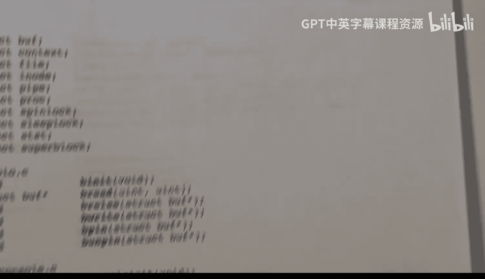

# hhp3《xv6 操作系统内核｜The xv6 Kernel 2022》中英字幕 p03 -03-xv6 Kernel-3_ Startup + Organization.zh_en -BV11CkSBsEtN_p3-

This video is part of a series on the X V6 operating system kernelel。😊，In this video。

 Im going to introduce the main function and talk a little bit about the startup procedure。

Before that， I'm going to go over the file organization and I'll end by going over a couple of small files that we can take care of quickly。

Let's begin with the files that are included with the XV6 system。

Here I've listed out all of the files， so you can see there are not too many of them。

The organization is pretty straightforward， you've got two directories， kernel and user。

These are the files that are in the kernel directory， basically it's just a bunch of C code files。

 some header files。There are several assembly language files。There's entry。s。

 which I'll discuss base a little bit， Colonel Vk， there is switch。s， very interesting one。

 trampoline。s。There's also anit code dot S。There's also a file here that's used by the linker。

As well。In the user directory， you have the code for the initial process。

As well as the code for the user application programs， the shell and user mode programs like cat。

 Echo and so on so。In addition， you've got a make file to build all these files。

And you've got to read me in a license file。 So it's a pretty straightforward organization。

The F sixth system runs on a multi corere computer。And。When it begins。

 each core will start executing all at once。 They all begin at the same time。

 It's a shared memory system， So all cores will share the exact same memory。

 and they will all begin executing the same exact code。

 And that code is in a file called entry dot S。It's not a very long file， just a few lines。

 and that code will then transfer control to a C function called start in the file start do C。

And that will then transfer。Controrolll to the main function。

The assembly code that's in the entry file basically gets things set up so that we can execute C programs。

It will initialize the stack pointer register， the S register。And it will initialize the TP register。

Each core will share main memory， so they will be accessing the same set of global variables。

 but each core will need its own stack。 They can't overlap。 That wouldn't work at all。

 So there's a separate stack space for each of the cores。

 and the code and entry God S will initialize the stack pointer register for the core appropriately。

Also， there's a TP register that stands for thread pointer。

 but the TP register actually will contain the core number， the number of the core，0，1，2， or so on。

Instead of some sort of a thread pointer， and that register will stay constant on that core throughout。

 So that allows the code to ask at any time， what core am I running on。So once those are set up。

 we transfer control to the start function。In another video。

 I talk about the different modes that the risk5 processor can execute in。

 It can execute in machine mode， supervisor mode and user mode。

All of the kernelel runs in supervisor mode， except for a tiny bit of code。

 which is in this dark dot C file。 And that so initially when they。System begins execution。

It begins executing in machine mode and the code here will take care of a few bookkeeping things and then switch to supervisor mode and the core will remain in supervisor mode after that。

Okay， now let's take a look at the main function。Here is the code for main dot C。 It's not。Very long。

 And it contains nothing more than the main function。So let's see what happens。

Remember that each core will begin executing this code in parallel so that all cores will begin with this if statement。

CPU I D is a short function that basically looks at and returns the value of the T P register， so。

On core 0， this function will return 0， and core 0 will then execute this code here。

All other cores will。Execute this code here， instead。是我的是。Co do。 Well。

 core0 is tasked with initializing things。 So you see a lot of calls to in， an， anit this。

 and that and init some other stuff。It also prints out this message that the colonel is booting。

There is a global variable or a shared variable here。 It's in the memory space。 So of course。

 all cores will have access to it。And it's used for synchronization。This keyword here。

 volatile is a little bit of C magic that says that this variable is used for synchronization。

 possibly by multiple cores or concurrent threads。And it is， in fact， used to control the begin。

 beginning of the other cores。 So it is initialized to 0 or false， if you will， and。

Once core0 is done initializing， it will change it to true。

All the other cores go into this tight loop where they're testing it。

And they keep testing until it is found to be true。 And then they execute this code here。

 and they start out by printing。Heart。Something starting。The term heart is synonymous with core。

 at least for these videos。 And so basically saying core1 is starting。

 core two is starting and so on。 and they are pulling up their own core or CPU I D right here。

The last thing that core 0 does is it starts the。Code for the init process。

 So that's what's going on here。And then it set started to one。 and then the other。The other cores。

 well do some initialization here。Kmin it。Trapping it。Click an it。

 These are per core initialization things， and they happen in core 0 as well。 K K V。

 imminent trap in it。And clicking it happen here for core0。

Once all of that happens on all of the cores， each core will then call the scheduler function。

 And what scheduler will do is we'll look for a process to execute。 So at that point。

 all the cores will start executing processes。We also see this synchronize。Fction here。 This is。

 again， a little bit of compiler magic。Compilrs will try to optimize things and what this is。

Doing is telling the compiler to chill out and not do that optimization。

 The compiler might rearrange code in order to try to achieve greater performance and efficiency。

 What the synchronize does is tele compiler。 make sure you finish， everything above it first。

 before you start anything after it。 So it's saying。

Please finish all of this initialization before you change this variable to one。

 You may not be able to understand what I'm doing here。 You're saying to the compiler。

 But I'm telling you， you need to finish doing every single thing above this before you think about changing that variable to one。

Likewise， down here， it's telling the compiler the same thing。

Don't start executing this stuff until you have completed this while loop here。Okay。

 there are several small files that I want to take a quick look at and get these out of the way。

Types dot H。Contains just these type defs here。You're probably familiar with these abbreviations for familiar types。

 So on the architecture we're using， the Ri 5 architecture with the tool chain， It's a 64 B machine。

 Integers will be 32 B。诶。So we define unsigned 8 bit values， unsigned 16 bit values。

 unsigned 32 bit values and unsigned 64 bit values。We use this type Uent 64。

 quite a bit for addresses and pointers。Okay， next file I want to look at is Param。h。

There are a number of things that are hard coded into the kernel。

 So let me just go through these quickly。In PRc， the maximum number of processes is just set to 64。

The number of cores。Is 8。Then you have other things。The number of open files。

 the number of open files per system。Number of inots， number of devices。The device number。

 root dev max argument。 This is the maximum number of arguments that you can have on on an exact system call。

Max blocks， log size， inbuff， FS size， max path。 that's the maximum number of characters in a files path name。

Finally， I want to look at a file called death。h。And this is。Lied out here on these four pages。

 So you can see what's going on。 But basically， this is just for the compiler， contains a bunch of。

Function prototypes。 So， for example， the file console do C contains at least these three functions。

 which might be used in in other files as well so。This is basically just the function prototypes。

 There's nothing much of interest here。 We'll encounter all these files later。

 so let's go through all these pages on the last page there is a preprocesor macro。

 Perhaps you've seen this in other contexts。 But this is the number of elements and do it have a variable here and an array variable and what it does is it just asks how big is the entire array and。

How big is a single element， and it just gives you the number of elements。Okay。

 that's it for this video。 I'll see you in the next video。

