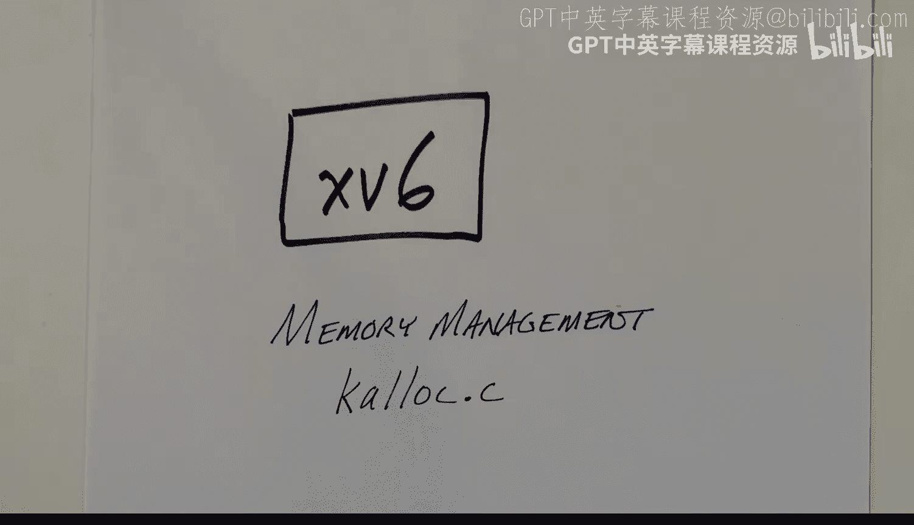
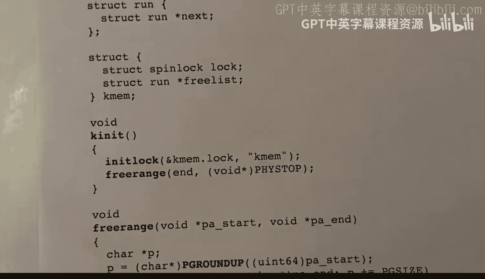

# hhp3《xv6 操作系统内核｜The xv6 Kernel 2022》中英字幕 p05 -05-xv6 Kernel-5_ kalloc, Mem Management.zh_en -BV11CkSBsEtN_p5-

This video is part of a series on the XV6 operatinging System kernel。

In this video， I'm going to look at memory management and how the XV6 kernel manages free memory。

It's pretty straightforward and simple， all memory management is in terms of 4K blocks。

 or we can also call them pages， so 4 kilobyte pages， and they're maintained on a free list。

We have two important functions， KLLEC and K free， which just take things off of the free list in the case of KLLEC。

 or add a free block back to the free list in the case of K free。And that's about all there is to it。

 but let's go into this in a little bit more detail。First of all， all this is coming from the file。

 Kalc do C。And here is the file， we've got some includes。Here is our pointer to the free list。

 and we've got this little structure here called Run， which is just a pointer to the next block。

So Freelist is a pointer to a linked list of。4 kiloby pages。

This structure here groups the free list with a spin lock called simply lock。

This is used to associate the lock with the free list。Whenever we manipulate the free list。

 we need to grab the lock， we need to acquire or set， if you will， the lock。

 and then when we're done looking at the free list， we need to release that lock。

We've also got a variable here， this is set by the linker when the program is being built and it's set to point to the first address after the。

 the kernel's executable code， its text section， and its data section。

 and this is the first usable memory， and we'll use that in initialization。So。Let's just。

Look at the initialization here。We initialize the lock。

 and then we call free range to free everything between the first available byte and the top of physical memory。

 which is a constant， happens to be 128 megabytes。Okay， let's look at the allocation routine。

What it does is it acquires。This been locked here。Manipulates the free list and then releases the lock。

 And finally， it returns the pointer。 Okay， so in more detail it。

Grabs the first thing off the free list。If it got something that is if memory is not exhausted。

 then it can keep going and what it'll do is modify the free list to point to the next item。

 so if the free list points to this item， we grab it and then redirect free list to point to the second what was the second item on the list。

Finally we return after releasing the spin lock， we return the pointer。Before we return it。

 if we got something， then we set every byte in the page to this value of five。

 just filling it with junk。Here is the。routine K free。

 and it's past a pointer to a page and what it does， well。

 it starts off with a little bit of error checking。

 make sure that this PA physical address is aligned on a page boundary。

It makes sure that it's not too small and not too large。So it's not below the starting address。

 and it's not above the ending address。And if that's okay， then it fills the page。

 it starts by filling the page with junk， in this case， junk happens to be one。

And the purpose of that is to hopefully bring out or trigger any bugs in the rest of the kernel code。

 we don't want to use a page after we return it to the free list。

 so by setting every byte in it to some value， we can hopefully confuse any program code that tries to use data from that page。

嗯。Then we acquire， we're going to use R as our pointer。 we acquire the。嗯。Spin lock。

 we manipulate and we add it to the free list and then we release our spin lock so adding it to the free list if our if this is our free block here。

 then we simply set the next pointer of it to point to the first element of the free list and then we redirect the free list to point to this。

Now let's go back and look at the initialization again。

We are initializing all of memory from this starting point to physical the top of physical memory。

 and we have a function here that will do that。It starts by。It's past this starting address。

 it rounds it up to the nearest page boundary because it will not necessarily be page aligned。

And then it does a loop。 And what it's doing here is it's adding。Each page to the free list。

By calling K free。 And it's just a loop here ining P by。4096 by until。P finally exceeds the endpoint。

