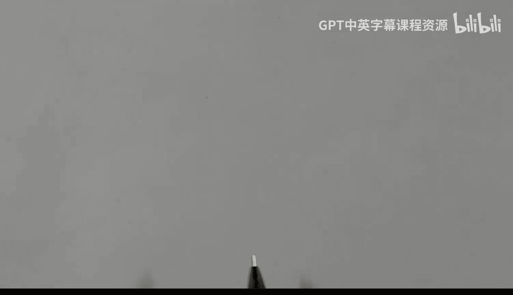

# hhp3《xv6 操作系统内核｜The xv6 Kernel 2022》中英字幕 p06 -06-xv6 Kernel-6_ Syscalls from Userland.zh_en -BV11CkSBsEtN_p6-

This video is part of a series on the XV6 operating System Colel。In this video。

 I'm going to talk about system calls and how they can be made from user mode code。

I'll start by looking at a small C program that makes a couple of system calls。

 and then I'll look at。The program called anit code。

 which is the very first code that is executed in user mode。

 This program is written in assembly code。 So be prepared。

 We'll see a little assembly code in this video。😊，But let's start with the C program。

Here is the code for kill。It is a command that I'm sure you're familiar with。

We see that it makes calls to some library functions， F print F and A2 I are used here。

It also makes some calls， too。Exit and kill， which our system calls。It passes arguments。

 in this case it passes a one to the system call exit。System calls can return values。

 but we don't see that happening here。This program includes user dot H。

 These two are not so interesting， but user dot H is relevant here because it contains the function prototypes for both the library functions and the system calls。

 So here's the code for user do H。Okay， and it does a pretty short program， a short file。

 it contains。Function prototypes for the various system calls。

And it contains function prototypes for the library functions。

So you can see each one of the 21 system calls that actually six supports is listed here。 So。

 for example， we see exit。And we see kill。 Each of these takes a single parameter， and。

We also see that the system calls return values。This attribute stuff here is a bit of compiler magic that tells the compiler that this particular function is guaranteed never to return。

And so this might allow the compiler to do some optimizations。We also see。

Function prototypes for the library functions。The actually six system doesn't include a whole lot of library functions。

 A normal operating system would have hundreds of。Functions， but we do see prototypes for。

F print F print F。Some string functions like string length， and we see A2 I and some other things。

We're not going to look at the code for these right now， but these are in a file called Ulibe do C。

We're more interested in the。Function code function for these system calls。

There is a small function for each one of these， and these are all collected into one file called Uis。

 S， which is an assembly language program。你。Function。Cdes for each one of these functions。

That is in the assembly language is actually generated automatically by a pearl script。

 So let's take a look at that。So， here we've got。Uis dot P L。

 And this script is going to generate some assembly code。

 And here I'm showing what the assembly code has generated。 and it goes into this file。 Uis dot S。

 which will be assembled and linked with。The program like that we're compiling like kill do C。

So what do we see here？Well， we start with a couple print statements， a comment here。

 and then a pound sign include。 And here I'm showing what gets produced。

 our comment and the pound sign include。 we're including something called ciscal dot H。And then。

For each of the 21 system calls， we are going to generate。Some code here。And what do we do， Well。

 for each one of them， we create a dot global statement。Here's the God Global。

With particular name in this example， it's， it's open。 So the name that we're dealing with is open。

 Then we have a label， open colon， which is right here。And then。We have three instructions。

 L I is load immediate。 E call is environment call， and R is returned。 So we see those L I。

 E call and Re。LI A 7， and then again， cis underscore。 and then our name， cis underscore open。

So for each one of these we'll have a very small function。

This function will execute a load immediate instruction， which will move some constant into a 7。

Ciss open is just a number and we see that we are including ciscall。h。 Well， here is ciscall。h。

All it has is。A collection of defined statements。 And for each of the 21 system calls。

 it associates a number。 In our example， we're looking at open。 So we see that。

Open has a system has a number of 15， so。All this does is move 15 into register A7。

And then then execute the E instruction。 E will。In execution in user mode。

 switch to kernel mode and the kernel will execute some code that will do whatever this is involved for opening a file。

And ultimately， it will return to user mode and execute the next instruction， which is a return。Now。

 we are passing arguments in the open system call。 So if we look at open here。We see that。

 We pass two arguments。Poin to the file name and the mode。

That we want to open that file in and we return a value。Arguments are passed in the A registers。

 The first argument in a 0， the second argument in a1。 And if there are additional arguments in a 2。

 A3 and so on。A return value will appear in a 0， and the kernel。Will do that。

 It will expect arguments in a 0，1，2， and so on。 And upon return from the kernel。

 the result will be an a 0。 And that's why this little bit of code here doesn't mess with a 0， a 1。

 a2 and so on。They are assumed to already be in the registers when this is invoked and the result from the colonel in a0 will stay in a0。

 and it will be returned to whoever invoked the open system call。Okay， next let's take a look at。

An it code dot S。This is a user mode program。 In fact。

 it's somewhat special because it is the very first。

Coode that's executed in user mode by the colonel。And here we see the code for this program。

 It's pretty short。 It includes system call do H。 So， in fact， we make a couple system calls here。

 We call the exact system call and the exit system call。Now， what does this little program do。

 I've tried to show it in this form here。It simply calls the exact system call passing a pointer to the file name and a pointer to an array。

 and the array contains two elements。This。First argument is a pointer to a sequence of bytes。

Backslash i N i T no bike。And our v is a pointer to an array of two elements。

The first is a pointer to a backlashlash in it。And the second thing is the null。

 the terminating null。These are each one byte and this is actually eight bytes a double word。

 and it's not shown very clearly because they look like the same size here。If exactec returns。

 which normally it would not， but if for some reason this file doesn't exist。

 then it would return and what do we do then， well， we invoke exit。

 We're not even and then if exit should return， which it definitely will not do。

 this program contains a go to statement， which we'll call it again。

So we don't expect that to happen。So now let's look at the actual code。

We're including Cis call dot H。 That is our。File that includes numbers that associates a value with each one of the。

Siss constantss。 So here we're using ciss exec。That's number7。We're also using cis exitit。

That's number two， okay？And what do we have， Well， we are executing。

3 instructions and then making the system call L A loads the address into a0 of variable in it。

 which is down here。This second instruction loads a1 with RV， which is the address of this down here。

Here we have exactly what's going on right here。And it。😊，And these bys are in RV。

 and these two words。So here we have ant。Backslash I N I T， No bite。And here we have R V。

 which is contains the address of a net， and it contains a0。With an alignment statement here。

So we load in the two arguments， and we set a 7 to the code number for。The exact system call。

 and we make the E call， E answer environment call。 And then if that should return。

 we then have the code to call the exit system call。We load into a7。The code number。

 which was two for the exit system call。 And then we perform the system call。

 And if that should return， we just jump here and keep repeating it。Exit happens to take a parameter。

 it takes a single argument， which is the exit code or return code。

We don't even bother to load a0 with anything。 So who knows what it would actually be。 But hopefully。

 exit， sorry， exec will never return。😔。

Okay， that's it。 I'll see you in the next video。