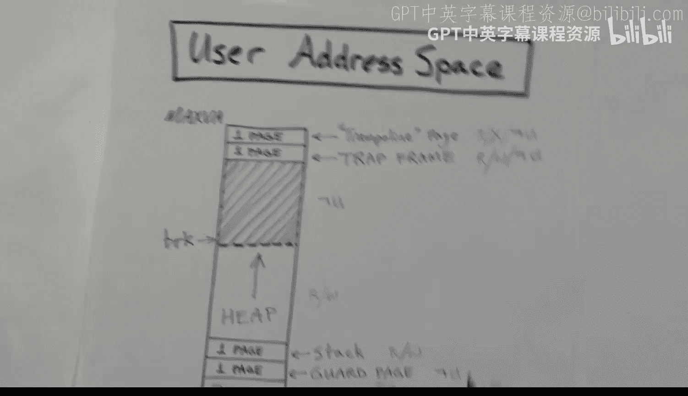

# hhp3《xv6 操作系统内核｜The xv6 Kernel 2022》中英字幕 p11 -11-xv6 Kernel-11_ Memory Layout.zh_en -BV11CkSBsEtN_p11-

This video is part of a series on the XB6 operating System Colonel。In this video。

 I'm going to talk about how memory is laid out， and I'm going to walk through the file of Men layout do H。

I'll talk about the general organization of physicaly memory。

 I'll talk about the Colel's virtual address space and the Colel's page table。

And I will describe and motivate the need for the trampoline and trap frame pages。

Let's begin with this picture of a user thread， which is executing instructions。At some point。

 a trap occurs and we start executing instructions in the kernel。And then at some other point。

The kernel code will execute the Ss rep or system return instruction and go back into user code。

The user code executes in user mode， and the kernel code executes in supervisor mode。

 riskk5 calls it supervisor mode， sometimes I use the term kernel mode， same idea。

So let's look more closely at what happens at the time of the trap and the SRP instruction。

So here we're executing in user mode and we have a trap and then we have the content switch。

 so that's when we go into executing kernel code and it's running in what Rik5 calls the supervisor mode or kernel mode and then at some later time we have the cis Re instruction and we return to executing the user code in user mode in the user's virtual address space。

So here's the trap instruction。 This is what happens in the hardware。 And then down here。

 we have the Sre instruction。 And so the trap。Will be handled in hardware。

 And what will it do while the core will switch into kernel mode or supervisor mode， if you will。

It will disable， interrupts。It will save the program counter in a control and status register called SPC。

And then it will load the program counter from another CSR called S TVc。

 This register will contain the address of the first instruction in this userve routine。

 and so effectively， this is a jump to the userV routine。

The user E routine is written in assembly language and it will begin by saving the user registers。

The general purpose registers and the program counter are very important to the user program。

 and they need to be saved immediately。 so later we can restore them。

We can't really do anything without using general purpose registers。

 so this has to be more or less the first thing we do， saving the user registers。

And then we load a few of the critical kernel registers。

We need to load the kernel stack pointer register， and we also need to load the T P register。

 which contains the core number。And finally， we need to switch into the kernelel's address space。

 so there's another control of status register called SATP。

And we load that with the address of the colonel's page table。

 thereby switching all execution into a different virtual address space。 And finally。

 we jump to this user trap function， which is written in C。😊。

Later we get ready when we get ready to return to the user code。

 we call this user trap Ret instruction， sorry， routine。

 and this user trap rep function will call a routine called user Ret。

User rep is coded in assembly language， and it will。Restore the SATP register。

 which will switch us back into the user's virtual address space。

And then directly before executing the S REt instruction， it will restore the users's registers。

And finally， the SRD instruction will switch the mode into user mode and it will restore the program counter from whatever is in the SPC register。

And finally， enable interrupts。 and from then on， we execute in user mode。Now。

 I said these things were functions， but not really。A function is called， and then it returns。

 whereas with these things， there's not really a return， Uzervek。Ends with a jump， too。User trap。

 Use trap is coded as a C function， but there's never any return from it。 It calls this。

 and it calls that。 And eventually it calls a function user trap rat and user trap will call user rat。

User Re will never return to user trap Re。 So in that sense， it's not really a function。

 but it's just a block of code。Likewise， user RE is not going to have a normal kind of return。

 instead， instead， it's executing this S RE instruction。Okay。

 let's look at the the what So the problem is that。

The code that saves the user registers and loads the kernel registers。

Is running in the user's address space。 So these instructions and the memory locations that they refer to have to be in the user's virtual address space。

Likewise， down here after we restore SATP。We're running in the user's address space。

 So the instructions have to be in that address space and the memory locations from which we get the old register contents also needs to be in the user's address space。

So let's look at the user's address space。We showed this picture earlier。

 but the user's virtual outer space contains the。Code and the data of the program as well as a page for stack and maybe some pages for a heap。

And then up at the very top， we have this thing called the trampoline page。

 And we also have a trap frame page。These pages are in every。Virtual outer space。

 and they're at the exact same location， namely the top two pages。

What goes on below that is you know different between， you know， depends on the user of programs。

 so where exactly the stack page is can vary。But these two pages are always at the same location。

The users' page table will mark these two pages as not accessible in user mode。

So if the user code tries to access them， it will get an error。

 so they're sort of invisible to the user code。The trampoline page will contain codes，'s marked。

 it's marked readable and executable， and the trap frame page will contain data。

 so it's marked readable and writeriable。Okay， so here is another picture showing what's going on。

 and I'll come back to this in a second。 but we've got the virtual ladderer space for all of the user processes。

There are up to 64 user processes， and each one will have a trap frame page and a trampoline page。

 a trampoline in blue， the trap frame in red。There is exactly one virtual address space for the kernel and all the kernel code will use the same address space。

All the cores will share this one virtual id of space。And it contains a number of things。

 but in particular， I want to point out it it contains the trampoline page at the very top of the address space。

 So before I talk more about that， let's oops， let's look at the trampoline page and the trap frame page。

As I said， there is one trammppoling page。And。It contains code。And in particular。

 it contains this user V and this user RE。Functions， so connect user back。

And use a leads to assembly language routines， and it contains nothing else。

It is mapped into the very same address， namely the top page of all virtual address spaces。

 and by that， I mean the 64 virtual address spaces for one for each other user processes and the kernel address space。

 and as I said， it's more readable and executable， but it cannot be accessed when running in user mode。

There's a trap frame page， and each process has its own page。 so each page is different。

There are 64 processes。Some of them may be dormant and not executing。

 but there can be at most 54 active processes， and each virtual address space will have its own trap frame。

And that will contain the data。 and in particular， it will contain the area where we will save the users registers。

So Mark read， writeriable， not accessible in user mode。 So in this picture down here。

 I'm showing the top of all the 64 virtual address spaces。

For the user processes and the top page is the trampoline page。

 and the second to the top page is the trap frame page。

And the idea here is that the page table maps all of these trap frame pages into the same physical page。

 Sorry， these trampoline pages are all mapped into the same physical。Address。

But the trap frame pages。Down here in blue are each mapped to a different physical page。

So they are not shared。It's okay to share code because it doesn't change and it can be shared without any problem。

 but each user process will need its own area in which to save the registers。

So now let's take a look at this picture。Which is the。

Physical memory on the right hand side and the kernelel's virtual address space on the left hand side。

 So let's start out with the physical memory。 It starts at 0 and goes all the way up to this enormous number of 256 exabytes。

 The vast majority of majority of it is unused and not allocated。 Nothing is up there。😊。

The computer that X 6 is intended to run on will have 128 meby of installed physical main memory。

 the Ram。 And that's in this region here。It will be located at this particular address。

 which happens to be the2 gigabte boundary。And below that。

 we have space for the memory mapped devices。 So we see the。Maerial communication device。

 It gets a page。 We see the disk device。 that gets a page。

We see the platform level interrupt controller that gets 4 megabytes。

 and we also see core local interrupt controller。Down here is the boot rom。

 After the colonel is executing the the booting process is over。

 So this is not accessed at all by the kernel。Now， over on the left hand side。

 we see the virtual address space for the colonel and。

The first thing to note is that all of physical memory is direct mapped。Into the virtual ider space。

That means the kernelel can provide an address， and it doesn't need to really make a distinction between whether it's a virtual address or a physical memory address。

The same number can be used for physical locations， even though virtual addressing is turned on。

 it will go to the same spot。 And likewise， all the stuff down here is direct mapped。

So to access the virtual disk and to access the serial communication device and the platform level interrupt controller。

 the kernel can just use physical addresses。 and since they're direct mapped。

And there won't be a problem。The core local interrupt controller is only accessed in machine mode。

Remember that when we're in machine mode， there is no virtual addressing the page table is not active。

 and we only use physical addresses。 The core local interrupt controller is only accessed in machine mode。

 so theres not actually a need for it to be mapped into the virtual address space。Now。

 the other thing we want to talk about is what's going on up here at the top of the virtual addresser space at 256 gigabytes。

-1 page。 We have the trampoline page。And then， we have a number of。Pages called stack pages。

 Colonel stack pages。 There is one for each user process。 So there are 64 of these things。

All of these pages， the trampoline and the stack pages are separated by a guard page。

That guard page is not mapped。 It has。 It's not readable， writeriable or executable。

 So any attempt to access it will cause an error。 And that just catches any stack overflow from the kernelel stack areas。

Within the kernel in the physical main memory， we're going to see the kernel code here and the read only data followed by the readrite data for the kernel。

 This would be the variables that are used in the kernel。And then above that。

 we have the rest of physical memory。And that will be used for the page allocator。

 We have these two functions， K ac and K free。 And this member here is initially divided into pages。

 and those pages are all kept on a free list。Every time we call the K ac function。

 it will allocate a page of free memory from that free list。

 So one of these pages will be allocated for use by something。

And then when we're done using that page， we can call the K free routine， and it will return it。

To the free area here。 And it will be put back on the free list and used the next time we need a page。

 So the most of the physical memory will be。Occuped with this in this page region that's used by K Ack and K free。

So now， let's take a look at。The。This picture here。

 which attempts to show things a little bit differently。 Again。

 we've got physical memory here somewhere。 and we've got over here the virtual ladderer spaces。

 We have 64 user processes。 So I'm showing only three of them here。

 but there's a virtual ladderer space for each of the user processes。

Theres exactly one virtual addresser space for the kernel。

 so all the cores will share this one virtual address space and this one page table for the kernel。

We see the trampoline pages in blue here at the top of all of the virtual ladderer spaces and at the top of each of the user mode virtual outer spaces。

 there is a trap frame shown in red。Now， these pages are mapped somewhere into physical memory。

The trampoline page will be mapped into code。 So it's a page that's actually part of the kernel's text area。

 So the kernel's code is in this area here in physical memory here。

 So the trampoline page will be mapped somewhere into the text area。The trap frame pages。

Will be allocated when the kernel starts up and they will be allocated somewhere in the free region。

 So they will be allocated somewhere in this region here。

Where the pages that are used by Kla and Kfr are kept。

And so I'm showing them map somewhere in that region。

 Of course all the physical memory direct mapped so the kernel can access them directly if it needs to。

 but the page tables for each one of the user processes will map those trap frame pages into one of the pages that was obtained with a call to Kalc。

We've also got these kernel stack pages up here， for each of the 64 processes。

 we need a kernel stack。and。That is because here。When we。First， go into kernel mode。

 the trap occurs and we begin executing。We save the user registers， and we load the kernel registers。

 Each process will need a separate stack。 Obviously。

 two separate threads cannot share the same stack。 They each need an individual stack。

 So each one of the 64 threads that are associated with the 64 user processes。

 will have its own stack。So when the user mode code switches over into executing and kernel mode。

It will need to access its kernel stack。 And so here we have one stack page for each of the 64 user processes。

At startup。There are 64 pages that are allocated from the free pool by calling Kaal and each time Kaalak is called。

 that page is mapped into one of these regions up here。 And here I'm showing the guard pages。

 separating those pages。Okay， now I think we're ready to actually look at the code for。

Mim layoutud dot H。So we've got just two pages here， I'll start with this one。

 we've got some comments。And we begin with the address of the serial device。

 So that's this address here。 And so you see that address。

 And that's just defined with a defined constant here。And then we have the page for the disk device。

 And that is shown right here。 So that's this address here that we're defining。

This is the core local interrupter。And it's mapped into some particular address。

 And that's shown here。 Okay， it's not used when we're executing in kernel mode。

 but it is used in machine mode。 So we give it an address here。

That will be used for timers and timer interrupts。 Those are those are handled。 The。

 the timer interrupt is handled with code that runs in machine mode and the。

Deevvice that's creating those interrupts is is。Accessed here。 Now。

 these memory map devices have what are called register。

 sometimes hardware registers to be not to be confused with the general purpose registers in the core。

 so。That's what's going on here。 There is one register called in time。 Okay。

 And where is that located。 Well， it's at this starting location， plus some constant。

 And that hardware register contains the number of cycles since the boot occurred。

 So we the kernel code can read from that address and effectively goes to this device and gets the current value So that device is constantly updated the value that's stored at this socal memory location。

 we can just read it。When we need the current time。This one here in time compare， that is a function。

Recall that with the C pre processorcessor， it matters whether you've got a space here or not。

If we have a space， then this is just what gets substituted， if you do not have a space。

 then this is a parameter or an argument， if you will。And this is defining a function。

 So given a particular core number， we will have the expression here that computes the address of one of the registers。

 There are eight cores。 and so there are8 hardware registers。 and where are they located。 Well。

 the starting address plus some value。 and each register is8 bytes。

 So this expression here computes the address of one of these hardware registers。

This register will be loaded by the colonel， and it will tell when to give the next interrupt。

 So the colonel writes to this location and then when and interrupt。 Sorry。

 when that time is reached and interrupt will be generated automatically by this device。

And for the platform level interrupt controller， we've got the similar kind of thing going on。

 We've got a starting address。 and then we've got some various different functions。

 And you can see we've got some different hardware registers here defined as a function of the core number。

Okay， heart ID is just the number zero through seven。Of the core。 And these。

Expressions compute various addresses within that device。Okay。

 moving on to the second page of MIm layout。We have。A definition of where the kernel is to be loaded。

 as I said， this number here is two gigabytes。 that's the kernel base right here。

 where the kernel is loaded。We also have the top of physical main memory。

 128 megabytes of main memory past。The starting location is the top of physical main memory fizz top is。

 so that's giving this address right here。诶。This constant trampoline gives the address of the trampoline page。

 which is the maximum virtual address。256 gigabytes， less one page。 So that's this point right here。

And then finally， we have the address of the stack pages， okay， that's a function。

Given a process number。0ero drew 63。 We compute an address here。

 and you can work out this algebra here， but basically we're doing it in units of two pages because of the guard pages。

 So every two pages we have the address of a stack page。And finally， we have a constant trap frame。

 which is just the address of the trap frame page。 So it's just the。Address of the。Tamppoline page。

- 4096， which is this value right here， so that's what's going on with this definition here。Okay。

 that's it for memory layout， see you in the next video。

