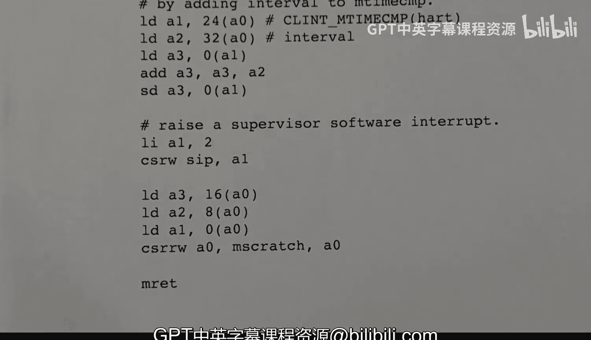

# hhp3《xv6 操作系统内核｜The xv6 Kernel 2022》中英字幕 p13 -13-xv6 Kernel-13_ entry.S + start.c.zh_en -BV11CkSBsEtN_p13-

This video is part of a series on the X B6 operating system kernelel。In this video。

 I'm going to talk about the kernel startup procedures。

I'll go over the code in the file entry dot S and the file start dot C。Intry。S is pretty short。

 it contains a few assembly code instructions。A start dot C contains two functions。

 start and timer in it。All of this code is executed in machine mode， and at the very end of it。

 we switch into supervisor mode and jump to the main function。I'll also talk about timer interrupts。

We'll see how they're set up in the timer init function。

 And we'll look at the code for the interrupt handler， which is called timerva。

 And that comes from a file called Colonelvek dot S。

And I won't talk about all the assembly code that's in ColonelV。s。

 but I'll talk about this part of it。Let's begin with start。c， and I want to focus on this。

Definition stack 0 is a stack of bytes， and。Remember， we're running on a multi core system， in fact。

 the constant in CPU is set to eight so we can handle up to eight cores。

Each corps will need its own stack。We will allocate a 4K page for each stack。

 And that's what's going on here。 So we're executing the number of cores and one page for each。

This bit of C magic here basically says， be sure and align this array on a 16 B boundary。Okay。

 it's just normally a byer array。 So it might not be aligned if we don't put this in here。

 And that's what we're doing。 I'm going come back and talk about timer scratch in a second。

 But let's first take a look at the entry dot C file。Here is the entire file。 It's not too long。

 And let's take a quick look at this。This section command。

Indicates that this all of this code will go into a so called section。

 sometimes I use the word segment。That is a text segment that is， it's executable code。

 And we see some assembly instructions here。We are defining a label underscore entry。

 and we're saying to the asmbler， be sure and make this a publicly known global symbol so that it can be seen outside of just the assembly。

There's another label down here， which is local， so that's what we're doing with the dot Global command。

Okay， so what do we do？Load address。 Okay， we're putting into the stack pointer register。

The address well， the the goal here is to initialize the stack pointer register。

 And so here is the computation that this code is doing。 The address of stack 0， that is that array。

 And then we're taking our core number。 It's called heart I D in the risk 5 world。

 We're multiplying it by。1K。 And so that's what's happening here。

 We load the address of the array into S。 Here we load 4 kilobyte into register A 0 load immediate。

 And here we are reading from the control and status register。Called M heart I D。

 That is the control register that contains the number of the core0 through 7。

 And then we add one to that。 So now we have a number between one and 8。

 and then we multiply that by the 4K that we computed in a 0。

 So we multiply by 4K and then we add that a0 to the stack pointer。

 And that gives us the point at the very top of the page for the stack for this core。 Okay。

 so now we've got S set up。 and we're jumping to start。Here we see a call。

 We do not expect start to return。 but if， for some reason， there's a bug and it should。

 then we would resume execution here。 This is a jump instruction。

 and we just go into an infinite loop and essentially lock up the core。Okay， next。

 let's look at start do C。And it is right here。We see the entire function。Right here。 And it will。

Take care of several of the registers。And set things up for executing in Maine。 And it will end。

 essentially with a jump to Maine。So this is executing in machine mode。

These functions that start with R underscore read various registers。

 and the ones that start with W underscore will write to the register。

 So here you can see we're updating the status register。 We read it into some variable。

 We zero out the two bits that tell the previous privilege code。For machine mode。 Okay so。

 and then we set those two bits with an ore to say the previous mode was supervisor。Well。

 we weren't previously in any mode we've just started。

 but that we see that that's what we need when we finally execute the system return instruction down here。

Here we write to the M EPC register。The address of the main function。 So again。

 that the M Re instruction down here will return us to whatever was previously executing。

 Nothing was previously executing， but by setting the status and the E PC， we're faking it。

 So we're going to be， if you will， returning to the first instruction， the main function。

The SATP register。Normally contains a pointer to the page table。 We initialize it with 0。

 There is no p going on in machine mode。 But when we go into supervisor mode。

The value of SATP will determine whether p is happening or not。

 So we want to zero that out to make sure that there is no paging。When Ma starts。

Now we have these two delegation registers， one for exceptions， and one for interrupts。

 and we're writing something into these registers。We're writing all ones。 And basically。

 that means that all interrupts and exceptions are delegated to supervisor mode。

 So when an exception or when an interrupt occurs， it will not be handled in machine mode。 Instead。

 it will cause an interrupt to the supervisor mode code， and it will get handled there。

 Timer interrupts cannot be delegated。 So they're handled differently， but all other interrupts。

And we really expect them only from the disk and the serial I O device。

 And so that's what's going on there。呃。Finally， this is the。Value for the interrupts enabled。

 I'm sorry， the。Register called S I。e， which is whether interrupts are enabled。

 And we are reading the current value and then setting some bits and then writing it back。

 And what we're we're setting them for。Devices are allowed to interrupt。

 The timer is allowed to interrupt and。I'm sorry， the the。Although it doesn't happen。

 And this is where the software interrupt。 the so called software interrupt。 These are all enabled。

 And so in particular， we're allowing the the delegation to go into supervisor mode。

 And we're telling the supervisor。Interrupts enabled register that we want to enable this these sorts of。

Interrupts。Next， we have this physical memory protection， and we don't really use the。

Physical memory protection system， basically we want to give the supervisor mode access to all physical memory。

 so we write in these constants here to do that and I're not really going to go into that。

 but basically this more or less disables the system。

Then we call this timer init function to enable to set up things for the clock interrupts。And。

Then we read the M heart IDd register。And。That is the core number。

 and we save it in the T P register。 So we write it to the T P register。

 and that it will allow our my CPU function。To work later on。

 to determine what CPU any code is running on。And then finally， we have some assembly code。

 We have the M Ret instruction。 So we've already said we want to return to supervisor mode。

 We want to return to this PC。 And so this Mret instruction here will。

Resume executing at the main function。 The first instruction， the main function。

And it will be in supervisor mode。So that's how we get into main。 But before we do that。

 let's look at this timer an function。 And I have that right here。 So let's take a look at that。

 That is from start do C。And。It's also fairly short to hear it is in its entirety。

But let's go through this。呃。So before I do that， I want to talk about the variable that is。

Then start。Dot C that we didn't look at called timer scratch。So let me just point this out here。

 timer Sc。Is。Well， it two dimensional array， we've got well， in our case， we've got 8 CPUs，8 cores。

 and each one of those has five。64 bit words。So this is going to create an array of five words for each core。

 So here I'm showing this timer scratch array with all of its。E elements， one for each core。

 and each element is going to look like this。In， it's going have five double words。

 I'm sure in the actual offset here， this is index 0 index index 1 index 2，3 and 4。

 But these are the byte offsets into this element of the array， if you will。 And so we need that。

So the first thing we do in timernet is figure out what core we're running on。

 So that just reads the core number。 And we're gonna be using that core number here。Remember that。

This core local interrupter has a couple of registers on it。 and the time compare register is。

One of them。 So there are。There is one register per core。

 so this macro function here will give us the address of the register for this particular core。

And what we're going to store into it is the current time。Okay， remember this。

Is a pre processorcesor expression that gives us the address of the M time register。

 So we get the current time。 Okay， we're， we're indirect here。

 We're getting the current time from this address， and we're adding the interval。

 Our timer interrupts will occur every。well， what is this one million cycles。Okay。

 every million cycles， we're going to have a timerrup。

 And so this is setting that register to this time plus a million。

 This is the current time plus a million。Okay， now。Prepare for the。We need to set up some of the。

When the timer interrupt occurs， we're going to be using this piece of memory during the interrupt handler。

 and we need to store two things at this point。The address of the M time compare register for our core。

 and we store the interval。 The interval is a constant。 And， you know。

 I'm not 100% sure why we really need to store that constant there。

 but perhaps in some future version。 we could have different cores running at different intervals。

 but that's the thing we're storing there， so。What we're doing here is we're getting a pointer to what。

 Well， the timer scratch。Aray， that's this array here。 Okay， the element for this particular core。

 And we get the address for the the。0 byte， the first， the first part of that。

 So we're getting an address， a point or two， the address for these five words for the core that we're running on。

 Okay， and then we're setting that。To restoring that address in scratch。

And then we're setting the third and fourth or index 3 and four elements。 Okay，0，1，2。

 we're setting 3 and 4。 We're setting 3 to the address of our。Time， M time compare register。

 So again， this， this preprocesor function here， this macro function。

 give it a core number computes the address of the the register for this core。

 And we need to keep updated it。 So when we initialize it here。

 that means we're going to get an interrupt in 1 million cycles。 But after that。

 we're going to need to add a million to it for the next interrupt and and store the updated value。

 so。We're storing the address of the register here， so we don't have to recompute it， if you will。

 each time we get the interrupt。And we're saving the interval， which is a million cycles。Okay。

 and finally， we're writing into the M Sctch register。

There is an name scratch register for each core。 It's one of the control and status registers。

 And so this core， the core we're running on， will contain a pointer2。The block for that。Core。

 so that's what I'm indicating here that we're saving in this M scratchch register。

The MsCtch register will only be accessed in the interrupt handler for the timer interrupts。

While we're executing in supervisor mode， in other words， throughout the entire rest of the kernel。

 this register will be inaccessible only when we're running in machine mode will this register be accessible and the only time we're in machine mode is during this startup and the executing of the execution of the timer in it function。

And then we will be in machine mode when the actual timer interrupt occurs。

So that's why what we're storing in M scratch。MTVc。This is a， well， this is another register。

 and we're writing into this register， the trap vector address。

 That is the address of the code that should be executed when a trap occurs。

 when that trap is handled by machine mode code， the core will handle it by jumping to。

Whatever address we give it。 So here we're storing in the M T Vec register the address of the timer Vk function。

 which I'm going to show you that code in just one second here。And so now when we get the interrupt。

 we will jump to timerbeck。Then。What do we do， We read the status register。

 This is the machine mode status register， and we update it and write it back。 And what do we do。

We set the interrupts enabled debt。 So now。Machine mode interrupts can occur。 so now at this point。

 the timer interrupts can occur。And。We also have a more。Control over individual timer interrupts。

 So were reading the MIIE register。 That's for interrupt En。 This is an entire register。

 and the bits in it tell us more specifically what interrupts are enabled。

And so we set the one for the timer interrupts。To enabled。 and they were done initializing。 And。

 of course， we were in the the。In the start function。 So after we do the timer in timer in it call。

 we write our T P， and then we。Jump to the main function in supervisor mode。Now。

 so then the current executes along in supervisor mode and everything's fine until the timer interrupt occurs。

And the timer interrupt will throw us into machine mode and will be handled by the machine mode code that's located at timer V。

And so we're going to look at that next。What that's going to do is hand off the interrupt to a supervisor mode interrupt controller。

 So it's basically going to。This code is going to be executed when the timer interrupt occurs。

 And what it's going to do is it's going to cause a a software interrupt at the supervisor level。

 So that's what's going on down here。 So let's take a look at this。

This timer V is the starting address of the first instruction。

 and all instructions need to be 4 by aligned in the risk 5。

 we're not talking about compressed instructions here。 That's for another video another time。

 The timer V， symbol needs to be exported。 So it's visible outside of this particular file。

 And so that the linker can find it。 And so that when we are actually compiling and linking the code。

 the where is it here， the the use of this timer V symbol。In the timer and knit function。

 the linker will plug in the right address。 Okay， so that's why we export and make this a global symbol。

 Okay， so what do we do here。Well， now let's come back to this。Keep in mind。

 we've just had an interrupt。 Who knows what was going on。 We could have been in user mode。

 We could have executing user code， We could have been anywhere in the kernel doing anything。

 So the point is， the registers that are in use must not be disturbed。

 This function will use registers 1，2 and 3 and 0， I guess。

 And those are the only registers that will be updated and they will be restored。

 So here what we're doing is we're saving the registers。At the time of the interrupt。

 Amcratch points here。 So the first thing we do is this read writeite， which is a swap。 Okay。

 so what it's going to do is it's going to exchange the value of a 0 and M scratchch。 In other words。

 a 0 will be written Am scratchtch and M scratchch will be read into a 0。Okay， and then down here。

 we're gonna undo that。 So for the duration of this function， a 0 will point to this。

But then at the end， we'll restore a0。For the duration of this program。

 we are saving a0 in the M Sctch register， and we're using a0 during this function to point to this five word area。

The next thing we do is we save a 1，2， and 3， because we're gonna be using them here。

 So we save them in offset 0，8 and 16。 So here we have a store double word。

Of a 1 into offset 0 from a 0。 a 0 points at that at this point， it points to the beginning of this。

0 bys offset。 We store a 1。 Then we store a 2 and a 3。So we store our registers here。

 And then right before we return， we restore those registers from the same location。

 So this is a low double word。 So we're loading from this。

Location into a3 and from this location into A 2 and from this location to a1。

 And then we're ready to execute the MR， which will go back to executing。When the interrupt occurs。

 our program counter will be saved automatically in the Em EP register and the previous status and interrupt status will be saved in in the status register。

 And then as a result of the Emret PC will be reloaded with whatever was saved。

 So we see some stuff going on with the trap and the Emret that's not really visible here。

 but that will be happening。Now here's the meat of it here。Schedule the next time or interrupt。

And by adding this interval， that's 1 million to the hardware register called M time compareare。

 So fortunately， we've saved the address。Of our end time compare register。

 that is the register for this core at location 24。And the interval at 32。

 So that's what we're doing here。We're loading from。That。From this place。Into register a1。

 So now a one points to the hardware register。 we load the value， which is 1 million into a 2。

And then。What we're doing is we are loading the current value of M time compare。Right， that's in a 1。

 Okay， with zero offset set。 We're loading to that。Into a3。And then， we're adding。A2。

 A2 contains 1 million。So this is where we add 1 million to the previous value of the end time compare register。

And finally， we need to store it back。 So here we loaded it。We added to it。

And then we stored it back。 Okay， so now that will essentially schedule another interrupt to occur in 1 million cycles。

1 million cycles， minus， however， many cycles have been executed to this point， of course。

 to this point where we load。어。Actually， I sorry， I misspoke。

 we're just adding a million to the time compare。 So it not less anything。

 It's just adding adding a million to it。 So we get a timer interrupt every million cycles。

And finally， we have to。Raise a supervisor software interrupt。This will interrupt the colonel。

It will only interrupt the kernel if the kernel is ready。

 So it depends on whether interrupts are enabled in supervisor mode。 But in any case， we。

We raise the interrupt to be handled either， you know whenever we go back to the supervisor mode。

Or whenever the supervisor mode code allows it。 But we do that by loading this value into a one and then writing it into the interrupts pending register for supervisor mode。

 So here is the particular bit position。That is corresponds to。Supervisor software interrupts。

 And we're storing that with a right to the control and status register called S I P。

 supervisor interrupt pending。 That makes the the interrupt pending。We're in machine mode。

 so it won't happen immediately。 Then when we return to supervisor mode code。

It depends on whether the。Interrupts are enabled in supervisor mode。

 If the interrupts are currently enabled in supervisor mode。

 then the interrupt would happen immediately。 But if the kernel is doing something that can't be interrupt in it interrupted。

 and it has temporarily disabled interrupts。 Then that interrupt the software。

 the supervisor software interrupt will remain pending。 But at some future point。

 the kernel will enable interrupts and the software interrupt will occur。

 the kernel will then have a trap in supervisor mode and it will interpret the software interrupt。As。

Being a timer interrupt， because that's the only thing that could be causing it。

 And well basically switch out the current user mode thread。 We'll do a context switch。 It will。

 you know， do the processing it would do at the end of a time slice。

 which we'll talk about in some future video。 Okay， thanks for watching。

 And I'll see you in the next video。

