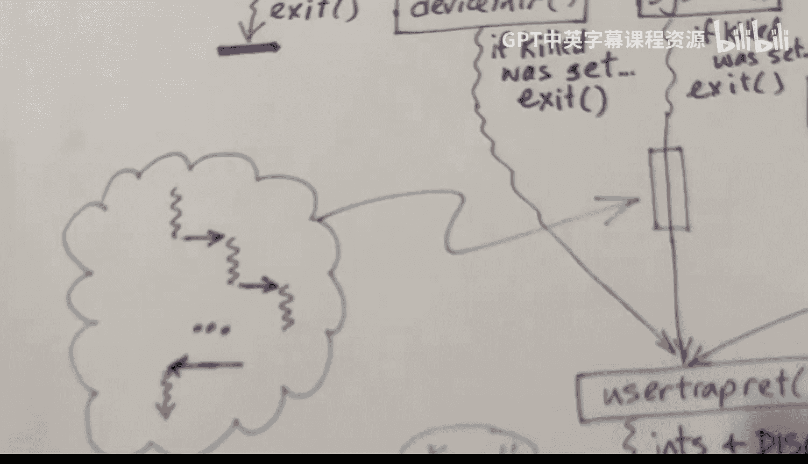

# hhp3《xv6 操作系统内核｜The xv6 Kernel 2022》中英字幕 p15 -15-xv6 Kernel-15_ Trampoline and Trapframe.zh_en -BV11CkSBsEtN_p15-

This video is part of a series on the XV6 operating system。In this video。

 I'm going to go over the assembly code in the tramline dos file。

 This includes the code called userbe and the code called user returnturn。

I'll also go over some of the code in the trap C file。

 I will talk about the user trap function and the user trap return function。

Let's begin with what I call the roadmap。诶。User code is executing。And we get a trap。

And we execute the user V assembly code first。And then we go into the user trap function。

And then we deal with the trap， whatever kind of trap it was。 And then。

We call the user trap return function。And that then goes into the user RE assembly code function。

 which ends by executing the system return or S REt instruction。When the trap occurs。

Interrupts are disabled by the hardware， and we change in the supervisor mode。

 And the current program counter is saved in the SPC register。

The S T Beck register is assumed to contain the address of the trap handler。

And so the hardware will also load that into the program counter。That。

Basically causes a jump to the userva code， because that is the address that the SVc contains。

And the user back。Needs to begin by saving the entire state of the user mode code needs to save the registers and the program counter。

And those are saved in the trap frame。We also get ready to execute kernel code by loading the SP and TP registers。

And then we switch over to executing in the colonel's address space。

So this initial stuff happens when the page table is set to the user's address space。

 but after we load the SATP register， the code will now be executing in the kernels space。

The trampoline page is mapped into the uppermost page of all address spaces。

 So this won't affect the code that's running here。

 but it will allow us then to jump to code that's in the kernelel's address space。

 but not the user's address space。 And so let's start by taking a look at what's going on in Usebe。

So here is code from the trapoline。s file， this is assembly code。And。

This code contains two pieces this file contains two pieces of code。

 One is called the userV function， and it takes a little bit of a page and a half。

 and then we have another one called user Ret， which I'll talk about later。

Those are the only two things in this trampoline file。When this is assembled。

 it will be placed into a section。Or sometimes I say the word segment。Named trampec。 Okay。

 and that will be placed by the linker into a single page by itself， and it will be page aligned。

We define a label here， trampoline lowercase， and that is the address in physical memory of where this page is located。

 And we have something called userbe as well。 That is the address of the start of this code that we'll look at in a second。

Since this is aligned on a page boundary。This alignment statement here will have no effect。 Were。

 we're already aligned on a 4 B boundary。 So userback and trampoline will be the same number。

So when we compute the offset of user Act from the beginning of the page， we'll subtract。

Tamppoline from userback， it's a zero offset。 However， when we calculate the offset of user rat。

 which is further down in this file， the offset will be。Greater than 0。 Okay。

 so that's why we have the same address being assigned two different labels here。

This is the start of the page and physical memory。This is the start of this particular routine。

 within that page。And we export these two labels with the global directive。Okay。

 we've got to save the registers initially。We could ask what's happening and what is true while the user code is executing。

 And one thing that's true is that the。Control and status register called S scratch contains a pointer to this。

To the。Crap frame。And so we。This is handy because we really can't do anything with registers。

 We can't really execute any code because we have to save the registers first。

 but we do have this instruction， control and status register。 readr。

 which will swap the values in a 0 and S scratch。 So after this instruction is executed。

S scratch will contain the user's value of a0。And a0 will contain a pointer to the trap frame。

 So now we can use that pointer and。Store all the remaining registers。

 So we began storing the registers here， and we store all of the registers。Except a0 itself。

Notice that these are the offsets here。 and this is a store double word of this register into this offset from this pointer。

And you can see that。Oset 1，1，2 is left out for a 0。 So we store everything except a 0。And then。

Following this down， we store all the registers。 And now that we store the registers。

 we have a little bit more flexibility。 We stored T 0。 so we can use that this。

Reads from the scratch register into T 0， and this stores is from T 0 into offset set 112。

 So now we store a 0。Let's take a look at。The trap frame， and in this image。

 I'm showing how the trap frame is laid out。And so we've got a number of locations where we save the state of the user mode thread。

 and we just saved the 31 general purpose registers into the register save area here。

 We've not yet saved the user's program counter， but we will。

 We've also got several locations here that we need to load so that we can execute kernel code。

And so actually。So look， that's what we're doing here。 We're loading the stack pointer。

From this location in。The trap frame， we're locating， loading the thread pointer。

And we're loading the SATP register， so let's go through that。嗯。We grabbed the。

Value of the S that' stored in the trap frame and put it into the S register。你。Colonel code。

 we will not have so。We have the trap executing here。 And once this trap happens。

 we're running in kernel mode。 And so we're going to execute all of this stuff。

 We're going to handle the trap， whether it's a timer interrupt or a device handler or whatever it is。

 system call。We're going to handle that in kernel mode as part of this little thread from here to here before we return to the user' code。

You can think of this as part of the processes thread。

 or you can think of it as like a little mini thread。

But we're starting with a fresh stack right here。 And we're not retrieving the previous values of registers。

 So I don't think it's right to think of this as continuing a kernel thread。 Instead。

 we're starting a new thread。 We're only loading the stack pointer and P P。

 The other registers are will have values that are left over from the user mode code。

The stack pointer that we will be loading， perhaps I should have said load rather than restore。

 because we're not retrieving a previous value as much as we are initializing the stack pointer。

 We are initializing it to what's called the kernels。Stack page， Every process。

 each of our 64 processes will have a single page set aside for the kernel stack。

 And that is what we are loading into S P here。 Or more precisely， we're loading a pointer to the。

Top of that page。Remember that Ss grow downward。 So we're essentially loading S with a pointer to a completely empty stack。

And so that's what happens at this point here。We've been executing and we are currently executing on some particular core。

 but we don't know what core we're executing on。 However， before we went into the user mode code。

 we would have saved。In this field， right here， the。Number of the coreps that we're executing on。

So the so called heart I D。And so at this point， we are loading that back into the so called thread pointer register。

By the way， if you're watching， I actually reverse these， so the offsets don't exactly match up。

 but the idea is there。So we're loading TP with the core number， so now we can make use of that。

And what we're going to do down here is we're going to jump into the user trap function。

So we're going to do a jump via register of T0。 Here we are loading T0。

 and we have previously saved into this field the address of the user trap function。

So this instruction here is preparing for this jump down here。At this point。

 we're ready to switch to the kernelel's address space。

 we've set everything up so that we can now execute kernel code in kernelel's address space。

So here we're getting the。Poiner to the colonel's page table， which we've previously saved。

 And we are storing it into the control and status register called SATP。

So we retrieve it into register T1 and then write it into this register。

 and then we do a fence instruction to make sure that everything that is supposed to be executed before that is executed to completion before that。

And every instruction that's supposed to be executed afterwards is delayed until after the SATP register is loaded。

The risk five processor。Call the function by jumping to the first address after saving the return address in register R。

 A return address。So that's how a call is normally made。However， in this case， we're simply jumping。

 We're not saving the return address。 and that's because user trackre does not return。

So now let's go take a look at user trap return。Sorry， user trap。And we have that code here。

So this is coming from the trap。 C file and theres some other things。

 there are some other functions in this file， which I will not cover in this video。

 but I will look at userT。At this point， so this is expressed as a C function。

 but is a C function that will not return。What will it do well at the end of this function？It will。

It will。Call another function。And that function will not return。 so we'll get there。诶。Here。

 we're doing a sanity check where。Looking at what's in the status register。 And in particular。

 we're looking at the previous privilege level bit。 And that tells whether the。

The core was running in user mode or supervisor mode when the trap occurred。

And it had better have been running in user mode or else something is dreadfully the matter。

So now we are running a kernel mode。 What if we get another trap。 Okay， A device might need service。

 for example， and might cause an interrupt。 So here we write into the S T back， a new address here。

 we're writing into it。 the address of a function that will handle kernel interrupts。And。

Then we grab a pointer to the。Proc。Structure。I showed a picture of the proc structure earlier。

 and it was this picture here。 Okay， so we've got information such as the pointer to the page table and a pointer to the trap frame and some other things。

And in particular， we're interested in this field trap frame。

 which is appointeder to the physical address of the trap frame page for this process in memory。

 each of our。64 processes will have its own。Page in physical memory for， for the trap frame。

Those will be mapped into the second to the highest page in the user's address space。

 but we're no longer running in the user's address space。

 so we need the physical address and this field contains a pointer to the trap frame in physical memory。

So we use we can use that now previously we have not yet stored the program sorry the program counter from the user's address space。

 So here we're storing that。 Okay so this is the last bit of state of the user mode process that we need to store。

 So that's done at this point where we read the control and status register and then save its value。

In my roadmap picture， I showed a big if statement。Okay， so now we're in user trap and。

We're going to do this if statement， so that's what's going on next。

So we look at the value of the S cause register to determine what's going on。 It'， it's 8。

 That means the trap was as a result of a system call。 So we do this bit of code here。

We'll ultimately call a function system called to deal with it， but first of all。

 we take a look at this trap， sorry， this killed field。That's a field in the prock。It's a boolean。

If anybody wants this particular process to die， it can set that boolean field to one。

So we check it right now to see whether this process needs to commit suicide。 And if it does。

 we call a function exit。 Exit will not return。 So that's that。

 But let's assume that we don't need to commit suicide， and we keep going。你。

Instruction that does the system call。In risk  five is called the environment call instruction。

 E call instruction。And our。Risk 5 core will have saved the pointer to that instruction in the EPC register。

But when we return， we don't want to execute this instruction again。

 We want to increment the PC to point to the instruction directly after the E call， so。

The instructions in the risk5 processor are 4 bys long， so we increment it by 4 to adjust。And now。

 we're ready to。Now， we're ready to turn interrupts on。 So at this point。

 the kernel code can be interrupted by another trap。So， for example， if a device needs handling。

 it can happen while we're handling the system call。Okay。

 we've saved the state of the user thread in here， and if we get interrupted。

 we're going to have to save the state or the kernel thread somewhere else。

 but we're not going to worry too much about that right now。

So we call this function and depending on what kind of a system call it is， we deal with it。

 And if it's the exit system call， we we may not。 In any case， we return here and keep going。Then。😊。

If it's not a system call， we call this function device interrupt。

And that then looks at the cause registered to determine which device requires handling。

And it returns a code。If it is a normal device， such as the serial comm device or the disk device。

 it returns one if it was a timer interrupt。Or more precisely， it was a。Software interrupt。

 which is how machine mode code will translate the timer interrupt。 Then it returns to 2。

 And if it's anything else， it's an error and it returns 0。 So here we're saying。

 is it an error or not。If it is not an error and it is a device， then it will be handled here。

If it is a timer interrupt。Well， we may update a counter to keep track of the current time。

 but basically， we just returned to。And we save that in this which device。Variable。

 which will then check right down here。But if it is0。

 then we print an error message and set this killed Boolean to indicate that we need to kill ourselveslf in the future down here。

The error message is just going to print out the process Id。

 It's going to print out the location in the user's address space at which the error occurred。And。

It's going to print out the。Value of the S T value， which may contain additional information。

If you're not familiar with the formatting code percent P， it basically prints out a。

64 B value in he。I paused for a moment because I saw that we were reading from these control and status registers。

 and I momentarily forgot that we turned interrupts on。

 but we only turned them on if we are in a system call if we are in the device interrupt the interrupts are not turned on so the device handlers will execute with interrupts disabled and likewise this error message has interrupts disabled。

 so these registers are still okay to be read directly。Okay。

 if at any point in the system call or or here we've set killed to true， then we self terminate。

Finally， if we had a timer interrupt。Then we call the yield function。

Yield function can be considered like a no op。 So we call this function， and then we return from it。

However， we may not return from it immediately。 yield will call the scheduler。

 and it may schedule some other threads to run， and it may be quite a while before this yield function ultimately returns。

 But at some point， we assume this scheduler will give the processor back to this particular thread。

 and while it will save all registers， it will restore them。 And so yield will simply return。However。

 it will not necessarily return on the same core。 We may have gotten switched to a different core。

So let's continue with this function and I'll show it like this。L them up， so。After this test。

 then we call user trapperturn。 user trapperturn is right here。 So this is effectively a go to。

 if you will， or it just falls through。We also will invoke user trap return from the fork process。

 but I don't want to go into that right now， but that's why this is set out as a separate function。

Rather than having it just simply fall through。 So now。Now we are whoops， we are。Down here。

 and we have considered doing the yield， and we are now ready to return to the user mode thread。

 So we're now in user trap return and。We need to disable interrupts。

And we need to set up some stuff and then go into the assembly code in the trampoline page。

 So let's walk through。What happens at that point。Interrupts may have been turned on if we had a system call。

 for example， and so we need to turn interrupts off。

 We're going to be messing with some control and status registers。

 and we cannot allow the core to be interrupted while we are dealing with the control and status registers。

We are grabbing a pointer to the proc structure as well up here。So previously。

 we had set the S T Vc register to point to kernel Vc。

 which will handle any interrupts and traps that occur if we're executing in kernel mode。

Now we're going to restore that by writing into the SV， the address of the userV code。

 so any future traps will jump to usererV。And what is that address， Well。

 it is the offset from trampoline， which， as I said， was zero。Plus。

 the address of the trampoline page， which is the highest page in memory， so。Next week。诶。

Look at that trap frame。 In other words， we've got a pointer to the proc structure。

 and we follow it to the physical address of the trap of our trap frame。

 the trap frame page for this process。 And we're going to then set the fields。These fields here。

These four fields that we need。When the next trap occurs， so that's what we're doing at this point。对。

We are currently executing in the colonel's address space。

 So we get the pointer to the kernelel's page table。And we store it here into the SATP field。

This is not actually a pointer， but it's basically you can think of it as a pointer。

 there are a couple of bits that are set。But。We will restore it as it is here。

Then we set the SP field at the stack pointer。Every process has a stack。 Okay。

 And so that is shown here。I didn't actually draw a little pointer to a page like I did down here。

 but it's the same idea。 We've got a pointer to the stack page for this kernel。

And here we are initializing the register to point to。The address just beyond that page。

 So that is effectively an empty stack。And then， we。Initialize the。

Trap field to point to the user trap。Function。And that is the sea code that we saw。 And finally。

 we are getting the number of the current core by reading the current。Thread pointer register。

Remember， we did a yield。 So it's possible that we're not running on the same core any more。

 So we need to retrieve the core number of of the core that we are running on。

 and we store it in the field called heart I D。Now。

 we're going to go back to the user code with the SR instruction。

 And so we need to prepare for the SR instruction。The SR instruction will use the status register。

 So here， what we're doing is we're， we're telling it。That the previous privilege mode was user mode。

 So we're clearing this bit。And so the S RET instruction will then return us to the previous privilege mode。

 that is it will change us into user mode。We're also saying that the previous interrupt enabled bit was enabled。

 okay， so that when the S instruction occurs， it will enable interrupts。And we， then。

Write that into the status register。 Okay， we， we read the status register here。

 update it and write it back。The SR instruction will also use the SPC register to restore the program counters for the user mode program。

 so we are retrieving the value that we saved here。And we're moving it into。你。e p c register。

And then。We have a variable SATP， this is a variable， not a register。

And we are taking the pointer to the current page table for this user to the to the page table for this user process。

 Okay， so we've got this field page table in the pro structure that points to the page table。

And we are essentially storing the address of the page table in this variable。However。

 the SATP register has sort of a couple of fields in it and make SATP is a pre preprocessor macro that has past the address of the page table。

 and it will shift out the offset bits and it will set some bits in the upper field to indicate that we are using risk5 SV 39 mode。

 you know， a few details that are related to the hardware。

 but you can think of it as essentially grabbing a pointer to the users page table。And finally。

 we've got this thing down here。Let me try to parse this for you a little bit。

 What we're doing here in the second line is calling a function。Okay。

 and we're passing it two arguments。So what is the function that we're calling？Well。

 we are determining it right here， and it is the userette code。 or more precisely。

 userette minus trampoline is the offset within the trampoline page of the userette code。

 And then we're adding it to the address of the highest page in memory， the trampoline page。

 And so this gives us our address。 And remember that trampoline page is mapped into all address spaces。

We are executing in the kernelel's address space， so that's fine。

 It's also mapped into the user's address space， but so it doesn't matter which what the address it doesn't matter what value of of the SATP register we have。

But in any case， we get the pointer to the user rep code。 and then we call it。 and this。

Casing thing here is basically the way of telling the compiler that we that F N is a pointer to a function。

 Okay， that returns void and has two arguments。 Okay， the two arguments are trap frame。 The pointer。

 the address of the second highest page in memory and。

The value that we will need to be sting into the SATP register。So now let's look at。Use a rat and。你。

Tampmpoline page。Okay， so here we go， we go。And。The comment here tells us that we are calling it。

With two arguments。The risk five will implement the call or the C compiler will implement the call by moving the two arguments into a0 and A1 will also say the return address in register R。

 the return address register， however， we'll never be returning， so we don't care about that。And。

At this point。A1 contains the pointer to the page table for the user address space。

We are writing into the Cs register the control and status register called SATP， that value here。

 So now we are switched into the user's address space。We do the fence here。

And a 0 points to the trap frame page。 Okay， so we can make use of a 0 here。

So the first thing we do is we grab the。Users value for register A0。That was stored at all set 112。

 and we moved that into register T 0。 So we load it into register T 0。

 and then we write it into the scratch register。So now the Sc register contains the users A0。

Whereas a0 contains a pointer to the trap frame。AndThen we load all of the registers that were previously saved。

Except。A 0 here at offsetet 1，12。Okay， we load all the registers。And then continuing on。

At this point。We swap the contents of the scratch register and a 0。 So now a 0。Is the user's value。

 which is what we need and the Sc register。Contains a pointer to the trap frame。

 which we will need to have， which we expect to have when the next trap occurs。And so finally。

 we're ready to do the SRA instruction。 So wrapping it up and going back to my。

The image I call the roadmap。

So we're down here， I just want to make a note about this I kind of。

Did things in the order that I thought made logical sense。

 the S status register was actually preloaded up up in user trap rat。 But in any case。

 you can see what we've done。 We've disabled interrupts。

We've restored STV to point to the userV code， namely。This code here。

We haven't really saved the we've set up SP and TP。

So that they will be usable when we have the next trap and we loaded the SPC register， and then we。

Set the SATP register to point to the user page table。

 so now we're executing in the user's virtual addresser space， we restored all the user registers。

 we loaded the status register or we basically change these bits with that up here actually and then finally we're ready to execute the S RE and so that will then change the program counter back to what it was and we will and it will change the mode to user mode and enable interrupts。

 so now we're right back where we left off when the when the trap occurred up here and we're ready for the next trap。

Okay， that's it for the trampoline page。 See you in the next video。

