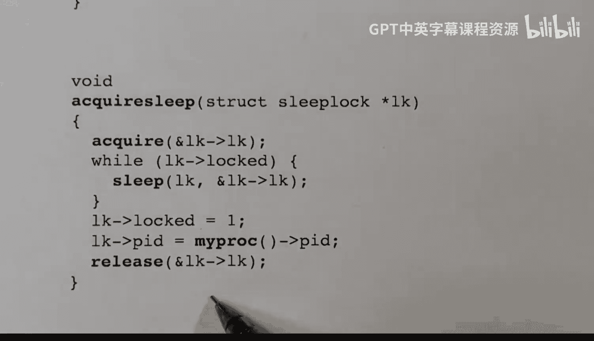

# hhp3《xv6 操作系统内核｜The xv6 Kernel 2022》中英字幕 p25 -25-xv6 Kernel-25_ Sleeplocks.zh_en -BV11CkSBsEtN_p25-

In this video， I'm going to describe sleep locks and contrast them with spin locks。

This video is part of a series on the XV6 operating System kernelel。With any locking system。

 there are two primary functions。 acquire and release。 Sometimes these are called lock and unlock。

 But for spin locks， the functions are called acquire and release。

 and they're each past a pointer to a structure representing the spin lock。

The key with a spin lock is that it must not be held for very long。 And in particular。

 between the acquire function and executing the release function， you are not allowed to go to sleep。

 so there is no time slicing。And what the acquire function will do is loop in a tight loop。

 looking for the lock or waiting for the lock to be released。

 And this is very practical on multi core systems， because the lock can generally be held by a core。

 another core， and it will release the lock quickly because it must not hold the lock for very long。

 So the busy loop or the spin loop inside the acquire function won't have to wait for very long before it finds that the lock has been released。

So the acquire will never wait for very long。 And this also happens to imply that the release will always be performed on the same core that did the corresponding acquire。

But the problem is， what if you need to wait for a long time between acquiring a lock and releasing it。

 And in particular， what if you need to execute the sleep function and suspend the execution of the process between the acquire and the corresponding release。

Well， if you were to hold the lock for a very long time， then with a spin lock。

 the acquirer would have to loop in its tight loop， waiting for that lock to be released。

 and that would essentially tie up the core。 And so this is just not going to work。Instead。

 what we have are sleep locks and sleep locks are very similar to spin locks in that they have an acquire and release function。

 However， you get to hold the lock while you go to sleep。In the case of the XV6 implementation。

 the acquire functions called acquire sleep， and there's a corresponding release sleep。

 and both of these are past a pointer to a structure that represents the sleep block。

There's also a function called a knit sleep lock， which is used to initialize the structure。

Each structure also carries a named field， which is initialized and never changed。

 and that can be used for debugging。 That's not really relevant to the functionality of it。

And there's also a function to check to see whether the current process is holding a given lock。

 And that's called holding sleep。 And it returns true if the current process is holding the lock。

 the way this is used is just for error checking。 and if it ever returns true。

 the colonel immediately panics。Okay， here's the representation of a sleep lock。

 The structure contains four fields， and the first field is a spin lock。

 which is just used to protect the remaining fields。As I said。

 the name is initialized and never changed。 so it's not really protecting the name field。

 but it's protecting the key field， which is this boolean called locked。 If true。

 the sleep lock is being held。 and if it's true， then the P ID will contain the process I D of the process that's actually holding the lock。

And if it's false， the lock is free and unheld。Okay， now let's take a look at the code。

The sleep lock dot H file contains the structure that is used to represent a sleep lock and nothing more。

 That structure contains the fields， L K locked， name and PD。

 And here we see that L K is a spin lock。 the locked is the boolean that's true if and only if the lock is held。

 And then we have the name string and the P ID， the process I D that is currently holding the lock。

 if any， that are used for debugging。The file sleeplock dot C contains the functions。

The initialized function is passed a pointer to one of these structures， as well as a name string。

 And it initializes all four fields， L。 K， lock， name and P I D。The LK field is a spin lock。

 so we have to call this function to initialize all spin locks， and we give it an arbitrary name。

We save the name field， and we set the lock to indicate that this sleep lock is currently not held。

 It's in the unlocked state。 and we also clear out the process I D。

The acquire function is past a pointer to a sleep lock。 And essentially。

 what it's going to do is it's going to acquire the L K spin lock。

Set the locked field to Trude to indicate that it's held and also save the process I D of the process that invoked this and then release the spinlock。

But we also need to check the lock field because it's possible this sleepwalk is currently being held by some other process。

If it's false， we immediately skip the while loop。 But if it's true， we go to sleep。

 And then when we wake back up， we check the locked field again。 And if it's unlocked this time。

 we then can proceed。 Otherwise， we keep sleeping until eventually we can find that it's unlocked and we can proceed。

Now， remember how the sleep works。 It's past a channel， and。A spin lock。

And the spinlock must be held upon call to the sleep function。 And what sleep will do is it will。

Release the spin lock and go to sleep as one atomic operation。

And it does this so that no wake ups will be missed。

 So it won't release the spin lock until it's certain that it is asleep。

The channel is an arbitrary number uninterpreted by the sleep and wake up functions that's just used to coordinate the wake up in sleep。

 So we're using the address of the sleep lock。 And when any process releases a sleep lock。

 it will notify all processes that are sleeping using that same channel number。 That is。

 it will notify all processes that are waiting for that lock to be released。

 And so when we are reawakned， the sleep function will reacquire the lock。

 And then we can check the lock field again。Now， if several processes are reawakened， That is。

 if several processes are trying to acquire this sleep lock。

 only one of them will be given the spin lock， the others will have to spin waiting for it。

 But whoever gets it will then be able to check the locked field and possibly proceed if it's unlocked。

 The others when they get the spin lock will find that someone else got there first。

Okay， here's the release function。It acquires the spin lock and then sets the status to unlock。

 also clears out the process I D field and releases the lock。 But before it releases it。

 it also wakes up all the other processes or any other process that is waiting for this particular sleep lock。

And finally， we have the holding sleep function， which is just used for debugging。

 This thing returns to boolean， and if it returns false， we will be calling panic。 But basically。

 it just takes a look at the lock field and make sure that it is set。

 But before we look at the lock lock field or the P I D field， we need to obtain this sleep lock。

 So it obtains the L K sleep lock。Sorry， we need to obtain the spin lock。

 So before it looks at these two fields， it obtains the L K spin lock。

 and then it checks these fields and if there's any and then gets that and returns that true if it's locked by the current process。

 And then， of course， it releases the spin lock before returning。Okay， that's it for sleep blocks。

 See you in the next video。