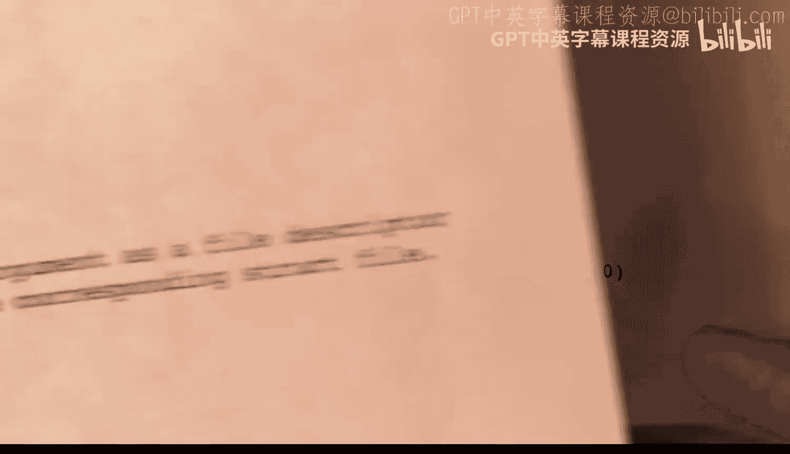

# hhp3《xv6 操作系统内核｜The xv6 Kernel 2022》中英字幕 p35 -35-xv6 Kernel-35_ File Descriptors and Open Files.zh_en -BV11CkSBsEtN_p35-

This video is part of a series on the X V6 operating system kernel。 In this video。

 I'll be talking about file descriptors and open files。

 and I'll be going over the code in the file called file do C。😊。

Let's begin by talking about the word file。 This term is ambiguous and fuzzy and can be confusing because it has a couple of related meanings。

The most common use is when we talk about a regular file on the disk。 So， for example。

 we might say that a directory contains several files， as well as directories。

 as if the directory is something different， But， in fact， a directory is a kind of file as well。

 And in fact， within the file system。A file can either be a directory file， a regular file。

 or a device file。These things each have an iode that refers to them。

 and they can be referenced using path names。C programmers will be familiar with a structure called fileile in capital letters。

This is a user mode only structure。 In other words。

 it lives only in the user's virtual address space， and the kernel doesn't know about it at all。

There are a number of library functions like F open， F  E。

 F write and F close that use this file structure。 but these are not system calls。 Instead。

 to get their work done， they use system calls and like open， close， read and write。

 which are system calls。So these communicate with the kernel by referring to files using a file descriptor。

The file descriptor is a small integer， and each small integer refers to a different file。

But in this sense， file descriptor can also refer to a pipe as well as a directory regular or device or device file。

 so that's yet another meaning of file。In this video。

 we'll be looking at a structure whose name is file。 And to make things even more confusing。

 we have a couple of files in the kernel， which are called file do H and file C。

 and we'll be looking at the code in those files。To show how the file structure is used。

 I've created this diagram。We've got two processes and each process is represented by a proC structure。

 and we've got four file structures here。And then we've got a couple of iode structures and a pipe structure。

So let's start with the proC structure。It has a field called O file， which is an array。

 and this array contains， well， it contains 15 elements as determined by this constant number of open files。

 And these are the file descriptors。 So this array is indexed by the file descriptor。

When a system call like Read or write， makes a system call to the kernel will be passed a file descriptor。

 and it will use that as an index into this array， and then it will follow this pointer to the file structure that is being referred to。

So the kernel will allocate these pointers and allocate slots in this array whenever an open system call is made。

 and so the user code doesn't get to choose which elements are used。

 is just returned to the file descriptor， and then it must provide the same file descriptor in the readrite and closed system calls。

So the file structure begins with a tight field， and let's go through these fields and see what it's got。

 It's got a reference count， which is just the number of pointers that are pointing to this structure。

And then it's got two flags to tell whether this file is either readable or writeriable or perhaps both。

 and then it's got two pointers。 The pipe pointer will point to a pipe structure and the IP pointer if used。

 will point to an i note structure。And then there's an offset and a major。

 So let's quickly take a look at these。Structure as defined in the file， file do H。

 and we see exactly that。We see the tight field。Which can either be pipe， iode or device。

 And it can also be none for unused structures。And then we've got the reference count。

 we've got the two readable and writeriable flags， and then we've got a pointer to a pipe structure。

 and then we've got a pointer to an Iode structure and the offset and a device major number。So， a。

File that's open in some process can either be a pipe in which case the type field will be pipe。

 or it can be a directory or a regular file in which case the type field will be。

F B underscore i node。 It'll be i node。Or it can be a device， in which case the type field is device。

If it is a pipe structure， well， each pipe has a read end and a right end。

 as determined by the settings of the readable and writeriable flag。

 So this is pointing to the read end of this pipe。And the pipe field will point to the structure。

 and the remaining fields will not be used。If it is a directory or a regular file。

 then the pipe field will not be used， but the IP field will point to the iode。

And the offset field will contain an integer that tells where in that file the next read or write will occur。

 and the major field is unused。 Now， this file is open for writing only。

 so the next right operation will happen at offsetet 47。And finally， if it's a device。

 then the IP pointer will point to an in。But the offset will be unused。 and instead。

 the major number， which is in the eye note， will be copied into the major field of the file structure。

Now， I want to remind you that in UniX。Fath thescriptor 0 was always used for standard N。

And filescriptor 1 is used for standard out， and filescriptor 2 is used for standard error。

 So the parent process here apparently has standard in being open to a pipe。 That's the read end。

 which is what we would expect。And for standard out。

 the standard out will go to a file and that file is described by this in。

 it happens to have a size of 900， but we're writing starting at the beginning of this file and we've made it up to location 47 at this point。

And for some reason， standard error is closed， which would not really be normal。

 The kernel will allocate entries into the O file array on each calls to the open system call。

 and it will use the next available unused slot， so apparently standard error was open。

 but it has been closed。Now let's take a look at what happens when this parent forks a child。

 so the fork process will copy the proC structure into a new pro structure and in particular。

 it will copyied the open file array into the child's proC structure So that means that every file that is open in the parent such as this pipe right here or this file right here will be open in the child。

 So the red lines indicate that these pointers have just been copied so this pointer here is copied as well。

 and initially file descriptor number two is copied， it was closed， so it's a zero here。

Now let's say that the child decides to open a file。

The open system call will find the next available unused file descriptor， which happens to be two。

 so it will use this slot right here， and it will open the file。

 We've provided a path name to the open system call。

 And it turns out that that path name happens to refer to the exact same file that file descriptor1 refers to。

Folescriptor 1 had this file open for writing and was positioned on offsetet 47。

 But when we open it here， apparently we're opening it for read reading and read only。

 and the offset is initialized to 0。 So any read using file descriptor 2 will come from the file starting at offset 0。

And if we write to the file using all1， it will write characters starting at allet 47 and increment them。

This the file structure shows that there is a sort of an intermediate layer between the pro structure and the iodes or pipes。

 and that intermediate structure is used for a number of things。 and in particular。

 it's used for the readable and writeriable flags。 so you can have one file It's open for writing by one process and。

For a different access protection in this case， reading by another process。

 and it also contains a field for the offset。 So one file could be at what sorry。

 one process could be at one point in the file using its file structure and another process could be at another point in that file。

 using its offset。File structures are a critical kernel resource。

 so next we need to look at how this resource is managed by the kernel。

There are a fixed number of file structures that are allocated in start up time。

 and they are kept in an array shown here。This array has size 100。

 The exact size as determined by this constant in filed。

Every structure in this array is either in use or is free and available for future use。

There's a variable called F table that contains a structure， and that structure is two fields。

 lock and file。Lock is a spin lock， and file is the array of 100 structures。

The file structures have these fields we saw these before， we have a type field， a reference count。

 the readable andriable flags， the pipe pointer， the IP pointer， the offsetet， and the major number。

The reference count tells whether the structure is in use or not。

 If a structure is free and unused and available for future use， then the reference count will be 0。

 On the other hand， if it's in use， then the reference count will be one or greater。

 So the reference count keeps track of how many pointers are pointing to this file structure。

Where are these pointers coming from？Well， remember that a process will have a number of open files。

 and each open file is given a file descriptor， and that's a slot in this array called O file。

 So the O file arrays contain pointers to the file structures。 That's where they're coming from。

 and reference count counts the number of pointers to this particular object。

The type field can either be F nonen， F iodeode， F device or F pipe。If the。Structure is unused。

 then its type field will be none， but really the reference count is what determines whether the structure is unused or whether it's in use。

The pipe field will contain a pointer to a pipe structure。 if and only if the type is F D pipe。

The I P pointer will contain a pointer to an i note。

 and that will be used if and only if the type is either。f d iode or f d device，If it is iNot。

 then that means that this is pointing to a device file or a regular file。

 and so the offset will be valid。On the other hand， if the iode is a device type。

 then the major number will be used。Okay， so the spin lock protects the reference count。

 We need to acquire the spin lock before allocating structures。

 and every time we increment or decrement the reference count， we better first acquire the spin lock。

Ousset will be changed。And since there can be multiple processes referring to this object。

 it needs to be protected by a lock。 However， there is no lock in this structure。Instead。

 the offset field is protected by the lock， but is in the iode structure。

So if this thing is a directory file or a regular file， then IP will contain a pointer to an iNot。

 and remember that i notess contain a sleep lock。 So that's the lock that has to be acquired before the offset is read or modified。

 So that's sort of unusual。And the other fields in this structure don't change。

 They're initialized when the structure is allocated and they don't change。 So therefore。

 they don't need a lock。 So the other fields do not change once the file structure is allocated and the reference count goes from 0 to 1。

Okay， let's begin by taking a look at the code that initializes this data structure。

 and this is coming from the file file。 C。So we see the definition of the variable F table。

 that's got two fields。 lock and file File is the array of these 100 file structures。

Remember that with C， when you define a variable， the name of the variable comes after the type and before the semicolon。

 sometimes we see a name here and an example of that would be the file structure in that case we're defining a new name which we can use in other places to refer to this particular structure。

 but in this example we see no variable being created In fact， that name file is used right here。

 and this is where we are actually creating some instances of the file structure。

But for this example， the structure will be anonymous。

 We don't ever need to refer to this type anywhere else。

This function file in it is called from the main function as it's running on core0 only so it'll get executed。

 and it simply initializes the spin lock that goes along with this F table structure。

 So that's the spin lock right here that protects all the reference fields in the file structures。

These things are assumed to be initialized to zero。

 so we don't see code to actually initialize those。Whenever we are ready to open a file。

 we need to locate an unused file structure in the array of 100 file structures and allocate it。

 And that's the purpose of the file Aloc function。So it will acquire the spin lock here。

 And then before returning， whether we return here or here， it will release the spin lock。

 And what is it going to do， Well， it's going to go through the file array in the F table function in the F table variable and find one where the reference count is 0。

 And then it's going to increment the reference count to one and return a pointer to that file structure。

 And if， for some reason， there are no more available， it will return the null pointer。

Now let's take a look at the file dope function。From time to time we will have a process and we will fork it so here's the parent process and we will need to create a child process。

 remember that the proC structure contains this array of open files and pointing to various file structures and we are copying this array and therefore we are adding pointers to each of the file objects that werere pointed to by the parent and so we need to go through these file structures and increment the reference counts and that's the purpose of the file do function。

It begins by acquiring the lock on the F table， and then it increments the reference count。

 releases the lock and returns。 It also does a quick check to make sure that we are already holding a pointer to that particular file object。

Next， at some point we are going to close files and we need to return these file structures to the free pool because they are no longer in use。

So we have this file close function that's past a pointer to some file structure。

The first thing it's going to do is decrement the reference count。

 So here we acquire the lock on the table of 100 file structures。

 and we decrement the reference count right here。 And then if it has not gone to 0。

 that is we're prederementing it here。 And if it's still not0。 Then there's nothing to be done。

 We don't need to free anything。 There is another pointer still in existence。

 So we can just release the lock and return immediately。

 We've also got to check here to make sure that the reference count is not already 0。

But if the reference count has gone to zero， then we need to do additional work。

 and that's shown here。So this FF variable is a local variable in this function that is a file structure。

 so we're going to copy the entire file structure right here。And。

Then we set its reference count to 0， thereby making it a free and unused file structure in the table of 100 file structures。

 And we're also setting its type to F D none。And then at that point， we can release the lock。However。

 this file structure may be pointing to some other structures that we need to take care of。

 it may be pointing to a pipe or it may be pointing to an iNot。

So that's why we made a copy of it so that we can access the pipe pointer here or the IP pointer here。

So if the type of the structure that we just released。Was F pipe。

 then it will contain a pointer to a pipe structure。 right。

 There will be exactly two pointers to a pipe structure。

 one from the read end and one from the right end and whichever one we are。

 we need to execute the pipe close function to possibly free that structure。 Okay。

 so here we're calling pipe close， which we looked at before。

 And is this the read end or the right end。 Well， we're passing it the value of the rightable flag to determine that。

On the other hand， if the type was F D i note or F D device， then we are。

Going to need to deal with the iode that's pointed to。 So for that， we will use the eye put function。

 which we covered earlier， but essentially， it's going to decrement the reference count for this i node。

 And if there are no other pointers to it， it will free the eyeode structure in memory。 and further。

 if there if we're freeing in the iode structure。 and there are no hard links left。

 that is the in link field0。 then this will also remove the file from the desk。

So disc operations are involved here， so we need to have these inside of a transaction。

 So here we have the begin up and the end up that define where the transaction occurs。

There are three more functions in the file file C。 There's file tab。

There's file read and there's a file right function in the remainder of this video。

 I'll just talk about file stat and I'll cover the others in a future video。

Filett is used for the Stt system call， so let's quickly review what the Ftt system call does。

This system call is available in both UniX and XV6 and has more or less the same definition。

It's past a small integer which indicates which file we're interested in and a pointer to someplace in the user's virtual address space。

 and what it will do is it will move into the user's virtual address space some information about this file。

The memory area is laid out according to this stat structure and contains the device number。

 the I number， the type of the file， the number of hard linkss and the size of the file。

And then it will return zero if everything was okay or minus-1， if there was an error。In Uniix。

 we have the error number variable， and the kernel will also set that to indicate what caused the error if there was an error。

 But in X 6， we don't mess with the error。 We don't have the error number system going on。

 We don't use that at all。Okay， so。When a system call occurs。

 the kernel will get control from the users program and it will look into a register to determine which system call it is。

 and then it will invoke one of these cis functions to actually do the work。

 So in the case of the Ftap system call。 the kernel will then invoke cis Ftap。

 which is coming from file， cis file dot C。These functions are passed， no arguments。

 and they return the value that should be returned to the user's code。

 so they return either zero or minus1 in this case。So what does the thing do， Well。

 it needs to first obtain the arguments that the user code was trying to pass in。

 Arguments are passed in registers， and those registers got saved。 So we have to call a function。

 and functions like Arg int and Arg address werere reviewed in a video a long time ago by me。

 and what they do is they're past the number of the argument you want to retrieve。

 So here we are retrieving the first argument 0 and the second argument number one。

 And in the case of Arg address that will be a virtual address。 So we're passed where to store that。

 Okay， so this is a local variable。 And this Arg address function will。

Find the save register and move the value into the location S T here。 And if there is any problem。

 it will return -1， and we'll immediately return -1。The A F D function， I have not looked at。

 but it's a similar kind of thing。 It's past the register number。

 That is the argument number that we want to get。 and a place where we want to store it。 Now。

 this is a file thescriptor。 So we're past and the address of F。

 And so this function here will obtain。A pointer to the file structure for this file for this。

 And so let's take a quick look at Arg FD。

Here's the code， fetch the in。System called argument as a file descriptor。

Return both the file descriptor and the pointer to the corresponding file structure。Okay， so。

It is past the number of the argument， and it's past two pointers。 Okay。

 that's where to store the file descriptor。 That's the small number。

 And this is where to store a pointer to the file structure。So it's going to start by calling A end。

And passing it in。 So that gets the first argument or the in argument， I should say。

 and stores it in this local variable FD。 And if there's a problem with that， it returns -1。

 then it checks this file descriptor that we just retrieved， Okay to make sure it's valid。

 Is it zero or greater， but not greater than the number of files that we have。

 the greatest possible number of open files。And then we look at the O file array and see whether it's null or not。

 Okay， so here we're going to the current procedures pro structure。

 and we're looking at the open file array in my picture Here is the proC structure for a procedure and we are looking at its o file structure。

 We make sure that the index is not less than0 or greater than the number of entries that we have here。

Determined by the number in O file。 And then we check to make sure that it's not a null pointer。

 And if so， we're going to trace it and return a pointer to the file structure。

 So that's what's going on here。We check it to make sure it's within range and not null。 And then。

We are grabbing it this pointer and storing it in F。If we want to capture the file descriptor itself。

 then this will be a pointer to where to store that file descriptor， a small integer。 But otherwise。

 it will be null。 So if it's null， we don't do anything。 But if it is a pointer。

 then we store the file descriptor there and。This argument will be to where to store the point to the file this structure。

And so if this is no， we don't do anything， but if it is a pointer。

 then we store the pointer to the file structure。There， and then we return 0。这是。

So now we're ready to go back to Cis。As staff。We have a pointer to the file structure we were not interested in the actual file descriptor number。

 so we didn't bother saving that。 there was a problem we return minus-1。

 and so now we call file stat to do the work， we're passing it a pointer to the file structure as well as a virtual address of the stat structure。

So。Then we're back in file。c and here is the file staff。Function。

So we're getting a pointer to the current procedure。 and then we are looking at this file structure。

 F。Is it an i note。Or is it a device？Well， if so， then its I P pointer will be valid。

 And so we can return something。 But if it's a pipe， then we have a problem。 So we return -1。

So if it is pointing to an iode， that is if the type is iode or a device。

 it's either a regular file or a directory file， or it's a device。In either case。

 the IP pointer will point to something。We're going to lock the iode that's pointed to。

And then we're going to use this stat I function， which I talked about earlier。

 And that is going to copy the data from the iode into the virtual address space at this virtual address。

 And then we are。Sorry， it's going to copy it into the kernel space。

 And so here we have a variable in the kernel space where we are going to be storing the data。

 And then we unlock the in。 And here we copy it into the virtual address space。

 one thing that X v6 does is it does a lot of copying from here。 you know。

 copy that maybe you could eliminate。 So maybe we could copy it directly into the virtual address space with a different design。

 But in any case， we're using stat I to copy it first， this stat structure here。

 And then we're using copy out to copy it into the virtual address space。 So we are copying。

To the virtual addresser space described by this page table。

 And here is the virtual address that we're copying it to And then here's where we're copying it from。

 namely this local S T variable。 And we are copying however many bytes that structure takes。

 And if there's a problem， we return -1， otherwise return 0 and everything's okay。

So I'm going to talk about the read and write functions in the next video。

 so I will see you in the next video。