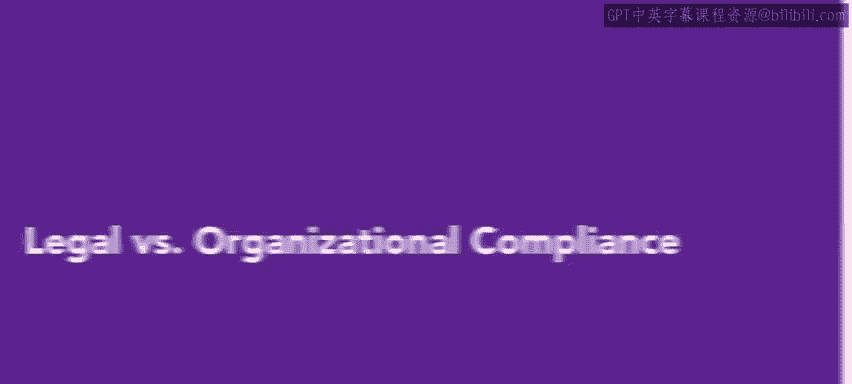
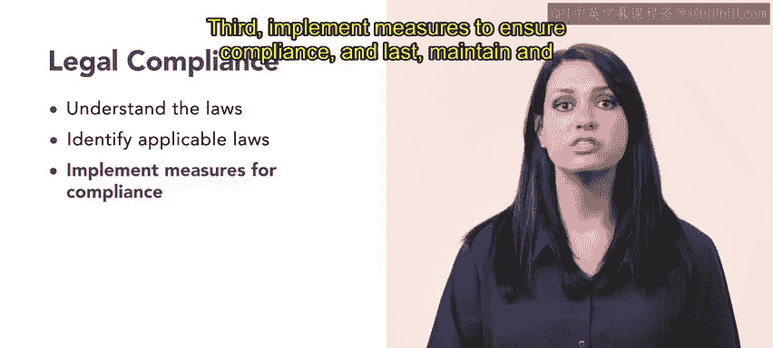
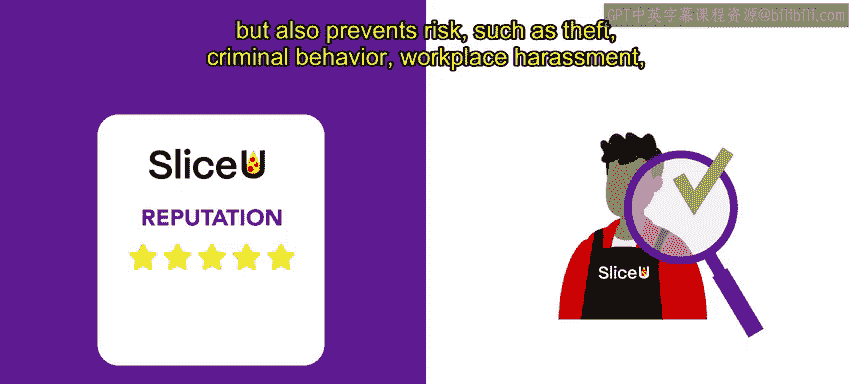

# HRCI《人力资源助理（员工关系、合规，4-5课／共5课）｜HRCI Human Resource Associate》 - P100：17_法律vs组织合规.zh_en - GPT中英字幕课程资源 - BV1qE4m19788

Compliance is critical for organizations so they can avoid legal and financial penalties。

 reputational damage， and potential harm to stakeholders。

There are too many types of compliance HR professionals must be aware of， legal and organizational。

 let's explore each type of compliance。

Legal compliance refers to the process by which an organization obeys or conforms to laws or regulations set by state or federal governing bodies。

These regulations range from industry specific regulations and standards such as the Railway Labor Act to federal regulations such as EEO and OSHA。

These policies and regulations often dictate how an organization can handle terminations。

 hiring policies， employment terms and benefits， union related matters and record keeping。

Not adhering to these policies can result in fines and other legal complications。

Legal compliance includes four components。 First， understand the laws within the industry and jurisdiction。

 Next， identify applicable laws and regulations。 Third， implement measures to ensure compliance。

 and last， maintain and submit mandatory records such as OSHA's form 300，300 a and 301。

Legal noncompliance can result in fines， csures， damage to reputation and potential jail time for an organization's leadership。

 For example， all restaurants must adhere to legal regulations from OSHA and the FDA。

 SeU takes compliance with these regulations very seriously。 Throughout each location。

 ongoing OSHA training pertaining to employee and food safety is a priority。 All employees。

 regardless of their position， participate in extensive training on a quarterly basis。

This training ensures all employees comply with laws and regulations in order to minimize risk to slice you Employ who do not complete the proper trainings are subject to disciplinary action。

 including retraining， regular monitoring and termination organizational compliance is similar to legal compliance。

 but focused on the organization itself。Organizational compliance ensures employees and other representatives adhere to policies。

 procedures， and training required by the organization。

Proper organizational compliance also includes ongoing risk monitoring， assessment and audits。

Organizational compliance focuses on protecting an organization's reputation。

 reduces the risk of fines and penalties， and fosters a positive relationship with stakeholders。

This is achieved through careful promotion of transparency， accountability。

 and responsible business practices。Organizational compliance also ensures that employees represent the organization with ethical behavior and personal conduct。

Sliceu is very mindful of their reputation Throughout the pizza industry。

 they are known for their high quality ingredients， excellent customer service。

 and overall great experience。During their employee screening process。

 all potential employees are subject to a background check。

 This background check helps slice you hire the most qualified people。

 but also prevents risk such as theft， criminal behavior。

 workplace harassment and other safety issues that could tarnish its reputation。

While legal compliance focuses on an entire industry。

 organizational compliance is specific to a business and its practices。

 both are important for HR professionals to understand in order to assist an organization in adhering to the law and avoiding risks。

