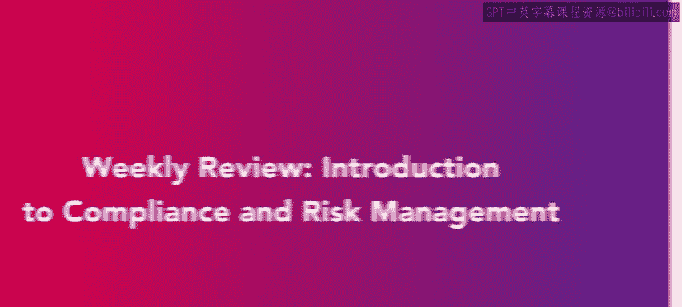
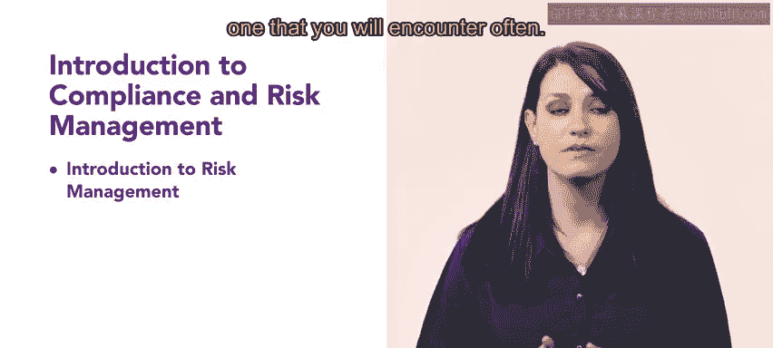

# HRCI《人力资源助理（员工关系、合规，4-5课／共5课）》：P101：18_每周回顾：合规与风险管理导论 📚

在本节课中，我们将回顾第一周关于合规与风险管理导论的核心内容。我们将总结本周所学的基础知识，并理解它们对于未来人力资源专业工作的重要性。

## 第一周学习内容回顾

恭喜你完成了合规与风险管理导论的第一周学习。

本周，你学习了合规与风险管理的基础知识，以及它们对于你未来作为人力资源专业人士的重要性。

## 风险管理基础

首先，我们介绍了风险管理的基本概念。

以下是风险管理的关键组成部分：

*   **风险管理阶段**：这包括风险识别、风险评估、风险应对和风险监控。
*   **风险管理职责**：人力资源专业人士在识别潜在风险、制定缓解策略和确保政策执行方面扮演着关键角色。
*   **风险评估与应对**：这涉及分析风险发生的可能性和影响，并决定是接受、规避、转移还是减轻风险。

能够分析、评估和减轻风险是一项基本的人力资源任务，你将会在工作中经常遇到。

## 合规基础

接下来，我们介绍了合规的基础知识。

具体来说，你学习了组织如何实施和监控合规性，以及合规性在维持组织运营中所扮演的角色。

以下是合规管理的核心方面：

*   **合规实施**：确保组织政策和实践符合相关法律、法规和行业标准。
*   **合规监控**：通过审计、报告和持续审查来监督合规情况。
*   **合规的作用**：有效的合规管理有助于保护组织免受法律处罚、财务损失和声誉损害。

## 总结与展望

合规与风险管理是人力资源工作中重要的组成部分。

你现在离实现成为人力资源专业人士的目标又近了一步。

在本节课中，我们一起回顾了风险管理的基本概念、阶段与职责，以及合规管理的基础知识与实施方法。掌握这些内容是成为一名合格人力资源助理的重要基石。