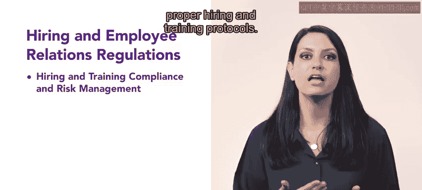

# HRCI《人力资源助理（员工关系、合规，4-5课／共5课）》：第19课：法律与安全合规的应用与设计 🛡️📚  


## 📘 课程概述  


在本节课中，我们将学习合规与风险管理课程第二周的核心内容，重点探讨招聘与员工关系相关的法律法规要求，以及如何在组织中应用合规与风险管理原则。  


我们将依次了解招聘与培训合规、员工关系合规，以及如何在实际工作中将合规与风险管理理念融入人力资源管理实践。  


## 🗂️ 第一部分：招聘与培训中的合规与风险管理  


上一部分我们对本周课程内容进行了整体介绍，接下来我们重点学习招聘与培训中的合规与风险管理。  


在本节中，你将深入了解组织中的招聘与培训合规及风险管理。  

我们将探讨遵守相关法规的重要性，以及如何确保招聘和培训流程符合规范。  


为了更好地理解招聘与培训合规，可以用以下公式来概括其核心逻辑：  


```text
合规招聘 = 遵守法律法规 + 公平流程 + 合法文件记录
```

```text
合规培训 = 符合法规要求 + 明确培训标准 + 风险控制机制
```


招聘与培训合规的关键点包括以下内容：  

- 明确适用的劳动法律与行业法规  
- 建立标准化的招聘流程  
- 确保培训内容符合法律和组织政策  
- 保存完整的合规记录以降低法律风险  


通过规范招聘与培训流程，可以有效降低组织面临的法律风险，并提高人力资源管理的专业性。  


## 🤝 第二部分：员工关系中的合规与风险管理  


在了解了招聘与培训的合规要求之后，本节我们进一步探讨员工关系中的合规与风险管理。  


接下来，你将学习员工关系合规与风险管理的核心内容。  



你将了解如何在处理员工关系问题时确保符合法规，同时最大限度地降低组织风险。  


员工关系合规的核心可以用以下逻辑表达：  


```text
员工关系合规管理 = 合法处理纠纷 + 公平沟通机制 + 风险预防措施
```

在实际工作中，需要重点关注以下方面：  

- 正确处理员工投诉与争议  
- 遵守劳动法规与组织政策  
- 维护公平与一致性的管理标准  
- 通过制度设计预防潜在风险  


通过建立规范的员工关系管理机制，可以在保障员工权益的同时保护组织利益。  


## 🎯 第三部分：为HR职业角色做好准备  


在掌握招聘与员工关系合规知识后，我们进一步思考其在职业发展中的应用。  


随着你深入学习本认证课程的最后阶段，并为成为一名人力资源专业人士做好准备，请始终在工作中考虑合规与风险管理。  


可以将这一理念总结为：  


```text
HR专业能力 = 专业知识 × 合规意识 × 风险管理能力
```


在任何人力资源决策中，都应当评估以下问题：  

- 是否符合法律法规  
- 是否符合组织政策  
- 是否可能带来潜在风险  
- 是否有记录与流程支持决策  


将合规与风险管理融入日常工作，是成为专业HR的重要基础。  


## 📝 课程总结  


本节课中，我们学习了合规与风险管理课程第二周的核心内容，重点包括招聘与培训合规、员工关系合规，以及在人力资源工作中如何应用合规与风险管理理念。  

通过系统理解法规要求、建立标准流程、强化风险意识，可以在保障组织合法合规运营的同时，提高人力资源管理的专业水平。