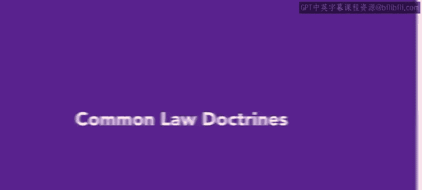
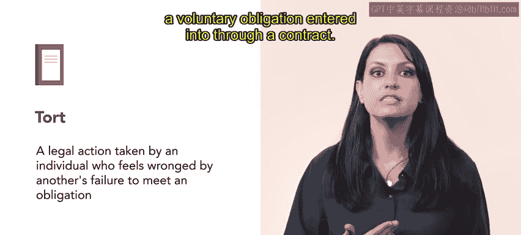
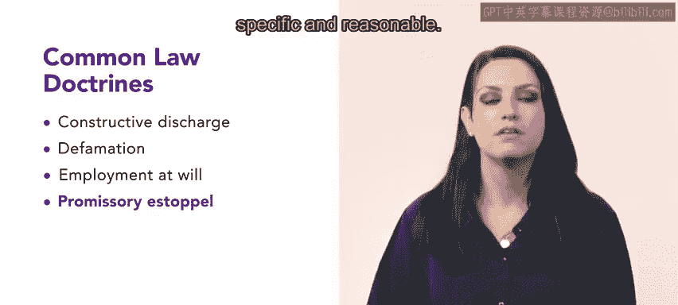
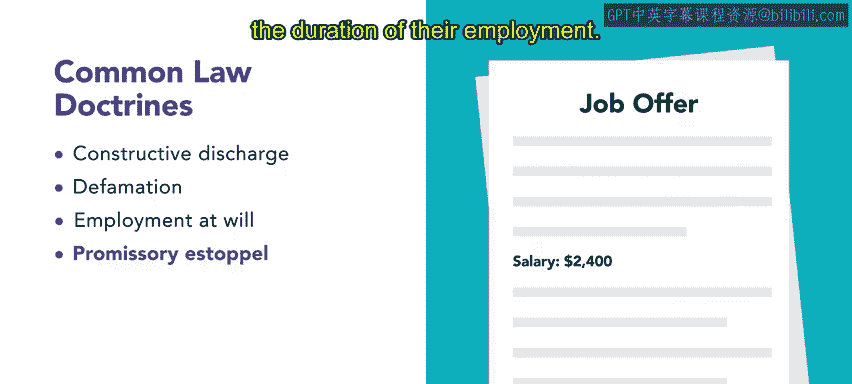
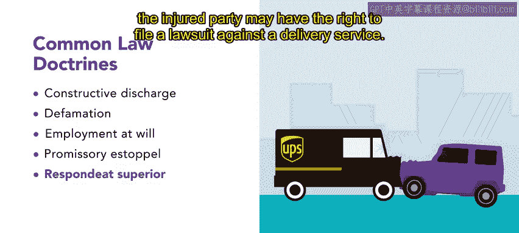
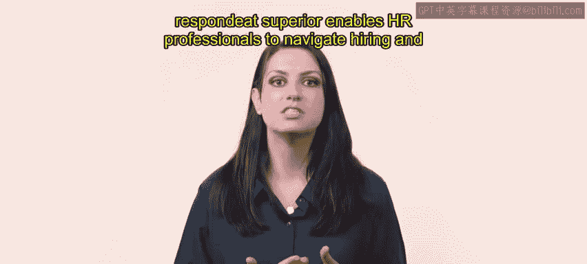

# HRCI《人力资源助理（员工关系、合规）》：第4-5课：普通法原则 ⚖️  




## 📌 课程概述  

在本节课中，我们将学习**普通法原则**及其在雇主与员工关系中的重要作用。  

我们将重点理解以下核心内容：构成性解雇、诽谤、任意雇佣、允诺禁止反言以及“雇主责任”原则。这些原则帮助人力资源从业者在实际工作中确保合规与风险控制。  


---

## 一、普通法的基本概念 📖  


上一节我们介绍了员工关系中的法律基础。本节首先了解普通法的来源与意义。  


**普通法（Common Law）**是由司法判决确立的法律体系。  

它不同于由国会立法或联邦政府行政部门颁布的法规，但同样具有重要法律效力。  


如果违反普通法原则，可能会引发法律诉讼，通常以**侵权行为（Tort）**形式出现。  


侵权行为可以用公式表示：  


```
侵权行为 = 一方未履行法律义务 → 他方遭受损害 → 提起诉讼
```


其中，这种义务可能来自：  


- 普通法原则  
- 双方自愿签订的合同  




理解了普通法的来源后，接下来我们通过具体案例了解其在组织中的实际应用。  


---


## 二、构成性解雇（Constructive Discharge）🏢  


首先，我们来看构成性解雇这一概念。  


**构成性解雇**是指雇主创造敌对或令人不愉快的工作环境，迫使员工主动辞职。  


其逻辑可以表示为：  


```
恶劣工作环境 + 雇主行为 → 员工被迫辞职
= 构成性解雇
```


在许多州，员工在此情况下有权提起诉讼。  

但不同州对证据要求不同，例如：  


- 有些州要求员工证明雇主有意迫使其辞职  
- 有些州要求员工证明工作环境恶劣的程度  


例如：  


- 削减员工工作时间  
- 降低员工薪资  


这些行为可能构成消极工作条件，从而形成构成性解雇。  


理解了“被迫辞职”的法律风险后，我们接下来探讨与员工声誉相关的问题。  


---

## 三、诽谤（Defamation）🗣️  


诽谤是一种保护个人免受损害其声誉的虚假指控或言论的法律概念。  


其基本结构为：  


```
不真实或无关言论 → 损害个人声誉 → 法律责任
```


组织在对外沟通时必须谨慎。  

尤其是在以下情况下：  


- 对员工进行评价  
- 提供推荐信  
- 回应背景调查请求  


即使员工已被解雇，雇主也不能发表不真实或与工作表现无关的言论。  


例如：  

当雇主在推荐调查中提供虚假或无关信息，并导致员工无法获得新工作时，雇主可能承担法律责任。  


为了保护自身，雇主应做到：  


- 仅提供与工作相关的信息  
- 信息必须明确、具体、准确  
- 取得员工的书面授权  


在了解了声誉保护问题后，我们继续讨论雇佣关系中的核心原则。  


---

## 四、任意雇佣（Employment at Will）📄  


任意雇佣是美国雇佣关系的默认形式。  


其基本原则为：  


```
雇主：可随时解雇员工（无需理由或提前通知）
员工：可随时辞职（无需提前通知）
```


例如：  

某组织以任意雇佣方式聘请一名簿记员。  

几个月后，因财务困难需要裁员。  

根据任意雇佣原则，组织可以无需说明理由或提前通知即可终止雇佣关系。  


需要注意的是：  

尽管任意雇佣是默认安排，但在过去60年中：  


- 联邦法规  
- 司法判例  


已经对雇主随意解雇员工的权力进行了大量限制。  


在理解了雇佣终止规则后，我们来看一个与承诺有关的重要原则。  


---

## 五、允诺禁止反言（Promissory Estoppel）🤝  


允诺禁止反言是一种普通法保护原则。  

在某些情况下，它要求雇主履行对员工作出的承诺。  




其成立条件可以表示为：  


```
明确承诺 + 具体内容 + 合理性
→ 雇主必须履行承诺
```


例如：  

如果雇主承诺在员工任职期间每月支付固定金额工资，且该承诺明确具体，则可能必须履行。  




这一原则提醒HR：口头或书面承诺都可能具有法律效力。  


接下来，我们探讨雇主对员工行为的责任问题。  


---

## 六、雇主责任原则（Respondeat Superior）⚖️  


该原则源自拉丁语，意为“让主人承担责任”。  


其核心规则为：  


```
员工在履行职务过程中发生过失或违法行为
→ 雇主承担责任
```


例如：  



某配送公司司机因疏忽造成交通事故。  

受害方可以对配送公司提起诉讼。  


在某些情况下，即使雇主并不知情，也可能需要承担员工的民事违法责任。  


这一原则强调：组织必须重视培训与监督。  


---

## 🎯 本节总结  


在本节课中，我们学习了普通法在雇佣关系中的关键原则，包括：  


- 构成性解雇  
- 诽谤  
- 任意雇佣  
- 允诺禁止反言  
- 雇主责任原则  


这些原则帮助人力资源专业人员在招聘、管理与合规方面做出更稳健的决策。  



理解普通法原则，有助于降低法律风险，构建更加规范与安全的组织环境。