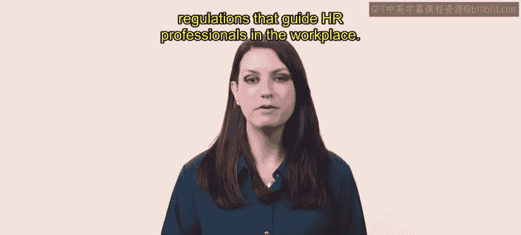
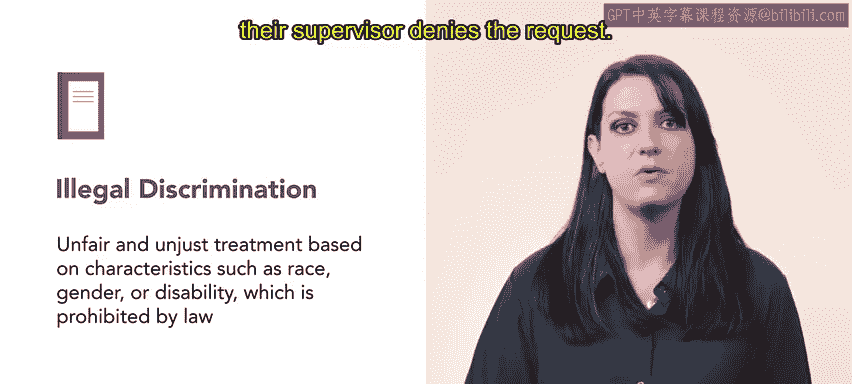
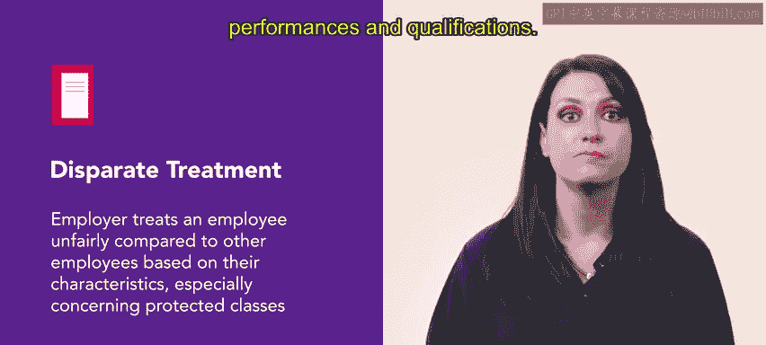
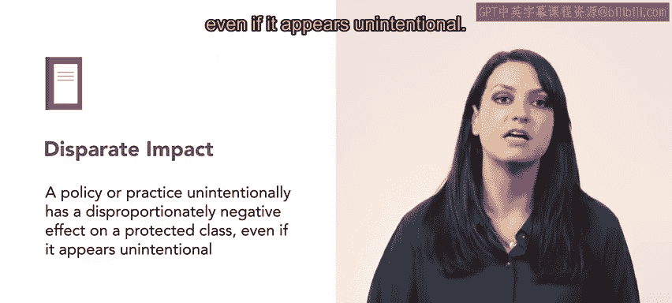
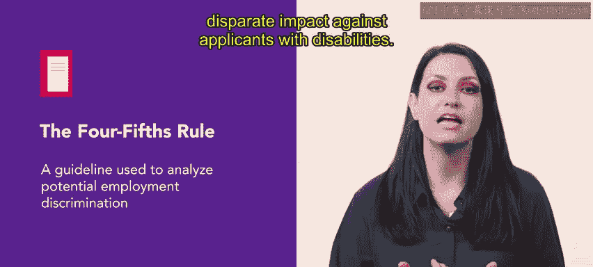
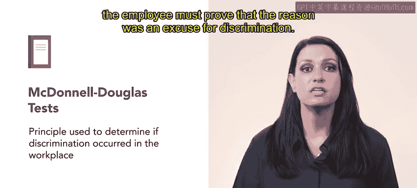

# HRCI《人力资源助理（员工关系、合规，4-5课／共5课）｜HRCI Human Resource Associate》 - P106：23_平等就业机会（EEO）简介.zh_en - GPT中英字幕课程资源 - BV1qE4m19788

You now have an understanding of the types of laws and regulations that guide HR professionals in the workplace Let's continue by exploring equal employment opportunities。

Equal  employment Opportunity or EEO refers to legislation and policies that require all employees to be treated equally regardless of race。

 national origin， aid， religion， or sex。Remember the Title VI of the Civil Rights Act of 1964。

As discussed in an earlier video， this Act established the Equal Employment Opportunity Commission。

 the EEOC， and is responsible for administering equal employment opportunity legislation。

Let's go over a few key concepts related to equal employment opportunity that we will delve into throughout this week。

 illegal discrimination refers to unfair and unjust treatment based on characteristics such as race。

 gender or disability， which is prohibited by law。Imagine an employee with a physical disability performs their duties well with reasonable accommodations。

 but experiences mistreatment from their supervisor。

When the employee requests wheelchair access to specific workplace areas。

 their supervisor denies the request。

The supervisor also creates a hostile work environment with derogatory comments about their disability。

In this case， the supervisor's actions amount to illegal discrimination based on disability and the employee has the right to file a complaint。

Protected classes refer to groups of people legally protected from harm or harassment by laws。

 practices， and policies that discriminate against them due to a shared characteristic such as race。

 gender， age， disability， or sexual orientation。Both US， federal and state laws protect these groups。

 for example， if an employer uses discriminatory hiring practices by consistently rejecting black applicants despite having the qualifications for the various roles。

 the employers' actions violate federal and state laws that protect individuals from race based discrimination。

Disparate treatment occurs when an employer treats an employee unfairly compared to other employees。

 based on their characteristics， especially concerning protected classes。

 supposeose an employer regularly denies promotions to qualified LGBTQI+ employees despite their excellent performance reviews and qualifications。

However， the employer promotes heterosexual employees with similar performances and qualifications。

This unfair treatment is disparate based on sexual orientation and gender identity。

Disparate impact occurs when a policy or practice unintentionally has a disproportionately negative effect on a protected class。

 even if it appears unintentional。 if an organization hires more men than women as construction workers due to their physical size。

 height or strength， this negatively affects women's opportunities in the field。

Bonnaified occupational qualifications are specific job requirements necessary for a particular role。

 even if they may seem discriminatory。To be defined as legal or bona fide。

 the qualifications should relate to the business's necessary operations and the position's essential job functions。

 For example， airline pilots are required to retire by a certain age。

 This job requirement enables airlines to prioritize safety and operational efficiency。

The4 fifth rule is a guideline used to analyze potential employment discrimination。

It states that if the selection rate for a particular group is less than4 fifths or 80% of the selection rate for the group with the highest selection rate。

 there is a potential disparate impact。 Suppose a company is hiring for an account manager role。

 Two groups apply for the role。 applicants without disabilities and applicants with disabilities。

Out of 100 applicants without disabilities， 65 are selected。

 which equals a 65% selection rate out of 100 applicants with disabilities， only 35 are selected。

 which equals a 35% selection rate。According to the4 fifth rule。

 the selection rates suggests potential employment discrimination and disparate impact against applicants with disabilities。

The McDonald Douglas Test is a principle used to determine if discrimination occurred in the workplace。

It requires an employee to provide evidence of discrimination in the employer to provide evidence that the action was taken for non discriminatory reasons。

 Suppose an employee interviews for a promotion。 The employer believes the employer did not hire them for the role。

 due to their religion。The employee gathers evidence supporting their employment discrimination claim。

 including proof of their religion and email stating their unsuccessful interview and proof that the employer promoted an employee with the same experience。

 skills and qualifications。The employer in turn， must provide a legitimate reason for not promoting the employee。

 such as poor performance if the employer offers a legitimate reason。

 the employee must prove that the reason was an excuse for discrimination。

Understanding these key concepts will guide you as you learn about workplace compliance and the principles of equal employment opportunity。

