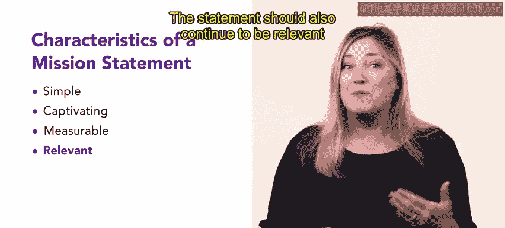
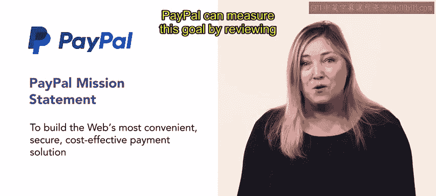

# HRCI《人力资源助理（员工关系、合规）》：第5课：制定使命声明 🎯


在本节课中，我们将系统学习什么是使命声明、使命声明的核心构成要素，以及如何通过真实企业案例来理解一份优秀使命声明的写法。这将帮助你在未来的人力资源工作中，更好地参与或支持组织使命的制定与评估。


## 一、使命声明的基本概念 📌


在前面的课程中，我们已经学习了**愿景声明、使命声明和价值观**的基本概念。


在此基础上，本节课将进一步深入使命声明，并通过几个知名公司的实际使命声明来进行讲解和回顾。


使命声明通常是**一句话**，用于解释一个组织的三个核心方面，其结构可以用以下公式来表示：


```
使命声明 = 做什么（What） + 为什么做（Why） + 如何做到（How）
```


使命声明应当是**具体且以行动为导向的**，它需要激励员工，并为组织的发展方向提供清晰指引。


## 二、制定使命声明的四个关键特征 🧩


在理解了使命声明的定义之后，接下来我们来看在制定使命声明时需要重点考虑的四个特征。以下内容将帮助你判断一份使命声明是否清晰、有效。


### 1. 简洁性（Simplicity）


首先，使命声明应当保持简洁。


具体来说，它需要做到以下几点：


- 表达清楚、简明扼要  
- 语言自然、接近日常交流  
- 使用易于理解的常见词汇  


这样的使命声明，能够让不同背景的人都快速理解组织的目标。


### 2. 吸引力（Emotional Connection）


在简洁之外，使命声明还应当能够吸引读者。


也就是说，它需要让读者在情感上与组织产生联系，从而增强认同感和归属感。


### 3. 可衡量性（Measurability）


接下来，一个非常重要但容易被忽视的特征是**可衡量性**。


使命声明中的目标，应当能够通过结果或基准进行衡量，例如：


```
目标 → 数据 / 事实 / 对比结果
```


举例来说，如果使命声明中提到“最具性价比”，那么组织就应当能够通过具体的统计数据或事实，来证明自己如何实现“性价比最高”。


### 4. 相关性（Relevance）


最后，使命声明必须具备相关性。


这意味着：


- 读者能够清楚理解使命声明与自己有什么关系  
- 能够明白使命声明如何影响或适用于自己的生活或工作  
- 即使组织不断发展壮大，使命声明依然保持价值和意义  


在理解了这四个特征之后，我们就可以通过真实案例来加深理解。


## 三、知名企业使命声明案例解析 🏢


下面，我们将一起分析几家知名企业的使命声明，看看它们是如何体现前面提到的特征的。


### 1. BBC 的使命声明 📺




**entity["organization","BBC","british public broadcaster"]** 的使命声明是：


> 为公众利益行事，通过提供公正、高质量且具有独特性的内容，服务所有受众，内容涵盖信息、教育和娱乐。


在这一使命声明中，BBC 清楚地表达了以下几点：


- 自身是一个**不带偏见**的组织  
- 成立的目的在于**服务所有人**  
- 明确指出三大核心目标：  
  - 提供信息  
  - 促进教育  
  - 提供娱乐  


这一使命声明既清晰又直接，充分体现了相关性和简洁性。


### 2. Google 的使命声明 🌍


接下来，我们来看 **entity["company","Google","technology company"]** 的使命声明：


> 整理全球信息，使人人皆可访问并从中受益。


这一使命声明具有以下特点：


- 表述非常简洁  
- 明确说明了组织的核心目标  
- 强调“全球”和“人人可访问”，增强了情感吸引力  
- 清楚体现了其**普遍适用性和相关性**  


通过这一句话，读者可以快速理解 Google 的存在意义和行动方向。


### 3. PayPal 的使命声明 💳


最后，我们来看 **entity["company","PayPal","online payments company"]** 的使命声明。


PayPal 的使命声明同样简短、清晰且直接，表达了其成为**最便捷支付解决方案**的目标。


这一使命具有很强的可衡量性，可以通过以下方式进行验证：


```
便捷性 = 与竞争对手的对比 + 用户体验评估
```


通过持续对比竞争者并优化用户体验，PayPal 可以判断自己是否真正实现了使命目标。


## 四、使命声明的核心要点回顾 🔁




在结束本节课之前，我们对使命声明的关键内容进行一次整体回顾。


一份有效的使命声明应当明确说明：


- 组织在做什么  
- 组织为什么这样做  
- 组织是如何完成目标的  


同时，它还必须具备以下四个特征：


- 简单  
- 有吸引力  
- 可衡量  
- 相关性强  


制定使命声明是人力资源工作中的一个重要组成部分，在你的实际工作中，很可能会参与或接触到这一过程。


在下一节课中，你将学习如何为组织制定**愿景声明**，从而进一步完善组织的整体战略表达。


## 五、本节课总结 ✅


在本节课中，我们一起学习了使命声明的定义、结构公式、四大关键特征，并通过 BBC、Google 和 PayPal 的案例，理解了优秀使命声明的实际表现形式。这些内容将为你今后在人力资源领域中的实践打下坚实基础。