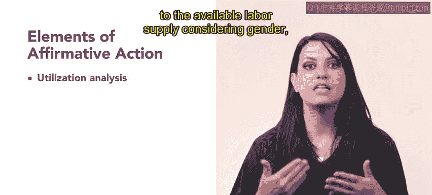
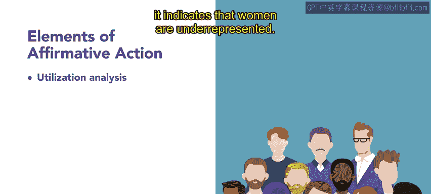
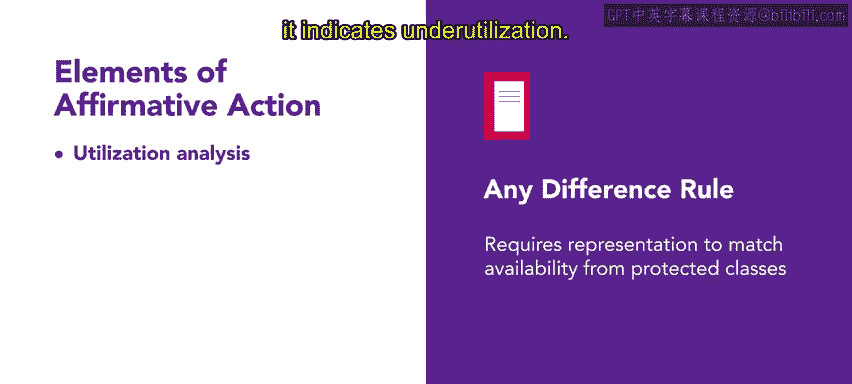
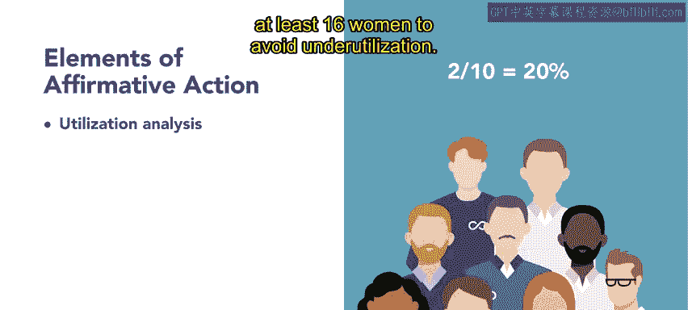
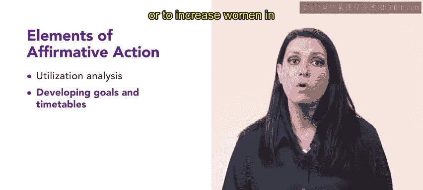
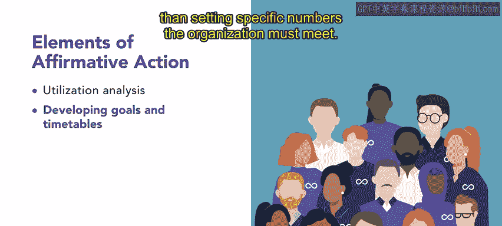
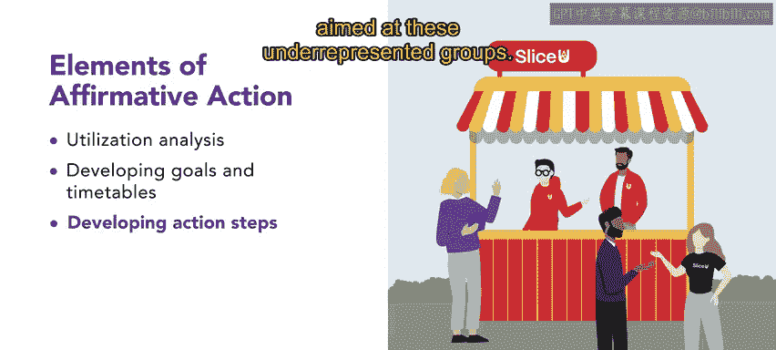

# HRCI《人力资源助理（员工关系、合规，4-5课／共5课）｜HRCI Human Resource Associate》 - P111：28_平权行动计划要素.zh_en - GPT中英字幕课程资源 - BV1qE4m19788

In this video， we will explore three important aspects of affirmative action programs。

 utilizationization analyses， goals and timetables and action steps。

 We will also discuss the arguments for and against affirmative action。 Let's get right into it。😊。

Organizations with more than 50 employees who receive federal contracts totaling $50，000 or more。

 and are members of the federal banking system or sell。

 issue or redeem US savings bonds are required to develop an affirmative action program。

Other organizations may choose to build an affirmative action program voluntarily。

Affirmative action programs consist of three key elements， let's discuss each of them。

The first part of an affirmative action program is called a utilization analysis。

 This analysis compares an organization's workforce to the available labor supply。

 considering gender， race and ethnic composition。 For example。

 if an organization has 150 employees in only 20 are women and the labor supply consists of 60% men and 40% women。

 it indicates that women are underrepresented。 Or can use various methods to determine underut。

 such as that any difference rule， which requires representation to match availability from protected classes or the commonly used 80% rule。

 where if a group's actual representation falls below 80% of the available proportion。

 it indicates under utilization。

For example， if women make up 20% of the available workforce。

 an organization with 100 employees should have at least 16 women to avoid underut。

Once an organization has decided to instate an affirmative action program。

 the next step is to develop a set of goals that the organization would like to achieve and a timetable for achieving those goals for example。

 an organization might set a goal to hire at least 10 people from underrepresented groups in the next year。

 or to increase women in leadership positions by 30% within two years。

These goals may indicate the underreed protected classes in the workforce and roughly how many new hires from those protected classes would be needed to represent the labor force fairly。

 However， using strict and unchangeable quotas is against the law。

 The focus is on promoting fairness in diversity， rather than setting specific numbers the organization must meet。

Finally， the organization must develop a set of action steps to achieve its goals in the allotted time。

To reach one organization's goal of hiring 10 people from underrepresented groups。

 the organization might consider implementing targeted recruitment strategies such as attending career fairs aimed at these underrepresented groups。

Additional steps include communicating open roles to underrepresented groups。

 recruiting from schools largely made up of some protected classes。

 participating in programs designed to enhance employment opportunities for underrepresented groups。

 identifying and removing inappropriate barriers to employment， and preferential hiring。

 which gives preferential treatment to minority job candidates。

Affirmative action has become a controversial topic， and later in the lesson。

 we will explore specific arguments for and against this policy by considering the elements of affirmative action programs。

 Or and HR professionals can make informed decisions that consider their employees and strive for a more inclusive and equitable workforce。

